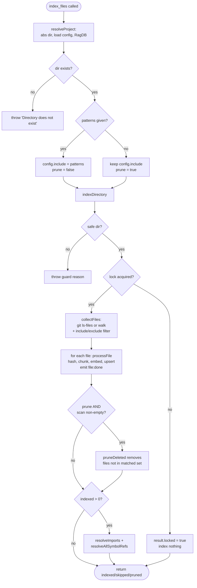

# Tool: index_files

`index_files` is the MCP tool that builds or refreshes the semantic search index for a project. Every other read tool — `search`, `read_relevant`, `search_symbols`, `usages`, `project_map` — only sees files that this tool has written into the SQLite index at `.mimirs/index.db`. If you create or change files and want them findable, this is the tool that makes them so.

It has two modes, chosen by whether the caller passes `patterns`:

- **Full re-index (no `patterns`)**: scan the whole project using the saved config, index everything that changed, and *prune* rows for files that were deleted or are now excluded.
- **Scoped refresh (with `patterns`)**: index only the files matching the given globs and leave the rest of the index untouched. Nothing is pruned.

The tool itself is a thin wrapper: it resolves the project, overrides the include list when scoped, calls the shared indexing engine, translates progress into a status file, and formats a short text summary. The real work lives in `indexDirectory` in `src/indexing/indexer.ts:796`. The tool is registered by `registerIndexTools` in `src/tools/index-tools.ts:6`.

## How a call flows



1. The caller invokes the tool with an optional `directory` and optional `patterns` array. Both are validated by a Zod schema and both are optional (`src/tools/index-tools.ts:10-23`).
2. `resolveProject` turns the optional directory into an absolute path (falling back to `RAG_PROJECT_DIR`, then the current working directory), verifies it exists, loads the project config, applies embedding settings, and returns the project dir, the `RagDB` handle, and the config (`src/tools/index.ts:22-45`). A path that does not exist throws here, before any indexing begins (`src/tools/index.ts:32-34`).
3. If `patterns` was supplied, the handler clones the config and overrides only its `include` list with those patterns: `const config = patterns ? { ...baseConfig, include: patterns } : baseConfig` (`src/tools/index-tools.ts:26`). The `exclude` list is left as configured, so excludes still apply even in a scoped refresh.
4. The handler calls `indexDirectory`, passing a progress callback, an `undefined` abort signal, and `{ prune: !patterns }`. That single boolean is what makes the two modes differ: pruning is on for a full run and off for a scoped refresh (`src/tools/index-tools.ts:31-53`).
5. `indexDirectory` first guards against indexing a system-level directory, then tries to take the per-directory index lock. If another live mimirs process already owns the lock, the engine sets `result.locked = true`, indexes nothing, and returns early (`src/indexing/indexer.ts:808-831`).
6. With the lock held, `collectFiles` lists the project's files — preferring git's view of the repo so `.gitignore` is honored — and keeps only paths that pass the include filter and fail the exclude filter (`src/indexing/indexer.ts:241-287`).
7. For each matched file, `processFile` decides whether the file is unchanged (skip), unindexable (skip), or needs (re)indexing. Indexing chunks the file, embeds the chunks, and writes file + chunk rows plus import/export graph data and symbol references (`src/indexing/indexer.ts:846-872`, `427-591`).
8. After each file the engine emits `file:done`; the tool turns that into a percentage and writes it to the project status file (`src/tools/index-tools.ts:34-40`).
9. On a full run with a non-empty scan, `pruneDeleted` removes any indexed file whose path is no longer in the matched set (`src/indexing/indexer.ts:876-890`).
10. If at least one file was indexed, the engine resolves cross-file import paths and then re-resolves all symbol references, so the graph and usage tools stay consistent (`src/indexing/indexer.ts:893-901`).
11. The handler formats a short text summary of `indexed`, `skipped`, `pruned`, and any `errors`, and returns it to the caller. The lock is released in a `finally` block (`src/tools/index-tools.ts:83-90`, `src/indexing/indexer.ts:904-906`).

## Inputs

| name | type | required | description |
| --- | --- | --- | --- |
| `directory` | string | no | Directory to index. Defaults to `RAG_PROJECT_DIR` if set, otherwise the current working directory. Resolved to an absolute path and checked for existence by `resolveProject` (`src/tools/index.ts:26-34`). |
| `patterns` | string[] | no | Include globs such as `["**/*.md", "src/**/*.ts"]`. When present, the engine indexes only matching files and skips pruning. When absent, the project's saved `include` list is used and pruning runs (`src/tools/index-tools.ts:17-26`). |

## Outputs

| output | where it lands / shape / description |
| --- | --- |
| File and chunk rows | Inserted or updated in `.mimirs/index.db` by `processFile`: a `files` row (path + content hash), `chunks` rows (text, embedding, line ranges), vector and full-text-search entries populated by triggers, import/export graph metadata, and symbol references (`src/indexing/indexer.ts:529-587`). |
| Pruned rows | On a full run, rows for deleted or now-excluded files are removed from `chunks`, the graph tables, and `files` (`src/db/files.ts:284-307`). |
| Result summary text | One text block: `Indexing complete:` followed by `Indexed`, `Skipped (unchanged)`, and `Pruned (deleted)` counts, plus an `Errors` line if any file failed. A locked run returns an `Indexing skipped:` block instead (`src/tools/index-tools.ts:67-90`). |
| Status-file progress | When a `writeStatus` callback is wired in (server mode), per-file progress and a final summary are written to `.mimirs/status` (`src/tools/index-tools.ts:31-64`, `src/server/index.ts:95-108`). |

## Full re-index vs scoped refresh

The only structural difference between the modes is what config drives the scan and whether pruning runs. Everything else — file listing, chunking, embedding, graph resolution — is identical.

| | Full re-index (no `patterns`) | Scoped refresh (with `patterns`) |
| --- | --- | --- |
| Include set | Project config `include` | The `patterns` argument |
| Exclude set | Project config `exclude` | Project config `exclude` (still applied) |
| `.gitignore` respected | Yes (via `git ls-files`) | Yes (via `git ls-files`) |
| Prune deleted/excluded files | Yes (when scan is non-empty) | No |
| Files outside the matched set | Pruned if gone from disk or config | Left untouched |
| Typical use | "Re-index the project after edits" | "Just refresh the docs I touched" |

Because a scoped refresh never prunes, it cannot *shrink* the index. To drop files from the index you change the `exclude` list in `.mimirs/config.json` and run a full re-index (no `patterns`); the pruning pass then deletes the now-excluded rows. This is called out in the tool's own parameter description (`src/tools/index-tools.ts:21`).

## How files are discovered (.gitignore)

The scan does not blindly walk the directory tree. `collectFiles` first asks git for the project's files, then layers the config filters on top.

- `listGitFiles` runs `git ls-files --cached --others --exclude-standard -z` in the target directory. `--cached` returns tracked files; `--others --exclude-standard` adds untracked files that are *not* ignored, so brand-new uncommitted source is still indexed while everything in `.gitignore` (including `node_modules`, build output, and global/nested ignore rules) is skipped before it is ever read (`src/indexing/indexer.ts:218-239`).
- If git is unavailable or the directory is not a repo, `listGitFiles` returns `null` and the scan falls back to a plain recursive `readdir` walk (`src/indexing/indexer.ts:255-256`).
- Empty git output is treated as `null` (fall back to a walk) rather than "no files." Returning an empty list here would be dangerous: on a full run it would make `pruneDeleted` see an empty matched set and try to wipe the entire existing index. This is why the engine deliberately refuses to trust an empty git result (`src/indexing/indexer.ts:229-235`).
- Whatever the source, every path is normalized to forward slashes and then run through the include filter (must match) and the exclude filter (must not match) before it is kept (`src/indexing/indexer.ts:264-268`). The config globs are an additional layer, not a replacement for git's ignore handling.

## State changes

### Index rows written, updated, or pruned

- **Before**: the index reflects the previous run — some files may be missing, stale, or deleted on disk but still present as rows.
- **After**: every matched file that changed is re-chunked, re-embedded, and rewritten; unchanged files (same content hash) are left as-is; and on a full run, files that are gone from disk or now excluded have their rows removed.
- **Why it matters**: this is the only path that updates what the search and graph tools can see. A file that is never indexed is invisible to `search`, `read_relevant`, `usages`, and the rest.
- **Where**: `processFile` decides per file. For a changed or new file it calls `db.upsertFileStart(filePath)` to write the `files` row with an empty in-progress hash, `db.insertChunkBatch(...)` for chunk rows (which populate the vector and FTS tables via triggers), `db.upsertFileGraph(...)` for imports/exports, and `db.upsertSymbolRefs(...)` for identifier references, then commits the real content hash last with `db.updateFileHash(...)` so an interrupted run is always retried (`src/indexing/indexer.ts:529-587`). After the loop, `db.pruneDeleted(...)` removes stale files on a full run, deleting their `chunks`, graph rows, and `files` row inside one transaction (`src/indexing/indexer.ts:886`, `src/db/files.ts:296-306`). Finally, `resolveImports` plus `db.resolveAllSymbolRefs()` rebuild cross-file edges when anything was indexed (`src/indexing/indexer.ts:893-901`).

## Branches and failure cases

- **Lock held by another process (query-only fallback)**: `tryAcquireIndexLock` returns `null` when a different *live* process owns `.mimirs/index.lock`. The engine sets `result.locked = true`, indexes nothing, and returns early. The tool then returns an `Indexing skipped:` message that reports the existing file/chunk counts and notes the server can still answer queries against the existing index (`src/indexing/indexer.ts:823-831`, `src/tools/index-tools.ts:67-81`). Stale locks whose PID is dead are reclaimed automatically, and the lock is reentrant within one process via a refcount, so the server holding it for its lifetime does not block its own indexing (`src/utils/index-lock.ts:28-89`).
- **Unsafe directory**: before anything else, `checkIndexDir` refuses to index system-level roots such as the home directory, `/`, `/Users`, or `/tmp`; an unsafe target throws and the call fails (`src/indexing/indexer.ts:808-812`, `src/utils/dir-guard.ts:36-64`).
- **Missing directory**: `resolveProject` throws `Directory does not exist` if the resolved path is absent, before any indexing begins (`src/tools/index.ts:32-34`).
- **No matched files**: `collectFiles` returns an empty list, the file loop does nothing, and the counts are all zero. On a full run, pruning is *also* skipped when the scan came back empty — `pruneDeleted(∅)` would wipe the entire index, so the engine guards on `matchedFiles.length > 0` before pruning (`src/indexing/indexer.ts:876-890`).
- **Per-file skips**: `processFile` returns `"skipped"` (counted in `result.skipped`) when the file is unchanged by content hash, larger than 50 MB, minified (average line length over 1000 chars), has an extension outside `KNOWN_EXTENSIONS`, or is empty after trimming (`src/indexing/indexer.ts:455-498`).
- **Deleted-but-tracked and submodule entries**: during a scan, `processFile` runs with `skipMissing: true`. A path that git still tracks but is gone from the working tree (`ENOENT`/`ELOOP`), or a submodule gitlink that git lists as a bare directory, is silently skipped instead of erroring (`src/indexing/indexer.ts:440-454`, `846-859`).
- **Per-file errors**: an exception thrown while indexing one file is caught, pushed onto `result.errors`, and the loop continues to the next file. Errors are appended to the summary text rather than aborting the run (`src/indexing/indexer.ts:866-870`, `src/tools/index-tools.ts:87`).
- **Abort signal**: `indexDirectory` accepts an optional `AbortSignal` and checks it before scanning, between files, and before pruning, returning partial counts if aborted. The `index_files` tool passes `undefined` for the signal, so a tool-initiated run is not externally cancellable (`src/indexing/indexer.ts:806-874`, `src/tools/index-tools.ts:53`).
- **Large project warning**: if `collectFiles` finds more than 200,000 indexable files it emits a warning suggesting `RAG_PROJECT_DIR` may be misconfigured, but it does not abort (`src/indexing/indexer.ts:277-283`, `64`).

## Progress reporting

The tool receives an `onProgress(msg)` callback from the engine and forwards a human-readable status string to `writeStatus`, but only if `writeStatus` was provided when the tools were registered (`src/tools/index-tools.ts:31-32`). The MCP server supplies one that writes to `.mimirs/status`; when there is no status path, the callback is a no-op (`src/server/index.ts:95-108`, `189`).

The handler interprets three kinds of engine messages:

- `Found N files to index` sets the running total and writes `0/N files`.
- `file:done` increments the processed count and writes `processed/total files (pct%)`.
- any message starting with `scanning files` is forwarded verbatim, so the user sees the directory walk before per-file progress begins.

When the run finishes, the handler writes a final `done` block listing `indexed`, `skipped`, `pruned`, and the current total file/chunk counts from `ragDb.getStatus()`. If the run was locked, it inserts a `mode: query-only` line into that block (`src/tools/index-tools.ts:55-64`). The returned MCP text content is separate from this status file — the status file is for live progress, the text content is the final answer the caller reads.

## Example

Refresh only the Markdown and TypeScript sources without touching the rest of the index:

```json
{
  "directory": "/Users/example/repos/myproject",
  "patterns": ["**/*.md", "src/**/*.ts"]
}
```

Full re-index of the default project (picks up new files and prunes deleted ones):

```json
{}
```

A successful full run returns text shaped like:

```
Indexing complete:
  Indexed: 12
  Skipped (unchanged): 480
  Pruned (deleted): 3
```

A run that could not take the lock returns instead:

```
Indexing skipped:
  Another mimirs process owns the index lock for this directory.
  Existing index: 492 files, 5120 chunks
  This server can still answer queries against the existing index.
```

## Key source files

- `src/tools/index-tools.ts` — registers the `index_files` MCP tool, chooses prune mode, maps progress to the status file, and formats the summary.
- `src/indexing/indexer.ts` — `indexDirectory` (the engine), `collectFiles` / `listGitFiles` (git-aware scan + filter), and `processFile` (per-file hash/chunk/embed/upsert).
- `src/tools/index.ts` — `resolveProject` (directory/config/db resolution) and the `WriteStatus` type.
- `src/utils/index-lock.ts` — `tryAcquireIndexLock` and the reentrant, PID-based per-directory lock.
- `src/utils/dir-guard.ts` — `checkIndexDir`, the guard against indexing system-level roots.
- `src/db/files.ts` — `pruneDeleted` (removes stale files) and the file/chunk totals reported in progress.

## Related tools

- [index_status](../tools/index-status.md) reads the same `getStatus` counts without re-indexing.
- [remove_file](../tools/remove-file.md) deletes a single file's rows when you do not want a full prune.
- [project_map](../tools/project-map.md) renders the import graph this tool populates.
