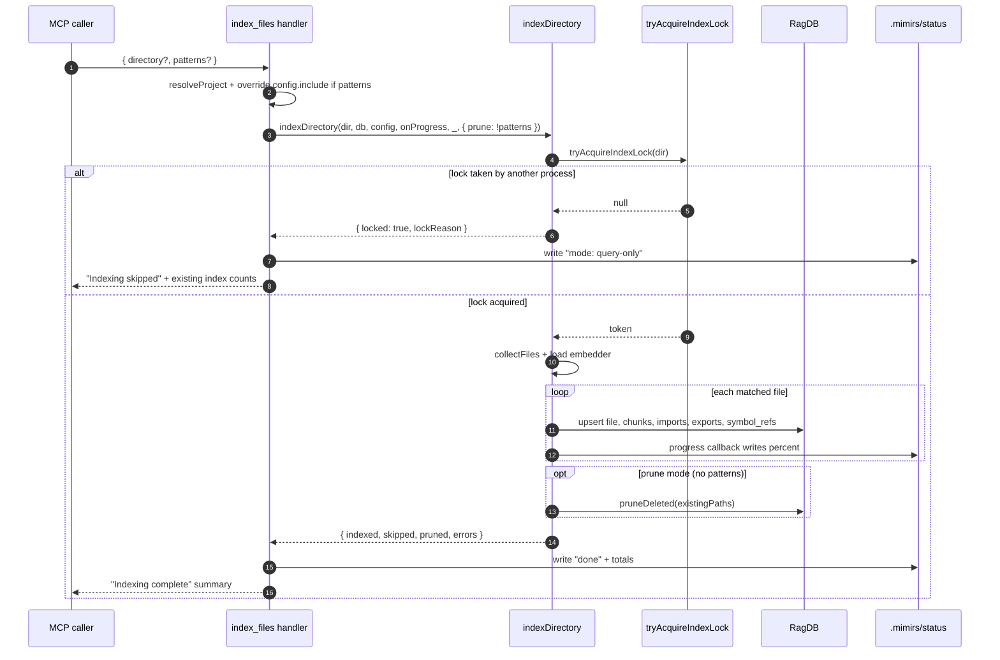

# Tool: index_files

`index_files` is the MCP tool that runs the mimirs indexing pipeline. It scans
files in a project, splits them into chunks, embeds them, writes graph data,
and (when called without patterns) prunes rows for files that no longer exist
or are now excluded. Call it after a large refactor, after pulling new code, or
the first time a project is opened. For most everyday work the file watcher
does this on save; `index_files` is the manual lever for the cases the watcher
missed.

The tool wraps `indexDirectory` and adds two things on top: it writes
percentage progress to `.mimirs/status` while indexing runs so other processes
can see what is happening, and it surfaces lock-contention as a "query-only"
fallback when another mimirs instance is already indexing the same project
(`src/tools/index-tools.ts:7-92`).

## Flow



1. Caller passes optional `directory` and optional `patterns`. `resolveProject`
   loads `.mimirs/config.json` for that directory and opens the `RagDB`
   (`src/tools/index-tools.ts:25`).
2. If `patterns` is set, the handler overrides `config.include` with the array
   in place, so only those globs are scanned (`src/tools/index-tools.ts:26`).
   Otherwise the project-wide include list is used.
3. The handler calls `indexDirectory` with `prune: !patterns`. Prune runs only
   on full-project invocations (`src/tools/index-tools.ts:53`).
4. `indexDirectory` calls `tryAcquireIndexLock`, a per-directory PID lock at
   `.mimirs/index.lock` (`src/utils/index-lock.ts:28-65`).
5. When another live PID owns the lock, the run short-circuits with
   `result.locked = true` and the caller is told the server can still answer
   queries against the existing index (`src/indexing/indexer.ts:722-730`,
   `src/tools/index-tools.ts:67-81`).
6. With the lock held, `indexDirectory` collects files, eagerly loads the
   embedder, then iterates each path. For every file the chain runs
   `processFile`, which writes `files`, `chunks`, `file_imports`,
   `file_exports`, and `symbol_refs` rows.
7. The handler's `onProgress` callback turns the `Found N files to index` and
   `file:done` messages into `0/N files` and `K/N files (P%)` lines, written
   to `.mimirs/status` (`src/tools/index-tools.ts:31-53`).
8. When prune is on, `pruneDeleted` removes every `files` row whose path is
   not in the just-collected set; cascade-deletes drop the chunk rows
   (`src/db/files.ts:273-298`).
9. The handler finishes by writing one more status line with the totals from
   `db.getStatus()` and returning a text summary to the caller
   (`src/tools/index-tools.ts:55-90`).

## Inputs

| Name | Type | Required | Description |
| --- | --- | --- | --- |
| `directory` | string | no | Project root. Defaults to `RAG_PROJECT_DIR` env or current working directory (`src/tools/index-tools.ts:11-16`). |
| `patterns` | string[] | no | Refresh only these include globs, e.g. `["**/*.md", "src/**/*.ts"]`. When set, the project's `include` config is replaced for this run and prune is disabled (`src/tools/index-tools.ts:17-22`). |

## Outputs

| Output | Where it lands |
| --- | --- |
| `indexed`, `skipped`, `pruned` counts | Returned in the text response to the caller (`src/tools/index-tools.ts:83-90`). |
| Refreshed `files`, `chunks`, `file_imports`, `file_exports`, `symbol_refs` rows | `.mimirs/index.db` via `processFile` and downstream graph writers. |
| Progress lines | `.mimirs/status` text file, overwritten on every callback (`src/server/index.ts:100-108`). |
| `errors` array | Joined and appended to the response text when `result.errors` is non-empty (`src/tools/index-tools.ts:87`). |

## State changes

- **`files` and `chunks` tables refreshed.** Before the run, the DB holds the
  previous snapshot of file hashes and chunk rows. After the run, every
  modified or new file has fresh rows; unchanged files are skipped by hash
  comparison (`src/tools/index-tools.ts:24-65`). Cascade-deletes through
  `ON DELETE CASCADE` on `chunks.file_id` keep chunk rows in sync with their
  file row (`src/db/index.ts:131-141`).
- **Deleted-file rows pruned (prune mode only).** Before: removed-from-disk
  files still have stale rows. After: those rows are gone, along with their
  chunks and `vec_chunks` entries (`src/db/files.ts:273-298`). Pattern-scoped
  runs deliberately skip this so a `patterns: ["**/*.md"]` call does not
  delete every TypeScript file (`src/indexing/indexer.ts:774-779`).
- **`.mimirs/status` overwritten.** The status file moves from whatever the
  previous run left to "0/N files" → "K/N files (P%)" → "done\nindexed: X,
  skipped: Y, pruned: Z\ntotal files: F, total chunks: C". When the lock is
  held by another process, an extra line `mode: query-only (another mimirs
  process owns indexing)` is inserted (`src/tools/index-tools.ts:55-64`).

## Full vs pattern-scoped indexing

The shape of the call decides whether the index can shrink:

- **No `patterns` (default).** The project's `include` config is used,
  `prune: true` is passed to `indexDirectory`, and `pruneDeleted` runs at the
  end. A file deleted from disk or removed from `include`/added to `exclude`
  drops out of the index in this pass.
- **With `patterns`.** The include list is replaced by the supplied array for
  this run only, and `prune: false` is forwarded. The runner re-indexes the
  matched files and leaves every other row untouched. This is the right shape
  for "refresh the markdown" or "re-pick-up these three changed files"; it is
  not the right shape for shrinking. To remove files from the index, update
  `.mimirs/config.json` excludes and call `index_files` without patterns.

This split is what the tool description in `src/tools/index-tools.ts:9-22`
documents and what `prune: !patterns` enforces.

## Query-only fallback

A project can have several mimirs processes pointed at the same
`.mimirs/index.db` — one per IDE window plus the CLI, for example.
Concurrent `processFile` calls on the same path race past each other and
produce duplicate chunk rows. `tryAcquireIndexLock` funnels writes through a
single process by writing a PID into `.mimirs/index.lock`. Other processes
get `null` back and skip writing entirely (`src/utils/index-lock.ts:28-65`).

When the index_files handler sees `result.locked === true`, it does two
things: it inserts the `mode: query-only` line into the status file so
operators can see why nothing changed, and it returns a multi-line text
response that names the existing file and chunk counts so the caller knows
the server is still useful for reads (`src/tools/index-tools.ts:67-81`). Stale
locks from crashed processes are reclaimed automatically on the next attempt
via `isPidAlive` (`src/utils/index-lock.ts:91-98`).

## Branches and failure cases

- **Lock held by another live PID.** Tool returns the "Indexing skipped" text
  and leaves the index untouched.
- **Status writer absent.** When the server does not pass a `writeStatus`
  function, the progress callback bails out at line 1 and only the text
  response is produced (`src/tools/index-tools.ts:32`).
- **Per-file errors.** `indexDirectory` catches per-file exceptions and
  appends them to `result.errors`; the run keeps going. The handler joins
  them into the response when any are present (`src/tools/index-tools.ts:87`,
  `src/indexing/indexer.ts:764-770`).
- **Unsafe directory.** `checkIndexDir` throws before the lock is acquired if
  the directory looks like a home or root path (`src/indexing/indexer.ts:707-711`).
- **Abort.** When the caller's signal aborts, the loop breaks and the partial
  `IndexResult` is returned (`src/indexing/indexer.ts:705`, `746`).

## Example

```json
{
  "tool": "index_files",
  "arguments": {
    "directory": "/path/to/project",
    "patterns": ["src/**/*.ts", "**/*.md"]
  }
}
```

Calling without `patterns` indexes the whole project from `.mimirs/config.json`
and prunes deleted or excluded files. The illustrative response text on
success is:

```
Indexing complete:
  Indexed: 12
  Skipped (unchanged): 174
  Pruned (deleted): 0
```

## Key source files

- `src/tools/index-tools.ts` — MCP handler, progress callback, status writes.
- `src/indexing/indexer.ts` — `indexDirectory` orchestrates collection,
  embedder load, per-file processing, and pruning.
- `src/utils/index-lock.ts` — process-level lock that gates writers.
- `src/db/files.ts` — `pruneDeleted` and `removeFile` cascade logic.
- `src/server/index.ts` — provides the `writeStatus` writer that the tool
  callback feeds.

## Related flows

- [Tool: index_status](./index-status.md) — read-only view of the same DB.
- [Tool: remove_file](./remove-file.md) — surgical delete without pruning.
- [Server start](../server/start.md) — owns the long-lived index lock
  and provides `writeStatus`.
