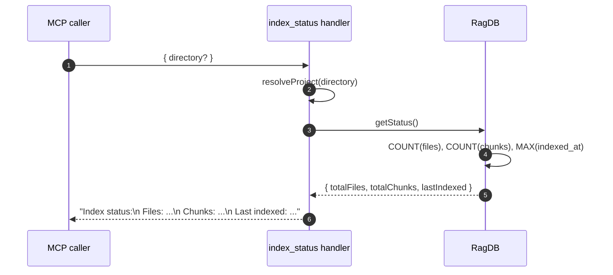

# Tool: index_status

`index_status` is a thin read tool that reports how much of a project is
currently indexed. It opens the project DB, runs three small `COUNT`/`ORDER
BY` queries, and returns a three-line text block. No writes happen — call it
freely from anywhere.

Use it when you want a quick "is the index alive and reasonably fresh?"
answer without the noisier output of `server_info`, which also dumps config,
connection state, and version info.

## Flow



1. The caller invokes `index_status` with an optional `directory`. When
   omitted, `resolveProject` falls back to the `RAG_PROJECT_DIR` env or the
   current working directory (`src/tools/index-tools.ts:94-104`).
2. `resolveProject` returns an open `RagDB` for that directory.
3. The handler calls `ragDb.getStatus()` (`src/tools/index-tools.ts:105`).
4. `getStatus` runs `SELECT COUNT(*) FROM files`, `SELECT COUNT(*) FROM
   chunks`, and `SELECT indexed_at FROM files ORDER BY indexed_at DESC LIMIT 1`
   (`src/db/files.ts:363-381`). `lastIndexed` is `null` when no files have
   been indexed yet.
5. The handler formats the three numbers into a single text block and
   returns it (`src/tools/index-tools.ts:107-113`).

## Inputs

| Name | Type | Required | Description |
| --- | --- | --- | --- |
| `directory` | string | no | Project directory. Defaults to `RAG_PROJECT_DIR` or the current working directory (`src/tools/index-tools.ts:98-101`). |

## Outputs

| Field | Source |
| --- | --- |
| Files count | `SELECT COUNT(*) FROM files` (`src/db/files.ts:364-366`). |
| Chunks count | `SELECT COUNT(*) FROM chunks` (`src/db/files.ts:367-369`). |
| Last indexed timestamp | `SELECT indexed_at FROM files ORDER BY indexed_at DESC LIMIT 1`. When empty, the response prints `never` (`src/tools/index-tools.ts:111`). |

## Branches and failure cases

- **Empty index.** `lastIndexed` is `null`; the response prints `Last indexed:
  never`.
- **Missing directory.** `resolveProject` throws if the resolved directory
  cannot be opened — the tool propagates the error to the caller. There is
  no graceful fallback because there is no DB to read from.
- **No optional flags.** Unlike `index_files`, this tool has no flags. It is
  pure read and pure synchronous on the SQLite side.

## Difference from `server_info`

`server_info` is the broader status tool: it reports tool registration,
connected databases, configured paths, version, and lock ownership.
`index_status` deliberately does only the three counts so it stays cheap to
call and easy to script. Both read the same underlying `RagDB.getStatus()`
counts, but `server_info` adds the process-level surroundings while
`index_status` adds nothing.

## Example

```json
{
  "tool": "index_status",
  "arguments": {
    "directory": "/path/to/project"
  }
}
```

Illustrative response text:

```
Index status:
  Files: 198
  Chunks: 4823
  Last indexed: 2026-05-27T14:02:11.413Z
```

## Key source files

- `src/tools/index-tools.ts` — handler registration and response formatting.
- `src/db/files.ts` — `getStatus` query implementation.
- `src/db/index.ts` — `RagDB.getStatus` shim that calls into `files.ts`.

## Related flows

- [Tool: index_files](./index-files.md) — the writer that bumps the counts
  this tool reads.
- [Tool: server_info](./server-info.md) — broader server status including
  these counts plus config and connection state.
