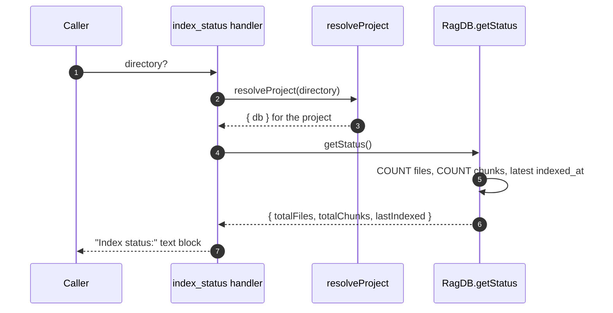

# Tool: index_status

`index_status` answers one question: how much of a project is currently in the search index, and when was it last refreshed. It is a read-only health check. You call it to confirm that indexing actually ran, to see whether a project has any indexed content before searching, or to compare counts before and after an [index_files](../tools/index-files.md) run.

The whole tool is a thin wrapper around a single database read. The handler is registered in `registerIndexTools` and returns three numbers as plain text; see `src/tools/index-tools.ts:94-116`.

## How it works



1. The caller may pass an optional `directory`. The handler calls `resolveProject` to resolve it to an absolute path (falling back to `RAG_PROJECT_DIR` then the current working directory), verify it exists, load config, and open the project's database (`src/tools/index-tools.ts:103-104`, `src/tools/index.ts:22-37`).
2. The handler asks the database object for its current status via `getStatus` (`src/tools/index-tools.ts:105`). `RagDB.getStatus` simply delegates to the file-store helper (`src/db/index.ts:593-594`).
3. `getStatus` runs three quick queries: a `COUNT(*)` over the `files` table, a `COUNT(*)` over the `chunks` table, and a single-row lookup of the most recent `indexed_at` timestamp ordered descending (`src/db/files.ts:363-381`).
4. The handler formats the three values into a text block and returns it as MCP text content. When no files have ever been indexed, `lastIndexed` is null and the output prints `never` (`src/tools/index-tools.ts:107-114`).

## Inputs

| name | type | required | description |
| --- | --- | --- | --- |
| `directory` | string | no | Project directory whose index to report on. Defaults to the `RAG_PROJECT_DIR` environment variable, then the current working directory. Resolved to an absolute path; if it does not exist, `resolveProject` throws before any read (`src/tools/index-tools.ts:98-101`, `src/tools/index.ts:26-32`). |

## Outputs

| output | where it lands / shape / description |
| --- | --- |
| Index status text | Returned as MCP text content. The block reads `Index status:` followed by `Files:` (row count of the `files` table), `Chunks:` (row count of the `chunks` table), and `Last indexed:` (the newest `indexed_at` value, or `never` when the index is empty) (`src/tools/index-tools.ts:111`). |

The three displayed numbers come straight from the database: `status.totalFiles`, `status.totalChunks`, and `status.lastIndexed` (`src/db/files.ts:376-380`).

## State changes

None. `index_status` only reads. It runs counting queries and a single ordered lookup, and writes nothing to the database, no status file, and no logs as part of the response (`src/tools/index-tools.ts:103-114`, `src/db/files.ts:363-381`). This is the key distinction from [index_files](../tools/index-files.md), which rewrites rows and updates the index.

## Branches and failure cases

| Condition | Behavior |
| --- | --- |
| Empty index (never indexed) | `getStatus` finds no `files` row, so `lastIndexed` is null and the output prints `Last indexed: never`; file and chunk counts read `0` (`src/db/files.ts:379`, `src/tools/index-tools.ts:111`). |
| Populated index | Counts and the latest timestamp are reported as-is. |
| `directory` does not exist | `resolveProject` throws `Directory does not exist` before any query runs (`src/tools/index.ts:30-32`). |
| `directory` omitted | Falls back to `RAG_PROJECT_DIR`, then the current working directory (`src/tools/index.ts:26`). |

There are no other branches: the handler has no flags, no pagination, and no locking. It cannot fail partway through because it performs only reads.

## index_status vs server_info

Both tools report the same three index numbers, but they answer different questions. `server_info` is a superset built for diagnosing connection and configuration problems.

| | index_status | server_info |
| --- | --- | --- |
| File / chunk counts | yes | yes (calls the same `getStatus`, `src/tools/server-info-tools.ts:28`) |
| Last-indexed timestamp | yes | yes |
| Resolved project dir + database location | no | yes |
| Active config (chunk size, weights, include/exclude counts, threads) | no | yes (`src/tools/server-info-tools.ts:46-57`) |
| Embedding model | no | yes |
| Currently connected databases | no | yes (`src/tools/server-info-tools.ts:61-63`) |

Use `index_status` when you only need the counts; reach for `server_info` when you need to know which database and config the server resolved.

## Example

Report on the current project:

```json
{}
```

Report on a specific project:

```json
{ "directory": "/Users/example/repos/myproject" }
```

A populated index returns text shaped like:

```
Index status:
  Files: 312
  Chunks: 4187
  Last indexed: 2026-05-28T18:42:11.000Z
```

A project that has never been indexed returns:

```
Index status:
  Files: 0
  Chunks: 0
  Last indexed: never
```

## Key source files

- `src/tools/index-tools.ts` — registers `index_status` and formats the text output.
- `src/db/index.ts` — `RagDB.getStatus` delegates to the file store.
- `src/db/files.ts` — `getStatus` runs the count and latest-timestamp queries.

## Related tools

- [index_files](../tools/index-files.md) is what changes the numbers this tool reports.
- `server_info` reports the same counts plus config and connection details.
