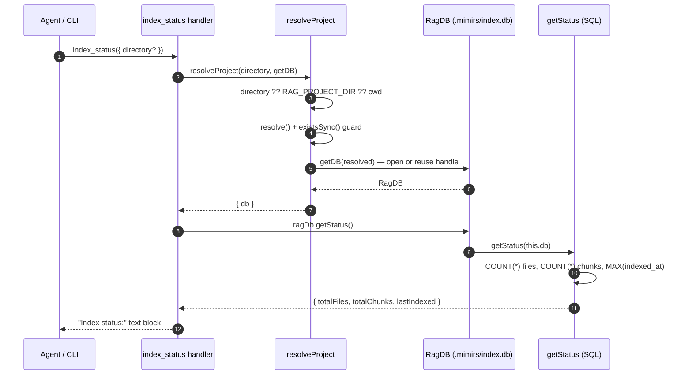

# Tool: index_status

`index_status` is a read-only MCP tool that reports the current state of the mimirs RAG index for a project: how many files it holds, how many searchable chunks those files produced, and when the most recent file was indexed. It answers the question "is the index actually populated, and is it fresh?" without changing anything.

Agents and users reach for it when search is returning nothing useful, after a fresh checkout, or right after running [index_files](./index-files.md) to confirm the work landed. Because it only counts rows and reads one timestamp, it is cheap and safe to call at any time, including before the project has ever been indexed.

## What it does

The tool takes an optional `directory`, resolves it to a concrete project and an open database handle, asks the database for three numbers, and formats them into a short text block. There is no embedding, no file scanning, and no write — the entire cost is three small SQL queries against the project's `index.db`.

The handler lives in `src/tools/index-tools.ts:94-116`. It is registered alongside `index_files` and `remove_file` by `registerIndexTools`, which the server wires up at startup through `registerAllTools` (`src/tools/index.ts:130-148`).



1. The caller invokes `index_status` with an optional `directory` argument; the schema declares only that one optional string (`src/tools/index-tools.ts:96-101`).
2. The handler hands `directory` and the server's `getDB` factory to `resolveProject` (`src/tools/index-tools.ts:103`).
3. `resolveProject` picks the target directory: the explicit argument if given, else the `RAG_PROJECT_DIR` environment variable, else the current working directory (`src/tools/index.ts:38-39`).
4. It calls `resolve()` to make the path absolute and rejects a path that does not exist on disk, throwing `Directory does not exist: <path>` (`src/tools/index.ts:44-47`).
5. `getDB(resolved)` returns a database connection. On the server this is a cached handle: the first call for a directory constructs a `RagDB` and stores it; later calls reuse it (`src/server/index.ts:43-82`).
6. The handler asks the connection for status via `ragDb.getStatus()` (`src/tools/index-tools.ts:104`), which is a thin pass-through to the file-operations module (`src/db/index.ts:940-942`).
7. `getStatus` runs three independent queries against the SQLite database — a row count of `files`, a row count of `chunks`, and the single most recent `indexed_at` value (`src/db/files.ts:418-436`).
8. The handler formats the three values into one text block and returns it as the tool result (`src/tools/index-tools.ts:106-113`).

## The status query

`getStatus` is the only data source for this tool. It runs three small, separate statements rather than one joined query (`src/db/files.ts:418-436`):

- `SELECT COUNT(*) FROM files` — the number of indexed file records. Each row in `files` is one source file mimirs has chunked and embedded.
- `SELECT COUNT(*) FROM chunks` — the number of semantic chunks. A single file usually produces several chunks (one per function, class, or markdown section), so this number is normally larger than the file count.
- `SELECT indexed_at FROM files ORDER BY indexed_at DESC LIMIT 1` — the newest indexing timestamp across all files.

The result shape is fixed: `{ totalFiles, totalChunks, lastIndexed }`, where `lastIndexed` is the raw ISO-8601 string stored in the row, or `null` when the `files` table is empty (`src/db/files.ts:431-435`).

The timestamp is not a single global "last full index" marker. Every file row carries its own `indexed_at`, written with `new Date().toISOString()` when that file is first inserted or re-indexed (`src/db/files.ts:62-64`, `src/db/files.ts:85-87`; the schema requires the column at `src/db/index.ts:299-304`). `getStatus` simply surfaces the maximum of those per-file timestamps, so "last indexed" really means "the most recently touched file." A partial refresh that only re-indexed a handful of files still moves this value forward.

## Inputs

| name | type | required | description |
| --- | --- | --- | --- |
| `directory` | string | no | Project directory whose index to inspect. When omitted, falls back to the `RAG_PROJECT_DIR` environment variable, then to the process working directory (`src/tools/index.ts:38-39`). The path is resolved to absolute and must exist on disk (`src/tools/index.ts:44-47`). |

## Outputs

| output | where it lands / shape / description |
| --- | --- |
| Index status text | A single MCP text content block. The body is `Index status:` followed by three indented lines — `Files: <n>`, `Chunks: <n>`, and `Last indexed: <iso-timestamp>`. When no file has ever been indexed, the timestamp line reads `Last indexed: never` (`src/tools/index-tools.ts:106-113`). |

The `never` fallback comes from the `status.lastIndexed || "never"` expression: because `lastIndexed` is `null` on an empty index, the `||` substitutes the literal string `never` (`src/tools/index-tools.ts:110`).

## Branches and failure cases

This tool has very little branching because it neither writes nor scans the file system. The cases that do exist:

- **Empty index.** When `files` has no rows, both counts are `0` and `lastIndexed` is `null`. The output shows `Files: 0`, `Chunks: 0`, and `Last indexed: never` (`src/db/files.ts:431-435`, `src/tools/index-tools.ts:110`).
- **Missing directory.** If the resolved path does not exist, `resolveProject` throws `Directory does not exist: <resolved>` before any query runs, and the tool call fails rather than returning a status block (`src/tools/index.ts:44-47`).
- **No `directory` argument.** The handler does not require it; the fallback chain in `resolveProject` always produces a path (`src/tools/index.ts:38-39`).
- **Unindexed non-configured directory.** `index_status` calls `resolveProject` without `allowCreate`, so it refuses to scaffold a fresh index. If you point it at a directory that is neither the configured project nor already has a `.mimirs` folder, it throws `No mimirs index at <path>` (or, when `RAG_DB_DIR` is set, an error saying read tools only accept the configured project) rather than reporting an empty index (`src/tools/index-tools.ts:103`, `src/tools/index.ts:59-72`).
- **Database open failure.** For the configured project (or an already-indexed directory) `getDB` constructs a `RagDB` on first use, which creates the `.mimirs` directory and opens `index.db`. If that directory cannot be written — for example a read-only file system — the constructor catches the `EROFS`/`EACCES` error and throws a guidance error pointing at `RAG_DB_DIR`, and that error surfaces from the tool call (`src/db/index.ts:121-136`). A fresh-but-writable configured directory does not fail: the schema is created on demand in `initSchema`, so the tool simply reports an empty index (`src/db/index.ts:292-304`).
- **Cached permanent error.** On the server, an earlier non-retryable initialization failure is remembered, and `getDB` re-throws it immediately on the next call without retrying (`src/server/index.ts:44-46`). A status request made after such a failure fails the same way.

There is no locking or query-only mode here. Those concerns belong to [index_files](./index-files.md), which writes to the index; `index_status` only reads.

## Example

Request arguments:

```json
{
  "directory": "/Users/example/repos/my-project"
}
```

Typical response on a populated index (values are illustrative):

```
Index status:
  Files: 312
  Chunks: 4187
  Last indexed: 2026-05-31T18:42:07.901Z
```

Response on a project that has never been indexed:

```
Index status:
  Files: 0
  Chunks: 0
  Last indexed: never
```

## Related tools

- [index_files](./index-files.md) — the write side. It indexes or refreshes files and is what advances the `Files`, `Chunks`, and `Last indexed` numbers this tool reports. After indexing, `index_files` itself prints the same `total files` / `total chunks` figures by calling `getStatus` (`src/tools/index-tools.ts:57-61`, `src/tools/index-tools.ts:65`).
- [status](../cli/status.md) — the command-line equivalent for humans, reporting the same index state from a terminal.
- [server_info](./server-info.md) — reports which project databases the running server currently has open, complementing the per-project counts shown here.

## Key source files

- `src/tools/index-tools.ts` — registers `index_status` (and its siblings) and formats the status text (`src/tools/index-tools.ts:94-116`).
- `src/tools/index.ts` — `resolveProject` resolves the directory, validates it, and supplies the database handle (`src/tools/index.ts:33-83`).
- `src/db/index.ts` — `RagDB.getStatus` forwards to the file-operations module and owns the schema for the `files` and `chunks` tables (`src/db/index.ts:940-942`, `src/db/index.ts:299-316`).
- `src/db/files.ts` — `getStatus` runs the three counting queries that produce the reported numbers (`src/db/files.ts:418-436`).
- `src/server/index.ts` — the `getDB` factory that caches one `RagDB` per project directory (`src/server/index.ts:43-82`).
