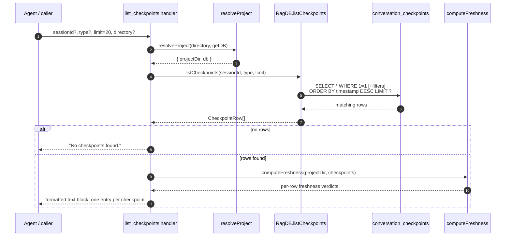

# Tool: list_checkpoints

`list_checkpoints` is an MCP tool that prints the checkpoints saved for a project, newest first. A checkpoint is a short, durable note an agent leaves at the end of a task — "what was done and why" — so a later session can pick up context without re-deriving it. This tool reads that log back. It answers "what has happened in this project before?" without running any semantic match. Reach for it when you want a chronological catch-up; reach for the semantic [search_checkpoints](search-checkpoints.md) tool instead when you want to find checkpoints about a specific topic.

The tool is registered alongside its two siblings in `registerCheckpointTools`, and the read it performs lives in the database layer as `listCheckpoints` (`src/db/checkpoints.ts:54`).

## What it does

The handler takes four optional inputs, resolves which project database to talk to, runs a single SQL query against the `conversation_checkpoints` table, and formats the rows into one plain-text block. There is no embedding step and no scoring — it is a straight ordered read, which is why it is fast and deterministic compared to `search_checkpoints`.

By default it reads across every session. Each agent run gets its own session id when a checkpoint is created, so a project accumulates checkpoints from many sessions over time. Listing without a `sessionId` filter gives the full cross-session history, newest first, bounded by the limit. Before the rows are formatted, the handler runs each one through a freshness check that compares the commit the checkpoint was stamped against to the current working tree, so the output can flag a checkpoint whose files have changed since it was written (`src/tools/checkpoint-tools.ts:114`).



1. The caller invokes the tool with any combination of `sessionId`, `type`, `limit`, and `directory`; all are optional, and `limit` defaults to `20` when omitted (`src/tools/checkpoint-tools.ts:97`).
2. The handler calls `resolveProject`, which turns the optional `directory` into an absolute path, verifies it exists, loads that project's config, and returns the matching `RagDB` handle (`src/tools/index.ts:33-72`). A missing directory throws here, before any query runs.
3. With the resolved database, the handler calls `ragDb.listCheckpoints(sessionId, type, limit)` (`src/tools/checkpoint-tools.ts:106`), a thin method that forwards straight to the store function (`src/db/index.ts:1161-1163`).
4. The store builds one SQL statement starting from `SELECT * FROM conversation_checkpoints WHERE 1=1`, then appends `AND session_id = ?` and/or `AND type = ?` only when those filters are supplied (`src/db/checkpoints.ts:60-70`).
5. It always appends `ORDER BY timestamp DESC LIMIT ?`, so rows come back most-recent-first and are capped by the limit (`src/db/checkpoints.ts:72-73`). The `timestamp` is the ISO string recorded when the checkpoint was created, not the row id, so ordering follows wall-clock creation time.
6. Each raw row is mapped into a `CheckpointRow`, with `files_involved` and `tags` parsed back from their stored JSON strings into arrays (`src/db/checkpoints.ts:81-92`).
7. If the result is empty, the handler short-circuits and returns the literal text `No checkpoints found.` (`src/tools/checkpoint-tools.ts:108-112`).
8. Otherwise it runs `computeFreshness` over the rows to attach a staleness verdict per checkpoint, then renders each one into a multi-line entry — id, type, title, optional tags, timestamp and turn index, summary, an optional file list, and an optional freshness tag — joins them with blank lines, and returns the whole thing as a single text content item (`src/tools/checkpoint-tools.ts:114-128`).

## Inputs

| name | type | required | description |
| --- | --- | --- | --- |
| `sessionId` | string | no | Limit results to one session id. Omit it to list across all sessions (the default cross-session history view). |
| `type` | enum | no | Filter by checkpoint type. Allowed values are `decision`, `milestone`, `blocker`, `direction_change`, and `handoff` (`src/tools/checkpoint-tools.ts:93-96`). |
| `limit` | integer | no | Maximum rows to return. Must be at least `1`; defaults to `20` when not provided (`src/tools/checkpoint-tools.ts:97`). |
| `directory` | string | no | Project directory whose database is read. Falls back to the `RAG_PROJECT_DIR` environment variable, then the current working directory (`src/tools/index.ts:38`). |

## Outputs

| output | where it lands / shape / description |
| --- | --- |
| Checkpoint listing | A single MCP text content item. When matches exist it is one formatted entry per checkpoint, newest first, separated by blank lines. Each entry shows `#<id> [<type>] <title>`, plus tags in brackets when present, then a line with the ISO `timestamp` and `(turn <turnIndex>)`, then the `summary`, then a `Files:` line when `filesInvolved` is non-empty, then a freshness tag line when the checkpoint's stamped commit yields a verdict (`src/tools/checkpoint-tools.ts:116-126`). When nothing matches, the text is `No checkpoints found.` |

This tool only reads. It issues a `SELECT`, so it never creates, updates, or deletes rows and changes no stored state.

## Freshness signal

Each checkpoint carries the `commit_hash` it was stamped against when it was created (null on a non-git project or for legacy rows). After fetching the rows, the handler calls `computeFreshness(projectDir, checkpoints)`, which diffs each row's stamped commit against the working tree and returns a verdict per row (`src/tools/checkpoint-tools.ts:114`). `freshnessTag` then renders that verdict into a one-line marker: `✓ current` when nothing the checkpoint touched has changed, `⚠ stale — changed since: <files>` when at least one of its files differs from the stamp, or `⚠ written on a commit not in current history` when the stamped commit is no longer reachable (rebase, squash, or a different clone) (`src/git/staleness.ts:89-99`). A row with no commit stamp or no files to anchor on produces no tag at all, so the signal is opt-in and never a false alarm (`src/git/staleness.ts:56-60`). This is why an old checkpoint can still be listed while being flagged as out of date.

## Branches and failure cases

- **No filters**: with neither `sessionId` nor `type`, the query is `WHERE 1=1 ORDER BY timestamp DESC LIMIT ?`, returning the newest checkpoints across all sessions (`src/db/checkpoints.ts:60-73`).
- **Session filter only**: supplying `sessionId` adds `AND session_id = ?`, scoping the list to one conversation's checkpoints (`src/db/checkpoints.ts:63-66`).
- **Type filter only**: supplying `type` adds `AND type = ?`, useful for listing only `blocker` or `decision` checkpoints, for example (`src/db/checkpoints.ts:67-70`).
- **Both filters**: both clauses are appended and combined with `AND`, so a checkpoint must match the session *and* the type to appear.
- **Empty result**: if the query returns no rows — empty project, over-narrow filters, or a `sessionId` with no saved checkpoints — the handler returns `No checkpoints found.` rather than an empty block (`src/tools/checkpoint-tools.ts:108-112`).
- **Per-entry conditional formatting**: the tags suffix, the `Files:` line, and the freshness tag are rendered only when their underlying data is present, so a minimal checkpoint with no files, tags, or commit stamp still prints cleanly (`src/tools/checkpoint-tools.ts:118-123`).
- **Non-git project**: `computeFreshness` returns no signal for every row when the directory is not a git repo, so the freshness lines are simply absent (`src/git/staleness.ts:39-41`).
- **Missing or bad directory**: `resolveProject` resolves the path to absolute and throws `Directory does not exist: <path>` when it is missing, so an invalid `directory` fails before the query (`src/tools/index.ts:44-47`).
- **Limit floor, no ceiling**: the schema rejects a `limit` below `1`; there is no upper bound in the schema, so a large limit is passed straight into the SQL `LIMIT`.

## Example

Arguments to list the five most recent blocker checkpoints in the current project:

```json
{
  "type": "blocker",
  "limit": 5
}
```

A representative response body (values synthetic):

```text
#42 [decision] Chose JSON columns over join tables [schema, db]
  2026-05-31T14:24:00.000Z (turn 7)
  Stored files_involved and tags as JSON text to avoid extra tables. Simpler reads, no migrations.
  Files: src/db/checkpoints.ts, src/db/index.ts
  ⚠ stale — changed since: src/db/checkpoints.ts

#41 [milestone] Checkpoint tooling wired into MCP server
  2026-05-30T09:10:00.000Z (turn 3)
  Registered create/list/search checkpoint tools and exposed them over the MCP transport.
  ✓ current
```

## How it relates to the other checkpoint flows

The three checkpoint tools share one store and one table, differing only in direction and ordering. The CLI exposes the same read through `mimirs checkpoint list`, which calls the identical `listCheckpoints` store function with no session filter (`src/cli/commands/checkpoint.ts:57`).

| Flow | What it does | Ordering |
| --- | --- | --- |
| [create_checkpoint](create-checkpoint.md) | Writes a new checkpoint plus its embedding | n/a (write) |
| `list_checkpoints` | Reads checkpoints by recency, with optional session/type filters | `timestamp` descending |
| [search_checkpoints](search-checkpoints.md) | Semantic match over title + summary embeddings | embedding distance |
| [mimirs checkpoint list](../cli/checkpoint.md) | CLI surface for the same listing query | `timestamp` descending |

## Key source files

- `src/tools/checkpoint-tools.ts` — registers `list_checkpoints` (and its siblings), validates inputs, runs the read, computes freshness, and formats the text response.
- `src/db/checkpoints.ts` — `listCheckpoints` builds the filtered, ordered SQL query and maps rows into `CheckpointRow` objects.
- `src/git/staleness.ts` — `computeFreshness` and `freshnessTag` produce the per-row staleness verdict and its inline tag.
- `src/db/index.ts` — defines the `conversation_checkpoints` table and its indexes (`src/db/index.ts:462-475`) and exposes `listCheckpoints` as a method on `RagDB` (`src/db/index.ts:1161-1163`).
- `src/db/types.ts` — the `CheckpointRow` shape returned to the handler (`src/db/types.ts:74-87`).
- `src/tools/index.ts` — `resolveProject` selects the project directory and database for the call.
