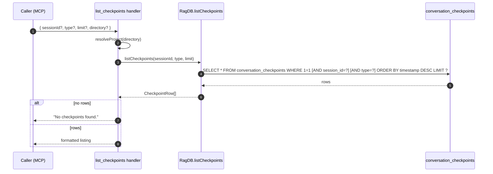

# Tool: list_checkpoints

`list_checkpoints` returns checkpoint rows, most recent first, with optional `sessionId` and `type` filters. It is the chronological read-side of [`create_checkpoint`](create-checkpoint.md). Use it to scan recent decisions, milestones, blockers, direction changes, or handoffs without writing a semantic query. The handler is at `src/tools/checkpoint-tools.ts:80-118` and calls `db.listCheckpoints` defined in `src/db/checkpoints.ts:50-88`.

When you remember the topic of a checkpoint, use [`search_checkpoints`](search-checkpoints.md) instead — that one ranks by vector distance. When you want the timeline, use this tool.

## Flow



1. Caller invokes the tool with any combination of `sessionId`, `type`, `limit`, and `directory`. Schema at `src/tools/checkpoint-tools.ts:83-94`.
2. `resolveProject` resolves the right `RagDB` based on `directory`, `RAG_PROJECT_DIR`, or cwd.
3. `ragDb.listCheckpoints(sessionId, type, limit)` builds a SQL `WHERE 1=1` query, conditionally appending `AND session_id = ?` and `AND type = ?`, then `ORDER BY timestamp DESC LIMIT ?` (`src/db/checkpoints.ts:55-69`).
4. Each row is mapped to a `CheckpointRow` with `files_involved` and `tags` parsed from JSON (`src/db/checkpoints.ts:77-87`).
5. When the result is empty the handler returns the literal `No checkpoints found.` (`src/tools/checkpoint-tools.ts:100-104`).
6. Otherwise rows are formatted into a multi-line string: `#id`, `[type]`, title, optional `[tag1, tag2]`, timestamp + `(turn <n>)`, summary, and an optional `Files:` line (`src/tools/checkpoint-tools.ts:106-114`). Lines are joined with blank lines between checkpoints.

## Cross-session default

Without a `sessionId` the SQL query has no `session_id` clause, so checkpoints from every session show up interleaved by `timestamp DESC`. This is intentional: a fresh chat in a new session can see the most recent decisions from previous sessions without knowing their ids ahead of time. Pass `sessionId` only when you specifically want to drill into one session's history.

## Inputs

| Input | Required | Notes |
|---|---|---|
| `sessionId` | no | Limit results to one session id. Omit to list across all sessions. |
| `type` | no | One of `decision`, `milestone`, `blocker`, `direction_change`, `handoff` (`src/tools/checkpoint-tools.ts:85-88`). Any other value is rejected by Zod. |
| `limit` | no | Max results, default 20 (`src/tools/checkpoint-tools.ts:89`). Must be a positive integer. |
| `directory` | no | Project directory. Defaults to `RAG_PROJECT_DIR` env or cwd. |

## Outputs

| Output | Notes |
|---|---|
| Formatted listing | One block per row, blank-line separated. |
| `No checkpoints found.` | When the query returns zero rows. |

Each block looks like:

```
#<id> [<type>] <title> [<tag1>, <tag2>]
  <timestamp> (turn <turnIndex>)
  <summary>
  Files: <path1>, <path2>
```

The `[<tag…>]` segment is omitted when `tags` is empty, and the `Files:` line is omitted when `filesInvolved` is empty (`src/tools/checkpoint-tools.ts:108-112`).

## Filters

- **`sessionId`** — exact match on the `session_id` column. Use the value reported by `create_checkpoint` or by checking `~/.claude/projects/<encoded>/*.jsonl` filenames.
- **`type`** — exact match on the `type` column. Combine with `sessionId` to see, say, every `direction_change` in one session.
- **`limit`** — capped at the DB query level via `LIMIT ?`. The default is 20; bump it when scanning further back.

The SQL is one query, not three, so combining filters does not multiply cost.

## Output format

The format mirrors what `cli/commands/checkpoint.ts` and `search_checkpoints` produce, minus the score. Concretely:

- Header line: `#<id> [<type>] <title>` plus `[<tags...>]` only when there are tags.
- Second line: `<timestamp> (turn <turnIndex>)` where `timestamp` is the ISO string passed to `createCheckpoint` and `turnIndex` is whatever was stored at creation time.
- Third line: the full `summary` text indented two spaces.
- Optional fourth line: `Files: <comma-joined paths>` indented two spaces, only when `filesInvolved` is non-empty.

## Branches and failure cases

- Empty filter combination (no rows in the DB, or filters too narrow) — returns `No checkpoints found.` without raising an error.
- Bad `type` — rejected by Zod before the handler runs.
- `limit` ≤ 0 or non-integer — rejected by Zod (`int().min(1)` at `src/tools/checkpoint-tools.ts:89`).
- No DB yet — `resolveProject` is expected to surface that as a normal error before the SELECT runs.

## Example

List the 5 most recent checkpoints across all sessions:

```json
{
  "name": "list_checkpoints",
  "arguments": { "limit": 5 }
}
```

List only blockers from one session:

```json
{
  "name": "list_checkpoints",
  "arguments": {
    "sessionId": "<session-uuid>",
    "type": "blocker"
  }
}
```

Sample shape (synthetic values):

```
#42 [decision] Chose JWT over session cookies [auth, design]
  2025-01-01T00:00:00.000Z (turn 12)
  Picked JWT for the public API because callers are stateless. Cookies stay for the dashboard.
  Files: src/auth/jwt.ts, src/auth/session.ts

#39 [milestone] Indexer landed
  2024-12-30T00:00:00.000Z (turn 18)
  First end-to-end run over the repo; FTS and vec tables stay in sync.
```

## Key source files

- `src/tools/checkpoint-tools.ts` — handler at lines 80-118 inside `registerCheckpointTools`.
- `src/db/checkpoints.ts` — `listCheckpoints` (line 50) builds the filtered SELECT and parses JSON columns.
- `src/db/index.ts` — exposes `RagDB.listCheckpoints` to the handler.

## Related flows

- [create_checkpoint](create-checkpoint.md) — writes the rows surfaced here.
- [search_checkpoints](search-checkpoints.md) — same store, ranked by vector distance instead of timestamp.
- [CLI: checkpoint](../cli/checkpoint.md) — command-line view of the same rows.
