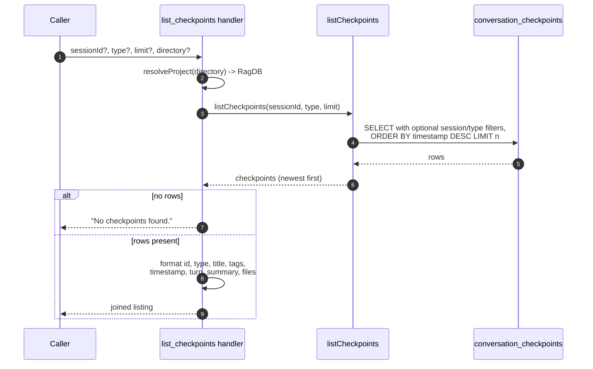

# Tool: list_checkpoints

`list_checkpoints` reads back the checkpoints saved by [create_checkpoint](create-checkpoint.md), most recent first. It is how a session orients itself in project history without searching: "what decisions, milestones, blockers, and direction changes have happened, newest first?". By default it spans every session, so you see the whole project's trail, not just the current conversation.

Use it when you want a chronological overview. When you instead want to find checkpoints by meaning rather than recency, use [search_checkpoints](search-checkpoints.md).

The handler is registered in `src/tools/checkpoint-tools.ts:80-118`.

## How it works



1. The caller invokes the tool with all-optional `sessionId`, `type`, `limit`, and `directory` (`src/tools/checkpoint-tools.ts:83-94`).
2. `resolveProject` resolves the optional `directory` into the `RagDB` handle, falling back to `RAG_PROJECT_DIR` or the current working directory (`src/tools/checkpoint-tools.ts:96`).
3. `listCheckpoints` runs a single `SELECT` against `conversation_checkpoints`, adding a `session_id = ?` clause only when `sessionId` is set and a `type = ?` clause only when `type` is set, then ordering by `timestamp DESC` with the limit applied (`src/tools/checkpoint-tools.ts:98`, `src/db/checkpoints.ts:50-69`).
4. Each row is mapped into a checkpoint object, with `files_involved` and `tags` parsed from their stored JSON strings (`src/db/checkpoints.ts:77-87`).
5. When the result set is empty, the handler returns the literal text `No checkpoints found.` (`src/tools/checkpoint-tools.ts:100-104`).
6. Otherwise each checkpoint is rendered into a multi-line block and the blocks are joined with blank-line separators (`src/tools/checkpoint-tools.ts:106-114`).

## Cross-session by default

The key behavior: when no `sessionId` is given, the `session_id` filter clause is simply not added, so the query returns checkpoints from every session, newest first (`src/db/checkpoints.ts:59-62`). This is what makes the tool a project-wide history view rather than a per-conversation one. Passing `sessionId` narrows it to a single session.

## Filters

All three filters are optional and combine with AND semantics in the query (`src/db/checkpoints.ts:56-69`).

| filter | effect | default |
|--------|--------|---------|
| `sessionId` | Restrict to one session's checkpoints. Omitted means all sessions. | unset (all sessions) |
| `type` | Restrict to one of `decision`, `milestone`, `blocker`, `direction_change`, `handoff`. | unset (all types) |
| `limit` | Cap the number of rows returned, applied as `LIMIT` after ordering. | `20` |

## Inputs

| name | type | required | description |
|------|------|----------|-------------|
| `sessionId` | string | no | Limit results to a specific session id. When omitted, checkpoints from all sessions are returned (`src/tools/checkpoint-tools.ts:84`). |
| `type` | enum | no | Filter by checkpoint type: `decision`, `milestone`, `blocker`, `direction_change`, or `handoff` (`src/tools/checkpoint-tools.ts:85-88`). |
| `limit` | integer ≥ 1 | no | Maximum number of checkpoints to return. Defaults to 20 (`src/tools/checkpoint-tools.ts:89`). |
| `directory` | string | no | Project directory to operate on. Defaults to `RAG_PROJECT_DIR` or the current working directory (`src/tools/checkpoint-tools.ts:90-93`). |

## Outputs

| output | where it lands / shape / description |
|--------|--------------------------------------|
| Formatted checkpoint listing | A single text block. Each checkpoint renders as `#<id> [<type>] <title><tags>` on the first line, `<timestamp> (turn <turnIndex>)` indented on the second, the summary indented on the third, and an indented `Files: ...` line when `filesInvolved` is non-empty. `<tags>` shows as ` [tag1, tag2]` only when tags are present. Blocks are joined by blank lines (`src/tools/checkpoint-tools.ts:106-114`). |
| Empty-state text | When no rows match, the block is exactly `No checkpoints found.` (`src/tools/checkpoint-tools.ts:100-104`). |

The listing is ordered purely by recency; unlike [search_checkpoints](search-checkpoints.md) it does not compute or print a relevance score.

## Branches and failure cases

- **No filters.** Returns the newest checkpoints across all sessions, up to the limit (`src/db/checkpoints.ts:56-68`).
- **Session filter.** Adds `AND session_id = ?` and returns only that session's checkpoints (`src/db/checkpoints.ts:59-62`).
- **Type filter.** Adds `AND type = ?` and returns only checkpoints of that type (`src/db/checkpoints.ts:63-66`).
- **Both filters.** They stack — only checkpoints matching both the session and the type are returned.
- **Limit default.** When `limit` is omitted, the schema default of 20 is used (`src/tools/checkpoint-tools.ts:89`).
- **Empty result.** Any filter combination that yields zero rows returns `No checkpoints found.` rather than an empty body (`src/tools/checkpoint-tools.ts:100-104`).
- **Tags / files rendering.** The ` [tags]` segment and the `Files:` line each appear only when their array is non-empty; an empty array renders nothing for that part (`src/tools/checkpoint-tools.ts:108-112`).
- **Read-only.** This tool only queries; it never writes. Directory errors surface from `resolveProject` / `RagDB`.

## Example

List the 10 most recent decisions across all sessions:

```json
{ "type": "decision", "limit": 10 }
```

Illustrative output:

```
#12 [decision] Chose SQLite vec0 for embeddings [storage, embeddings]
  2026-05-20T14:03:11.000Z (turn 8)
  Picked sqlite-vec over a separate vector DB to keep the index a single file.
  Files: src/example.ts, src/db/index.ts

#9 [decision] Switched chunker to bun-chunk
  2026-05-18T09:12:44.000Z (turn 3)
  Replaced the hand-rolled splitter; better symbol boundaries.
```

## Related tools

- [create_checkpoint](create-checkpoint.md) — writes the rows this tool reads.
- [search_checkpoints](search-checkpoints.md) — find checkpoints by meaning instead of by recency.

## Key source files

- `src/tools/checkpoint-tools.ts` — registers `list_checkpoints`, applies filters, and formats the listing.
- `src/db/checkpoints.ts` — `listCheckpoints`, the filtered `ORDER BY timestamp DESC LIMIT` query and row mapping.
- `src/db/index.ts` — the `RagDB` class exposing `listCheckpoints` over the `conversation_checkpoints` table.
