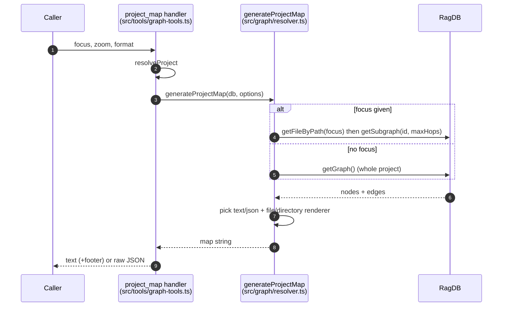

# Tool: project_map

The `project_map` MCP tool turns the codebase's import graph into a readable map: which files import which, what each file exports, and how connected each one is. It is faster than opening dozens of files and reading their import statements, and it can zoom into the neighborhood around a single file so you only see what is nearby. It answers "how does this code fit together?" without you having to trace imports by hand.

The handler is registered in `src/tools/graph-tools.ts:8-51`. The map itself is built by `generateProjectMap` in `src/graph/resolver.ts:181-225`.

## When to use it

Use `project_map` to understand structure: the layering of the project, what a module connects to, or a file's neighborhood before changing it. The edges it draws are real resolved imports, so it reflects what the code actually depends on. For a single file's direct dependencies or importers in isolation, [depends_on](depends-on.md) and [depended_on_by](depended-on-by.md) are more targeted.

## Inputs

| name | type | required | description |
| --- | --- | --- | --- |
| `focus` | string | no | A project-relative file path. When set, the map is limited to that file's neighborhood instead of the whole project. |
| `zoom` | enum `file` \| `directory` | no | Granularity. `file` (default) shows individual files; `directory` collapses files into their directories — better for large projects. |
| `format` | enum `text` \| `json` | no | Output shape. `text` (default) is human-readable; `json` is structured data carrying fan-in/fan-out metrics. |
| `directory` | string | no | Which project to map. Defaults to `RAG_PROJECT_DIR` or the cwd. |

The handler resolves the project, then calls `generateProjectMap` with `zoom ?? "file"` and `format ?? "text"`, passing `focus` through untouched `src/tools/graph-tools.ts:30-37`.

## Outputs

| output | where it lands / shape / description |
| --- | --- |
| Text map | A single MCP text block. A `## Project Map` heading with the file or directory count, then per-node sections listing exports, `depends_on`, and `depended_on_by`. A footer suggests `search` / `depends_on` / `depended_on_by`. |
| JSON map | A single text block containing a JSON string: `{ level, nodes, edges }` for file zoom or `{ level, directories, edges }` for directory zoom, with fan-in/fan-out numbers. No footer is appended. |

The handler appends the tip footer only for the text format; the JSON branch returns the raw JSON string `src/tools/graph-tools.ts:39-49`.

## How a map is built



1. The handler resolves the project directory and database `src/tools/graph-tools.ts:30`.
2. It invokes `generateProjectMap` with the focus, zoom, and format options `src/tools/graph-tools.ts:32-37`.
3. If `focus` is given, the file is looked up by its absolute path and its neighborhood is fetched with `getSubgraph(file.id, maxHops)`; if the file is not in the index, an empty graph is used. Without focus, the whole project graph is loaded with `getGraph()` `src/graph/resolver.ts:195-204`.
4. `getSubgraph` does a breadth-first walk over the import edges, expanding `maxHops` (default 2) in both directions — following imports and importers `src/db/graph.ts:834-945`. `getGraph` loads every file as a node and every resolved import as an edge `src/db/graph.ts:780-832`.
5. The renderer is chosen by format then zoom: JSON+directory, JSON+file, text+directory, or text+file `src/graph/resolver.ts:213-224`.
6. The map string is returned; the handler wraps it appropriately for the format `src/tools/graph-tools.ts:39-49`.

## Source of truth: dependency edges in the database

Every edge in the map is a resolved import recorded during indexing. Both `getGraph` and `getSubgraph` build edges from `file_imports` rows where `resolved_file_id IS NOT NULL`, joining back to `files` for the paths `src/db/graph.ts:815-828`, `925-940`. Unresolved imports (e.g. external packages that could not be matched to an indexed file) carry a null `resolved_file_id` and so never become edges. Each node's exports come from the `file_exports` table `src/db/graph.ts:790-808`. This means the map only ever shows relationships that the indexer actually resolved — if the index is stale or a file was never indexed, that connection will be missing.

## Focus: a file's neighborhood

By default the map covers the entire project, which can be large. Passing `focus` narrows it to the files within `maxHops` import-edges of the focused file. The neighborhood is computed by `getSubgraph`, which starts from the focused file's id and walks outward two hops by default, collecting both the files it imports and the files that import it `src/graph/resolver.ts:195-198`, `src/db/graph.ts:838-870`. A subtlety worth knowing: the focus path must already be in the index — if `getFileByPath` returns nothing, the graph is empty and you get the "No files indexed or no dependencies found." message rather than an error `src/graph/resolver.ts:196-211`.

## Zoom levels: file vs directory

| zoom | what a node is | what it shows |
| --- | --- | --- |
| `file` (default) | one indexed file | exports (first 8, then `+N more`), `depends_on` list, `depended_on_by` list | 
| `directory` | one directory | files in it, and directory-to-directory dependency counts |

In text file-zoom, files are split into two sections — "Files With No Importers" and "Files" — so structural roots (nothing imports them) are easy to spot `src/graph/resolver.ts:253-306`. In directory zoom, files are grouped by `dirname` and cross-directory edges are deduplicated into counts like `src/a -> src/b (3 imports)` `src/graph/resolver.ts:311-356`.

## Fan-in and fan-out metrics (JSON)

The JSON format adds quantitative connectivity. In file-zoom JSON, each node gets a `fanIn` (how many files import it) and `fanOut` (how many files it imports), counted by walking the edge list `src/graph/resolver.ts:358-391`. In directory-zoom JSON, each directory reports `fileCount`, `totalExports`, and a `fanIn`/`fanOut` measured as the number of distinct other directories pointing in or out `src/graph/resolver.ts:393-449`. These metrics let an agent rank files or directories by how central they are, which the text format does not surface numerically.

## Branches and failure cases

- **No `focus`** — the whole project graph is loaded via `getGraph()` `src/graph/resolver.ts:202-204`.
- **`focus` resolves to an indexed file** — the two-hop neighborhood is returned `src/graph/resolver.ts:196-198`.
- **`focus` not found in index** — the graph is empty and an empty-state result is returned `src/graph/resolver.ts:199-201`.
- **Empty graph (no nodes)** — JSON returns `{ level, nodes: [], edges: [], directories: [] }`; text returns "No files indexed or no dependencies found." `src/graph/resolver.ts:206-211`.
- **`format` json** — the handler returns the JSON string with no footer `src/tools/graph-tools.ts:39-43`.
- **`format` text (default)** — the handler appends the next-steps tip footer `src/tools/graph-tools.ts:45-49`.
- **More than 8 exports on a node (text file-zoom)** — only the first 8 are listed, followed by `+N more` `src/graph/resolver.ts:273-279`.

This tool reads the graph tables only; it does not write to the database and does not log an analytics row.

## Example

Focus on one file, directory zoom, JSON output:

```json
{
  "focus": "src/db/index.ts",
  "zoom": "file",
  "format": "json"
}
```

Illustrative JSON shape (file zoom):

```json
{
  "level": "file",
  "nodes": [
    { "path": "src/db/index.ts", "exports": [{ "name": "RagDB", "type": "class" }], "fanIn": 54, "fanOut": 10 }
  ],
  "edges": [
    { "from": "src/db/index.ts", "to": "src/db/search.ts", "source": "./search" }
  ]
}
```

Illustrative text shape (file zoom, no focus):

```
## Project Map (file-level, 42 files)

### Files With No Importers
  src/cli.ts
    exports: main (function)
    depends_on: src/server/index.ts

### Files
  src/db/index.ts
    exports: RagDB (class)
    depended_on_by: src/tools/index.ts, src/search/hybrid.ts

── Tip: call search("<topic>") to find files related to a specific area, or depends_on/depended_on_by for a single file's connections. ──
```

## Key source files

- `src/tools/graph-tools.ts` — registers `project_map`, resolves options, formats the text footer.
- `src/graph/resolver.ts` — `generateProjectMap` and the four text/JSON renderers.
- `src/db/graph.ts` — `getGraph` and `getSubgraph` build nodes and edges from `file_imports` and `file_exports`.
- `src/db/index.ts` — `RagDB` exposes `getGraph`, `getSubgraph`, and `getFileByPath`.
