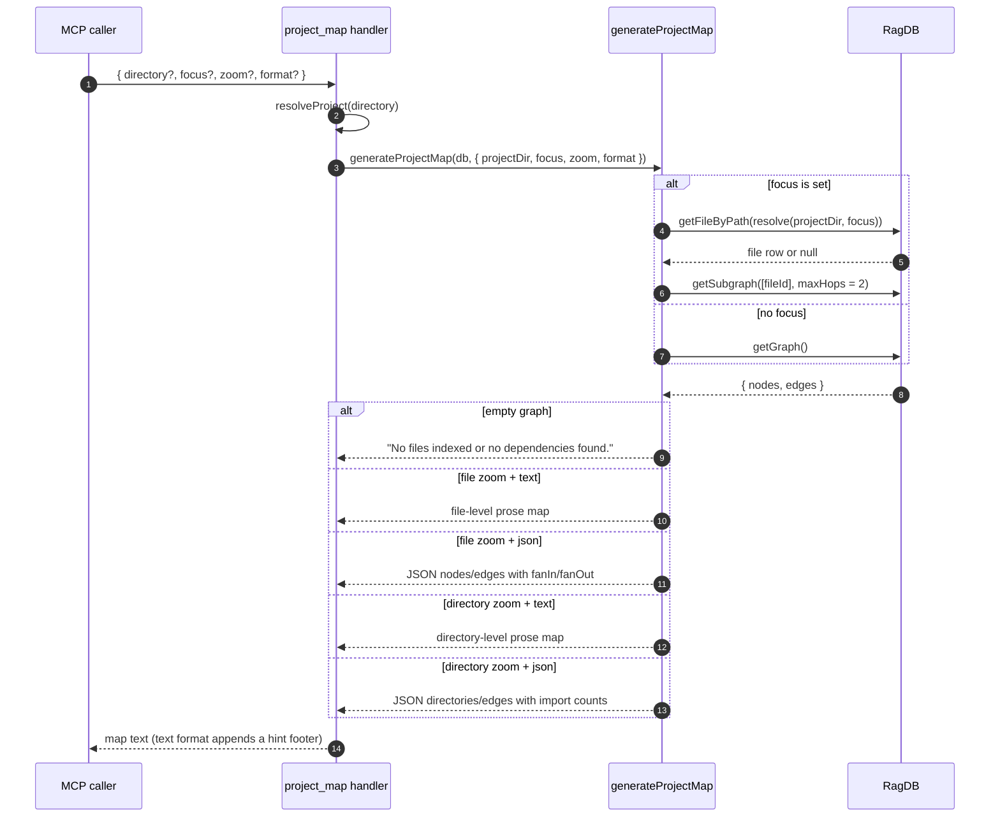

# Tool: project_map

`project_map` builds a structured view of the project's import graph. It
turns the dependency edges stored in `file_imports` into a readable map of
which files depend on which, with optional zoom-out to directories and an
optional JSON shape carrying fan-in / fan-out metrics.

Reach for it when you need orientation in an unfamiliar codebase, or when you
want to find a file's neighborhood without opening every file to read its
imports. It is faster than reading import statements across many files and
catches re-exports that grep can miss.

## Flow



1. Caller provides an optional `directory`, `focus`, `zoom` and `format`. The
   handler resolves the project and opens the DB
   (`src/tools/graph-tools.ts:29-30`).
2. `generateProjectMap` is called with the resolved `projectDir`, `focus`,
   `zoom` (default `file`), and `format` (default `text`)
   (`src/tools/graph-tools.ts:32-37`).
3. When `focus` is set, the resolver loads that one file row and asks the DB
   for a two-hop neighborhood subgraph; otherwise it pulls the full graph
   (`src/graph/resolver.ts:195-204`).
4. An empty graph short-circuits to a "no dependencies found" message — in
   JSON form, an empty `{ level, nodes, edges, directories }` envelope
   (`src/graph/resolver.ts:206-211`).
5. The renderer picks one of four code paths based on `zoom` and `format`
   (`src/graph/resolver.ts:213-225`).
6. In JSON `file` mode, each node carries `exports`, `fanIn`, `fanOut`
   counted off the edge list; each edge carries `from`, `to`, and the
   original import `source` string (`src/graph/resolver.ts:358-391`). In
   text `file` mode, the renderer groups nodes by "no importers" vs others
   and prints the up-to-eight first exports plus the depends-on and
   depended-on-by sets per node (`src/graph/resolver.ts:228-309`).
7. In `directory` zoom, nodes are bucketed by `dirname(relPath)`; cross-
   directory edges are deduplicated with import counts. Text and JSON
   versions print directory file lists and the edge table
   (`src/graph/resolver.ts:311-449`).
8. When the response is text, the handler appends a short hint footer
   pointing at `search`, `depends_on`, and `depended_on_by` so a follow-up
   query is one step away (`src/tools/graph-tools.ts:39-49`).

## Inputs

| Name | Type | Required | Description |
| --- | --- | --- | --- |
| `directory` | string | no | Project directory. Defaults to `RAG_PROJECT_DIR` or cwd. |
| `focus` | string | no | Project-relative path. When set, the resolver fetches a two-hop subgraph around that file. When the file is not in the index, the resolver returns the empty-graph message (`src/graph/resolver.ts:195-201`). |
| `zoom` | `"file"` \| `"directory"` | no | `file` (default) lists individual files. `directory` aggregates files by their parent directory and counts cross-directory edges. |
| `format` | `"text"` \| `"json"` | no | `text` (default) is prose with sections and a hint footer. `json` is a structured envelope for tooling. |

## Outputs

| Format | Shape |
| --- | --- |
| `text` + `file` | `## Project Map (file-level, N files)`, then `### Files With No Importers` and `### Files`, each node printed with `exports`, `depends_on`, `depended_on_by` (`src/graph/resolver.ts:266-308`). |
| `text` + `directory` | `## Project Map (directory-level, N directories)`, then `### Directories` listing files per directory and `### Dependencies` showing cross-directory edges with import counts (`src/graph/resolver.ts:338-355`). |
| `json` + `file` | `{ level: "file", nodes: [{ path, exports[], fanIn, fanOut }], edges: [{ from, to, source }] }` (`src/graph/resolver.ts:377-390`). |
| `json` + `directory` | `{ level: "directory", directories: [{ path, fileCount, files, totalExports, fanIn, fanOut }], edges: [{ from, to, importCount }] }` (`src/graph/resolver.ts:434-448`). |

## Focus and zoom

- **No focus, file zoom.** Calls `db.getGraph()` for the whole project. On a
  large codebase this can be a long output — switch to `zoom: "directory"`
  to keep the response manageable.
- **`focus` set, file zoom.** The resolver calls `db.getSubgraph([file.id],
  maxHops)` with `maxHops` fixed at `2` (`src/graph/resolver.ts:188-198`).
  The hop limit is hard-coded in this code path; if you need a wider window,
  call again on a different focus file. When the focus path is not in the
  index the subgraph is empty and the empty message is returned.
- **Directory zoom.** Same data, regrouped by parent directory. Useful for
  large monorepos where the file-level output is too noisy.

## Output formats: text vs JSON

The text format is meant to be read by a human or pasted into a chat. The
JSON format is meant for tools that want to compute on the graph — for
example, sorting by `fanIn` to find leaf utilities or by `fanOut` to find
god-files. JSON file-mode also keeps the full `exports` array per node so
downstream tools can match symbols without a second call. JSON output skips
the hint footer; only the text branch appends it
(`src/tools/graph-tools.ts:39-49`).

## Branches and failure cases

- **Focus path not indexed.** The DB lookup misses, the subgraph is empty,
  and the response is the no-files message. There is no error; the caller
  still gets a 200 with explanatory text (`src/graph/resolver.ts:195-211`).
- **Empty project DB.** Same no-files message; JSON returns
  `{"level":"file","nodes":[],"edges":[],"directories":[]}`.
- **Unresolved imports.** `getDependsOn` / `getGraph` skip imports whose
  `resolved_file_id` is null, so external packages and unresolved relative
  paths do not appear as nodes. The project map is strictly the in-project
  edge set.

## Example

```json
{
  "tool": "project_map",
  "arguments": {
    "focus": "src/server/index.ts",
    "zoom": "file",
    "format": "text"
  }
}
```

Illustrative response shape (values truncated, names obviously synthetic):

```
## Project Map (file-level, 7 files)

### Files With No Importers
  src/server/index.ts
    exports: startServer (function)
    depends_on: src/tools/index.ts, src/db/index.ts

### Files
  src/tools/index.ts
    exports: registerAllTools (function)
    depends_on: src/tools/graph-tools.ts
    depended_on_by: src/server/index.ts

── Tip: call search("<topic>") to find files related to a specific area, or depends_on/depended_on_by for a single file's connections. ──
```

## Key source files

- `src/tools/graph-tools.ts` — MCP handler that forwards arguments and
  appends the text-mode hint footer.
- `src/graph/resolver.ts` — `generateProjectMap` plus the four render
  functions for the text and JSON variants.
- `src/db/graph.ts` — `getGraph` and `getSubgraph` queries against
  `file_imports` / `file_exports`.

## Related flows

- [Tool: depends_on](./depends-on.md) — single-file outbound edges, same DB
  source.
- [Tool: depended_on_by](./depended-on-by.md) — single-file inbound edges.
- [CLI: map](../cli/map.md) — CLI wrapper that prints the same map.
