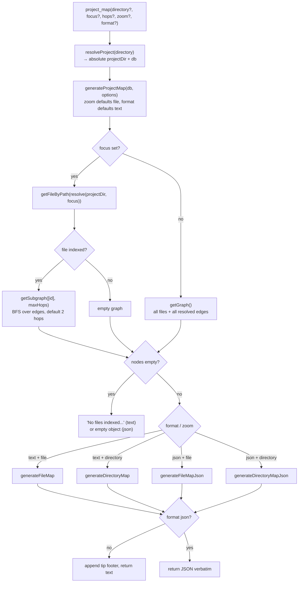

# Tool: project_map

`project_map` turns the stored import graph of a codebase into a readable
dependency map. Instead of opening dozens of files and tracing `import`
statements by hand, an agent (or a person) calls this tool once and gets a
single document describing which files exist, what each one exports, what it
depends on, and what depends on it. It answers questions like "what is the
shape of this project?", "what does this file pull in?", and "which files have
no importers (likely entry points or dead code)?".

The tool reads only what indexing already stored — it does not parse source on
demand. The graph is built earlier, when files are indexed: the indexer extracts
each file's imports and exports, then resolves each import specifier to a
concrete indexed file. So `project_map` is fast (a few SQL reads plus in-memory
formatting) but only as complete as the last index run. The handler lives in
`src/tools/graph-tools.ts:48-98`, the formatting in `src/graph/resolver.ts:370`,
and the graph reads in `src/db/graph.ts`.

## How a call flows

The interesting part of this tool is not the call order — it is the branching:
`focus` chooses whether to load the whole graph or a neighborhood, and the
`zoom` × `format` pair selects one of four formatters. A flowchart shows those
forks more clearly than a sequence.



1. The agent calls `project_map` with up to five optional arguments. None are
   required; with no arguments the tool maps the whole indexed project at file
   level as readable text `src/tools/graph-tools.ts:51-74`.
2. The handler calls `resolveProject(directory, getDB)`, which resolves the
   directory to an absolute path (falling back to `RAG_PROJECT_DIR` or the
   current working directory), confirms it exists, loads config, and opens the
   matching database `src/tools/index.ts:33-83`. A non-existent directory throws
   here before any map work begins.
3. The handler calls `generateProjectMap` with the resolved project directory and
   the caller's options, defaulting `zoom` to `"file"` and `format` to `"text"`,
   and passing the `hops` argument through as `maxHops`
   `src/tools/graph-tools.ts:78-84`.
4. If `focus` is set, the resolver looks up that file by its absolute path (the
   focus argument is resolved against the project root first). If found, it pulls
   only the neighborhood around it; if not found, it produces an empty graph
   rather than erroring `src/graph/resolver.ts:384-393`.
5. `getSubgraph` runs a breadth-first walk over the import edges starting at the
   focus file, up to `maxHops` (defaulting to 2 inside the resolver) in both
   directions — importers and dependencies `src/db/graph.ts:1056-1094`.
6. With no `focus`, `getGraph` loads every file, every export, and every resolved
   edge in three SQL queries `src/db/graph.ts:1002-1054`.
7. If the resulting graph has no nodes, the resolver short-circuits: text mode
   returns a one-line "nothing found" string, JSON mode returns an empty object
   `src/graph/resolver.ts:395-400`.
8. Otherwise the resolver picks one of four formatters based on `zoom` and
   `format`, then builds the output string `src/graph/resolver.ts:402-413`.
9. The string returns to the handler. For `format: "json"` it is returned
   verbatim. For text, the handler appends a one-line tip footer pointing the
   caller at `search`, `depends_on`, and `dependents` for follow-up
   `src/tools/graph-tools.ts:86-96`.

## Where the graph data comes from

`project_map` never parses source files itself. The nodes and edges it renders
are rows in the `files`, `file_exports`, and `file_imports` tables, populated
during indexing. After files are indexed and their raw imports stored, the
indexer calls `resolveImports`, which matches each import specifier (for example
`../db`) to a concrete indexed file id and writes that id into
`file_imports.resolved_file_id` via `db.resolveImport`
`src/graph/resolver.ts:25-44`. The indexer triggers this once per index run,
right after files are chunked, but only when at least one file was indexed
`src/indexing/indexer.ts:979-980`. An edge only appears in the map after it has
been resolved this way — every graph query filters on
`resolved_file_id IS NOT NULL` `src/db/graph.ts:1042`.

Resolution is two-pass per specifier in `resolveSpecifier`: first
`@winci/bun-chunk`'s filesystem resolver (which understands tsconfig path aliases
plus Python, Rust, C, and Go import styles), then a fallback that probes the
indexed paths directly for explicit relative or absolute specifiers, with
per-language strategies for non-relative intra-project imports
`src/graph/resolver.ts:316-339`. Bare external specifiers (`react`, `fmt`,
`<stdio.h>`) resolve to nothing and are skipped, so third-party packages never
become edges `src/graph/resolver.ts:313-314`.

Two consequences follow. First, imports of third-party packages (bare specifiers
like `zod`) are never resolved to a node, so they do not appear as edges — the
map shows internal structure only. Second, if the index is stale or a file was
added but not yet indexed, its edges are missing from the map even though they
exist in source.

## Inputs

| name | type | required | description |
| --- | --- | --- | --- |
| `directory` | string | no | Project directory to map. Defaults to `RAG_PROJECT_DIR` or the current working directory. Resolved to an absolute path; must exist or the call throws `src/tools/index.ts:38-47`. |
| `focus` | string | no | A file path relative to the project root. When set, the map is limited to that file's neighborhood (its importers and dependencies) instead of the whole project `src/graph/resolver.ts:384-393`. |
| `hops` | integer (≥ 1) | no | Neighborhood radius, in import hops, around `focus`. Defaults to 2 and is ignored when `focus` is not set `src/tools/graph-tools.ts:60-65`. |
| `zoom` | `"file"` \| `"directory"` | no | Granularity. `"file"` (default) lists individual files; `"directory"` groups files by folder and shows folder-to-folder dependencies `src/graph/resolver.ts:409-411`. |
| `format` | `"text"` \| `"json"` | no | Output shape. `"text"` (default) is a human-readable outline; `"json"` is a structured object that adds fan-in/fan-out counts `src/graph/resolver.ts:402-407`. |

## Outputs

| output | where it lands / shape / description |
| --- | --- |
| dependency map | A single text block returned as the tool's `content`. The tool only reads the graph — it writes nothing to the database and changes no state. |

The map shape depends on `zoom` and `format`. The four combinations are below.

### Text, file zoom (the default)

`generateFileMap` builds adjacency maps from the edges, then splits files into
two groups: those with no indexed importers and the rest
`src/graph/resolver.ts:444-453`. Output starts with a header line counting the
files, then a `### Files With No Importers` section (likely entry points or
unreferenced files) and a `### Files` section. Each file lists up to its first 8
exports (with a `+N more` suffix beyond that), its `depends_on` list, and its
`dependents` list `src/graph/resolver.ts:458-495`.

```text
## Project Map (file-level, 3 files)

### Files With No Importers
  src/tools/graph-tools.ts
    exports: registerGraphTools (function)
    depends_on: src/graph/resolver.ts, src/tools/index.ts

### Files
  src/graph/resolver.ts
    exports: resolveImports (function), generateProjectMap (function), +4 more
    depends_on: src/db/index.ts
    dependents: src/tools/graph-tools.ts, src/cli/commands/map.ts
```

### Text, directory zoom

`generateDirectoryMap` groups files by their parent directory and counts how
many import edges cross from one directory to another (edges within the same
directory are ignored). Output is a `### Directories` section listing each
folder, its file count, and its file names, followed by a `### Dependencies`
section showing `dirA -> dirB (N imports)` for each cross-directory pair
`src/graph/resolver.ts:500-545`.

### JSON, file zoom

`generateFileMapJson` computes per-file fan-in and fan-out by counting incoming
and outgoing edges, then serializes `{ level: "file", nodes, edges }`. Each node
carries its relative path, full export list (name and type, not truncated), and
its `fanIn` and `fanOut` counts. Each edge carries `from`, `to`, and the raw
import `source` string `src/graph/resolver.ts:547-580`.

```json
{
  "level": "file",
  "nodes": [
    { "path": "src/graph/resolver.ts", "exports": [{ "name": "generateProjectMap", "type": "function" }], "fanIn": 10, "fanOut": 1 }
  ],
  "edges": [
    { "from": "src/tools/graph-tools.ts", "to": "src/graph/resolver.ts", "source": "../graph/resolver" }
  ]
}
```

### JSON, directory zoom

`generateDirectoryMapJson` aggregates per directory: file count, file names,
total export count, and directory-level fan-in/fan-out (counted as the number of
distinct other directories it imports from or is imported by, using sets so a
directory pair counts once regardless of how many files cross). It serializes
`{ level: "directory", directories, edges }`, where each edge carries `from`,
`to`, and an `importCount` `src/graph/resolver.ts:582-638`.

## Text vs JSON, and file vs directory

| dimension | option | what it gives you |
| --- | --- | --- |
| format | `text` | Readable outline grouped by importer status; exports truncated to 8 per file; a tip footer is appended. Best for a person or an agent reading prose. |
| format | `json` | Machine-parseable object; adds numeric `fanIn`/`fanOut`; full untruncated exports; no footer. Best for ranking files by connectivity or feeding another tool. |
| zoom | `file` | One node per file with its exports and direct dependencies. |
| zoom | `directory` | One node per folder; intra-folder edges collapsed; cross-folder edges counted. Best for a large project where a file-level map would be too big. |

## State changes

None. `project_map` is read-only. The handler opens the database, runs `SELECT`
queries through `getGraph` or `getSubgraph`, formats the result in memory, and
returns it. It performs no inserts, updates, or deletes, and starts no background
work. The graph it renders was written earlier by indexing; this tool only reads
it.

## Branches and failure cases

- Non-existent `directory`: `resolveProject` throws
  `Directory does not exist: <abs-path>` before any map is built
  `src/tools/index.ts:45-47`. The tool wrapper turns this into an `isError` text
  response rather than a bare crash `src/tools/index.ts:100-128`.
- `focus` names a file that is not indexed: `getFileByPath` returns nothing, the
  resolver substitutes an empty graph, and the next branch reports nothing found
  rather than throwing `src/graph/resolver.ts:384-393`.
- Empty graph (no files indexed, no resolved edges, or an unmatched `focus`): for
  text, the resolver returns the literal string
  `No files indexed or no dependencies found.`; for JSON, it returns
  `{ "level": <zoom>, "nodes": [], "edges": [], "directories": [] }`
  `src/graph/resolver.ts:395-400`.
- `focus` set and found: only the neighborhood is mapped via `getSubgraph`. The
  radius is the caller's `hops` (default 2) and applies symmetrically to
  importers and dependencies `src/db/graph.ts:1056-1094`.
- Large focus neighborhoods: `getSubgraph` batches its frontier by 499 ids per
  query to stay under SQLite's 999-parameter limit (each frontier query binds the
  batch twice). The final edge-collection pass batches by `file_id` alone and
  filters the other endpoint in JS against the visited set, rather than reusing
  one batch for both endpoints of an edge, which would silently drop edges that
  span batches `src/db/graph.ts:1130-1164`.
- `format: "json"` skips the tip footer; text output always appends it
  `src/tools/graph-tools.ts:86-96`.
- Bare/external imports are never edges: only imports whose `resolved_file_id` is
  set appear, so third-party packages and unresolved relative imports are absent
  `src/db/graph.ts:1042`.

## Example

Map a single file's neighborhood as JSON to rank its connections:

```json
{
  "focus": "src/graph/resolver.ts",
  "format": "json"
}
```

Map an entire large project grouped by folder:

```json
{
  "zoom": "directory"
}
```

The same engine backs the `mimirs map` CLI command, which calls
`generateProjectMap` directly with `--focus` and `--zoom` flags. The CLI never
passes `format`, so it always emits text, and it does not expose a `hops` flag
`src/cli/commands/map.ts:7-24`.

## Key source files

- `src/tools/graph-tools.ts` — registers the `project_map` MCP tool, validates
  the five arguments, resolves the project, calls the map engine, and appends the
  text footer (lines 48-98).
- `src/graph/resolver.ts` — `generateProjectMap` and its four formatters
  (`generateFileMap`, `generateDirectoryMap`, `generateFileMapJson`,
  `generateDirectoryMapJson`); also holds `resolveImports` and `resolveSpecifier`,
  which build the edges this tool reads.
- `src/db/graph.ts` — `getGraph` (whole-project nodes and edges) and `getSubgraph`
  (BFS neighborhood around a focus file).
- `src/indexing/indexer.ts` — calls `resolveImports` after indexing so the map's
  edges exist (line 980).

## Related tools

- [depends_on](depends-on.md) — list one file's direct dependencies.
- [dependents](dependents.md) — list one file's importers (reverse dependencies).
- [mimirs map](../cli/map.md) — the CLI command over the same map engine.
