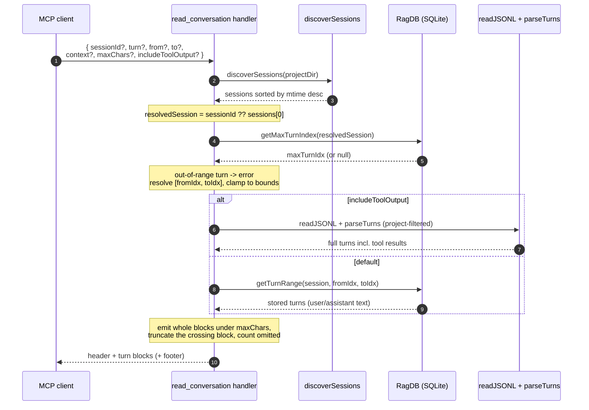

# Tool: read_conversation

`read_conversation` returns the full verbatim text of past conversation turns
for this project, by session and turn index. It is the read counterpart to
[search_conversation](search-conversation.md): search finds *which* turn is
relevant and gives a short snippet, then `read_conversation` hydrates that turn
into its complete user/assistant text — or pulls a whole range of recent turns
when you just want to see what the last session did. With one flag it will even
re-parse the raw transcript file to include full tool results, which the index
does not store.

The tool is registered on the MCP server by `registerConversationTools`, the
same function that registers search, which declares the tool name, its
description, and its argument schema, then wires up the read handler
(`src/tools/conversation-tools.ts:87-255`). Turns must already be indexed for
the default (database) path to return anything; indexing happens elsewhere (see
the [conversation CLI command](../cli/conversation.md) and the
[server start](../server/start.md) flow that can index history in the
background).

## What it does

When the handler runs it first decides *which* session to read — the one the
caller named, or the freshest transcript on disk. It then learns the highest
stored turn index for that session, rejects an explicitly out-of-range `turn`,
and resolves the request into one inclusive `[fromIdx, toIdx]` window. From that
window it renders each turn into a text block: by default from the database
(user and assistant text only), or — when `includeToolOutput` is set — by
re-parsing the raw transcript so tool results are included. Finally it enforces a
total-character ceiling, emitting whole blocks until the budget is spent and
marking anything it had to drop. The flow reads only; it never writes to the
database.



1. The client calls the tool, optionally naming a `sessionId` and a selector —
   a single `turn` (with optional `context` padding), a `from`/`to` range, or
   nothing at all — plus an optional `maxChars` cap and the `includeToolOutput`
   flag. All selectors default sensibly, so the bare call is valid
   (`src/tools/conversation-tools.ts:90-136`).
2. `resolveProject` resolves the directory and opens the project's `RagDB`,
   throwing if the directory does not exist
   (`src/tools/conversation-tools.ts:138`, `src/tools/index.ts:33-47`).
3. `discoverSessions` globs the project's transcript directory and returns the
   sessions sorted by file modification time, newest first
   (`src/conversation/parser.ts:402-432`).
4. The session is resolved: the explicit `sessionId` if given, otherwise the
   freshest transcript (`sessions[0]`). If neither exists, the tool returns
   "No conversation sessions found for this project."
   (`src/tools/conversation-tools.ts:142-148`).
5. `getMaxTurnIndex` returns the highest stored `turn_index` for that session.
   If it is `null` — the session has no indexed turns yet — the tool returns a
   "no indexed turns yet" message pointing at indexing
   (`src/tools/conversation-tools.ts:153-161`).
6. If `turn` was given and exceeds `maxTurnIdx`, the tool returns an out-of-range
   error naming the valid `0–maxTurnIdx` band rather than silently reading a
   different turn (`src/tools/conversation-tools.ts:165-172`).
7. The inclusive `[fromIdx, toIdx]` window is computed from whichever selector
   was supplied, then clamped to `[0, maxTurnIdx]`
   (`src/tools/conversation-tools.ts:175-190`).
8. Each turn in range is rendered to a block. With `includeToolOutput`, the raw
   transcript is re-parsed (project-filtered) and rendered with `buildTurnText`,
   which appends tool results; otherwise `getTurnRange` returns the stored turns
   and `renderRow` formats user/assistant text only
   (`src/tools/conversation-tools.ts:192-219`).
9. If no block fell in range, the tool reports the empty range
   (`src/tools/conversation-tools.ts:221-225`).
10. The character ceiling is enforced: whole blocks are emitted until the budget
    is spent, the block that crosses the limit is truncated and marked, and a
    footer counts any further omitted turns. The header, body, and footer are
    returned as the tool's single text content item
    (`src/tools/conversation-tools.ts:227-253`).

## Inputs

| Name | Type | Required | Description |
| --- | --- | --- | --- |
| `sessionId` | string | no | Session to read from. Defaults to the most recently active session (the freshest transcript on disk) (`src/tools/conversation-tools.ts:95-98`). |
| `turn` | integer ≥ 0 | no | A single turn index to read. Combine with `context` to include neighbors (`src/tools/conversation-tools.ts:99-104`). |
| `from` | integer ≥ 0 | no | Start of an inclusive turn-index range. Used with `to` (`src/tools/conversation-tools.ts:105-110`). |
| `to` | integer ≥ 0 | no | End of an inclusive turn-index range. Used with `from` (`src/tools/conversation-tools.ts:111-116`). |
| `context` | integer ≥ 0 | no | Turns of padding on each side of `turn`. Defaults to 0 (`src/tools/conversation-tools.ts:117-123`). |
| `maxChars` | integer ≥ 500 | no | Cap on total returned characters. Defaults to 12000; oversized turns are truncated and marked (`src/tools/conversation-tools.ts:124-130`). |
| `includeToolOutput` | boolean | no | Include full tool results by re-parsing the raw transcript. Slower; defaults to false (`src/tools/conversation-tools.ts:131-135`). |
| `directory` | string | no | Project directory; defaults to `RAG_PROJECT_DIR` or the current working directory (`src/tools/conversation-tools.ts:91-94`, `src/tools/index.ts:38`). |

## Outputs

| Output | Where it lands / shape / description |
| --- | --- |
| Verbatim turn text | A single text content item. A header line — `Session <id> — turns <fromIdx>–<toIdx> (max turn index <maxTurnIdx>)` — followed by one block per turn. Each block is `### Turn <index> (<timestamp>) [<tools>]` and then the turn's text (`src/tools/conversation-tools.ts:229-252`). |
| Diagnostic messages | When the session can't be resolved, has no indexed turns, the `turn` is out of range, the transcript file can't be located, or the range is empty, a single explanatory text item is returned instead of turn blocks (`src/tools/conversation-tools.ts:142-225`). |

The tool does not write or modify any stored state, so there is no state-change
section — this flow leaves the database untouched.

## Resolving the session

The checkpoint and read flows pick the "live" session the same way, from the
file system rather than the database. `discoverSessions` builds the transcript
directory path with `getTranscriptsDir` — which encodes the absolute project
path by replacing `/` with `-` under `~/.claude/projects/<encoded-path>/`,
falling back to a more aggressively flattened encoding when the exact one is
absent — then globs every `*.jsonl` file, stats each one, and sorts the results
by modification time descending so the freshest transcript is first
(`src/conversation/parser.ts:378-432`). The handler takes the explicit
`sessionId` when supplied, otherwise `sessions[0]`, which in practice is the
session that is currently running (`src/tools/conversation-tools.ts:142-143`).
If no session resolves — no `sessionId` and no transcripts on disk — the tool
returns a plain message and stops (`src/tools/conversation-tools.ts:144-148`).

## Turn selectors

There are three ways to pick which turns to read, resolved into one inclusive
`[fromIdx, toIdx]` window (`src/tools/conversation-tools.ts:174-190`):

| Selector | Window | Notes |
| --- | --- | --- |
| `turn` (+ `context`) | `[turn - context, turn + context]` | Reads one turn, optionally padded by `context` neighbors on each side. Default `context` is 0, so a bare `turn` reads exactly that turn. |
| `from` / `to` range | `[from ?? 0, to ?? from ?? maxTurnIdx]` | Inclusive range. A lone `from` reads from there to the end; a lone `to` reads from 0 to there. |
| neither (tail) | `[maxTurnIdx - 10 + 1, maxTurnIdx]` | With no selector, the handler returns the last 10 turns — `DEFAULT_TAIL` is 10 (`src/tools/conversation-tools.ts:17`). |

After the window is computed it is clamped to valid bounds: `fromIdx` to
`[0, maxTurnIdx]`, and `toIdx` to `[fromIdx, maxTurnIdx]`, so the range never
runs below 0, above the last turn, or backwards
(`src/tools/conversation-tools.ts:189-190`).

## Bounds via MAX(turn_index)

Bounds come from `getMaxTurnIndex`, which runs `SELECT MAX(turn_index)` over the
session's `conversation_turns` rows — not `COUNT(*)`
(`src/db/conversation.ts:230-237`). This matters because stored turn indices can
have gaps: a `COUNT`-based clamp made the newest turns unreachable and silently
redirected a `turn: N` request to a different turn. Using the true maximum index
keeps `turn: N` honest (`src/tools/conversation-tools.ts:150-153`).

The maximum also drives a deliberate choice about out-of-range requests. A
`turn` greater than `maxTurnIdx` is treated as an **error**, not a silent clamp:
the caller asked for a specific turn and must be told it does not exist, so the
tool returns `Turn <turn> is out of range — session <id> has turns 0–<max>.`
(`src/tools/conversation-tools.ts:163-172`). Ranges, by contrast, are clamped
rather than rejected — a `from`/`to` window that overshoots the end simply stops
at `maxTurnIdx`, because a range is a best-effort span rather than a request for
one exact turn (`src/tools/conversation-tools.ts:188-190`). When the session has
no stored turns at all, `getMaxTurnIndex` returns `null` and the tool returns a
"no indexed turns yet" message before computing any window
(`src/tools/conversation-tools.ts:154-161`).

## Default vs. full-fidelity rendering

There are two rendering paths, chosen by `includeToolOutput`
(`src/tools/conversation-tools.ts:194-219`):

- **Default (database).** `getTurnRange` fetches the stored turns for the
  inclusive index range, ordered oldest-first, returning the complete
  `user_text` and `assistant_text` — not the short search snippet
  (`src/db/conversation.ts:255-290`). Each row is formatted by `renderRow` into
  `### Turn <index> (<timestamp>) [<tools>]` followed by the `User:` and
  `Assistant:` lines that are present
  (`src/tools/conversation-tools.ts:258-265`). Tool-result bodies are not stored
  in this table — selective indexing drops most of them — so this path never
  shows tool output (`src/db/conversation.ts:249-254`).
- **Full fidelity (`includeToolOutput: true`).** To recover tool results, the
  handler re-parses the raw transcript. It looks up the session's `jsonlPath`
  (from the stored session row, falling back to the discovered list), reads the
  whole file with `readJSONL`, filters entries to those that `belongsToProject`
  — mirroring the indexer's project filter so turn indices line up with the
  database — and rebuilds turns with `parseTurns`
  (`src/tools/conversation-tools.ts:194-208`). Each in-range turn is rendered
  with `buildTurnText`, which appends each tool result as
  `[<toolName>]: <content>` (`src/conversation/parser.ts:307-323`). This path is
  slower because it reads and parses the entire transcript on every call, which
  is why it is off by default. If the transcript file cannot be located, the
  tool returns "Cannot locate transcript file for session <id>."
  (`src/tools/conversation-tools.ts:199-203`).

## The character ceiling

Whatever the rendering path, the rendered blocks are subject to a total-character
budget, `maxChars` (default 12000) (`src/tools/conversation-tools.ts:19`,
`src/tools/conversation-tools.ts:124-130`). The handler walks the blocks in
order, starting the budget already charged for the header line. A whole block is
appended only if it fits; the first block that would overflow is handled
specially — if more than 200 characters of budget remain, that block is
truncated to the remaining budget and a
`…[turn truncated — raised maxChars to see the rest]` marker is appended, and the
loop stops (`src/tools/conversation-tools.ts:227-246`). Every block after the
break is counted as omitted, and when any were dropped a footer
`[<n> more turn(s) omitted — narrow the range or raise maxChars]` is appended so
the reader knows the response is incomplete and how to widen it
(`src/tools/conversation-tools.ts:247-253`). Because turns are emitted whole
until the very last one, the output is never cut mid-turn except in that one
clearly marked place.

## Branches and failure cases

| Branch | Behavior |
| --- | --- |
| Directory does not exist | `resolveProject` throws `Directory does not exist: <path>` before any read runs (`src/tools/index.ts:45-47`). |
| No sessions on disk and no `sessionId` | Returns "No conversation sessions found for this project." (`src/tools/conversation-tools.ts:142-148`). |
| Session has no indexed turns | `getMaxTurnIndex` returns `null`; the tool returns a "no indexed turns yet" message pointing at `index_files`/the server (`src/tools/conversation-tools.ts:154-161`). |
| `turn` above the maximum | Treated as an error — returns `Turn <turn> is out of range — session <id> has turns 0–<max>.` (`src/tools/conversation-tools.ts:165-172`). |
| `from`/`to` overshoot the maximum | Clamped to `maxTurnIdx`, not rejected (`src/tools/conversation-tools.ts:188-190`). |
| No selector at all | Reads the tail — the last `DEFAULT_TAIL` (10) turns (`src/tools/conversation-tools.ts:184-186`). |
| `includeToolOutput` but transcript missing | Returns "Cannot locate transcript file for session <id>." (`src/tools/conversation-tools.ts:199-203`). |
| Range resolves to no turns | Returns "No turns in range <from>–<to> of session <id>." (`src/tools/conversation-tools.ts:221-225`). |
| Output exceeds `maxChars` | Whole blocks emitted until the budget is spent; the crossing block is truncated and marked, and a footer counts the omitted turns (`src/tools/conversation-tools.ts:227-253`). |

## Example

Read three turns around turn 12 of a specific session, including tool output:

```json
{
  "sessionId": "session-2024-...",
  "turn": 12,
  "context": 1,
  "includeToolOutput": true
}
```

Illustrative output text (values synthetic):

```
Session session-2024-... — turns 11–13 (max turn index 47)
### Turn 11 (2024-01-01T10:12:00Z) [search]
User: where do we normalize path separators?
Assistant: Let me look. ...

### Turn 12 (2024-01-01T10:15:00Z) [read_relevant]
User: show me the function
Assistant: It lives in src/db/files.ts ...
[read_relevant]: src/db/files.ts:40-67 ...
```

To pull the tail of the most recent session instead, call the tool with no
selector at all — it returns the last ten turns from the database.

## Key source files

| File | Role |
| --- | --- |
| `src/tools/conversation-tools.ts` | Registers the `read_conversation` MCP tool; resolves session, bounds, and window, renders blocks, and enforces the character ceiling. |
| `src/db/conversation.ts` | `getMaxTurnIndex` supplies the clamp bound; `getTurnRange` returns the stored turns for the default render path; `getSession` provides the transcript path. |
| `src/conversation/parser.ts` | `discoverSessions` resolves the freshest session; `readJSONL` + `parseTurns` + `belongsToProject` re-parse the raw transcript, and `buildTurnText` renders turns with tool output. |
| `src/tools/index.ts` | `resolveProject` resolves the directory, database handle, and config used by the tool. |

## Related flows

- [search_conversation](search-conversation.md) finds the turn to read and emits
  a `→ read_conversation { sessionId, turn }` hint pointing here.
- [create_checkpoint](create-checkpoint.md) picks the live session the same way
  (`discoverSessions` newest-first) and anchors a checkpoint to its turn index.
- The [conversation CLI command](../cli/conversation.md) indexes the transcripts
  this tool reads from.
