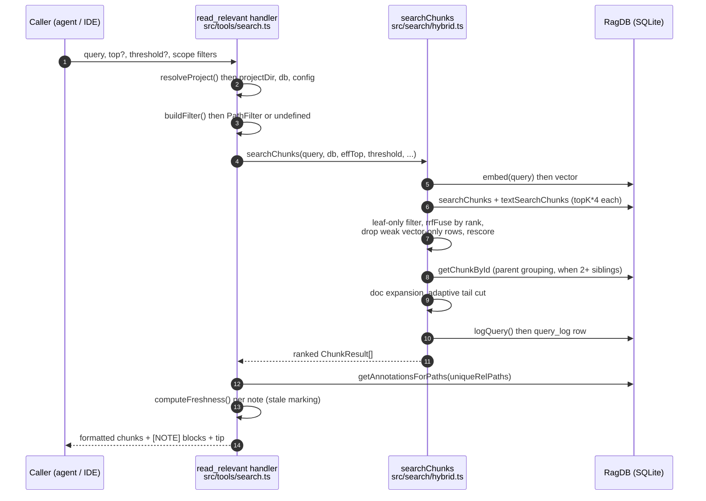

# Tool: read_relevant

`read_relevant` answers "show me the actual code relevant to this topic," not "tell me which files are relevant." It runs a hybrid (vector + keyword) search over the indexed code at the *chunk* level — individual functions, classes, or markdown sections — and returns the full text of the best-ranked chunks. Each result is tagged with its score, file path, and exact `:startLine-endLine` range so a caller can jump straight to the code, and any persistent note attached to that file or symbol is inlined as a `[NOTE]` block above the chunk.

Reach for this tool when you want the content itself, not a map. The sibling [search](search.md) tool returns ranked *file paths* with short snippets and deduplicates by file; `read_relevant` returns the bodies of chunks and does **not** deduplicate by file, so two functions from the same file can both appear. The CLI command [`mimirs read`](../cli/read.md) is the terminal twin of this tool — both call the same chunk-search engine, so their ranking and content match.

The tool is registered in `src/tools/search.ts:106` as the second tool inside `registerSearchTools`. The bulk of the work happens in `searchChunks` (`src/search/hybrid.ts:504`), which the handler calls and then formats into a single text block.

## Inputs

| name | type | required | description |
| --- | --- | --- | --- |
| `query` | string (1–2000 chars) | yes | Natural-language search query. Embedded into a vector and also used for keyword (BM25) matching. |
| `top` | int (1–1000) | no | Maximum chunks to return. Defaults to `5` in the default leaf-only mode, or `8` when leaf-only is off (`src/tools/search.ts:150`). |
| `threshold` | number (0–1) | no | Minimum cosine relevance for a vector-only chunk to survive. Defaults to `0.3` (`src/tools/search.ts:155`). |
| `extensions` | string[] | no | Restrict to these file extensions, e.g. `[".ts", ".tsx"]`. The leading dot is optional. |
| `dirs` | string[] | no | Restrict to these directories. Relative paths are resolved against the project root before matching. |
| `excludeDirs` | string[] | no | Exclude these directories. Also resolved against the project root. |
| `directory` | string | no | Project directory to search. Falls back to `RAG_PROJECT_DIR`, then the current working directory (`src/tools/index.ts`). |

The three scope fields (`extensions`, `dirs`, `excludeDirs`) are folded into a single `PathFilter` by `buildFilter` (`src/tools/search.ts:15`). That helper resolves `dirs` and `excludeDirs` to absolute paths so they line up with the absolute paths stored in the index, and returns `undefined` when none of the three fields are populated — in that case the search runs unfiltered.

## Outputs

| output | where it lands / shape / description |
| --- | --- |
| Chunk listing | A single text block in the MCP tool response. A header line counting chunks and files, then each chunk rendered as `[score] path:start-end • entityName`, any `[NOTE]` lines, and the chunk body, joined by `---` separators, closed by a `usages` tip. |
| `query_log` row | One row inserted into the `query_log` table of the project's SQLite index for every call, recording the query text, result count, the top vector hit's cosine similarity, top path, and elapsed milliseconds. Feeds analytics. |

## How a call flows



1. The caller invokes the tool with a query and optional `top`, `threshold`, and scope filters.
2. `resolveProject` resolves the target directory to an absolute path, verifies it exists, loads `.mimirs/config.json`, and hands back the project directory, the `RagDB` handle, and the config (`src/tools/index.ts`).
3. `buildFilter` turns the scope arguments into a `PathFilter`, resolving `dirs`/`excludeDirs` to absolute paths, or returns `undefined` when no scope was given (`src/tools/search.ts:15`).
4. The handler computes `effTop` (`top ?? 5` in leaf-only mode, else `8`) and calls `searchChunks`, passing `threshold ?? 0.3`, the configured `hybridWeight`, the `generated` patterns, the filter, and the chunk-tuning knobs `parentGroupingMinCount`, `leafOnly`, `chunkParentBoost`, `chunkRelCutoff`, and `chunkSteepSkip` (`src/tools/search.ts:150-165`).
5. `searchChunks` embeds the query into a vector via `embed(query)` (`src/search/hybrid.ts:526`).
6. It runs two candidate fetches, each over-fetching `topK * 4` rows: a vector search (`db.searchChunks`) and a BM25 keyword search (`db.textSearchChunks`). The text search is wrapped in a `try/catch` that logs and falls back to vector-only if the FTS query throws (`src/search/hybrid.ts:528-535`).
7. In the default leaf-only mode the synthetic whole-class/file parent rows are dropped, then the two result sets are fused by reciprocal-rank fusion in `mergeHybridScores`. A vector-only chunk whose true cosine is below `threshold` is dropped (keyword-matched chunks are kept regardless), and each surviving chunk is rescored by path type, filename affinity, dependency fan-in, and the optional whole-class boost (`src/search/hybrid.ts:552-627`).
8. Outside leaf-only mode, if two or more chunks share the same parent chunk, `groupByParent` fetches the parent via `getChunkById` and replaces the siblings with the parent (`src/search/hybrid.ts:665`).
9. Documentation chunks are protected by `expandForDocs`, then an adaptive tail cut trims the weak end of the ranking, and `searchChunks` writes a `query_log` row recording the query, result count, the top vector hit's cosine similarity, top path, and elapsed milliseconds (`src/search/hybrid.ts:668-695`).
10. Back in the handler, annotations are batch-fetched in one query for all unique file paths, their freshness is computed against git, and each chunk is rendered with its score, path, line range, entity name, matching `[NOTE]` blocks (with a stale marker when the file changed since the note), and body. A `usages` tip closes the response (`src/tools/search.ts:181-244`).

## Chunk search and ranking

`searchChunks` is the engine. It returns a `ChunkResult[]`, where each chunk carries its file `path`, a `score`, the full `content` (the stored chunk snippet), the `entityName` (the function or class name), the `chunkType`, the `startLine`/`endLine`, and the `parentId` (`src/search/hybrid.ts:47-57`). Unlike the file-level `search`, it does **no** per-file deduplication, which is what lets multiple chunks from the same file surface together — the behavior the tool description promises.

Scoring is hybrid, fused by **rank, not by raw score**. The vector search returns chunks by embedding distance, converted to a similarity of `1 / (1 + distance)` (`src/db/search.ts:235`); the keyword search returns chunks by FTS5 rank, scored `1 / (1 + |rank|)` (`src/db/search.ts:286`). These two numbers live on different, non-comparable scales, so a raw linear blend would be dominated by whichever has the larger magnitude. To avoid that, `mergeHybridScores` delegates to `rrfFuse`, which throws the raw scores away and uses each list's *position*: a chunk at rank `i` in a list contributes `K / (K + i)` with `K = 60`, a value in `(0, 1]` that is `1` at the top and decays smoothly (`src/search/hybrid.ts:77-103`). The two contributions are combined as `weight * primaryRank + (1 - weight) * secondaryRank`, where the primary list is the vector results and `weight` is `hybridWeight` (`src/search/hybrid.ts:101`). `hybridWeight` defaults to `0.5` — equal trust in the semantic and lexical *rank* signals, not a 70/30 split of scores (`src/search/hybrid.ts:63`, `src/config/index.ts:23`). Chunks present in only one list still get fused; the missing list contributes `0` for that key (`src/search/hybrid.ts:101`).

`threshold` is documented as a 0–1 relevance score, but the fused values are positional RRF numbers on a different scale (a single-list maximum is `weight ≤ 1`, decaying fast), so comparing `threshold` to the fused score directly would silently filter almost everything. Instead the cut compares against the **true cosine** of each chunk's vector match, and it only applies to chunks that matched by vector alone: a chunk that also matched by keyword keeps its slot regardless of cosine, because a keyword hit is its own relevance signal (`src/search/hybrid.ts:557-578`). Each surviving chunk is then multiplied by a series of adjustments computed inline (`src/search/hybrid.ts:579-627`):

- Path type: test files are demoted to `0.85`. There is deliberately no source-directory whitelist boost here — measured as adding nothing, since cross-helper agreement is already captured by the rank fusion (`src/search/hybrid.ts:584-586`).
- Boilerplate filenames (such as `types.ts`, `index.d.ts`) are demoted to `0.8`; files matching the configured `generated` glob patterns are demoted by `0.75` (`src/search/hybrid.ts:591-594`).
- Filename and path affinity: each query word found in the filename stem multiplies by `1 + 0.1` per match, and each query word found in a directory segment multiplies by `1 + 0.05` per match (`src/search/hybrid.ts:596-608`).
- Dependency-graph boost: a small additive `0.05 * log2(importerCount + 1)` rewards widely-imported files, so heavily-depended-on code ranks higher (`src/search/hybrid.ts:611-617`).
- Whole-class boost: when `chunkParentBoost` is non-zero (default `0.3`), a leaf chunk whose enclosing class or file matched well as a whole blob is lifted by that blob's score times the boost, on the theory that a chunk inside a strongly-matching parent is more likely relevant (`src/search/hybrid.ts:537-547`, `src/search/hybrid.ts:622-624`).

The rescored chunks are sorted high-to-low (`src/search/hybrid.ts:627`), then passed through parent grouping, doc expansion, and an adaptive tail cut (below) before being returned.

### Identifier-aware keyword search

The keyword half of the search is more than a literal substring match. FTS5's default tokenizer splits on punctuation and whitespace but **not** on case boundaries, so an identifier like `getDependsOn` is one opaque token and a search for `depends` would never match it. To fix this, every chunk is indexed with a companion `parts` column alongside its `snippet`, and the FTS table covers both (`src/db/index.ts:324-329`). The `parts` value is produced by `identifierParts`, which scans the chunk text for identifiers and splits each compound one on camelCase, snake_case, kebab, and dotted boundaries — `getDependsOn` becomes `get depends on`, `HTMLParser` becomes `html parser` (`src/indexing/identifiers.ts:13-20`). Only *multi-part* identifiers are emitted; single plain words already live in the snippet, so they are not repeated, and tokens longer than 80 characters are skipped so the case-boundary regex never goes quadratic on a base64/hex blob (`src/indexing/identifiers.ts:27-41`). The query itself is passed through `sanitizeFTS`, which wraps each whitespace-separated token in quotes and joins them with `OR`, so a multi-word query matches chunks containing any of its words and never trips the FTS5 query grammar (`src/search/usages.ts:39-43`). The net effect: searching for a word that only ever appears as part of a longer identifier still finds it.

### Exact line ranges in the output

Every chunk row carries `startLine` and `endLine` straight from the `chunks` table — they are selected by both `vectorSearchChunks` and `textSearchChunks` and mapped onto the result (`src/db/search.ts:205-242`, `src/db/search.ts:258-294`). The handler turns them into the suffix `:${startLine}-${endLine}` only when both are present, otherwise the range is omitted (`src/tools/search.ts:215`). This is what lets a caller open the file at the precise location, e.g. `src/example.ts:42-67`. When parent grouping promotes a parent chunk, the line range follows the parent's stored range, so a promoted result still points at a real, navigable span (`src/search/hybrid.ts:475-485`).

### Inline [NOTE] annotation blocks

`read_relevant` is the surface where persistent notes left by [annotate](annotate.md) become visible. After ranking, the handler collects the unique project-relative paths of the results and fetches every file's annotations in a single SQL pass with `ragDb.getAnnotationsForPaths(uniqueRelPaths)`, grouping the rows into a `Map` keyed by relative path so it never issues one query per chunk (`src/tools/search.ts:188-194`, `src/db/annotations.ts:75-102`). The relative paths are run through `normalizePath` first: annotation paths are stored forward-slash, but `relative()` emits backslashes on Windows, and un-normalized keys would never match there (`src/tools/search.ts:188`). For each chunk it then filters that file's notes to the ones that apply: a note with a null `symbolName` is a file-level note and always applies, while a note with a `symbolName` applies only when it equals the chunk's `entityName` (`src/tools/search.ts:222-224`). Each surviving note is rendered as `[NOTE] <text>` for file-level notes or `[NOTE (symbolName)] <text>` for symbol-scoped notes, printed directly above the chunk body (`src/tools/search.ts:225-231`).

Stale notes are worse than no notes, so the handler also checks each surfaced note against git. It calls `computeFreshness`, which diffs the note's anchoring commit against the working tree, and when the annotated file has changed since the note was written the rendered block gets a ` ⚠ stale` marker (`src/tools/search.ts:196-205`, `src/tools/search.ts:228-230`, `src/git/staleness.ts:35-86`). In a non-git project `computeFreshness` returns no signal and no marker is added.

### Leaf-only mode

By default the tool runs in leaf-only mode (`config.leafOnly` is `true`). The index stores both tight function-level child chunks and synthetic whole-class/whole-file parent rows (marked `chunkIndex === -1`). Leaf-only mode drops those parent rows from both candidate lists before fusion, so retrieval returns precise function-level spans rather than large concatenations — the children carry the same lines, so coverage is preserved while token cost drops (`src/search/hybrid.ts:552-555`). This is also why the default `top` is `5` rather than `8`: leaf chunks are tight, so fewer of them still cover the answer at much lower token cost (`src/tools/search.ts:148-150`). Parent grouping is skipped in this mode, since the whole point is to keep tight child spans rather than promote parents (`src/search/hybrid.ts:665`).

### Parent grouping

Parent grouping only runs when leaf-only mode is off. When several sibling chunks from the same enclosing block (for example multiple methods of one class) all rank, they would otherwise consume several result slots. `groupByParent` prevents that: it groups chunks by `parentId`, and when a group has at least `parentGroupingMinCount` members (default `2`, from `src/config/index.ts:34`), it fetches the parent chunk with `getChunkById` and emits the parent in place of the children, keeping the best score of the group (`src/search/hybrid.ts:438-498`). It avoids duplicating a parent already present in the result set, and if the parent row is missing from the database it keeps the children as-is. Groups below the count threshold keep their children individually (`src/search/hybrid.ts:491-494`).

### Doc expansion

Markdown files are useful context but should not push code out of the top results. `expandForDocs` looks at the initial top-`K` slice; if it contains some docs *and* some code, it widens the returned set, walking down the pool until the original code-slot count is restored, capped at twice `topK`. If the slice is all docs or all code, it returns exactly `topK` (`src/search/hybrid.ts:304-326`). Because of this, a call can return slightly more than `top` chunks (`src/search/hybrid.ts:668`).

### Adaptive tail cut

When `chunkRelCutoff` is non-zero (default `0.85`), a final pass trims the weak tail of the ranking for precision. It finds an "anchor" score — the value the score curve settles at — by skipping any steep head steps where the relative drop exceeds `chunkSteepSkip` (default `0.15`), so a single inflated top result cannot set the bar too high. It then keeps only chunks scoring at or above `anchor * chunkRelCutoff` (`src/search/hybrid.ts:674-682`). The effect is fewer, tighter spans while the confident head of the list is preserved.

## State changes

### query_log row written per call

| | state |
| --- | --- |
| before | no row for this call |
| after | one new row in `query_log` |

Every chunk search records its own analytics row. Just before returning, `searchChunks` calls `db.logQuery(query, results.length, vectorScoreToCosine(vectorResults[0]?.score), results[0]?.path ?? null, durationMs)` (`src/search/hybrid.ts:689-695`). The logged "top score" is deliberately **not** the result's fused score — the fused score is a positional rank-fusion value that is always ≈1 at the top, so it would make the "avg top score" and the low-relevance (< 0.3) heuristic meaningless. But the raw vector score is also not a usable relevance signal: embeddings are L2-normalized and `vec_chunks` uses vec0's Euclidean distance, so the stored `1 / (1 + distance)` bottoms out near `0.333` and a `< 0.3` test could never fire on it. So the top vector hit's raw score is passed through `vectorScoreToCosine`, which inverts the distance and applies `cosine = 1 − distance² / 2` to recover a true cosine in `[-1, 1]` before logging (`src/db/search.ts:20-26`). That facade method inserts into the `query_log` table — query text, result count, top score, top path, and duration in milliseconds, plus a timestamp (`src/db/analytics.ts:3-8`). When there is no top hit, `vectorScoreToCosine` returns `null` and top path is stored as `null`, with `result_count` `0`. This is the same table powering [search_analytics](search-analytics.md): zero-result and low-score rows are exactly how documentation and indexing gaps surface later. The write happens unconditionally on every call, including the empty-result case, because it lives inside `searchChunks` rather than the formatting code.

## Branches and failure cases

- **No results.** When `searchChunks` returns an empty array, the handler returns a plain message instead of a listing: `No relevant chunks found … across N indexed files. Has the directory been indexed? Try calling index_files first.` If a scope filter was active, the phrase ` matching the given scope` is inserted (`src/tools/search.ts:169-178`). The `query_log` row is still written by `searchChunks` before it returns, so empty queries are captured for analytics.
- **Threshold filtering.** A vector-only chunk whose true cosine is below `threshold` is dropped after fusion; chunks that also matched by keyword keep their slot regardless (`src/search/hybrid.ts:557-578`). A high threshold can therefore still produce zero vector-only results when the semantic match is weak; the default `0.3` is fairly permissive.
- **Keyword-search failure.** If the FTS5 query throws (for example on input that confuses the tokenizer despite `sanitizeFTS`), the `try/catch` logs a debug message and continues with vector-only results rather than failing the whole call (`src/search/hybrid.ts:530-535`).
- **Scope filter present vs absent.** With no scope fields, `buildFilter` returns `undefined` and the search is unfiltered. With a filter, the vector KNN over-fetches more candidate rows (`topK * FILTER_OVERFETCH`, where `FILTER_OVERFETCH` is `5`, widening further until the post-filter set fills `topK`) so a selective filter does not starve the result set. The filter clauses reach SQL as parametrized `LIKE ? ESCAPE '\'`, with each user-supplied extension and directory passed through `escapeLike` so a literal `%`, `_`, or `\` in a name does not act as a wildcard (`src/db/search.ts:37-107`).
- **Missing or non-existent directory.** `resolveProject` throws if the resolved `directory` is not present on disk, surfacing as a tool error before any search runs (`src/tools/index.ts`).
- **Unindexed index.** If the project has never been indexed there are no chunks to match, producing the empty-result message above. The fix the message suggests is to run [index_files](index-files.md) first.
- **Annotations present vs absent.** Files with no notes simply render no `[NOTE]` block. A symbol-scoped note whose `symbolName` differs from the chunk's `entityName` is silently skipped (`src/tools/search.ts:222-224`). A note whose file changed since it was written is still shown, but flagged ` ⚠ stale` (`src/tools/search.ts:228-230`).
- **More chunks than `top`.** Doc expansion can return slightly more than the requested `top` when documentation chunks would otherwise displace code (`src/search/hybrid.ts:668`).
- **Follow-up tip.** The footer suggests `usages("<entity>")` using the top result's `entityName` when one exists, falling back to a generic `<symbol>` placeholder when the top chunk has no entity name (`src/tools/search.ts:238-241`).

## Example

Example arguments:

```json
{
  "query": "how are hybrid scores merged",
  "top": 5,
  "threshold": 0.3,
  "extensions": [".ts"],
  "dirs": ["src/search"]
}
```

Illustrative shape of the returned text block (values synthetic):

```
── 5 chunks from 2 files (searched 174 files in 18ms) ──

[0.74] src/search/hybrid.ts:77-103  •  rrfFuse
export function rrfFuse(...)
...

---

[0.61] src/search/hybrid.ts:504-698  •  searchChunks
[NOTE (searchChunks)] FTS failures fall back to vector-only — do not assume keyword hits are always present.
export async function searchChunks(...)
...

── Tip: call usages("rrfFuse") to see all call sites before modifying. ──
```

## Key source files

- `src/tools/search.ts` — registers the `read_relevant` MCP tool, builds the path filter, calls the chunk search, batch-fetches annotations, computes their freshness, and formats the response (handler at `src/tools/search.ts:106`).
- `src/search/hybrid.ts` — `searchChunks` engine plus `rrfFuse`/`mergeHybridScores`: embedding, leaf-only filtering, rank fusion, cosine threshold cut, rescoring, parent grouping, doc expansion, adaptive tail cut, and the `query_log` write.
- `src/db/search.ts` — `vectorSearchChunks` and `textSearchChunks`, which produce the raw scored chunks including line ranges and `parentId`, plus the `FILTER_OVERFETCH` widening when a scope filter is active.
- `src/indexing/identifiers.ts` — `identifierParts`/`splitIdentifier`, which build the camelCase/snake_case `parts` column that makes the keyword search identifier-aware.
- `src/db/annotations.ts` — `getAnnotationsForPaths`, the batched per-file note lookup that supplies the `[NOTE]` blocks.
- `src/git/staleness.ts` — `computeFreshness`/`freshnessTag`, which flag a `[NOTE]` as stale when its file changed since the note was written.
- `src/db/analytics.ts` — `logQuery`, which inserts the `query_log` analytics row.
- `src/config/index.ts` — defaults for `hybridWeight` (0.5), `parentGroupingMinCount` (2), `leafOnly` (true), `chunkParentBoost` (0.3), `chunkRelCutoff` (0.85), and `chunkSteepSkip` (0.15).
