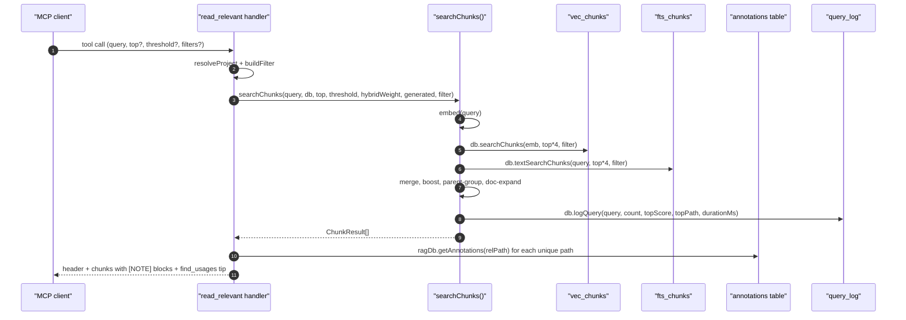

# Tool: read_relevant

The `read_relevant` MCP tool returns ranked code chunks — the actual body
of a function, class, or markdown section — with exact line ranges, so an
agent can navigate straight to the right span without a follow-up `Read`.
It is the chunk-level counterpart to `search`: both run hybrid vector +
BM25 retrieval, but `read_relevant` does **not** deduplicate by file, so
two chunks from the same file can both appear when they each score well.

It also injects `[NOTE]` blocks taken from the annotations table, so any
caveat someone has previously attached to a file or symbol shows up
inline next to the matching chunk. The handler lives at
`src/tools/search.ts:101-216` and delegates to `searchChunks` in
`src/search/hybrid.ts:470-554`.



1. The client sends a natural-language query plus optional filters and a
   threshold (`src/tools/search.ts:104-137`).
2. The handler resolves the project DB and builds an absolute-path filter
   so `dirs`/`excludeDirs` line up with the indexed paths
   (`src/tools/search.ts:139-140`, `src/tools/search.ts:13-29`).
3. `searchChunks` is invoked with the requested `top` (default `8`) and
   `threshold` (default `0.3`) (`src/tools/search.ts:143-151`).
4. Inside `searchChunks`, the query is embedded, then top `topK*4` vector
   and BM25 chunks are pulled. The BM25 step is wrapped in a try/catch
   that falls back to vector-only on FTS errors
   (`src/search/hybrid.ts:480-489`).
5. Each merged chunk is rescored: tests get a `0.85x` multiplier, source
   files a `1.1x` multiplier, boilerplate basenames a `0.8x` multiplier,
   and generated files a configurable demotion. Filename and path-segment
   matches add small multiplicative bonuses
   (`src/search/hybrid.ts:495-523`).
6. A graph boost based on importer count is added on top
   (`src/search/hybrid.ts:526-531`).
7. `groupByParent` consolidates sibling chunks: when two or more child
   chunks from the same parent appear, they are replaced by the parent
   chunk (highest child score wins) so a single class doesn't fill the
   result page with its methods (`src/search/hybrid.ts:404-463`).
8. `expandForDocs` appends doc-style matches without displacing code
   chunks, then `db.logQuery` records the call before returning
   (`src/search/hybrid.ts:540-553`).
9. Back in the handler, annotations are batch-fetched once per unique
   path to avoid N+1 queries; relevant notes (no `symbolName` or one that
   matches the chunk's `entityName`) are rendered as `[NOTE]` lines just
   above the chunk body (`src/tools/search.ts:171-205`).
10. The footer suggests `find_usages("<topEntity>")` when the top chunk
    has an entity name, otherwise a placeholder
    (`src/tools/search.ts:207-210`).

## Inputs

- `query` — required string, 1 to 2000 characters
  (`src/tools/search.ts:105`).
- `top` — optional 1–1000 cap. Defaults to `8`
  (`src/tools/search.ts:112-118`, `src/tools/search.ts:146`).
- `threshold` — optional 0–1 minimum score. Defaults to `0.3`. Chunks
  below this value are filtered out before sorting
  (`src/tools/search.ts:119-124`, `src/search/hybrid.ts:492-493`).
- `extensions`, `dirs`, `excludeDirs` — same shape and resolution rules
  as `search` (`src/tools/search.ts:125-136`).
- `directory` — optional project root override
  (`src/tools/search.ts:106-111`).

## Outputs

- Text content with one block per chunk:
  `[score] path:startLine-endLine  •  entityName` followed by any
  inline `[NOTE]` lines and then the chunk body
  (`src/tools/search.ts:184-205`).
- Blocks are separated by `---` so they are visually grouped, and the
  header counts chunks plus distinct files
  (`src/tools/search.ts:168`).
- Side effect: one row appended to `query_log` with the chunk count and
  top score (see State changes).

## Difference from `search`

- `search` deduplicates by file: each result is one path with the best
  snippet (`src/search/hybrid.ts:339-359`).
- `read_relevant` returns chunks: a `path:startLine-endLine` range per
  hit, multiple chunks from the same file are allowed, and the body of
  the chunk is included verbatim (`src/search/hybrid.ts:470-554`).
- `searchChunks` adds parent grouping, source/test multiplier, and
  boilerplate demotion that `search` does not do at the chunk level.
- Practical rule: use `search` to find *which* file to look at; use
  `read_relevant` to read the matching code without a second tool call.

## Inline annotations

Annotations are loaded with one `getAnnotations(relPath)` call per
unique result path (`src/tools/search.ts:171-176`). For each chunk, only
annotations whose `symbolName` is null or equals the chunk's
`entityName` are emitted, so a note attached to a specific function
won't pollute siblings (`src/tools/search.ts:193-201`). The format is
`[NOTE (symbolName)] note text` when a symbol is named, or `[NOTE]
note text` otherwise.

## State changes

### `search_queries` row (the `query_log` table)

- Before: no row exists for this invocation.
- After: one new row recording `query`, `result_count`, `top_score`,
  `top_path`, `duration_ms`, and `created_at`.
- Trigger: `db.logQuery` is called inside `searchChunks` regardless of
  whether any chunk cleared the threshold
  (`src/search/hybrid.ts:544-551`).
- Why it matters: feeds `search_analytics` and the trend command, which
  use both `search` and `read_relevant` rows to surface gaps in the
  index (`src/db/analytics.ts:10-67`).

## Branches and failure cases

- Empty result set: returns a message that counts the indexed files and
  suggests `index_files`. A "matching the given scope" suffix is added
  when a filter is active (`src/tools/search.ts:155-165`).
- FTS error: caught, debug-logged, vector-only results continue
  (`src/search/hybrid.ts:485-489`).
- Threshold filters before parent grouping, so when `threshold` is
  high enough to drop all children, parent-grouping is a no-op
  (`src/search/hybrid.ts:493`).

## Example

```json
{
  "query": "how does the symbol table get populated",
  "top": 5,
  "threshold": 0.3,
  "dirs": ["src/indexing"]
}
```

Response shape (illustrative):

```
── 5 chunks from 3 files (searched 198 files in 31ms) ──

[0.81] src/example.ts:120-185  •  upsertSymbolRefs
[NOTE (upsertSymbolRefs)] watch for the per-file clear; concurrent indexers race here
export function upsertSymbolRefs(...) { ... }

---

[0.72] src/example.ts:42-67  •  indexFile
...

── Tip: call find_usages("upsertSymbolRefs") to see all call sites before modifying. ──
```

## Related flows

- `search` — same retrieval pipeline, one row per file.
- `get_annotations` — the source of the `[NOTE]` blocks; this tool only
  reads them.
- `find_usages` — the natural next step suggested by the footer.

## Key source files

- `src/tools/search.ts` — handler, annotation merge, output format.
- `src/search/hybrid.ts` — `searchChunks`, parent grouping, scoring.
- `src/db/annotations.ts` — `getAnnotations` used to enrich chunks.
- `src/db/index.ts` — `RagDB` wrappers over the chunk-level search SQL.
