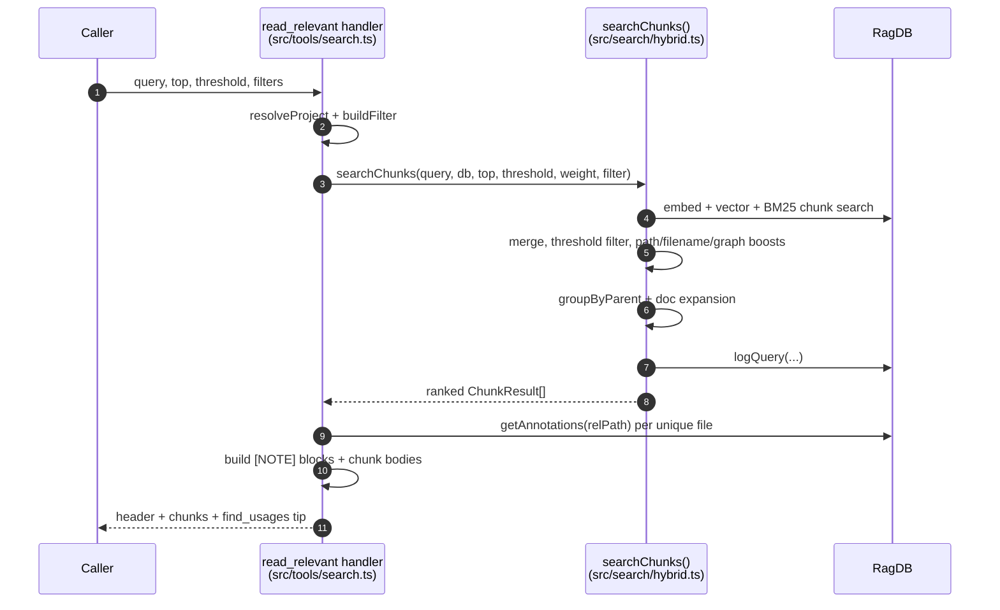

# Tool: read_relevant

The `read_relevant` MCP tool returns the actual code, not just file paths. You give it a natural-language query, and it returns the most relevant semantic chunks — individual functions, classes, or markdown sections — each with its exact line range and full body. It is the tool to reach for when you want to read code by meaning instead of grepping for a string, and it lets you jump straight to an edit location like `src/db.ts:42-67`.

The handler is registered in `src/tools/search.ts:101-216`. The ranking work happens in the `searchChunks` function in `src/search/hybrid.ts:470-554`.

## How it differs from `search`

Both tools run the same hybrid vector + keyword scoring, but they return different granularities:

| | [search](search.md) | `read_relevant` |
| --- | --- | --- |
| Returns | file paths + short snippet preview | full chunk bodies with line ranges |
| Granularity | one entry per file (deduped) | one entry per chunk; two chunks from the same file can both appear |
| Body | first snippet, 400 chars | the entire chunk content |
| Threshold | fixed at `0` | caller-tunable, default `0.3` |
| Annotations | none | inline `[NOTE]` blocks |

`search` deduplicates to one result per file; `read_relevant` does not, so sibling functions in the same file each get their own slot `src/search/hybrid.ts:466-469`.

## Inputs

| name | type | required | description |
| --- | --- | --- | --- |
| `query` | string (1–2000 chars) | yes | The search text. Natural language or a symbol name. |
| `top` | integer (1–1000) | no | Max chunks to return. Defaults to 8. |
| `threshold` | number (0–1) | no | Minimum relevance score to include. Defaults to 0.3. |
| `extensions` | string[] | no | Restrict to these file extensions, e.g. `[".ts"]`. Leading dot optional. |
| `dirs` | string[] | no | Restrict to these directories; relative paths resolve against the project root. |
| `excludeDirs` | string[] | no | Drop chunks under these directories. |
| `directory` | string | no | Which project to search. Defaults to `RAG_PROJECT_DIR` or the cwd. |

The three scoping arrays become a single path filter via `buildFilter`, which resolves relative dir paths to absolute and returns `undefined` when none are set `src/tools/search.ts:13-29`, `140`.

## Outputs

| output | where it lands / shape / description |
| --- | --- |
| Ranked chunks | A single MCP text block. A header with chunk count, unique-file count, total indexed files, and elapsed ms; then each chunk as a `[score] path:start-end • entityName` header followed by its full body, joined by `---` separators. A footer suggests `find_usages` on the top chunk's entity. |
| Inline annotations | Any saved notes for a chunk's file appear as `[NOTE]` lines right under that chunk's header. |
| Empty-result message | When nothing clears the threshold, a text block suggesting `index_files`. |
| Analytics row | A row in the `query_log` table recording the query, result count, top score, top path, and duration. |

The body is assembled in `src/tools/search.ts:184-205`. Each chunk header is `[score.toFixed(2)] path:startLine-endLine` plus the entity name when present `src/tools/search.ts:186-188`. The line range is omitted only when `startLine`/`endLine` are null `src/tools/search.ts:186`.

## How a query becomes ranked chunks



1. The handler resolves the project and builds the path filter `src/tools/search.ts:139-140`.
2. It times the call and invokes `searchChunks` with `top ?? 8`, `threshold ?? 0.3`, `config.hybridWeight`, and the configured generated patterns `src/tools/search.ts:142-151`.
3. `searchChunks` embeds the query, then runs a vector chunk search and a BM25 chunk search, each fetching `topK * 4` candidates `src/search/hybrid.ts:480-489`. A failing full-text query is caught and the search falls back to vector-only `src/search/hybrid.ts:485-489`.
4. `mergeHybridScores` blends the two with the hybrid weight, then results below the threshold are filtered out and the per-path multipliers are applied (test demotion, source boost, filename affinity, boilerplate/generated demotion, dependency-graph boost) `src/search/hybrid.ts:492-535`.
5. `groupByParent` consolidates siblings: when two or more sub-chunks share the same parent chunk, they are replaced by the single parent chunk (highest score kept), so sibling methods do not eat multiple slots `src/search/hybrid.ts:399-464`, `538`.
6. `expandForDocs` lets markdown chunks expand the result set instead of displacing code chunks `src/search/hybrid.ts:541`.
7. The query is logged for analytics `src/search/hybrid.ts:544-551`.
8. Back in the handler, the unique file paths are collected and annotations are batch-fetched once per file to avoid N+1 queries `src/tools/search.ts:167-176`.
9. For each chunk, the handler builds the header, attaches any matching `[NOTE]` blocks, and appends the chunk body `src/tools/search.ts:184-205`.
10. The footer suggests `find_usages` on the top chunk's entity name, falling back to a placeholder when no entity is present `src/tools/search.ts:207-210`.

## Exact line ranges and chunk metadata

Each returned chunk carries `startLine`, `endLine`, `entityName`, `chunkType`, and `parentId` from the `ChunkResult` shape `src/search/hybrid.ts:45-55`. The handler renders the range as `:start-end` so you can open the file at the precise location `src/tools/search.ts:186`. When parent grouping promotes a parent chunk, the promoted result carries the parent's own line range and a `chunkIndex` of `-1` `src/search/hybrid.ts:441-451`.

## Inline annotations

Annotations are persistent notes attached to a file (and optionally a symbol). `read_relevant` surfaces them inline so a caller reading code sees relevant caveats without a separate lookup. The handler converts each chunk's absolute path to a project-relative path and fetches that file's annotations via `getAnnotations(relPath)` `src/tools/search.ts:171-176`. `getAnnotations` runs `SELECT * FROM annotations WHERE path = ? ORDER BY updated_at DESC` `src/db/annotations.ts:101-135`.

For a given chunk, only annotations whose `symbolName` is null (file-level) or matches the chunk's `entityName` are shown — a note pinned to a different function in the same file is not attached here `src/tools/search.ts:193-195`. Each shown note renders as `[NOTE]` or `[NOTE (symbolName)]` followed by the note text, placed directly above the chunk body `src/tools/search.ts:196-201`. To manage these notes directly, see [annotate](annotate.md) and [get_annotations](get-annotations.md).

## State changes

### Analytics row in `query_log`

| before | after |
| --- | --- |
| No row for this query | One new `query_log` row: query text, chunk count, top score, top path, duration in ms, ISO timestamp |

`searchChunks` writes this row near its end via `db.logQuery(...)` `src/search/hybrid.ts:544-551`, the same `INSERT INTO query_log` used by file-level search `src/db/analytics.ts:3-8`. The row is written even when zero chunks clear the threshold; in that case the count is 0 and top score/path are null. This feeds [search_analytics](search-analytics.md).

## Branches and failure cases

- **No chunk clears the threshold** — returns the "No relevant chunks found... Try calling index_files first." text, with " matching the given scope" appended when a filter was active `src/tools/search.ts:155-165`.
- **`top` / `threshold` omitted** — default to 8 and 0.3 respectively `src/tools/search.ts:146-147`.
- **Full-text query throws** — caught; the search continues with vector-only chunk results `src/search/hybrid.ts:485-489`.
- **Parent chunk missing in DB** — `groupByParent` keeps the children individually rather than dropping them `src/search/hybrid.ts:453-456`.
- **Fewer than two siblings from a parent** — children are kept as-is, no promotion `src/search/hybrid.ts:457-460`.
- **Chunk has no entity name** — the `• entity` suffix and the file-level note filter still work; the footer falls back to a `<symbol>` placeholder `src/tools/search.ts:187`, `208-209`.
- **File has no annotations** — the note block is empty and only the chunk body is shown `src/tools/search.ts:196-201`.

A known limitation: `searchChunks` calls `groupByParent(results, db)` without forwarding the configurable `parentGroupingMinCount`, so the grouping always uses the hard-coded minimum of 2 regardless of project config `src/search/hybrid.ts:404`, `538`.

## Example

```json
{
  "query": "how are hybrid scores merged",
  "top": 6,
  "threshold": 0.35,
  "extensions": [".ts"],
  "dirs": ["src/search"]
}
```

Illustrative output shape:

```
── 6 chunks from 3 files (searched 186 files in 51ms) ──

[0.81] src/search/hybrid.ts:65-91  •  mergeHybridScores
export function mergeHybridScores<T...>(...) { ... }

---

[0.74] src/search/hybrid.ts:313-397  •  search
[NOTE (search)] remember to keep threshold at 0 for file-level search
export async function search(query, db, ...) { ... }

── Tip: call find_usages("mergeHybridScores") to see all call sites before modifying. ──
```

## Key source files

- `src/tools/search.ts` — registers `read_relevant`, formats chunk bodies, attaches annotations.
- `src/search/hybrid.ts` — `searchChunks`: hybrid merge, threshold filter, boosts, parent grouping, doc expansion, analytics logging.
- `src/db/annotations.ts` — `getAnnotations` reads the notes attached to each file.
- `src/db/analytics.ts` — `logQuery` writes the `query_log` row.
