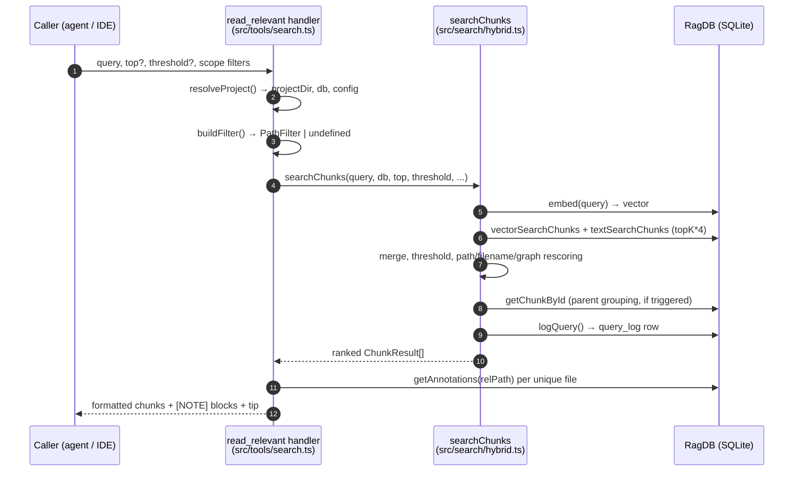

# Tool: read_relevant

`read_relevant` answers the question "show me the actual code relevant to this topic," not "tell me which files are relevant." It runs a hybrid (vector + keyword) search over the indexed code at the *chunk* level — individual functions, classes, or markdown sections — and returns the full text of the best-ranked chunks. Each result is tagged with its score, file path, and exact `:startLine-endLine` range so a caller can jump straight to the code, and any persistent note attached to that file or symbol is inlined as a `[NOTE]` block above the chunk.

This is the tool to reach for when you want the content itself, not a map. The sibling [search](search.md) tool returns ranked *file paths* with short snippets and deduplicates by file; `read_relevant` returns the bodies of chunks and does **not** deduplicate by file, so two functions from the same file can both appear. The CLI command [`mimirs read`](../cli/read.md) is the terminal twin of this tool — both call the same chunk-search engine, so their ranking and content match.

The tool is registered in `src/tools/search.ts:101` as the second tool inside `registerSearchTools`. The bulk of the work happens in `searchChunks` in `src/search/hybrid.ts:470`, which the tool calls and then formats.

## Inputs

| name | type | required | description |
| --- | --- | --- | --- |
| `query` | string (1–2000 chars) | yes | Natural-language search query. Embedded into a vector and also used for keyword (BM25) matching. |
| `top` | int (1–1000) | no | Maximum chunks to return. Defaults to `8` when omitted (`src/tools/search.ts:146`). |
| `threshold` | number (0–1) | no | Minimum relevance score for a chunk to be kept. Defaults to `0.3` (`src/tools/search.ts:147`). |
| `extensions` | string[] | no | Restrict to these file extensions, e.g. `[".ts", ".tsx"]`. The leading dot is optional. |
| `dirs` | string[] | no | Restrict to these directories. Relative paths are resolved against the project root before matching. |
| `excludeDirs` | string[] | no | Exclude these directories. Also resolved against the project root. |
| `directory` | string | no | Project directory to search. Falls back to `RAG_PROJECT_DIR`, then the current working directory (`src/tools/index.ts:26`). |

The three scope fields (`extensions`, `dirs`, `excludeDirs`) are folded into a single `PathFilter` by `buildFilter` (`src/tools/search.ts:13`). That helper resolves `dirs` and `excludeDirs` to absolute paths so they line up with the absolute paths stored in the index, and returns `undefined` when none of the three fields are populated — in that case the search runs unfiltered.

## Outputs

| output | where it lands / shape / description |
| --- | --- |
| Chunk listing | A single text block in the MCP tool response. A header line, then each chunk rendered as `[score] path:start-end • entityName`, any `[NOTE]` lines, and the chunk body, joined by `---` separators, followed by a `find_usages` tip. |
| `query_log` row | One row inserted into the `query_log` table of the project's SQLite index for every call, recording the query, result count, top score, top path, and duration. Feeds analytics. |

## How a call flows



1. The caller invokes the tool with a query and optional `top`, `threshold`, and scope filters.
2. `resolveProject` resolves the target directory to an absolute path, verifies it exists, loads `.mimirs/config.json`, and hands back the project directory, the `RagDB` handle, and the config (`src/tools/index.ts:22`).
3. `buildFilter` turns the scope arguments into a `PathFilter`, resolving `dirs`/`excludeDirs` to absolute paths, or returns `undefined` when no scope was given (`src/tools/search.ts:13`).
4. The handler calls `searchChunks`, passing `top ?? 8`, `threshold ?? 0.3`, the configured `hybridWeight`, the `generated` patterns, the filter, and `parentGroupingMinCount` (`src/tools/search.ts:143`).
5. `searchChunks` embeds the query into a vector via `embed(query)` (`src/search/hybrid.ts:481`).
6. It runs two candidate fetches, each over-fetching `topK * 4` rows: a vector search (`db.searchChunks`) and a BM25 keyword search (`db.textSearchChunks`). The text search is wrapped in a `try/catch` that logs and falls back to vector-only if the FTS query throws (`src/search/hybrid.ts:483`).
7. The two result sets are merged by `mergeHybridScores`, scores below `threshold` are dropped, and each surviving chunk is rescored by path type, filename affinity, and dependency fan-in (`src/search/hybrid.ts:493`).
8. If two or more chunks share the same parent chunk, `groupByParent` fetches the parent via `getChunkById` and replaces the siblings with the parent (`src/search/hybrid.ts:539`).
9. Before returning, `searchChunks` writes a `query_log` row recording the query, result count, top score, top path, and elapsed milliseconds (`src/search/hybrid.ts:546`).
10. Back in the handler, annotations are batch-fetched once per unique file path, and each chunk is rendered with its score, path, line range, entity name, matching `[NOTE]` blocks, and body. A `find_usages` tip closes the response (`src/tools/search.ts:185`).

## Chunk search and ranking

`searchChunks` is the engine. It returns a `ChunkResult[]`, where each chunk carries its file `path`, a `score`, the full `content` (the stored chunk snippet), the `entityName` (the function or class name), the `chunkType`, the `startLine`/`endLine`, and the `parentId` (`src/search/hybrid.ts:45`). Unlike the file-level `search`, it does **no** per-file deduplication, which is what lets multiple chunks from the same file surface together — the behavior the tool description promises.

Scoring is hybrid. The vector search returns chunks by embedding distance, converted to a similarity score of `1 / (1 + distance)` (`src/db/search.ts:178`); the keyword search returns chunks by FTS5 rank, scored `1 / (1 + |rank|)` (`src/db/search.ts:227`). `mergeHybridScores` blends them per chunk key (`path:chunkIndex`) as `hybridWeight * vectorScore + (1 - hybridWeight) * textScore`, with `hybridWeight` defaulting to `0.7` — that is, 70% vector, 30% keyword (`src/search/hybrid.ts:87`). The default is set in config (`src/config/index.ts:23`).

After merging, each chunk that clears the `threshold` is multiplied by a series of adjustments inline in `searchChunks` (`src/search/hybrid.ts:495`):

- Path type: test files are demoted to `0.85`, recognized source directories (`src`, `lib`, `app`, `pkg`, `packages`, `internal`, `cmd`) are boosted to `1.1`.
- Boilerplate filenames (such as `types.ts`, `index.d.ts`) are demoted to `0.8`; files matching the configured `generated` glob patterns are demoted by `0.75`.
- Filename and path affinity: each query word found in the filename stem adds `+0.1`, and each query word found in a directory segment adds `+0.05`.
- Dependency-graph boost: a small additive `0.05 * log2(importerCount + 1)` rewards widely-imported files, so heavily-depended-on code ranks higher.

The rescored chunks are sorted high-to-low, then passed through parent grouping and doc expansion (below) before being returned.

### Exact line ranges in the output

Every chunk row carries `startLine` and `endLine` straight from the `chunks` table — they are selected by both `vectorSearchChunks` and `textSearchChunks` and mapped onto the result (`src/db/search.ts:183`). The handler turns them into the suffix `:${startLine}-${endLine}` only when both are present, otherwise the range is omitted (`src/tools/search.ts:187`). This is what lets a caller open the file at the precise location, e.g. `src/db.ts:42-67`. When parent grouping promotes a parent chunk, the line range follows the parent's stored range, so a promoted result still points at a real, navigable span.

### Inline [NOTE] annotation blocks

`read_relevant` is the surface where persistent notes left by [annotate](annotate.md) become visible. After ranking, the handler collects the unique project-relative paths of the results and fetches annotations once per path with `ragDb.getAnnotations(relPath)`, building a `Map` keyed by relative path so it never issues one query per chunk (`src/tools/search.ts:171`). For each chunk it then filters that file's notes to the ones that apply: a note with a null `symbolName` is a file-level note and always applies, while a note with a `symbolName` applies only when it equals the chunk's `entityName` (`src/tools/search.ts:194`). Each surviving note is rendered as `[NOTE] <text>` for file-level notes or `[NOTE (symbolName)] <text>` for symbol-scoped notes, printed directly above the chunk body (`src/tools/search.ts:197`). Notes are stored relative to the project root, which is why the handler converts each absolute result path back to a relative path before the lookup.

### Parent grouping

When several sibling chunks from the same enclosing block (for example multiple methods of one class) all rank, they would otherwise consume several result slots. `groupByParent` prevents that: it groups chunks by `parentId`, and when a group has at least `parentGroupingMinCount` members (default `2`, from `src/config/index.ts:31`), it fetches the parent chunk with `getChunkById` and emits the parent in place of the children, keeping the best score of the group (`src/search/hybrid.ts:404`). It avoids duplicating a parent already present, and if the parent row is missing it keeps the children as-is. Groups below the count threshold keep their children individually.

### Doc expansion

Markdown files (`.md`, `.mdx`) are useful context but should not push code out of the top results. `expandForDocs` looks at the initial top-`K` slice; if it contains some docs *and* some code, it widens the returned set by the number of docs so the code keeps its slots. If the slice is all docs or all code, it returns exactly `topK` (`src/search/hybrid.ts:287`). Because of this, a call can return slightly more than `top` chunks.

## State changes

### query_log row written per call

| | state |
| --- | --- |
| before | no row for this call |
| after | one new row in `query_log` |

Every chunk search records its own analytics row. Just before returning, `searchChunks` calls `db.logQuery(query, results.length, results[0]?.score ?? null, results[0]?.path ?? null, durationMs)` (`src/search/hybrid.ts:546`). That facade method inserts into the `query_log` table — query text, result count, top score, top path, and duration in milliseconds, plus a timestamp (`src/db/analytics.ts:3`). When the result set is empty, top score and top path are stored as `null`, and `result_count` is `0`. This is the same table powering [search_analytics](search-analytics.md): zero-result and low-score rows are exactly how documentation and indexing gaps are surfaced later. The write happens unconditionally on every call, including the empty-result case, because it lives inside `searchChunks` rather than the formatting code.

## Branches and failure cases

- **No results.** When `searchChunks` returns an empty array, the handler returns a plain message instead of a listing: `No relevant chunks found … across N indexed files. Has the directory been indexed? Try calling index_files first.` If a scope filter was active, the phrase ` matching the given scope` is inserted (`src/tools/search.ts:156`). The `query_log` row is still written by `searchChunks` before it returns, so empty queries are captured for analytics.
- **Threshold filtering.** Chunks scoring below `threshold` are dropped before any rescoring (`src/search/hybrid.ts:494`). A high threshold can therefore produce zero results even when the index is populated; the default `0.3` is fairly permissive.
- **Keyword-search failure.** If the FTS5 query throws (for example on special characters that confuse the tokenizer), the `try/catch` logs a debug message and continues with vector-only results rather than failing the whole call (`src/search/hybrid.ts:486`).
- **Scope filter present vs absent.** With no scope fields, `buildFilter` returns `undefined` and the search is unfiltered. With a filter, the SQL over-fetches more candidate rows (`topK * FILTER_OVERFETCH`) before applying the path constraints, so filtering does not starve the result set (`src/db/search.ts:148`).
- **Missing or non-existent directory.** `resolveProject` throws `Directory does not exist: <path>` if the resolved `directory` is not present on disk (`src/tools/index.ts:30`).
- **Unindexed or read-only index.** If the project has never been indexed there are no chunks to match, producing the empty-result message above. If the `.mimirs` directory cannot be created or written (e.g. a read-only filesystem), constructing the `RagDB` throws a descriptive error pointing at `RAG_DB_DIR` (`src/db/index.ts`).
- **Annotations present vs absent.** Files with no notes simply render no `[NOTE]` block. A symbol-scoped note on a different symbol than the chunk's `entityName` is silently skipped (`src/tools/search.ts:194`).
- **More chunks than `top`.** Doc expansion can return slightly more than the requested `top` when documentation chunks would otherwise displace code (`src/search/hybrid.ts:542`).
- **Follow-up tip.** The footer suggests `find_usages("<entity>")` using the top result's `entityName` when one exists, falling back to a generic `<symbol>` placeholder when the top chunk has no entity name (`src/tools/search.ts:208`).

## Example

Example arguments:

```json
{
  "query": "how are hybrid scores merged",
  "top": 5,
  "threshold": 0.3,
  "extensions": [".ts"],
  "dirs": ["src/search"]
}
```

Illustrative shape of the returned text block (values synthetic):

```
── 5 chunks from 2 files (searched 174 files in 18ms) ──

[0.74] src/search/hybrid.ts:64-91  •  mergeHybridScores
export function mergeHybridScores(...)
...

---

[0.61] src/search/hybrid.ts:470-555  •  searchChunks
[NOTE (searchChunks)] FTS failures fall back to vector-only — do not assume keyword hits are always present.
export async function searchChunks(...)
...

── Tip: call find_usages("mergeHybridScores") to see all call sites before modifying. ──
```

## Key source files

- `src/tools/search.ts` — registers the `read_relevant` MCP tool, builds the path filter, calls the chunk search, fetches annotations, and formats the response (handler at `src/tools/search.ts:101`).
- `src/search/hybrid.ts` — `searchChunks` engine: embedding, hybrid merge, rescoring, parent grouping, doc expansion, and the `query_log` write.
- `src/db/search.ts` — `vectorSearchChunks` and `textSearchChunks`, which produce the raw scored chunks including line ranges and `parentId`.
- `src/db/annotations.ts` — `getAnnotations`, the per-file note lookup that supplies the `[NOTE]` blocks.
- `src/db/analytics.ts` — `logQuery`, which inserts the `query_log` analytics row.
- `src/config/index.ts` — defaults for `hybridWeight` (0.7) and `parentGroupingMinCount` (2).
