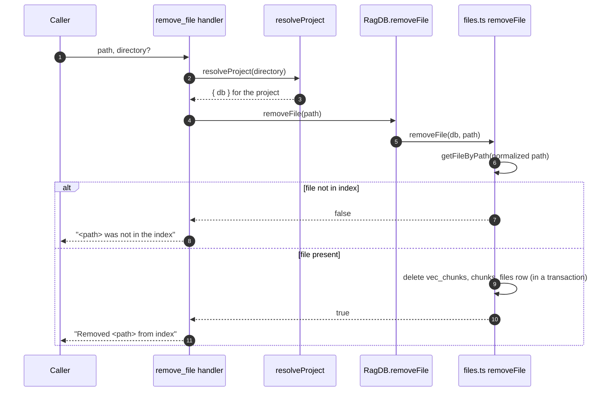

# Tool: remove_file

`remove_file` deletes one file's entry from the search index without re-scanning the whole project. Use it when a single file has been deleted or moved and you want search to stop returning it immediately, rather than waiting for a full [index_files](../tools/index-files.md) run to prune it. It is a targeted, fast alternative to a full reconcile.

The handler is registered in `registerIndexTools` and is a thin wrapper over the database's `removeFile` method; see `src/tools/index-tools.ts:118-143`.

## How it works



1. The caller passes a `path` (the file to remove) and an optional `directory`. The handler resolves the project directory to an absolute path and opens its database via `resolveProject` (`src/tools/index-tools.ts:128-129`, `src/tools/index.ts:22-37`).
2. The handler calls `RagDB.removeFile`, which delegates to the file-store helper `removeFile` (`src/tools/index-tools.ts:130`, `src/db/index.ts:569-570`).
3. The helper normalizes the path and looks up the file row with `getFileByPath`. If no row matches, it returns `false` immediately and nothing is changed (`src/db/files.ts:254-256`).
4. When the file exists, the helper opens a transaction and deletes the file's vector-embedding rows, then its chunk rows, then the file row itself, and returns `true` (`src/db/files.ts:258-270`).
5. The handler turns the boolean into a confirmation string: `Removed <path> from index` on success, or `<path> was not in the index` when the file was absent (`src/tools/index-tools.ts:136-139`).

## Inputs

| name | type | required | description |
| --- | --- | --- | --- |
| `path` | string | yes | Absolute path of the file to remove. It is normalized to forward slashes and compared against the stored `files.path` value (`src/tools/index-tools.ts:122`, `src/db/files.ts:6-12`). |
| `directory` | string | no | Project directory whose index to operate on. Defaults to the `RAG_PROJECT_DIR` environment variable, then the current working directory; must exist or `resolveProject` throws (`src/tools/index-tools.ts:123-126`, `src/tools/index.ts:26-32`). |

## Outputs

| output | where it lands / shape / description |
| --- | --- |
| Confirmation message | Returned as MCP text content. Reads `Removed <path> from index` when a row was deleted, or `<path> was not in the index` when the path had no matching row (`src/tools/index-tools.ts:136-139`). |
| Deleted index rows | The target file's `files`, `chunks`, and `vec_chunks` rows are removed from the database (see State changes). |

## State changes

### `files`, `chunks`, and `vec_chunks` rows for the target path

Before the call, the file has one `files` row, a set of `chunks` rows, and a matching vector-embedding row per chunk in `vec_chunks`. After a successful call, all three are gone.

The deletion is explicit and runs inside a single transaction so it is atomic: first every chunk's vector row is deleted from `vec_chunks`, then all `chunks` rows for the file, then the `files` row (`src/db/files.ts:258-270`). Removing the chunk and vector rows is what actually stops search from returning the file; the vector rows must be deleted by chunk id before the chunk rows disappear.

These tables declare `ON DELETE CASCADE` foreign keys in the schema, but that cascade never fires: bun:sqlite runs with `PRAGMA foreign_keys` off, so the engine does not auto-delete dependent rows. Every deletion here is performed manually in code (`src/db/files.ts:262-266`).

A consequence of that, worth knowing before you change this code: `removeFile` deletes only `files`, `chunks`, and `vec_chunks`. It does not touch the graph tables `file_imports`, `file_exports`, or `symbol_refs`. Because the foreign-key cascade is inert, those rows are left behind as orphans pointing at a now-missing `files.id` until the next full [index_files](../tools/index-files.md) run rewrites or prunes them. Search results disappear right away, but the dependency-graph tools ([depends_on](../tools/depends-on.md), [depended_on_by](../tools/depended-on-by.md), [find_usages](../tools/find-usages.md)) can still see stale edges for the removed file until that reindex happens.

## Branches and failure cases

| Condition | Behavior |
| --- | --- |
| File present in index | Rows deleted in a transaction; returns `true`; message is `Removed <path> from index` (`src/db/files.ts:258-270`, `src/tools/index-tools.ts:137`). |
| File absent from index | `getFileByPath` returns null, helper returns `false` without any write; message is `<path> was not in the index` (`src/db/files.ts:255-256`, `src/tools/index-tools.ts:138`). |
| Called twice on the same path | Second call hits the absent branch and reports `not in the index` — the operation is idempotent and safe to repeat (`src/db/files.ts:255-256`). |
| `directory` does not exist | `resolveProject` throws `Directory does not exist` before any lookup (`src/tools/index.ts:30-32`). |
| Path with backslashes | Normalized to forward slashes before lookup, so Windows-style paths still match stored entries (`src/db/files.ts:255`). |

This tool does not delete the file from disk — it only removes index rows. It also does not take the indexing lock, since it touches only one file's rows rather than reconciling the whole project.

## Example

Remove a deleted file from the index of the current project:

```json
{ "path": "/Users/example/repos/myproject/src/old-module.ts" }
```

Remove a file from a specific project:

```json
{
  "path": "/Users/example/repos/other/src/legacy.ts",
  "directory": "/Users/example/repos/other"
}
```

Successful response:

```
Removed /Users/example/repos/myproject/src/old-module.ts from index
```

When the path was never indexed:

```
/Users/example/repos/myproject/src/old-module.ts was not in the index
```

## Key source files

- `src/tools/index-tools.ts` — registers `remove_file` and formats the confirmation message.
- `src/db/index.ts` — `RagDB.removeFile` delegates to the file store.
- `src/db/files.ts` — `removeFile` performs the transactional deletion of `vec_chunks`, `chunks`, and `files` rows.

## Related tools

- [index_files](../tools/index-files.md) performs the full prune that also cleans up the graph tables this tool leaves behind.
