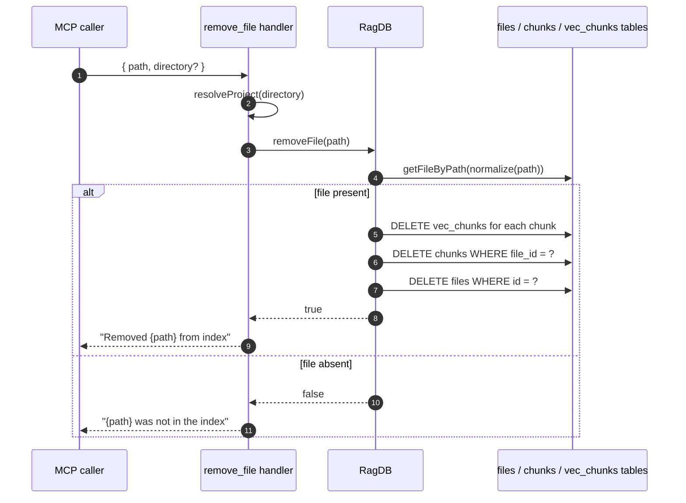

# Tool: remove_file

`remove_file` deletes one file's rows from the index without scanning the
whole project. It is a surgical alternative to `index_files` (which prunes
deleted files only after walking the entire include set). Reach for it when
you know a single path no longer belongs — for example, a temporary file you
indexed by accident, or a path you want gone before the next full pass.

The tool is idempotent: removing a file that is not in the index returns a
"was not in the index" message rather than an error.

## Flow



1. The caller passes an absolute `path` and an optional `directory`. The
   `directory` selects which project DB to open via `resolveProject`
   (`src/tools/index-tools.ts:118-129`).
2. The handler calls `ragDb.removeFile(path)`.
3. `removeFile` looks up the row via `getFileByPath(normalizePath(path))`. If
   the row is missing it returns `false` immediately
   (`src/db/files.ts:254-256`).
4. When the row exists, the deletes run inside one transaction: every chunk's
   `vec_chunks` entry is dropped, then `chunks WHERE file_id = ?`, then
   `files WHERE id = ?` (`src/db/files.ts:258-269`).
5. The handler returns the matching confirmation text. The boolean controls
   the message; both branches return success to the MCP caller
   (`src/tools/index-tools.ts:132-141`).

## Inputs

| Name | Type | Required | Description |
| --- | --- | --- | --- |
| `path` | string | yes | Absolute path of the file to remove (`src/tools/index-tools.ts:122`). The lookup normalizes to forward slashes before matching (`src/db/files.ts:255`). |
| `directory` | string | no | Project directory. Defaults to `RAG_PROJECT_DIR` or cwd (`src/tools/index-tools.ts:123-126`). |

## Outputs

| Output | Where it lands |
| --- | --- |
| Confirmation text | Returned in the tool response, one of `Removed {path} from index` or `{path} was not in the index`. |
| Deleted rows | `files`, `chunks`, and `vec_chunks` rows for the file are gone (`src/db/files.ts:258-269`). |

## State changes

- **`files` row for the target path.** Before: a row in `files` plus its
  associated chunk rows. After: the row is gone and the chunk and vector
  rows are gone with it (`src/db/files.ts:258-269`). Other tables wired with
  `ON DELETE CASCADE` on `files.id` — `file_imports`, `file_exports`,
  `symbol_refs` — also drop their matching rows automatically
  (`src/db/index.ts:131-167`). The FTS shadow rows are removed by the
  `chunks_ad` trigger on `chunks` (`src/db/index.ts:118-120`).

## Branches and failure cases

- **File not in index.** `getFileByPath` returns `undefined`, `removeFile`
  returns `false`, the handler returns the "was not in the index" text. The
  call is idempotent — no error, no state change.
- **Path with backslashes (Windows).** `normalizePath` on the way in matches
  whatever was stored at index time so paths line up across operating
  systems (`src/db/files.ts:255`).
- **Concurrent indexing.** Both `removeFile` and `indexDirectory` write
  through the same connection; the transaction around the three deletes
  keeps the row, its chunks, and its vector rows in sync even if other
  writes race.

## Use case: prune faster than `index_files`

`index_files` only prunes files when it is called without `patterns` because
pruning requires the full include set to compare against. If you just need
one stale path gone, `remove_file` is faster: it does three small `DELETE`
statements and skips the whole scan-collect-embed cycle. It is what the
`mimirs remove` CLI calls under the hood (see [CLI: remove](../cli/remove.md)).

## Example

```json
{
  "tool": "remove_file",
  "arguments": {
    "path": "/abs/path/to/project/src/example.ts",
    "directory": "/abs/path/to/project"
  }
}
```

Illustrative response text:

```
Removed /abs/path/to/project/src/example.ts from index
```

## Key source files

- `src/tools/index-tools.ts` — MCP handler.
- `src/db/files.ts` — `removeFile` transactional delete.
- `src/db/index.ts` — table definitions and cascade declarations that make
  the single DELETE on `files` clean up everything wired to it.

## Related flows

- [Tool: index_files](./index-files.md) — the bulk indexer; with `prune` it
  removes deleted files but only as part of a full pass.
- [CLI: remove](../cli/remove.md) — the CLI command that wraps the same
  `RagDB.removeFile` call.
