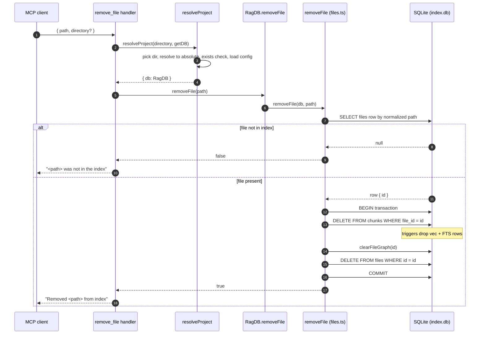

# Tool: remove_file

`remove_file` takes a single file out of the RAG index by its absolute path. Reach for it when one file should stop showing up in search, read, and dependency-graph results, but you do not want to re-scan the whole project — for example after deleting a file on disk, renaming it, or moving it outside the indexed tree. It removes the file's bookkeeping row and everything derived from that file: the semantic chunks the indexer split it into, the vector embeddings for those chunks, the full-text search entries, and the import/export/reference graph rows that mention it. The tool tells the caller whether the file was actually in the index, so a genuine removal can be distinguished from a no-op.

The tool is registered by `registerIndexTools`, alongside `index_files` and `index_status`, and its handler lives at `src/tools/index-tools.ts:118-143`. The deletion itself is one transaction in the file store, `removeFile` in `src/db/files.ts:252-266`.

## How a call flows



1. The MCP client invokes the tool with a `path` and an optional `directory`. The argument schema is declared inline with Zod: `path` is a required string described as the absolute path of the file to remove, `directory` is optional `src/tools/index-tools.ts:121-127`.
2. The handler calls `resolveProject(directory, getDB)` to find the project root and open its database `src/tools/index-tools.ts:129`.
3. `resolveProject` picks the directory in priority order — the passed `directory`, then the `RAG_PROJECT_DIR` environment variable, then the current working directory — resolves it to an absolute path, throws if that path does not exist, and loads the project config `src/tools/index.ts:26-36`. The handler only uses the returned `db` (a `RagDB`); the resolved directory and config are loaded but not needed for removal.
4. The handler calls `ragDb.removeFile(path)` `src/tools/index-tools.ts:130`. On the `RagDB` class this is a thin pass-through to the file store: `removeFile(path)` forwards to `fileOps.removeFile(this.db, path)` `src/db/index.ts:682-684`.
5. The store first looks the file up by path. `getFileByPath` runs `SELECT id, path, hash, indexed_at as indexedAt FROM files WHERE path = ?` against the path after normalization `src/db/files.ts:8-14`. The lookup path is normalized to forward slashes by `normalizePath`, which is also how paths are stored, so the comparison holds on Windows where callers may pass back-slash paths `src/utils/path.ts:12-14`.
6. If no row matches, `removeFile` returns `false` immediately without opening a transaction `src/db/files.ts:253-254`, and the handler returns the text `"<path> was not in the index"` `src/tools/index-tools.ts:136-138`.
7. If the row exists, the deletes run inside a single `db.transaction(...)` so the file, its chunks, its vectors, its FTS rows, and its graph rows all disappear together or not at all `src/db/files.ts:256-262`.
8. Deleting the chunk rows fires the SQLite triggers that keep the derived tables in sync (described under State changes), `clearFileGraph` removes the import/export/reference rows, and finally the `files` row itself is deleted.
9. `removeFile` returns `true`, and the handler returns the text `"Removed <path> from index"` `src/tools/index-tools.ts:136-137`.

## Inputs

| name | type | required | description |
| --- | --- | --- | --- |
| `path` | string | yes | Absolute path of the file to remove. It is normalized to forward slashes and matched against the stored `files.path`. A relative path will only match if a row with that exact normalized string exists, which is unlikely since the indexer stores resolved absolute paths. |
| `directory` | string | no | Project directory whose index to operate on. Defaults to the `RAG_PROJECT_DIR` environment variable, then the current working directory. Selects which database is opened. Must exist on disk or `resolveProject` throws. |

## Outputs

| output | where it lands / shape / description |
| --- | --- |
| Text result | An MCP `content` array with a single `text` item. The message is either `Removed <path> from index` when the file was present, or `<path> was not in the index` when it was not. The `<path>` echoed back is the caller's input string, not the normalized form `src/tools/index-tools.ts:132-141`. |
| Deleted file row | The matching row in the `files` table is gone. |
| Cascaded rows | The file's `chunks`, the matching `vec_chunks` embeddings, the matching `fts_chunks` entries, and the file's graph rows (`file_imports`, `file_exports`, `symbol_refs`), plus stale cross-file pointers that referenced this file, are all removed. See State changes. |

## State changes

The removal commits one transaction that mutates several tables. Each piece exists because the index keeps parallel derived structures next to the canonical `files`/`chunks` data, and they have to stay consistent.

| State | Before | After | How |
| --- | --- | --- | --- |
| `files` row | One row keyed by normalized path | Deleted | `DELETE FROM files WHERE id = ?` `src/db/files.ts:261` |
| `chunks` rows | One row per semantic chunk of the file | Deleted | `DELETE FROM chunks WHERE file_id = ?` `src/db/files.ts:259` |
| `vec_chunks` embeddings | One vector per chunk | Deleted | `chunks_vec_ad` trigger on chunk delete `src/db/index.ts:221-223` |
| `fts_chunks` entries | One full-text row per chunk | Deleted | `chunks_ad` trigger on chunk delete `src/db/index.ts:208-210` |
| Graph rows for this file | `file_imports`, `file_exports`, `symbol_refs` rows owned by the file | Deleted | `clearFileGraph` `src/db/graph.ts:951-953` |
| Cross-file pointers | Other files' `file_imports.resolved_file_id` and `symbol_refs.resolved_export_id` pointing at this file | Nulled | `clearFileGraph` `src/db/graph.ts:938-949` |

A few of these are worth explaining, because the order and mechanism matter for anyone changing this code.

**Chunks first, then the cascade comes for free.** The transaction deletes the chunk rows explicitly, but it never touches `vec_chunks` or `fts_chunks` directly. Those are kept in sync by triggers that fire on any chunk delete. `vec_chunks` is a `vec0` virtual table, so it can never be the child of a foreign key and a cascade can never reach it; the `chunks_vec_ad` trigger mirrors the chunk delete into it by hand `src/db/index.ts:216-223`. `fts_chunks` is an FTS5 contentless table kept current by the `chunks_ad` delete trigger, which writes the special `'delete'` row that FTS5 uses to forget an entry `src/db/index.ts:208-210`. Deleting the chunks is therefore the single action that clears both derived search tables.

**The graph tables do not cascade — they are cleared by hand.** The schema declares `ON DELETE CASCADE` on the graph tables' `file_id` columns and `ON DELETE SET NULL` on the cross-file pointer columns `src/db/index.ts:225-257`, but those clauses never fire: this database leaves `PRAGMA foreign_keys` at its bun:sqlite default of OFF, so foreign keys are not enforced and no cascade runs `src/db/graph.ts:923-924`. `clearFileGraph` is the manual equivalent. It first nulls the pointers in *other* files that referenced this file — `symbol_refs.resolved_export_id` rows pointing at this file's exports, and `file_imports.resolved_file_id` rows that resolved to this file — and only then deletes this file's own `symbol_refs`, `file_exports`, and `file_imports` rows `src/db/graph.ts:936-954`. Without this step a removed file would leave orphaned graph rows and dangling pointers, which would corrupt `depends_on`, `dependents`, and `usages` results. The ordering matters: nulling the inbound pointers before deleting the targets keeps other files from holding ids that no longer exist.

**Everything is atomic.** All of the above runs inside one `db.transaction` closure that is invoked with `tx()` `src/db/files.ts:256-264`. If any statement throws, none of the deletes commit, so the index is never left half-removed.

## Branches and failure cases

- **File not in the index.** `getFileByPath` returns `null`, `removeFile` short-circuits to `false`, and no transaction is opened `src/db/files.ts:253-254`. The tool reports `<path> was not in the index`. This is the expected, non-error outcome when the path was never indexed, was excluded by config, or was already removed.
- **Path normalization mismatch.** The lookup normalizes the input to forward slashes, but it still has to match the stored string exactly. A path that differs in case (on a case-sensitive filesystem) or that is relative when the index stored an absolute path will not match and will be reported as not in the index, even though the file conceptually exists. The indexer stores resolved absolute paths, so callers should pass an absolute path. (The path is normalized twice on this route — once by `removeFile` before it calls `getFileByPath`, and again inside `getFileByPath` — which is harmless because `normalizePath` is idempotent `src/utils/path.ts:10-14`.)
- **Directory does not exist.** If the resolved project directory is missing, `resolveProject` throws `Directory does not exist: <resolved>` before any removal logic runs `src/tools/index.ts:30-32`. The MCP tool call surfaces that error rather than a text result.
- **No partial removal.** Because the deletes are wrapped in a transaction, there is no branch where, say, the chunks are deleted but the `files` row survives. Either the whole file is gone or nothing changed.
- **No file-not-on-disk check.** The tool operates purely on the index. It never reads the filesystem to confirm the file still exists; removing an index entry for a file that is still on disk is a valid operation, and a later `index_files` run would simply re-add it.

## Example

Arguments to the MCP tool:

```json
{
  "path": "/Users/example/project/src/legacy/old-helper.ts",
  "directory": "/Users/example/project"
}
```

Successful result content:

```
Removed /Users/example/project/src/legacy/old-helper.ts from index
```

When the path was never indexed:

```
/Users/example/project/src/legacy/old-helper.ts was not in the index
```

## Relationship to other flows

The same `RagDB.removeFile` deletion path backs the [`mimirs remove`](../cli/remove.md) CLI command. That command resolves the file argument against the target directory rather than the current working directory — `db.removeFile(resolve(dir, file))` — because the index stores absolute paths rooted at `dir`, then prints `Removed <file>` or `<file> was not in the index` using the raw argument string `src/cli/commands/remove.ts:11-16`. The MCP tool and the CLI command are two front doors to one store function.

Removal is the inverse of indexing. [`index_files`](./index-files.md) adds and refreshes files and, when run without explicit patterns, prunes files that no longer exist by way of `pruneDeleted`, which loops the same chunk-delete plus `clearFileGraph` plus file-delete sequence over every file no longer on disk `src/db/files.ts:268-291`. `remove_file` is the targeted, single-file version of that prune.

## Key source files

- `src/tools/index-tools.ts` — registers the `remove_file` tool and builds the present/not-present text response (lines 118-143).
- `src/tools/index.ts` — `resolveProject` resolves the directory, verifies it exists, loads config, and hands back the `RagDB` (lines 22-37).
- `src/db/index.ts` — the `RagDB.removeFile` pass-through (lines 682-684) and the schema with the `chunks_ad` and `chunks_vec_ad` triggers (lines 208-223).
- `src/db/files.ts` — `removeFile`, the transactional delete of the file row and its chunks (lines 252-266).
- `src/db/graph.ts` — `clearFileGraph`, the manual cleanup of graph rows and cross-file pointers (lines 936-954).
- `src/utils/path.ts` — `normalizePath`, the forward-slash normalization applied to the lookup path (lines 12-14).
