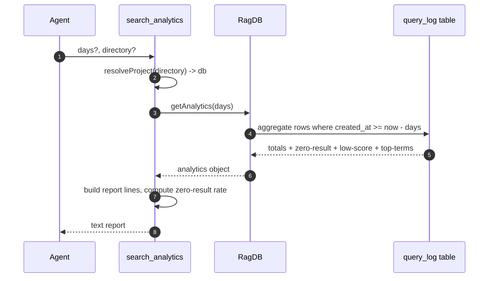

# Tool: search_analytics

`search_analytics` summarizes how the project's search has been used over a
recent window. It answers questions like "what do people keep searching for?",
"which queries return nothing?", and "which queries return weak results?".
Those last two are the practical payoff: a query that returns zero results or
a low top score is a signal that the index is missing content the user wanted,
so the tool doubles as a documentation-gap finder.

The tool only reads and aggregates. The rows it summarizes are written by the
search flows themselves every time someone runs a query
(see [search](search.md) and [read_relevant](read-relevant.md)).

## How it works

The handler is registered as the MCP tool `search_analytics` in
`registerAnalyticsTools` (`src/tools/analytics-tools.ts:5-6`). On each call it
resolves the target project and database with `resolveProject`
(`src/tools/analytics-tools.ts:24`), asks the database for an aggregate over
the look-back window with `getAnalytics(days)`
(`src/tools/analytics-tools.ts:25`), and formats the result into a plain-text
report.

All of the numbers come from one table, `query_log`, which holds one row per
completed search. `getAnalytics` runs a handful of SQL aggregates over the
rows newer than `now - days`, all scoped by the same `created_at >= since`
cutoff (`src/db/analytics.ts:19-56`). It returns totals, three ranked lists,
and a per-day count; the handler renders all of them except the per-day
series.



1. The agent calls the tool with an optional `days` look-back (default 30)
   and optional `directory` (`src/tools/analytics-tools.ts:9-22`).
2. `resolveProject` resolves the directory (or `RAG_PROJECT_DIR` / cwd) to an
   absolute path and returns that project's database handle
   (`src/tools/analytics-tools.ts:24`).
3. `getAnalytics(days)` computes the window start as
   `now - days * 86400000` ms and runs every aggregate against rows newer
   than it (`src/db/analytics.ts:19-56`).
4. The database returns total query count, average result count, average top
   score, and three ranked lists (`src/db/analytics.ts:58-66`).
5. The handler builds a header with the totals and computes the zero-result
   rate as a percentage from the zero-result list and the total
   (`src/tools/analytics-tools.ts:27-33`).
6. It appends the top-searched, zero-result, and low-score lists, each only
   when non-empty (`src/tools/analytics-tools.ts:35-54`).
7. The joined lines are returned as a single text block
   (`src/tools/analytics-tools.ts:56-58`).

## Inputs

| name | type | required | description |
| --- | --- | --- | --- |
| `directory` | string | no | Project directory to read analytics for. Falls back to `RAG_PROJECT_DIR`, then cwd (`src/tools/analytics-tools.ts:10-13`). |
| `days` | integer 1–365 | no | How many days back to include; older rows are ignored. Defaults to 30 (`src/tools/analytics-tools.ts:14-21`). |

## Outputs

| output | where it lands / shape / description |
| --- | --- |
| Header metrics | First lines of the text report: total query count, average results per query (1 decimal), average top score (2 decimals, or `n/a` when no scored rows), and zero-result rate as a whole-number percent (`src/tools/analytics-tools.ts:27-33`). |
| Top searches | Up to 10 most-frequent queries with their counts, only when there were any queries (`src/tools/analytics-tools.ts:35-40`, `src/db/analytics.ts:46-50`). |
| Zero-result queries | Up to 10 distinct queries that returned no results, with counts, labeled as topics worth indexing (`src/tools/analytics-tools.ts:42-47`, `src/db/analytics.ts:33-37`). |
| Low-relevance queries | Up to 10 queries whose best result scored below 0.3, with that score, ordered worst first (`src/tools/analytics-tools.ts:49-54`, `src/db/analytics.ts:39-44`). |

The aggregate object also carries a `queriesPerDay` series
(`src/db/analytics.ts:52-56`), but this tool does not render it; only the four
report blocks above appear in the text.

## The metrics, precisely

| metric | how it is computed | source |
| --- | --- | --- |
| `totalQueries` | `COUNT(*)` of rows in the window | `src/db/analytics.ts:21-23` |
| `avgResultCount` | `AVG(result_count)` over the window, `0` when no rows | `src/db/analytics.ts:25-27`, `src/db/analytics.ts:60` |
| `avgTopScore` | `AVG(top_score)` over rows with a non-null score; `null` (shown as `n/a`) when none | `src/db/analytics.ts:29-31`, `src/tools/analytics-tools.ts:31` |
| Zero-result rate | sum of zero-result counts ÷ `totalQueries`, as a percent; `0` when there were no queries | `src/tools/analytics-tools.ts:32` |
| Top searched terms | `GROUP BY query ORDER BY count DESC LIMIT 10` | `src/db/analytics.ts:46-50` |
| Zero-result queries | rows with `result_count = 0`, grouped and ranked, `LIMIT 10` | `src/db/analytics.ts:33-37` |
| Low-score queries | rows with `top_score < 0.3`, ordered ascending, `LIMIT 10` | `src/db/analytics.ts:39-44` |

Note the zero-result rate is computed in the handler from the (capped-at-10)
zero-result list, not from a separate full count, so it reflects the displayed
zero-result groups rather than a global zero-result total
(`src/tools/analytics-tools.ts:32`).

## Where the source rows come from

Every completed search writes one row into `query_log` via
`db.logQuery(...)`. The full-document search and the chunk search both call it
at the end of their run, recording the query text, the number of results, the
top result's score and path, and the duration in milliseconds
(`src/search/hybrid.ts:388-394`, `src/search/hybrid.ts:545-551`,
`src/db/analytics.ts:3-8`). The chunk search path is what [read_relevant](read-relevant.md)
uses, and the document search path is what [search](search.md) uses, so both
tools feed this analytics view. When `results[0]` is absent (zero results),
the logged `top_score` and `top_path` are `null`, which is exactly what makes a
query show up in the zero-result list (`src/search/hybrid.ts:391-392`).

## Branches and failure cases

- **No queries in the window.** `totalQueries` is 0, `avgResultCount` falls
  back to 0, `avgTopScore` is `null` and renders as `n/a`, and the zero-result
  rate short-circuits to `0` instead of dividing by zero
  (`src/tools/analytics-tools.ts:31-32`, `src/db/analytics.ts:60`).
- **No scored rows but some queries.** If every row in the window had a `null`
  `top_score` (all zero-result), `avgTopScore` is `null` → `n/a`
  (`src/db/analytics.ts:29-31`).
- **Empty optional lists.** Each of the three list sections is only appended
  when its list is non-empty, so a project with no zero-result or low-score
  queries simply omits those headings
  (`src/tools/analytics-tools.ts:35-54`).
- **`days` out of range.** The schema rejects values below 1 or above 365
  before the handler runs (`src/tools/analytics-tools.ts:14-21`).
- **Missing directory.** `resolveProject` throws if the resolved directory
  does not exist, before any query runs.
- **Long history.** Each list is hard-capped at 10 rows by the SQL `LIMIT 10`,
  so the report length is bounded regardless of how many distinct queries
  exist (`src/db/analytics.ts:35`, `src/db/analytics.ts:41`,
  `src/db/analytics.ts:48`).

## Example

Example arguments:

```json
{
  "days": 14
}
```

Illustrative report (values synthetic):

```
Search analytics (last 14 days):
  Total queries:    128
  Avg results:      6.3
  Avg top score:    0.71
  Zero-result rate: 9%

Top searches:
  - "how does indexing work" (12×)
  - "embedding model config" (8×)

Zero-result queries (consider indexing these topics):
  - "webhook retry policy" (4×)

Low-relevance queries (top score < 0.3):
  - "deploy to staging" (score: 0.18)
```

## Key source files

- `src/tools/analytics-tools.ts` — the MCP tool handler: calls `getAnalytics`
  and formats the report, including the zero-result rate calculation.
- `src/db/analytics.ts` — `logQuery` (writer) and `getAnalytics` (the
  windowed aggregate queries over `query_log`).
- `src/search/hybrid.ts` — the search functions that call `logQuery` and so
  produce the rows this tool reads.

## Related flows

- [search](search.md) — document search that logs a `query_log` row per call.
- [read_relevant](read-relevant.md) — chunk search that also logs rows here.
- [cli/analytics](../cli/analytics.md) — CLI view over the same aggregates.
