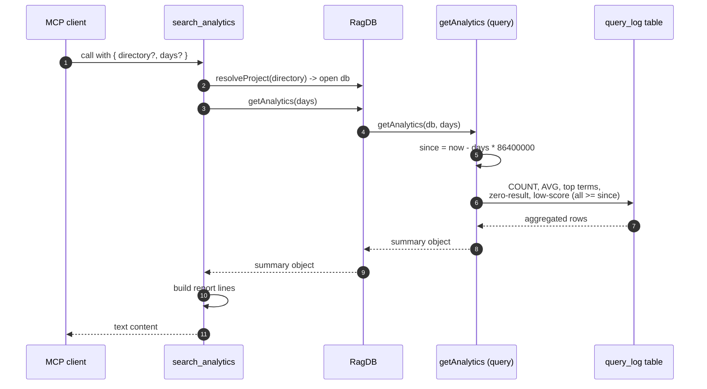

# Tool: search_analytics

`search_analytics` is a read-only MCP tool that summarizes how search has been used on a project over a recent window of time. It answers questions like: how many searches ran, how good the results were on average, which terms get searched most, and — most usefully — which queries returned nothing or returned only weak matches. Those last two lists are the point of the tool: they expose gaps in the index or in the documentation, so an agent or maintainer knows what topics to write about or re-index next.

Every search the project runs is logged. `search_analytics` reads that log back, aggregates it over a look-back window, and renders a plain-text report. It writes nothing — it is purely a reporting view over the `query_log` table.

## Where the data comes from

The report only has anything to show because the two main search flows record each query they run. Both the `search` MCP tool and the `read_relevant` MCP tool funnel through the hybrid search engine, and each path inserts one row per query once results are computed.

- `search` (full-file ranking) logs its query at `src/search/hybrid.ts:410-416`.
- `read_relevant` (chunk ranking) logs its query at `src/search/hybrid.ts:571-577`.

Both call sites record the same five values: the query string, how many results came back (`results.length`), the top result's score, the top result's path (`results[0]?.path ?? null`), and how long the search took in milliseconds. The score that gets logged is **not** the score shown to the caller. Since the hybrid-search fix, the visible result score is a positional rank-fusion value that sits near `1.0` at the top regardless of true relevance, so logging it would make "avg top score" and the `< 0.3` low-relevance heuristic meaningless. Instead, both paths log the **raw top vector cosine**, derived by `vectorScoreToCosine(vectorResults[0]?.score)` — which converts the stored L2-based vector score back to a true cosine and yields `null` when there were no vector hits (`src/search/hybrid.ts:403-416`, `src/search/hybrid.ts:566-577`). That cosine is the relevance signal that feeds `avgTopScore` and the low-relevance list.

The writer inserts those values into a row alongside an ISO-8601 `created_at` timestamp (`src/db/analytics.ts:3-8`). The columns land in the `query_log` table, whose schema is `id`, `query`, `result_count`, `top_score`, `top_path`, `duration_ms`, and `created_at` (`src/db/index.ts:434-442`). The `created_at` string is what the look-back window filters on, and `result_count = 0` plus `top_score < 0.3` are the two conditions that feed the zero-result and low-relevance lists.

## What the tool does

When the tool is invoked it resolves the project directory, opens that project's database, and asks for an analytics summary over the requested number of days. The summary comes back as a single structured object; the tool then turns that object into a human-readable block of text and returns it as the tool's text content (`src/tools/analytics-tools.ts:23-58`).

The actual aggregation happens in the database layer. The tool calls the `getAnalytics` wrapper method on the project's database object, which delegates to the standalone analytics query function with the live SQLite connection (`src/db/index.ts:1083-1085`). That function computes a start timestamp `days` ago and runs a handful of SQL queries against `query_log`, all scoped to rows at or after that timestamp (`src/db/analytics.ts:19-56`):

- **Total queries** — a `COUNT(*)` of rows in the window.
- **Average result count** — `AVG(result_count)`, defaulting to `0` when there are no rows.
- **Average top score** — `AVG(top_score)` across rows where `top_score` is not null. Because the logged `top_score` is the raw top vector cosine (see above), this average reflects vector relevance, not the rank-fusion display score. It stays `null` if every row in the window had a null score.
- **Top searched terms** — the ten most frequent query strings, grouped and ordered by count.
- **Zero-result queries** — the ten most frequent queries whose `result_count` was `0`, grouped by query and ordered by count.
- **Low-relevance queries** — up to ten queries whose best result scored below `0.3`, ordered by the worst score first.

The query function also computes a per-day breakdown (`queriesPerDay`), but `search_analytics` does not render it — that field is consumed elsewhere (the [`analytics` CLI command](../cli/analytics.md) uses it for a trend view). The tool only formats the totals and the three lists.



1. An MCP client calls the tool, optionally passing a project `directory` and a `days` window.
2. `resolveProject` turns the optional directory into an absolute path, verifies it exists, loads the project config, and returns the project's database handle (`src/tools/index.ts:22-36`).
3. The tool calls `getAnalytics(days)` on that database handle.
4. The wrapper method forwards to the standalone analytics query function with the live SQLite connection (`src/db/index.ts:1083-1085`).
5. The function derives the window start as `Date.now() - days * 86400000` and converts it to an ISO string (`src/db/analytics.ts:19`).
6. It runs the count, average, top-term, zero-result, and low-score queries — each restricted to rows whose `created_at` is at or after the window start.
7. SQLite returns the aggregated rows.
8. The function assembles them into one summary object and returns it up through the wrapper.
9. The tool stitches the numbers and lists into a list of text lines.
10. The joined lines are returned as the tool's text content.

## Inputs

| name | type | required | description |
| --- | --- | --- | --- |
| `directory` | string | no | Project directory to report on. When omitted, falls back to the `RAG_PROJECT_DIR` environment variable, then the current working directory (`src/tools/index.ts:26`). |
| `days` | integer | no | Look-back window in days. Validated as an integer between `1` and `365`; defaults to `30` when not supplied (`src/tools/analytics-tools.ts:14-21`). |

## Outputs

| output | where it lands / shape / description |
| --- | --- |
| analytics report text | A single multi-line text block returned as the tool's `content`. It always includes the header line plus four summary rows (total queries, average results, average top score, zero-result rate). It then appends a "Top searches" section, a "Zero-result queries" section, and a "Low-relevance queries" section, but only for those lists that are non-empty (`src/tools/analytics-tools.ts:27-58`). |

## The report format

The header line names the window (`Search analytics (last N days):`) and is followed by four aligned summary rows (`src/tools/analytics-tools.ts:27-33`):

- **Total queries** — printed as-is.
- **Avg results** — fixed to one decimal place via `toFixed(1)`.
- **Avg top score** — fixed to two decimals, or the literal `n/a` when no scored query exists in the window (`analytics.avgTopScore?.toFixed(2) ?? "n/a"`).
- **Zero-result rate** — computed in the tool, not the database. It sums the counts of the zero-result query groups and divides by total queries, shown as a whole-number percent. When there were no queries at all it prints `0%` to avoid dividing by zero (`src/tools/analytics-tools.ts:32`).

Then up to three labelled lists follow, each rendered only if it has at least one entry. Top searches and zero-result queries show the query and a count with a `×` suffix; low-relevance queries show the query and its top score to two decimals (`src/tools/analytics-tools.ts:35-54`).

One subtlety in the zero-result rate: it is derived from `zeroResultQueries`, which is capped at the ten most frequent zero-result groups by SQL. If more than ten distinct queries returned nothing, the summed count understates the true number of zero-result rows, so the displayed rate is a lower bound rather than an exact percentage (`src/db/analytics.ts:33-37`, `src/tools/analytics-tools.ts:32`).

## Branches and failure cases

- **No matching directory.** If the resolved directory does not exist, `resolveProject` throws before any query runs, and the tool call fails with `Directory does not exist: <path>` (`src/tools/index.ts:31-34`).
- **Empty window (no queries logged).** When nothing has been searched in the window, total queries is `0`, average results is `0.0`, and average top score is `n/a`. The zero-result-rate guard prints `0%` instead of dividing by zero. All three lists are empty, so none of their sections are emitted — the report is just the header and four summary rows (`src/tools/analytics-tools.ts:29-33`).
- **Some queries but no scored ones.** Average top score stays `null` and renders as `n/a` because the average ignores rows with a null `top_score` (`src/db/analytics.ts:29-31`).
- **Empty list sections are skipped.** Each of "Top searches", "Zero-result queries", and "Low-relevance queries" is gated on its array being non-empty, so a healthy project with no zero-result or low-score queries simply omits those sections (`src/tools/analytics-tools.ts:35-54`).
- **`days` out of range.** The Zod schema rejects non-integers, values below `1`, and values above `365` before the tool body runs; the caller gets a validation error rather than a report (`src/tools/analytics-tools.ts:14-21`).
- **List caps.** Each of the three lists is capped at ten entries by `LIMIT 10` in SQL, so the report never grows unbounded regardless of how many distinct queries were logged (`src/db/analytics.ts:35-50`).

## How it differs from the analytics CLI command

The same aggregation backs the [`analytics` CLI command](../cli/analytics.md), but the two presentations differ:

| | `search_analytics` (this tool) | `analytics` CLI |
| --- | --- | --- |
| Caller | MCP client / agent | Terminal user |
| Window source | `days` argument (default 30) | `--days` flag |
| Output | Text content in a tool response | Printed to stdout |
| Per-day trend | Not rendered | Rendered (uses `queriesPerDay` and `getAnalyticsTrend`) |

Both ultimately call the same `getAnalytics` query function, so the numbers agree; only the rendering and the extra trend section differ.

## Example

Example arguments:

```json
{
  "directory": "/Users/me/projects/example",
  "days": 14
}
```

Illustrative output (values are synthetic):

```
Search analytics (last 14 days):
  Total queries:    128
  Avg results:      6.4
  Avg top score:    0.71
  Zero-result rate: 9%

Top searches:
  - "how does indexing work" (12×)
  - "embedding config" (8×)

Zero-result queries (consider indexing these topics):
  - "websocket transport" (4×)
  - "rate limiting" (2×)

Low-relevance queries (top score < 0.3):
  - "deployment pipeline" (score: 0.18)
```

## Key source files

| File | Role |
| --- | --- |
| `src/tools/analytics-tools.ts` | Registers the `search_analytics` MCP tool, validates `directory`/`days`, calls `getAnalytics`, and renders the text report. |
| `src/db/analytics.ts` | The `getAnalytics` query function that aggregates `query_log` over the window, plus `logQuery` (the writer) and `getAnalyticsTrend` (used by the CLI). |
| `src/db/index.ts` | Defines the `query_log` table schema and the `RagDB.getAnalytics` / `logQuery` wrapper methods. |
| `src/search/hybrid.ts` | The search engine that calls `logQuery` after each `search` and `read_relevant` query, populating the data this tool reports on. |
| `src/tools/index.ts` | `resolveProject` — resolves the directory and opens the project database for the tool. |

## Related

- [search](search.md) and [read_relevant](read-relevant.md) — the two flows that write the rows this tool aggregates.
- [analytics CLI command](../cli/analytics.md) — the terminal-facing view over the same data.
