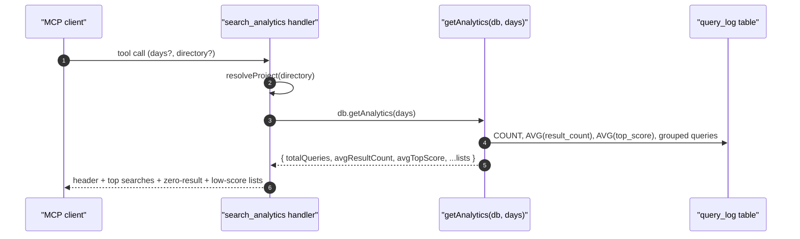

# Tool: search_analytics

The `search_analytics` MCP tool turns the query log into a short report.
It is the read side of the `query_log` table that `search` and
`read_relevant` write to on every invocation. The output is meant to
surface gaps in the index — queries that returned nothing, queries with
suspiciously low top scores, and the most frequently searched terms.

The handler lives at `src/tools/analytics-tools.ts:5-60` and pulls
aggregate stats from `getAnalytics` in `src/db/analytics.ts:10-67`.



1. The client invokes `search_analytics` with an optional `days`
   parameter (1–365, default `30`) and optional `directory`
   (`src/tools/analytics-tools.ts:9-22`).
2. The handler opens the project DB through `resolveProject`
   (`src/tools/analytics-tools.ts:24`).
3. `ragDb.getAnalytics(days)` runs six SQL queries against `query_log`,
   each scoped to `created_at >= now - days * 86400000` ms
   (`src/db/analytics.ts:19-56`).
4. The aggregator returns the totals (`totalQueries`, `avgResultCount`,
   `avgTopScore`), the top 10 zero-result queries, the 10 lowest
   `top_score < 0.3` queries, the top 10 most-searched terms, and a
   per-day count (`src/db/analytics.ts:58-66`).
5. The handler computes a zero-result rate (`sum of zero-result counts /
   totalQueries`) and assembles a plain-text report. Sections are only
   appended when their list has entries
   (`src/tools/analytics-tools.ts:27-55`).

## Inputs

- `days` — optional integer, 1–365, default `30`. Controls the look-back
  window. The aggregator turns this into an ISO `since` cutoff before
  every SQL query (`src/tools/analytics-tools.ts:14-21`,
  `src/db/analytics.ts:19`).
- `directory` — optional project root override
  (`src/tools/analytics-tools.ts:10-13`).

## Outputs

- A single text block. The first block always contains:
  - `Total queries: N`
  - `Avg results: X.X` — `AVG(result_count)` across the window.
  - `Avg top score: X.XX` or `n/a` when no top score is on file.
  - `Zero-result rate: P%` — sum of zero-result query counts divided
    by `totalQueries`, rounded to integer percent
    (`src/tools/analytics-tools.ts:27-33`).
- Conditional sections, only when populated:
  - `Top searches:` — up to 10 entries from `topSearchedTerms`
    (`src/tools/analytics-tools.ts:35-40`).
  - `Zero-result queries (consider indexing these topics):` — up to 10
    entries from `zeroResultQueries`
    (`src/tools/analytics-tools.ts:42-47`).
  - `Low-relevance queries (top score < 0.3):` — up to 10 entries from
    `lowScoreQueries`, showing the lowest single-query top score
    (`src/tools/analytics-tools.ts:49-54`).
- No write side effects.

## Aggregated metrics

The four headline numbers all come from one window-bounded snapshot of
`query_log`:

- `totalQueries` — `SELECT COUNT(*) FROM query_log WHERE created_at >=
  ?` (`src/db/analytics.ts:21-23`).
- `avgResultCount` — `AVG(result_count)`. Returns 0 when there are no
  rows (`src/db/analytics.ts:25-27`, fallback applied in the wrapper).
- `avgTopScore` — `AVG(top_score)` over rows where `top_score` is
  non-null. Can be null on its own and renders as `n/a`
  (`src/db/analytics.ts:29-31`,
  `src/tools/analytics-tools.ts:31`).
- Zero-result rate — computed in the handler, not the DB. It iterates
  the `zeroResultQueries` list, sums its `count` field, and divides by
  `totalQueries` (`src/tools/analytics-tools.ts:32`).

## Top, zero-result, and low-score queries

- Top terms come from a `GROUP BY query ORDER BY count DESC LIMIT 10`
  scan, so repeat use of the *same exact* query string is what
  registers — small wording differences create separate buckets
  (`src/db/analytics.ts:46-50`).
- Zero-result queries are filtered with `result_count = 0` before the
  group-by, so the count column is the number of *invocations* of that
  zero-result query (`src/db/analytics.ts:33-37`).
- Low-score queries are ordered by `top_score ASC LIMIT 10`. This
  surfaces the worst hits individually rather than aggregating by
  query, so each row carries its own `topScore` and timestamp
  (`src/db/analytics.ts:39-44`). The fixed `0.3` cutoff is hard-coded
  in the SQL.

## Source data: rows written by `search` and `read_relevant`

Every successful call to `search` (`src/search/hybrid.ts:387-394`) and
`searchChunks` (`src/search/hybrid.ts:544-551`) writes one row to
`query_log` via `db.logQuery`. The row records the query string, the
total number of results returned, the top score (nullable), the top
file path (nullable), the elapsed `durationMs`, and the ISO
`created_at` timestamp (`src/db/analytics.ts:3-8`).

`write_relevant` reuses `searchChunks`, so its invocations are also
logged — appearing in `search_analytics` under the content that was
passed as the "query". Other tools (`search_symbols`, `find_usages`,
`search_conversation`, `search_commits`) do **not** write to
`query_log`, so the analytics view is a code-search-centric view, not
an everything-search view.

## Branches and failure cases

- Empty window: `totalQueries` is 0; `avgTopScore` is `n/a`; the
  zero-result rate is hard-coded to 0 in the format string when no
  queries are present (`src/tools/analytics-tools.ts:32`). The
  conditional sections render zero lines because their lists are empty.
- No `top_score` rows: `avgTopScore` is `null` from the DB and renders
  as `n/a` (`src/tools/analytics-tools.ts:31`).
- Very large `days`: the aggregator caps at 365 in the input schema
  (`src/tools/analytics-tools.ts:17`).

## Example

```json
{ "days": 14 }
```

Response shape (illustrative):

```
Search analytics (last 14 days):
  Total queries:    312
  Avg results:      4.2
  Avg top score:    0.62
  Zero-result rate: 7%

Top searches:
  - "how does indexing work" (8×)
  - "config defaults" (6×)
  ...

Zero-result queries (consider indexing these topics):
  - "lru cache impl" (3×)

Low-relevance queries (top score < 0.3):
  - "what is the deal with X" (score: 0.18)
```

## Related flows

- `search` — primary writer of `query_log` rows.
- `read_relevant` — secondary writer of `query_log` rows.
- `cli/analytics` — CLI counterpart that reads the same aggregation
  function plus the `getAnalyticsTrend` view.

## Key source files

- `src/tools/analytics-tools.ts` — handler, formatting, zero-result
  rate computation.
- `src/db/analytics.ts` — `logQuery`, `getAnalytics`,
  `getAnalyticsTrend` SQL.
- `src/db/index.ts` — `RagDB.logQuery` and `RagDB.getAnalytics` thin
  wrappers.
