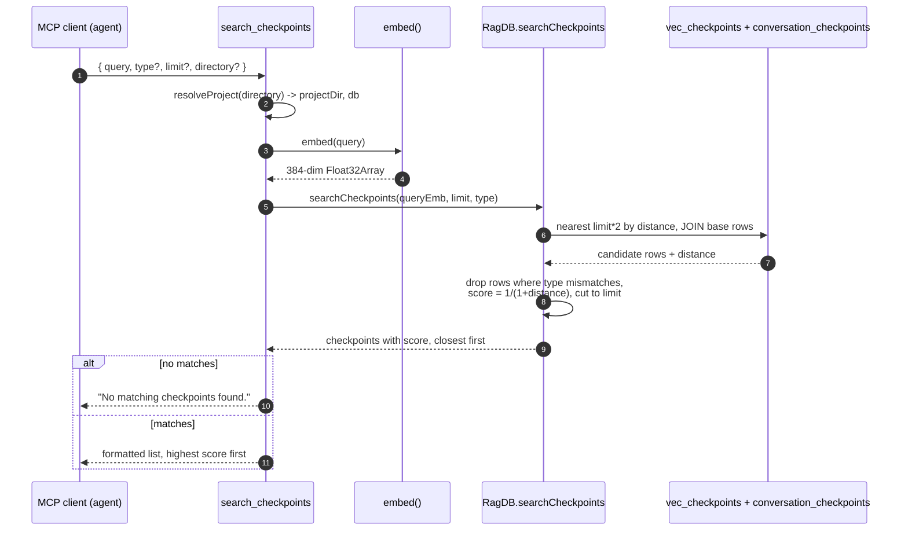

# Tool: search_checkpoints

`search_checkpoints` finds past checkpoints by meaning rather than by exact words. A checkpoint is a short note an earlier session saved with `create_checkpoint` — a decision, a milestone, a blocker, a mid-task direction change, or a handoff — describing what was done and why. Over many sessions these pile up, and listing them newest-first with `list_checkpoints` stops being useful once there are dozens. This tool lets an agent ask a question in plain language ("why did we drop the worker pool?", "did we ever decide on the auth approach?") and get back the most semantically similar checkpoints, ranked by closeness.

The tool is registered on the MCP server inside `registerCheckpointTools`, alongside `create_checkpoint` and `list_checkpoints`, in `src/tools/checkpoint-tools.ts:120`. The actual vector query lives one layer down in the database module at `src/db/checkpoints.ts:91`.

## How it works

When a checkpoint is created, its title and summary are concatenated into one string (`${title}. ${summary}`) and embedded into a single vector (`src/tools/checkpoint-tools.ts:46-47`). That vector is written to a dedicated virtual table while the human-readable fields go to a separate base table (`src/db/checkpoints.ts:41-44`). Searching reverses that: the incoming query string is embedded with the same model, and that query vector is compared against every stored checkpoint vector to find the nearest ones.

The embedding step is shared with the rest of mimirs. `embed` loads (or reuses) a singleton transformer pipeline — by default `Xenova/all-MiniLM-L6-v2` producing 384-dimensional vectors — and returns a mean-pooled, L2-normalized `Float32Array` for the text (`src/embeddings/embed.ts:95-103`). Because the model is a singleton, the first search in a process can be slow while the model loads; later searches reuse the loaded pipeline.

The nearest-neighbor lookup uses a `vec0` virtual table named `vec_checkpoints`, created with the project database; its embedding width is the configured embedding dimension, 384 by default (`src/db/index.ts:429-432`). The query joins the vector hits back to the `conversation_checkpoints` base table so each match carries its full title, summary, type, files, and tags (`src/db/checkpoints.ts:114-118`).



1. The agent calls the tool with a `query` and optional `type`, `limit`, and `directory`. Zod validates the arguments before the handler runs, so a missing or empty `query` is rejected before any work happens (`src/tools/checkpoint-tools.ts:123-134`).
2. `resolveProject` turns the optional `directory` into an absolute path, verifies it exists, loads the project config, applies its embedding settings, and returns the project's `RagDB` handle (`src/tools/index.ts:22-36`). This is what lets the same server serve checkpoints for multiple projects.
3. The handler embeds the query string into a vector with `embed` (`src/tools/checkpoint-tools.ts:138`).
4. The vector is passed to `ragDb.searchCheckpoints`, which forwards to the database helper with the `limit` as `topK` and the optional `type` (`src/db/index.ts:1011-1013`).
5. The helper runs a `MATCH` query against `vec_checkpoints` ordered by distance, joined to the base checkpoint rows. It deliberately over-fetches — it asks for `topK * 2` candidates (`src/db/checkpoints.ts:114-120`).
6. It walks the candidates, skips any whose `type` does not match the requested filter, converts each distance into a `score` of `1 / (1 + distance)`, and stops once it has collected `topK` results (`src/db/checkpoints.ts:124-141`).
7. If nothing survives, the handler returns the fixed string `"No matching checkpoints found."` (`src/tools/checkpoint-tools.ts:141-145`).
8. Otherwise it formats each match as a text block — score, id, type, title, summary, and an optional `Files:` line — joined by blank lines, with the highest score first (`src/tools/checkpoint-tools.ts:147-156`).

## Inputs

| name | type | required | description |
| --- | --- | --- | --- |
| `query` | string (1–2000 chars) | yes | Natural-language text to match against checkpoint titles and summaries. It is embedded and used as the search vector (`src/tools/checkpoint-tools.ts:124`). |
| `type` | enum: `decision`, `milestone`, `blocker`, `direction_change`, `handoff` | no | Restrict results to one checkpoint kind. Applied as a post-filter on the vector candidates, not in SQL (`src/tools/checkpoint-tools.ts:125-128`). |
| `limit` | integer ≥ 1 | no | Maximum number of results. Defaults to `5` (`src/tools/checkpoint-tools.ts:129`). Passed through as `topK`. |
| `directory` | string | no | Project directory to search. Falls back to the `RAG_PROJECT_DIR` env var, then the current working directory (`src/tools/index.ts:26`). |

## Outputs

| output | where it lands / shape / description |
| --- | --- |
| Ranked checkpoints | A single MCP text block. Each checkpoint is rendered as `<score>  #<id> [<type>] <title>` followed by an indented summary line, with an optional `Files: ...` line when the checkpoint recorded involved files (`src/tools/checkpoint-tools.ts:147-156`). The score is distance-derived and printed to four decimals. Blocks are separated by a blank line. |
| Empty-result message | When no candidate survives the search and type filter, the literal text `No matching checkpoints found.` is returned instead of a list (`src/tools/checkpoint-tools.ts:141-145`). |

The tool only reads. It performs no inserts or updates, so it changes no stored state — unlike `create_checkpoint`, which writes a new base row and a new vector.

## Ranking and the score field

Vector search returns a `distance` (smaller means closer). The helper turns that into a similarity-like `score` with `score = 1 / (1 + row.distance)`, so a perfect match (distance 0) scores `1.0` and worse matches trend toward `0` (`src/db/checkpoints.ts:137`). Results are already ordered by ascending distance from the SQL `ORDER BY distance`, so the printed list runs from most to least relevant (`src/db/checkpoints.ts:117`). The score is informational; there is no minimum-score cutoff, so even weak matches appear if fewer than `limit` strong ones exist.

## Branches and failure cases

| Situation | Behavior |
| --- | --- |
| Empty / over-long `query` | Rejected by Zod validation (`min(1).max(2000)`) before the handler runs (`src/tools/checkpoint-tools.ts:124`). |
| `type` omitted | No filtering; all candidate kinds are eligible (`src/db/checkpoints.ts:125`). |
| `type` provided | Candidates whose `type` differs are skipped in the result loop. Because filtering happens after the vector lookup, see the over-fetch note below (`src/db/checkpoints.ts:124-125`). |
| `limit` omitted | Defaults to `5` results (`src/tools/checkpoint-tools.ts:129`). |
| No checkpoints stored / none match | The vector query yields no surviving rows and the handler returns `"No matching checkpoints found."` (`src/tools/checkpoint-tools.ts:141-145`). |
| Checkpoint has no involved files | The `Files:` line is omitted from that block; only score, id, type, title, and summary are shown (`src/tools/checkpoint-tools.ts:149-152`). |
| `directory` does not exist | `resolveProject` throws `Directory does not exist: <path>` before any search (`src/tools/index.ts:31-34`). |
| Model load failure | Surfaces from `embed` / `getEmbedder`. A corrupted cached model is deleted and the load is retried once; other load errors propagate (`src/embeddings/embed.ts:75-89`). |

### The over-fetch and post-filter

The most surprising part of the search is that the type filter is not pushed into SQL. The vector query fetches `topK * 2` nearest candidates regardless of type, and the type check happens afterward in a loop that stops once it has `topK` matches (`src/db/checkpoints.ts:117-141`). The doubled fetch is a cushion so that filtering by type still tends to return enough results. It is only a cushion, though: if a type is rare and its checkpoints are not among the `topK * 2` nearest overall, the result can come back shorter than `limit` — or empty — even when matching checkpoints of that type exist further down the distance ranking. Callers that need exhaustive type-scoped history are better served by [list_checkpoints](list-checkpoints.md) with its `type` filter, which queries the base table directly.

## Example

Example arguments:

```json
{
  "query": "why did we switch the embedding model",
  "type": "decision",
  "limit": 3,
  "directory": "/Users/me/repos/myproject"
}
```

Illustrative response text (values synthetic):

```
0.8421  #42 [decision] Switched embedding model to all-MiniLM-L6-v2
  Chose the smaller MiniLM model for faster local indexing; quality loss was acceptable for code search.
  Files: src/embeddings/embed.ts, src/config.ts

0.6113  #29 [decision] Locked embedding dimension at 384
  Standardized the vector table width so swapping models later requires a reindex, recorded here so nobody assumes it is dynamic.
```

## Key source files

| File | Role |
| --- | --- |
| `src/tools/checkpoint-tools.ts` | Registers `search_checkpoints`, validates arguments, embeds the query, formats the result text. |
| `src/db/checkpoints.ts` | `searchCheckpoints` runs the `vec_checkpoints` MATCH query, applies the type post-filter, and computes the score. |
| `src/embeddings/embed.ts` | `embed` turns the query string into the normalized vector used for the lookup. |
| `src/tools/index.ts` | `resolveProject` resolves the directory and hands back the project's `RagDB`. |
| `src/db/index.ts` | Defines the `conversation_checkpoints` table and the `vec_checkpoints` virtual table, and exposes `searchCheckpoints` on `RagDB`. |

## Related tools

- [create_checkpoint](create-checkpoint.md) — writes the checkpoint rows and embeddings that this tool searches.
- [list_checkpoints](list-checkpoints.md) — newest-first listing with an exact `type` filter, queried straight from the base table.
- [checkpoint CLI](../cli/checkpoint.md) — the command-line surface over the same checkpoint store.
