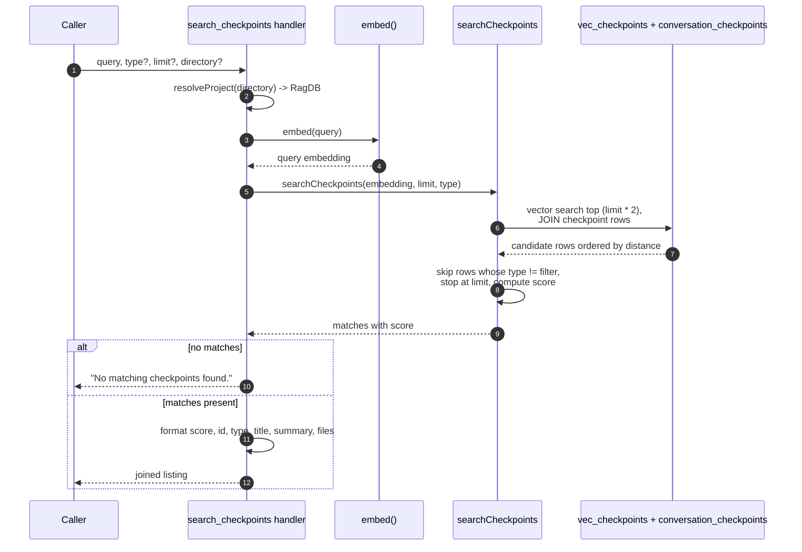

# Tool: search_checkpoints

`search_checkpoints` finds saved checkpoints by meaning rather than by recency. Each checkpoint written by [create_checkpoint](create-checkpoint.md) was embedded from its title and summary; this tool embeds your query the same way and returns the closest matches, ranked by similarity. Use it when you remember roughly what a past decision or blocker was about but not when it happened — for example "why did we pick this storage layer?" — where the chronological listing from [list_checkpoints](list-checkpoints.md) would not help you find it.

The handler is registered in `src/tools/checkpoint-tools.ts:120-158`.

## How it works



1. The caller invokes the tool with a required `query` plus optional `type`, `limit`, and `directory` (`src/tools/checkpoint-tools.ts:123-134`).
2. `resolveProject` resolves the optional `directory` into the `RagDB` handle, falling back to `RAG_PROJECT_DIR` or the current working directory (`src/tools/checkpoint-tools.ts:136`).
3. The query string is embedded with the same embedder used when checkpoints were stored, so the vectors are comparable (`src/tools/checkpoint-tools.ts:138`).
4. `searchCheckpoints` runs a vector search over `vec_checkpoints` joined back to `conversation_checkpoints`, requesting `limit * 2` candidates ordered by ascending distance (`src/tools/checkpoint-tools.ts:139`, `src/db/checkpoints.ts:96-119`).
5. The candidate rows are walked in order. Any row whose `type` does not match the filter is skipped, and the loop stops once it has collected `limit` matches (`src/db/checkpoints.ts:123-141`).
6. Each kept row gets a `score` of `1 / (1 + distance)`, so a smaller distance yields a higher score closer to 1 (`src/db/checkpoints.ts:136`).
7. When nothing matches, the handler returns the literal text `No matching checkpoints found.` (`src/tools/checkpoint-tools.ts:141-145`).
8. Otherwise each match is rendered into a multi-line block and the blocks are joined with blank-line separators (`src/tools/checkpoint-tools.ts:147-155`).

## Why it over-fetches before filtering

The type filter is applied in application code, not in the SQL vector query. To avoid returning too few rows when many of the nearest matches are the wrong type, the database fetches `limit * 2` candidates by distance first, then skips non-matching types and stops at `limit` (`src/db/checkpoints.ts:119`, `src/db/checkpoints.ts:123-141`). A consequence worth knowing: if more than half of the top `limit * 2` neighbors are filtered out by type, the result can come back shorter than `limit` even when more matching checkpoints exist further down the full ranking.

## list_checkpoints vs search_checkpoints

| | [list_checkpoints](list-checkpoints.md) | search_checkpoints |
|---|---|---|
| ordering | `timestamp DESC` (recency) | similarity to the query (`score`) |
| requires a query | no | yes |
| score in output | no | yes, printed as the first field |
| session filter | yes (`sessionId`) | no |
| type filter | yes | yes |
| default limit | 20 | 5 |

## Inputs

| name | type | required | description |
|------|------|----------|-------------|
| `query` | string (1–2000) | yes | What to search for. Embedded and matched against stored checkpoint title+summary vectors (`src/tools/checkpoint-tools.ts:124`). |
| `type` | enum | no | Restrict matches to `decision`, `milestone`, `blocker`, `direction_change`, or `handoff`. Applied as a post-search filter (`src/tools/checkpoint-tools.ts:125-128`). |
| `limit` | integer ≥ 1 | no | Maximum number of matches to return. Defaults to 5 (`src/tools/checkpoint-tools.ts:129`). |
| `directory` | string | no | Project directory to operate on. Defaults to `RAG_PROJECT_DIR` or the current working directory (`src/tools/checkpoint-tools.ts:130-133`). |

## Outputs

| output | where it lands / shape / description |
|--------|--------------------------------------|
| Ranked checkpoint matches | A single text block. Each match renders as `<score>  #<id> [<type>] <title>` on the first line, the summary indented on the second, and an indented `Files: ...` line when `filesInvolved` is non-empty. The score is formatted to four decimal places. Blocks are joined by blank lines (`src/tools/checkpoint-tools.ts:147-155`). |
| Empty-state text | When no rows match, the block is exactly `No matching checkpoints found.` (`src/tools/checkpoint-tools.ts:141-145`). |

Unlike [list_checkpoints](list-checkpoints.md), this tool's output does not print the timestamp or turn index — it leads with the relevance score (`src/tools/checkpoint-tools.ts:152`).

## Branches and failure cases

- **Type filter.** When `type` is set, candidate rows of other types are skipped during the walk; when unset, all candidate types are eligible (`src/db/checkpoints.ts:124`).
- **Over-fetch then trim.** The search asks for `limit * 2` neighbors and breaks once `limit` matches are collected, so a strict type filter can yield fewer than `limit` results even if more exist deeper in the ranking (`src/db/checkpoints.ts:119`, `src/db/checkpoints.ts:139`).
- **Limit default.** When `limit` is omitted, the schema default of 5 applies (`src/tools/checkpoint-tools.ts:129`).
- **Empty result.** No matches (including the case where every candidate is filtered out by type) returns `No matching checkpoints found.` (`src/tools/checkpoint-tools.ts:141-145`).
- **Files rendering.** The `Files:` line appears only when `filesInvolved` is non-empty (`src/tools/checkpoint-tools.ts:149-151`).
- **Read-only.** This tool only queries; it never writes. Directory or embedding errors surface from `resolveProject` / `embed` / `RagDB`.

## Example

Find decisions related to storage:

```json
{ "query": "why we picked the embedding storage layer", "type": "decision", "limit": 3 }
```

Illustrative output:

```
0.8123  #12 [decision] Chose SQLite vec0 for embeddings
  Picked sqlite-vec over a separate vector DB to keep the index a single file.
  Files: src/example.ts, src/db/index.ts

0.6440  #9 [decision] Switched chunker to bun-chunk
  Replaced the hand-rolled splitter; better symbol boundaries.
```

## Related tools

- [create_checkpoint](create-checkpoint.md) — writes and embeds the checkpoints this tool searches.
- [list_checkpoints](list-checkpoints.md) — the recency-ordered counterpart when you want chronological history instead of relevance.

## Key source files

- `src/tools/checkpoint-tools.ts` — registers `search_checkpoints`, embeds the query, and formats the ranked listing.
- `src/embeddings/embed.ts` — `embed`, which turns the query into a comparable vector.
- `src/db/checkpoints.ts` — `searchCheckpoints`, the over-fetch vector search, type filtering, and score computation.
- `src/db/index.ts` — the `RagDB` class exposing `searchCheckpoints` over the `vec_checkpoints` and `conversation_checkpoints` tables.
