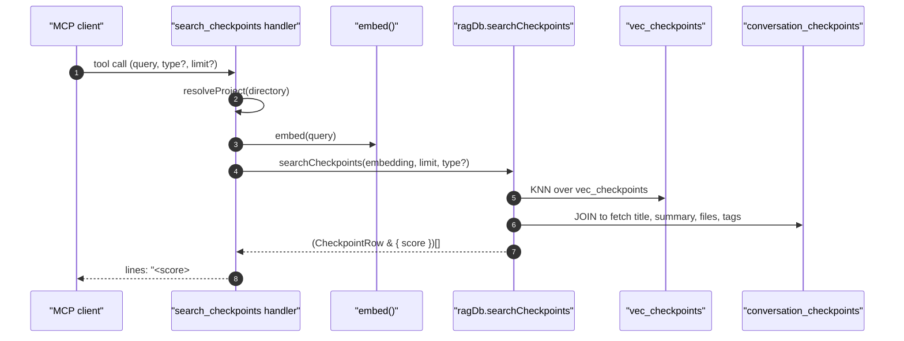

# Tool: search_checkpoints

The `search_checkpoints` MCP tool runs a semantic search across saved
checkpoints — the decision/milestone/blocker records that
`create_checkpoint` writes at the end of every task. It is the read
side of the cross-session memory: agents call it when they need to find
prior decisions or blockers by topic, rather than by recency
(`list_checkpoints` is the recency view).

The handler lives at `src/tools/checkpoint-tools.ts:120-158`. Unlike
the code-side `search`, this is a pure vector search — there is no
BM25 leg, no path filter, and no analytics logging. Ranking is by
cosine distance against an embedding built from each checkpoint's
title + summary at insert time.



1. The client invokes `search_checkpoints` with a query, optional
   `type` filter, and optional `limit` (default `5`)
   (`src/tools/checkpoint-tools.ts:122-134`).
2. The handler opens the project DB through `resolveProject`
   (`src/tools/checkpoint-tools.ts:136`).
3. The query is embedded with `embed(query)`
   (`src/tools/checkpoint-tools.ts:138`).
4. `ragDb.searchCheckpoints(queryEmb, limit, type)` runs a KNN query
   over the `vec_checkpoints` virtual table, joining to
   `conversation_checkpoints` for the row fields and the optional
   `type` filter (`src/tools/checkpoint-tools.ts:139`).
5. Each row carries a `score` field that the handler renders with
   `toFixed(4)`. The format is `score  #id [type] title` on line one,
   `summary` on line two, and an optional `Files: ...` line when
   `filesInvolved` is non-empty
   (`src/tools/checkpoint-tools.ts:147-154`).

## Inputs

- `query` — required string, 1 to 2000 chars
  (`src/tools/checkpoint-tools.ts:124`).
- `type` — optional enum:
  `decision | milestone | blocker | direction_change | handoff`
  (`src/tools/checkpoint-tools.ts:125-128`).
- `limit` — optional positive integer, default `5`. Caps the result
  set (`src/tools/checkpoint-tools.ts:129`).
- `directory` — optional project root override
  (`src/tools/checkpoint-tools.ts:130-133`).

## Outputs

- Text content with one block per match:
  - Line 1: `<score with 4 decimals>  #<id> [<type>] <title>`
  - Line 2: full `summary` (no truncation).
  - Optional line 3: `Files: <comma-joined filesInvolved>` when the
    checkpoint had files attached
    (`src/tools/checkpoint-tools.ts:147-154`).
- No write side effects. No `query_log` row is written.

## Semantic search over title + summary

The embedding stored on each checkpoint is built when
`create_checkpoint` runs: it embeds the string `"<title>. <summary>"`
once and stores the vector in `vec_checkpoints` alongside the row
(`src/tools/checkpoint-tools.ts:46-47`,
`src/db/checkpoints.ts` — `createCheckpoint`). That means the
similarity score returned here is computed against that combined
text, not against the title and summary independently. If you want a
checkpoint to be findable, both fields should be meaningful — a
generic title with a one-line summary is harder to retrieve by topic.

## Optional type filter

The `type` filter is forwarded straight to `searchCheckpoints`, which
appends a `WHERE type = ?` to the join. Use it to scope a search to
"blockers about X" or "decisions about Y" without sifting through
milestone entries (`src/tools/checkpoint-tools.ts:135-139`,
`src/db/checkpoints.ts` — `searchCheckpoints`).

## Score formatting

The score is rendered with `toFixed(4)` — four decimal places, no
percent sign, e.g. `0.7423` (`src/tools/checkpoint-tools.ts:152`).
This differs from `read_relevant`, which uses two decimals in
brackets. The wider precision here helps differentiate near-tie
checkpoints when several touch the same topic.

## Branches and failure cases

- Empty result set: returns "No matching checkpoints found." This
  fires when the `searchCheckpoints` query returns zero rows — either
  the checkpoint table is empty, or the optional `type` filter ruled
  every row out (`src/tools/checkpoint-tools.ts:141-145`).
- No diagnostic distinguishes "no checkpoints at all" from "filter
  excluded everything"; check with `list_checkpoints` when in doubt.

## Example

```json
{
  "query": "decision about how chunk parents are grouped",
  "type": "decision",
  "limit": 3
}
```

Response shape (illustrative):

```
0.7821  #42 [decision] Chose count-based parent grouping over score-based
  When two or more child chunks from the same parent appear, we now promote the parent. Tried score-based; it merged too aggressively.
  Files: src/example/hybrid.ts

0.6133  #29 [decision] Lifted parent threshold to ≥2
  Initially set to ≥3; the eval showed 2 was the sweet spot.
```

## Related flows

- `create_checkpoint` — writes the rows this tool reads. Builds the
  embedding from `title + summary`.
- `list_checkpoints` — recency view over the same table; use it when
  you want the latest N regardless of topic.

## Key source files

- `src/tools/checkpoint-tools.ts` — handler, schema, output format.
- `src/embeddings/embed.ts` — `embed(query)` used to vectorise the
  search input.
- `src/db/checkpoints.ts` — `searchCheckpoints` KNN + join SQL.
- `src/db/index.ts` — `RagDB.searchCheckpoints` thin wrapper.
