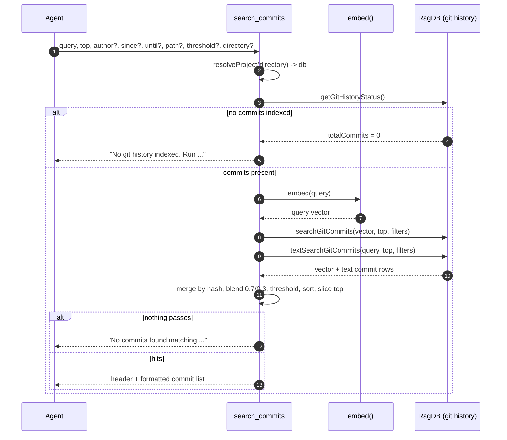

# Tool: search_commits

`search_commits` is semantic search over a project's git history. Instead of
grepping commit messages, an agent asks a question in plain language — "why did
we switch the embedding model", "when did we add the lock" — and gets back the
commits most relevant to it, ranked. It is the answer to "why was this code
written this way" when the reasoning lives in commit messages rather than the
code itself. It can also narrow by author, date range, and touched file path.

The tool reads from indexed commit rows; it does not run `git log`. The commits
must be ingested into the database first (see [cli/history](../cli/history.md)),
and the tool reports a clear hint when nothing is indexed yet.

## How it works

The handler is registered as the MCP tool `search_commits` in
`registerGitHistoryTools` (`src/tools/git-history-tools.ts:34-37`). After
resolving the project and database with `resolveProject`
(`src/tools/git-history-tools.ts:56`), it first checks how many commits are
indexed via `getGitHistoryStatus()`; if the count is zero it returns an
indexing hint and stops (`src/tools/git-history-tools.ts:58-66`).

When there is history, the query string is embedded
(`embed`, `src/embeddings/embed.ts:78-86`) and two retrievals run:

- A **vector search** over `vec_git_commits`, joined back to `git_commits`,
  scoring each row as `1 / (1 + distance)`
  (`searchGitCommits`, `src/db/git-history.ts:154-187`).
- A **keyword (BM25/FTS) search** over `fts_git_commits`, which indexes commit
  message and diff summary text, scoring as `1 / (1 + |rank|)`
  (`textSearchGitCommits`, `src/db/git-history.ts:189-225`).

The two lists are merged and deduplicated by commit hash. A commit found by
both is re-scored with a fixed blend `0.7 * vectorScore + 0.3 * textScore`; a
commit found only in the text list keeps `0.3 * textScore`
(`src/tools/git-history-tools.ts:75-88`). Results are then filtered by
`threshold`, sorted by score, and truncated to `top`
(`src/tools/git-history-tools.ts:90-93`).



1. The agent calls with a `query` and optional `top`, `author`, `since`,
   `until`, `path`, `threshold`, and `directory`
   (`src/tools/git-history-tools.ts:38-54`).
2. The project database is resolved (`src/tools/git-history-tools.ts:56`).
3. `getGitHistoryStatus()` returns the indexed commit count; a zero count
   short-circuits to the indexing hint
   (`src/tools/git-history-tools.ts:58-66`).
4. The query is embedded into a vector
   (`src/tools/git-history-tools.ts:68`).
5. The vector search and the FTS search each run with the same filters and an
   over-fetch limit, then apply the filters in code
   (`src/tools/git-history-tools.ts:71-72`, `src/db/git-history.ts:154-225`).
6. Results merge by commit hash; overlapping commits get the blended score,
   text-only commits get the weighted text score
   (`src/tools/git-history-tools.ts:75-88`).
7. The merged set is filtered by `threshold`, sorted descending, and cut to
   `top` (`src/tools/git-history-tools.ts:90-93`).
8. An empty result set yields a "No commits found" message; otherwise a header
   plus one formatted block per commit is returned
   (`src/tools/git-history-tools.ts:95-107`).

## Inputs

| name | type | required | description |
| --- | --- | --- | --- |
| `query` | string (≤2000 chars) | yes | Natural-language search query, embedded and matched against commit text (`src/tools/git-history-tools.ts:39`). |
| `top` | integer ≥ 1 | no | Maximum commits to return; defaults to 10 (`src/tools/git-history-tools.ts:40-41`). |
| `author` | string | no | Case-insensitive substring match against author name or email (`src/tools/git-history-tools.ts:42-43`, `src/db/git-history.ts:145-146`). |
| `since` | string (ISO date) | no | Keep only commits with `date >= since` (string comparison) (`src/tools/git-history-tools.ts:44-45`, `src/db/git-history.ts:147`). |
| `until` | string (ISO date) | no | Keep only commits with `date <= until` (`src/tools/git-history-tools.ts:46-47`, `src/db/git-history.ts:148`). |
| `path` | string | no | Keep only commits where some changed file path contains this substring (`src/tools/git-history-tools.ts:48-49`, `src/db/git-history.ts:149`). |
| `threshold` | number 0–1 | no | Minimum blended relevance score; defaults to 0 (no filtering) (`src/tools/git-history-tools.ts:50-51`, `src/tools/git-history-tools.ts:91`). |
| `directory` | string | no | Project directory; falls back to `RAG_PROJECT_DIR`, then cwd (`src/tools/git-history-tools.ts:52-53`). |

## Outputs

| output | where it lands / shape / description |
| --- | --- |
| Header | `## Results for "<query>" (<n> commits, <total> indexed)` where `<total>` is the indexed commit count (`src/tools/git-history-tools.ts:104`). |
| Ranked commits | One block per commit, each rendered by `formatCommitResult` (`src/tools/git-history-tools.ts:7-19`). Line 1: rank, **short hash**, score to 2 decimals, date (date portion only), `@author`, plus `[merge]` for merge commits and `(refs)` when refs exist. Line 2: first line of the message. Line 3: up to 5 changed file paths (`+N more` beyond that) and `(+insertions -deletions)`. |
| Empty-index hint | `No git history indexed. Run \`index_files()\` or \`mimirs history index\` first.` when nothing is indexed (`src/tools/git-history-tools.ts:60-65`). |
| No-match message | `No commits found matching "<query>"` (with `by <author>` appended when an author filter was set) when every candidate was filtered out (`src/tools/git-history-tools.ts:95-101`). |

The per-commit fields (`shortHash`, `score`, `date`, `authorName`, `isMerge`,
`refs`, `message`, `filesChanged`, `insertions`, `deletions`) come from the
`GitCommitSearchResult` rows produced by the database search functions
(`src/db/git-history.ts:160-186`).

## Scoring and the hybrid blend

| branch | score formula | source |
| --- | --- | --- |
| Vector only | `1 / (1 + distance)` | `src/db/git-history.ts:177-180` |
| Text (FTS) only | `0.3 * (1 / (1 + abs(rank)))` | `src/db/git-history.ts:211-214`, `src/tools/git-history-tools.ts:86` |
| Found by both | `0.7 * vectorScore + 0.3 * textScore` | `src/tools/git-history-tools.ts:84` |

The 70/30 weight is a constant in the handler, `HYBRID_WEIGHT = 0.7`
(`src/tools/git-history-tools.ts:76`); it is not the configurable
`hybridWeight` used by code search.

## Branches and failure cases

- **No history indexed.** A zero `totalCommits` from `getGitHistoryStatus()`
  returns the indexing hint and runs no search
  (`src/tools/git-history-tools.ts:58-66`).
- **No matches after filtering.** When merging and filtering leave an empty
  list, the no-match message is returned, naming the author filter when
  present (`src/tools/git-history-tools.ts:95-101`).
- **Filters set.** When any of `author`/`since`/`until`/`path` is provided,
  each search over-fetches `topK * 5` rows (instead of `topK * 2`) and applies
  the filters in code afterward, so a narrow filter still has candidates to
  fill `top` (`src/db/git-history.ts:163`, `src/db/git-history.ts:198`,
  `src/db/git-history.ts:137-152`).
- **Threshold.** Commits whose blended score is below `threshold` are dropped
  before sorting; with the default `0` nothing is dropped
  (`src/tools/git-history-tools.ts:91`).
- **Date comparison is lexical.** `since`/`until` compare the stored ISO
  `date` string directly, so they assume ISO-8601 input
  (`src/db/git-history.ts:147-148`).
- **Author / path matching is substring.** Both use `includes`, so a partial
  name or path fragment matches (`src/db/git-history.ts:145-149`).

## Example

Example arguments:

```json
{
  "query": "why did we add the index lock",
  "top": 5,
  "author": "winci",
  "since": "2026-01-01"
}
```

Illustrative output (values synthetic):

```
## Results for "why did we add the index lock" (2 commits, 412 indexed)

1. **<short-sha>** (0.82) — 2026-02-14 — @winci
   fix: guard concurrent indexing with a file lock
   Files: src/indexing/indexer.ts, src/server/index.ts (+64 -12)

2. **<short-sha>** (0.55) — 2026-02-10 — @winci [merge]
   Merge branch 'locking'
   Files: src/indexing/lock.ts +3 more (+120 -4)
```

## Key source files

- `src/tools/git-history-tools.ts` — the MCP handler: empty-index check,
  hybrid merge with the 0.7 weight, threshold, and commit formatting.
- `src/db/git-history.ts` — `searchGitCommits` (vector), `textSearchGitCommits`
  (FTS), `applyFilters`, and `getGitHistoryStatus`.
- `src/embeddings/embed.ts` — `embed` turns the query string into a vector.
- `src/db/index.ts` — `RagDB` wraps these git-history database operations.

## Related flows

- [file_history](file-history.md) — the sibling tool in the same file that
  lists commits touching one file, sorted by date rather than relevance.
- [cli/history](../cli/history.md) — indexes the commit rows this tool reads.
