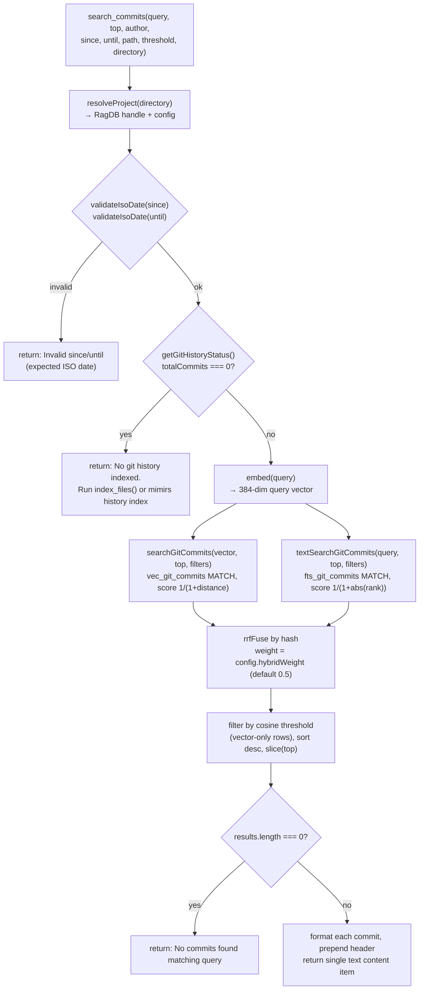

# Tool: search_commits

`search_commits` lets an agent search a project's git history by meaning rather
than by scrolling `git log`. It answers questions like "why was the
path-normalization logic added?", "when did we switch the embedding model?", or
"what has this author been working on lately?". The tool finds commits two ways
at once — by *meaning* (vector similarity over the indexed commit text) and by
*keyword* (full-text match on the commit message and diff summary) — fuses the
two by rank, applies author/date/path filters and a relevance threshold, and
returns the surviving commits ranked best-first.

The tool is registered on the MCP server by `registerGitHistoryTools`, which
declares the tool name, a description, and the argument schema, then wires up the
search handler (`src/tools/git-history-tools.ts:47-126`). It is read-only: it
queries the index and formats text, and never writes to the database.

Commit history must already be indexed for this tool to return anything. The
index is populated by the [`mimirs history index`](../cli/history.md) command,
which walks `git log --all`, embeds each commit, and writes rows into the index
database. If nothing has been indexed yet, the tool short-circuits with a message
telling the caller to index first (`src/tools/git-history-tools.ts:76-84`).

## What it does

When the handler runs it first validates the date filters, then checks whether
any commits are indexed at all. If so, it embeds the query into a single vector,
runs two independent searches over the stored commits — a vector (semantic)
search and a full-text search — then fuses the two result sets into one ranked
list by reciprocal-rank fusion, deduplicated by commit hash. It applies the
relevance threshold, sorts by the fused score, truncates to the requested count,
and renders each surviving commit into a short text block.



1. The client calls the tool with a `query` and optional `top`, `author`,
   `since`, `until`, `path`, `threshold`, and `directory`. The schema requires
   `query` to be at most 2000 characters and defaults `top` to 10 and `threshold`
   to 0 (`src/tools/git-history-tools.ts:51-67`).
2. `resolveProject` turns the optional `directory` into an absolute path, loads
   the project config, applies the embedding model settings, and hands back the
   `RagDB` handle and `config`. If the directory does not exist it throws before
   any search runs (`src/tools/index.ts:33-47`).
3. The `since` and `until` filters are validated against an ISO-date shape. A
   non-ISO value (for example `"yesterday"` or `"01/02/2025"`) would be compared
   lexically in SQL and silently filter everything out, so the handler rejects it
   at the boundary with a clear error instead (`src/tools/git-history-tools.ts:71-74`,
   `:9-18`).
4. The handler asks the database how many commits are indexed via
   `getGitHistoryStatus`. When the count is zero it returns a fixed "not indexed"
   message and stops — it never embeds the query or touches the search tables
   (`src/tools/git-history-tools.ts:76-84`).
5. The query string is embedded once. `embed` loads the shared
   sentence-transformer model and returns a single mean-pooled, L2-normalized
   `Float32Array` (`src/embeddings/embed.ts:274-282`).
6. The vector, the requested count, and the four filters are passed to
   `searchGitCommits`, which runs a nearest-neighbor search over the
   `vec_git_commits` virtual table, joins back to the commit rows, applies the
   filters, and scores each hit (`src/db/git-history.ts:155-188`).
7. The same count, raw query string, and filters are passed to
   `textSearchGitCommits`, which runs a full-text match over the
   `fts_git_commits` index and scores by FTS rank (`src/db/git-history.ts:190-226`).
8. The two lists are fused into one by `rrfFuse`, keyed by commit hash, using the
   project's configured `hybridWeight` (default 0.5)
   (`src/tools/git-history-tools.ts:103`).
9. The relevance threshold is applied to vector-only rows by comparing the true
   cosine of each vector match; the results are sorted by descending fused score
   and sliced to `top` (`src/tools/git-history-tools.ts:99-110`).
10. If nothing survives, a fixed "no commits found" message is returned, echoing
    the query and the author filter if one was given
    (`src/tools/git-history-tools.ts:112-119`).
11. Otherwise each commit is rendered into a text block and the joined text,
    prefixed with a results header, is returned as the tool's single content item
    (`src/tools/git-history-tools.ts:121-124`).

## Inputs

| Name | Type | Required | Description |
| --- | --- | --- | --- |
| `query` | string (≤ 2000 chars) | yes | What to search for. Used both as the text to embed for the vector search and, raw, as the keyword query for the full-text search (`src/tools/git-history-tools.ts:52`). |
| `top` | integer ≥ 1 | no (default 10) | Maximum number of commits to return. Also caps how many candidates each underlying search fetches (`src/tools/git-history-tools.ts:53-54`). |
| `author` | string | no | Case-insensitive substring match against the commit's author name *or* email (`src/tools/git-history-tools.ts:55-56`, `src/db/git-history.ts:146-147`). |
| `since` | string | no | ISO date string. Keeps only commits whose date is at or after this value, using a plain string comparison on the stored ISO date. Validated as ISO-shaped before use (`src/tools/git-history-tools.ts:57-58`, `:71`, `src/db/git-history.ts:148`). |
| `until` | string | no | ISO date string. Keeps only commits whose date is at or before this value. Also validated as ISO-shaped (`src/tools/git-history-tools.ts:59-60`, `:71`, `src/db/git-history.ts:149`). |
| `path` | string | no | Substring match against the paths a commit touched. A commit is kept if any of its changed-file paths contains this substring (`src/tools/git-history-tools.ts:61-62`, `src/db/git-history.ts:150`). |
| `threshold` | number 0–1 | no (default 0) | Minimum cosine relevance for vector-only hits. Defaults to 0, so by default nothing is dropped on score (`src/tools/git-history-tools.ts:63-64`, `:105-107`). |
| `directory` | string | no | Project directory whose commit index to search. Defaults to the `RAG_PROJECT_DIR` environment variable, then the current working directory (`src/tools/index.ts:38`). |

## Outputs

| Output | Where it lands / shape / description |
| --- | --- |
| Ranked commits | A single text content item. It opens with the header `## Results for "<query>" (<n> commits, <total> indexed)` and then one block per commit (`src/tools/git-history-tools.ts:121-124`). |
| Per-commit block | Three lines: rank, short hash, score to two decimals, the date portion of the commit timestamp, `@author`, an optional ` [merge]` tag and ` (refs)` list; then the first line of the commit message; then up to five changed file paths with a `+N more` overflow note and the total insertions/deletions (`src/tools/git-history-tools.ts:20-32`). |
| Empty-index message | When no commit is indexed: `No git history indexed. Run \`index_files()\` or \`mimirs history index\` first.` (`src/tools/git-history-tools.ts:78-83`). |
| Date-error message | When `since`/`until` is not ISO-shaped: `Invalid since: "<value>" — expected an ISO date like 2025-01-31 (optionally with time).` (`src/tools/git-history-tools.ts:13-17`, `:71-74`). |
| No-match message | When commits exist but none survive filtering and threshold: `No commits found matching "<query>"` plus ` by <author>` when an author filter was given (`src/tools/git-history-tools.ts:112-119`). |

This tool only reads. It does not write or modify any stored state, so there is
no state-change step in the flow.

## How the two searches work

Both searches read from `git_commits` (the commit metadata) and its companion
search tables, and both apply the same four filters and the same candidate
over-fetch strategy. They return the same `GitCommitSearchResult` shape — every
commit field plus a `score` (`src/db/types.ts:105-107`).

**Vector search.** `searchGitCommits` runs an inner query against the
`vec_git_commits` vec0 table that matches the query embedding and orders by
distance, then joins the matched commit ids back to their `git_commits` rows
(`src/db/git-history.ts:172-176`). Each result's `score` is `1 / (1 + distance)`,
mapping a smaller distance to a higher score (`src/db/git-history.ts:180`).

**Full-text search.** `textSearchGitCommits` matches the query against the
`fts_git_commits` FTS5 table — which indexes the commit `message` and
`diff_summary` columns — and orders by FTS5's built-in `rank`
(`src/db/git-history.ts:207-213`, `src/db/index.ts:523-528`). The query is first
run through `sanitizeFTS`, which splits on whitespace and wraps every token in
double quotes, joining them with `OR`, so that characters FTS5 would otherwise
treat as operators (`+`, `-`, `*`, `AND`, `OR`, `NOT`, `NEAR`, parentheses) are
matched literally instead of throwing a syntax error
(`src/search/usages.ts:39-43`). Its `score` is `1 / (1 + abs(rank))`; FTS5 ranks
are negative, so the absolute value turns the best (most negative) rank into the
highest score (`src/db/git-history.ts:218`).

**Filter-aware over-fetch.** Both functions ask the SQL layer for more rows than
`top` so the in-code filters have material to work with. When any of `author`,
`since`, `until`, or `path` is set they fetch `topK * 5` candidates; otherwise
`topK * 2` (`src/db/git-history.ts:164-165`, `:199-200`). The filters then run in
JavaScript over those candidates via `applyFilters`, and each function finally
slices its filtered list back down to `top`
(`src/db/git-history.ts:138-153`, `:183-187`, `:221-225`). Because the over-fetch
is bounded, a very narrow filter combined with a large indexed history can still
miss matching commits that ranked just outside the candidate window.

## Hybrid scoring and dedup

The two result lists are merged by `rrfFuse`, the single reciprocal-rank-fusion
helper used by every hybrid search in this project. Vector (cosine-derived) and
full-text (BM25-derived) scores live on different, non-comparable scales, so a
raw linear blend is dominated by whichever has the larger magnitude. Instead each
list contributes `K / (K + rank)` (with `K = 60`), a scale-free value in `(0, 1]`
that is 1 at the top of a list, and the two contributions are blended by the
configured weight toward the primary (vector) list
(`src/search/hybrid.ts:77-103`). Commits that appear in both lists are deduplicated
by hash, keeping the vector-list object as the representative
(`src/tools/git-history-tools.ts:103`).

The blend weight is the project's `config.hybridWeight`, which defaults to 0.5 —
equal weight to the semantic and keyword rank signals
(`src/config/index.ts:23`, `:141`). It is read from config, not hardcoded in the
handler, so a project can retune it. (The current `server_info` output prints the
effective value as `hybrid_weight`.)

The relevance threshold is applied after fusion but compares the *true cosine* of
the vector match, not the positional fused score. The handler precomputes the
cosine of every vector hit with `vectorScoreToCosine` and keeps a set of the
hashes that the full-text search matched
(`src/tools/git-history-tools.ts:99-101`). A row passes the filter when the
threshold is at or below 0, when it was a keyword hit (its own relevance signal),
or when its derived cosine meets the threshold; a vector hit whose cosine cannot
be derived is kept (`src/tools/git-history-tools.ts:104-108`). This keeps keyword
matches from being dropped by a vector-scale threshold, and keeps the default
threshold of 0 from discarding vector hits with a legitimately negative derived
cosine. The survivors are sorted by descending fused score and sliced to `top`
(`src/tools/git-history-tools.ts:109-110`).

## Branches and failure cases

| Branch | Behavior |
| --- | --- |
| Directory does not exist | `resolveProject` throws `Directory does not exist: <path>` before any search runs (`src/tools/index.ts:45-47`). |
| Non-ISO `since`/`until` | `validateIsoDate` returns an error message and the handler stops before embedding or searching (`src/tools/git-history-tools.ts:71-74`). |
| No commits indexed | `getGitHistoryStatus().totalCommits === 0` short-circuits with the "No git history indexed" message; the query is never embedded (`src/tools/git-history-tools.ts:76-84`). |
| Commits exist but none match | After fusion and threshold the result list is empty, so the "No commits found matching" message is returned (`src/tools/git-history-tools.ts:112-119`). |
| `author` filter | Kept only if the substring (lower-cased) appears in the author name or email (`src/db/git-history.ts:146-147`). |
| `since` / `until` filter | Kept only if the stored ISO date string compares `>= since` / `<= until`. This is a lexical string compare, which works because dates are stored as ISO strings (`src/db/git-history.ts:148-149`). |
| `path` filter | Kept only if some changed-file path string contains the substring; `filesChanged` is a flat array of path strings parsed from the stored `files_changed` JSON (`src/db/git-history.ts:150`, `:113`). |
| Any filter set | Both searches widen their candidate fetch to `topK * 5` to survive in-code filtering; with no filters they fetch `topK * 2` (`src/db/git-history.ts:164-165`, `:199-200`). |
| `threshold` above 0 | Vector-only hits below the cosine threshold are dropped; keyword hits are always kept (`src/tools/git-history-tools.ts:104-108`). |
| Commit with more than five changed files | The block lists the first five and appends ` +N more` (`src/tools/git-history-tools.ts:24-25`). |
| Merge commit / commit with refs | The header line gains a ` [merge]` tag and/or a ` (<ref>, <ref>)` list when those fields are populated (`src/tools/git-history-tools.ts:21-22`). |

Unlike the conversation search tool, this handler does not wrap the full-text
search in a try/catch; the token quoting done by `sanitizeFTS` is what keeps a
stray operator character in the query from making the FTS match throw
(`src/search/usages.ts:39-43`).

## What the index contains

This tool can only surface what the history indexer wrote. The indexer walks
`git log --all` and, for each commit, records the changed files with
`git diff-tree --numstat`. Two indexer details shape what `search_commits` and
the `path` filter can see (`src/git/indexer.ts:108-137`):

- It passes `--root` to `diff-tree`, so the very first (parentless) commit's
  files are recorded too. Without this, a file first introduced in the root
  commit would be invisible to history searches and to the `path` filter.
- It runs with `-c core.quotepath=false`, so a non-ASCII path such as `café.ts`
  is stored literally instead of octal-escaped and quoted. That keeps the stored
  `files_changed` paths matching what callers actually pass to the `path` filter.

The per-commit block's short hash is the first eight characters of the full hash,
set at index time (`src/git/indexer.ts:379`).

## Example

Example arguments:

```json
{
  "query": "why did we switch the embedding model dimension",
  "author": "alice",
  "since": "2025-01-01",
  "path": "src/embeddings",
  "top": 3,
  "threshold": 0.4
}
```

Illustrative output text (values synthetic):

```
## Results for "why did we switch the embedding model dimension" (2 commits, 412 indexed)

1. **a1b2c3d4** (0.81) — 2025-02-14 — @alice
   feat: configurable embedding model + dimension
   Files: src/embeddings/embed.ts, src/config/index.ts (+96 -12)

2. **9f8e7d6c** (0.52) — 2025-01-20 — @alice [merge]
   Merge branch 'embed-dim-guard'
   Files: src/db/index.ts, src/embeddings/embed.ts +3 more (+44 -8)
```

Each block opens with the rank, short hash, fused score, the date portion of the
commit timestamp, and the author; merge commits and commits with refs get extra
tags. The second line is the first line of the commit message, and the third
lists the changed files (first five, with a `+N more` overflow) and the
insertion/deletion totals (`src/tools/git-history-tools.ts:27-31`).

## Key source files

| File | Role |
| --- | --- |
| `src/tools/git-history-tools.ts` | Registers the `search_commits` MCP tool and runs the date validation → empty-index guard → embed → dual search → rank fusion → threshold → format sequence. |
| `src/db/git-history.ts` | `searchGitCommits` (vector) and `textSearchGitCommits` (full-text) query the commit tables, apply the author/date/path filters, and score results; `getGitHistoryStatus` powers the empty-index guard. |
| `src/search/hybrid.ts` | `rrfFuse` is the shared reciprocal-rank fusion that merges the two result lists by rank. |
| `src/db/search.ts` | `vectorScoreToCosine` converts the stored L2-derived vector score back to a true cosine for the threshold check. |
| `src/embeddings/embed.ts` | `embed` turns the query string into a single normalized vector. |
| `src/search/usages.ts` | `sanitizeFTS` quotes query tokens so FTS5 treats operator characters literally. |
| `src/git/indexer.ts` | Walks `git log --all`, records changed files with `--root` and `core.quotepath=false`, embeds each commit, and writes the rows this tool reads. |
| `src/db/index.ts` | Defines the `git_commits`, `vec_git_commits`, and `fts_git_commits` tables and exposes the `RagDB` wrapper methods the tool calls. |
| `src/config/index.ts` | Defines `hybridWeight` (default 0.5), the fusion weight the handler reads. |
| `src/tools/index.ts` | `resolveProject` resolves the directory, database handle, and config used by the tool. |

## Related flows

- The [`mimirs history index`](../cli/history.md) command populates the
  `git_commits`, `vec_git_commits`, and `fts_git_commits` tables this tool reads;
  run it (or `mimirs history status` to check) before searching.
- The [`file_history`](./file-history.md) tool, registered alongside this one in
  the same file, lists commits that touched a specific path in date order rather
  than by relevance (`src/tools/git-history-tools.ts:128-164`).
