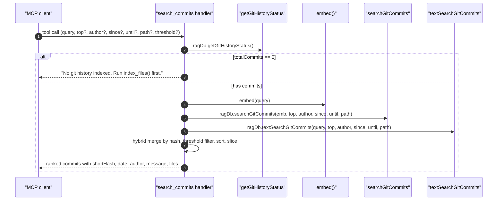

# Tool: search_commits

The `search_commits` MCP tool runs a semantic search over indexed git
commit messages and diff summaries. It is meant for "why was this code
changed?" or "what did this author work on?" questions where the commit
log carries the answer. The handler is at
`src/tools/git-history-tools.ts:34-109` and runs a hybrid vector + FTS
merge with a fixed `0.7` weight that favours the vector leg, then
optionally filters by author, date window, and file path.

The data this tool queries is written by the git history indexer, which
walks the repo with `git log` and inserts rows into `git_commits` plus
embeddings into `vec_git_commits`. If the index is empty, the tool
returns a hint pointing at `index_files` or `mimirs history index`.



1. The client calls `search_commits` with a query and any filters
   (`src/tools/git-history-tools.ts:38-54`).
2. The handler resolves the project DB and reads
   `ragDb.getGitHistoryStatus()` to confirm there are indexed commits
   (`src/tools/git-history-tools.ts:56-58`).
3. When `totalCommits` is `0`, it short-circuits with a hint telling the
   caller to run `index_files()` or `mimirs history index`
   (`src/tools/git-history-tools.ts:59-66`).
4. Otherwise it embeds the query and runs the vector leg via
   `searchGitCommits(emb, top, author, since, until, path)` against
   `vec_git_commits` (`src/tools/git-history-tools.ts:68-71`).
5. The BM25 leg runs `textSearchGitCommits(query, top, author, since,
   until, path)` against `fts_git_commits` (which indexes both `message`
   and `diff_summary`) (`src/tools/git-history-tools.ts:72`).
6. Results are merged in a `Map<hash, ...>`. Vector rows seed the map.
   Each text row either contributes to an existing entry as
   `0.7 * vec + 0.3 * txt`, or inserts a new entry with score
   `0.3 * txt` (vector-side score treated as 0)
   (`src/tools/git-history-tools.ts:74-88`).
7. The merged list is filtered by `threshold`, sorted by score
   descending, and sliced to `top`
   (`src/tools/git-history-tools.ts:90-93`).
8. Each surviving commit is rendered by `formatCommitResult` — a
   numbered entry with `shortHash`, score, ISO date (date portion
   only), `@authorName`, optional `[merge]` and ref tags, the message's
   first line, and the first five changed files plus `+N more` and
   diff stats (`src/tools/git-history-tools.ts:7-19`,
   `src/tools/git-history-tools.ts:104-107`).

## Inputs

- `query` — required string up to 2000 chars. Used for both the
  embedding and the FTS query
  (`src/tools/git-history-tools.ts:39`).
- `top` — optional positive integer, default `10`. Caps both the
  per-leg fetch and the final output
  (`src/tools/git-history-tools.ts:40-41`).
- `author` — optional case-insensitive substring match against author
  name or email, applied at the SQL layer
  (`src/tools/git-history-tools.ts:42-43`).
- `since` / `until` — optional ISO dates that bound `git_commits.date`
  on either side (`src/tools/git-history-tools.ts:44-47`).
- `path` — optional substring match against rows in
  `git_commit_files.file_path`; commits that touched a matching path
  are kept (`src/tools/git-history-tools.ts:48-49`).
- `threshold` — optional 0–1 minimum score, default `0`
  (`src/tools/git-history-tools.ts:50-51`).
- `directory` — optional project root override
  (`src/tools/git-history-tools.ts:52-53`).

## Outputs

- Text content with a header `## Results for "..." (N commits, M
  indexed)` followed by numbered blocks
  (`src/tools/git-history-tools.ts:104`).
- Each block uses the format defined in `formatCommitResult`:
  - Line 1: `1. **<shortHash>** (<score>) — <yyyy-mm-dd> —
    @<authorName>` plus `[merge]` and `(refs)` tags when applicable.
  - Line 2: first line of the commit message.
  - Line 3: `Files: a.ts, b.ts, ... +K more (+<insertions>
    -<deletions>)`. Only the first five files are listed
    (`src/tools/git-history-tools.ts:7-19`).
- No write side effects.

## Hybrid scoring with 0.7 weight

Unlike the codebase search, this tool uses a hard-coded
`HYBRID_WEIGHT = 0.7` rather than the config-driven `hybridWeight`
(`src/tools/git-history-tools.ts:76`). The reasoning is that commit
messages are often short, so BM25 carries less signal than it does for
full source files; favouring the vector leg keeps the ranking sensible
when the user's query has no exact word overlap with the message.

Each leg's score is normalised to 0–1 before the merge. The two
formulas applied are:

- Commit appears in both legs: `score = 0.7 * vecScore + 0.3 * txtScore`.
- Commit appears only in FTS: `score = 0.3 * txtScore` (vector score
  treated as 0).
- Commit appears only in the vector leg: keeps its `vecScore` as-is
  (the FTS branch is what does the rewrite)
  (`src/tools/git-history-tools.ts:78-88`).

## Empty-index hint

The status check at `src/tools/git-history-tools.ts:58-66` is the only
branch in this tool that explicitly tells the caller *how* to populate
the data: `index_files()` triggers the full indexing pipeline (which
includes history indexing when the config enables it), and
`mimirs history index` is the CLI that does only history. This is
intentional: a brand-new mimirs project will have an empty
`git_commits` table and an unhelpful "no results" message would be
misleading.

## Branches and failure cases

- Empty git index: short-circuit with the "Run `index_files()` ..."
  hint (`src/tools/git-history-tools.ts:59-66`).
- No matches after merge + threshold: returns "No commits found
  matching ..." with the query and optional author echoed back
  (`src/tools/git-history-tools.ts:95-102`).
- Filters are applied at the SQL layer (vector and FTS each), so the
  hybrid merge sees an already-filtered candidate set; a commit that
  matches the query but fails an author/date/path filter never enters
  the score map.

## Example

```json
{
  "query": "switch from local llama to sentence-transformers",
  "top": 5,
  "author": "alice",
  "since": "2025-01-01",
  "path": "src/embeddings"
}
```

Response shape (illustrative):

```
## Results for "switch from local llama to sentence-transformers" (3 commits, 412 indexed)

1. **<commit-sha>** (0.81) — 2025-03-14 — @alice
   feat: replace ollama embedder with all-minilm transformers backend
   Files: src/example/embed.ts, src/example/config.ts +1 more (+220 -84)

2. **<commit-sha>** (0.46) — 2025-03-21 — @alice
   fix: tokenizer init for non-bge models
   Files: src/example/embed.ts (+12 -3)
```

## Related flows

- `file_history` — exposed by the same `registerGitHistoryTools` entry
  point; returns commits that touched a specific file, sorted by date
  rather than by relevance (`src/tools/git-history-tools.ts:111-142`).
- `cli/history` — CLI counterpart for backfilling and inspecting the
  git history index.

## Key source files

- `src/tools/git-history-tools.ts` — handler, scoring constants, output
  format.
- `src/embeddings/embed.ts` — `embed(query)` used by the vector leg.
- `src/db/git-history.ts` — `searchGitCommits`, `textSearchGitCommits`,
  `getGitHistoryStatus` SQL.
- `src/db/index.ts` — `RagDB.searchGitCommits` /
  `RagDB.textSearchGitCommits` thin wrappers.
