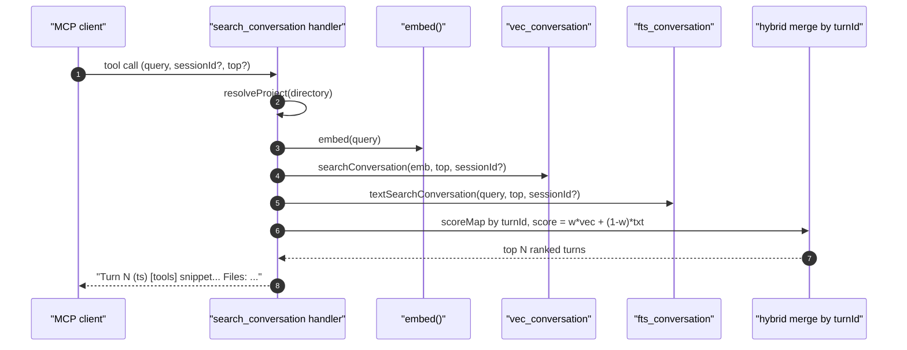

# Tool: search_conversation

The `search_conversation` MCP tool searches across past Claude Code
conversation turns that have been indexed into the project DB. It is the
"have we discussed this before?" tool — agents call it before
re-investigating a topic that may already have a decision attached to
it. The handler runs a hybrid vector + BM25 search over conversation
chunks and returns a small, ranked list of turns with their tool use
and referenced files surfaced.

The handler lives at `src/tools/conversation-tools.ts:8-87`. The data it
queries is written by the conversation tail worker, which the MCP
server starts at boot and which appends new turns to the
`conversation_turns` / `conversation_chunks` tables as the JSONL
transcript grows.



1. The client invokes `search_conversation` with a query, an optional
   `sessionId` scope, and an optional `top` (default `5`)
   (`src/tools/conversation-tools.ts:11-28`).
2. `resolveProject` opens the right project DB and surfaces the
   `hybridWeight` from config (`src/tools/conversation-tools.ts:30`,
   `src/tools/conversation-tools.ts:44`).
3. The query is embedded once with `embed(query)` and passed to
   `ragDb.searchConversation(embedding, top, sessionId)`, which runs the
   vector search over `vec_conversation`
   (`src/tools/conversation-tools.ts:33-34`).
4. `ragDb.textSearchConversation(query, top, sessionId)` runs the BM25
   leg over `fts_conversation`. The call is wrapped in a try/catch and
   falls back to vector-only on FTS error
   (`src/tools/conversation-tools.ts:36-41`).
5. Results from both legs are merged in a `Map<turnId, ...>`: vector
   rows seed the map, then BM25 rows either contribute their score to an
   existing entry or insert a new entry with vector score zero
   (`src/tools/conversation-tools.ts:45-57`).
6. Each entry's final score is `hybridWeight * vecScore + (1 -
   hybridWeight) * txtScore`. The map is sorted by score and sliced to
   `top` (`src/tools/conversation-tools.ts:59-62`).
7. Each turn is formatted as `Turn N (timestamp) [tool1, tool2]` with a
   snippet truncated to 200 chars and a `Files: ...` line listing the
   first five referenced files
   (`src/tools/conversation-tools.ts:73-81`).

## Inputs

- `query` — required string, 1 to 2000 chars
  (`src/tools/conversation-tools.ts:12`).
- `sessionId` — optional. When set, the SQL queries filter to that
  session only. Omit to search across every indexed session
  (`src/tools/conversation-tools.ts:17-20`).
- `top` — optional positive integer, default `5`
  (`src/tools/conversation-tools.ts:21-27`).
- `directory` — optional project root override
  (`src/tools/conversation-tools.ts:13-16`).

## Outputs

- Text content listing the ranked turns. Each block contains:
  - Header line: `Turn <turnIndex> (<timestamp>)` followed by a
    bracketed tool list when the turn invoked any tools
    (`src/tools/conversation-tools.ts:75`).
  - Snippet line: first 200 chars of the chunk that matched, with `...`
    appended (`src/tools/conversation-tools.ts:79`).
  - Optional `Files: ...` line listing the first five
    `filesReferenced` entries (`src/tools/conversation-tools.ts:76-78`).
- No write side effects: this tool does not call `db.logQuery`, so it
  is not visible in `search_analytics`.

## Hybrid scoring and FTS fallback

The merge formula is `hybridWeight * vec + (1 - hybridWeight) * txt`
applied to each turn that appears in either leg. When the FTS query
throws — typically because of unusual tokens in the query —
`bm25Results` stays empty and the formula collapses to vector-only
(`src/tools/conversation-tools.ts:36-41`). This mirrors the same
fallback pattern in the codebase-side `search` (`src/search/hybrid.ts:330-334`).

`hybridWeight` is sourced from the project config, so it tracks the
same dial as code search — there is no separate conversation-only
weight (`src/tools/conversation-tools.ts:44`).

## Where the turn data comes from

The conversation index is populated by a background tail worker that
the MCP server starts at boot. The worker watches the Claude Code
JSONL transcript for the current session, parses new lines into
`conversation_turns` + `conversation_chunks`, embeds each chunk, and
inserts the rows the search query later reads. This means the tool
only returns content that the tail has already absorbed; a turn the
client just sent will appear once the tail flushes (debounced by 1.5
seconds in the indexer). The CLI command `mimirs conversation index`
can be used to backfill sessions whose JSONL exists on disk but has
never been tailed.

## Branches and failure cases

- Empty result: returns "No conversation results found. The conversation
  may not be indexed yet." This happens when the index has zero rows for
  the requested session, or when both retrieval legs return no rows
  (`src/tools/conversation-tools.ts:64-71`).
- FTS failure: debug-logged and ignored; vector-only ranking still
  works (`src/tools/conversation-tools.ts:36-41`).
- Session-scoped search with no matches: the message is identical to
  the global empty case — there is no diagnostic about whether the
  `sessionId` was even known to the index.

## Example

```json
{
  "query": "decision about hybrid weight default",
  "top": 3
}
```

Response shape (illustrative):

```
Turn 42 (2026-04-12T11:08:00Z) [search, read_relevant]
  We agreed the default hybridWeight should stay at 0.5 because BM25 is too brittle...
  Files: src/config/index.ts, src/search/hybrid.ts

Turn 17 (2026-04-09T18:11:00Z)
  Re-read the eval suite — top-1 drops above weight 0.7 on the doc-heavy queries...
```

## Related flows

- `server/start` — boots the conversation tail that populates the data
  this tool reads.
- `cli/conversation` — CLI counterpart for indexing and searching
  conversation history offline.

## Key source files

- `src/tools/conversation-tools.ts` — handler, merge, formatting.
- `src/embeddings/embed.ts` — `embed(query)` used by the vector leg.
- `src/db/conversation.ts` — `searchConversation` and
  `textSearchConversation` queries against the conversation tables.
- `src/db/index.ts` — `RagDB.searchConversation` /
  `RagDB.textSearchConversation` thin wrappers.
