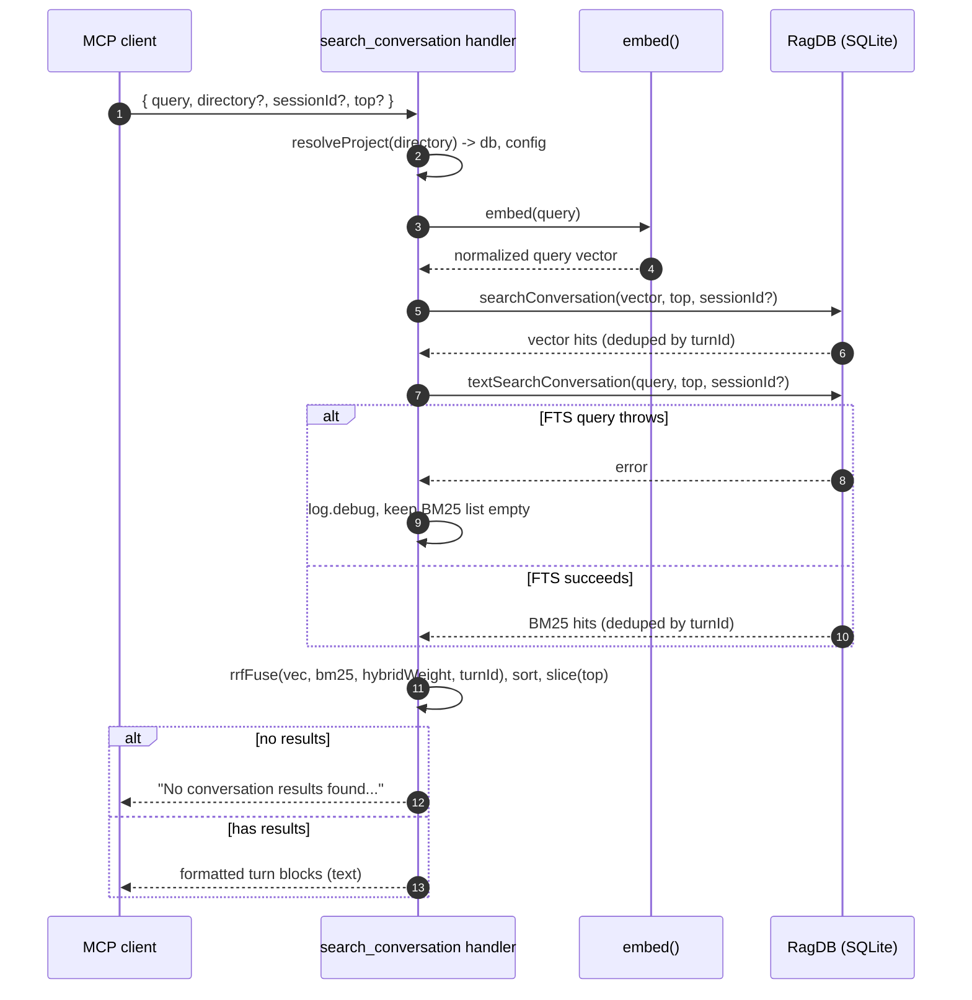

# Tool: search_conversation

`search_conversation` lets an agent search the indexed history of past Claude
Code sessions for this project. It answers questions like "did we already decide
how to handle path normalization?" or "what did the last session do to the
embedding cache?" without re-reading raw transcript files. The tool finds
relevant *turns* — a user message paired with the assistant's reply — by meaning
and by keyword, and returns each one with its timestamp, the tools that turn
used, and the files it touched.

The tool is registered on the MCP server by `registerConversationTools`, which
declares the tool name, its one-line description, and its argument schema, then
wires up the search handler (`src/tools/conversation-tools.ts:8-73`). Turns must
already be indexed for this to return anything; indexing happens elsewhere (see
the [conversation CLI command](../cli/conversation.md) and the
[server start](../server/start.md) flow that can index history in the
background).

## What it does

When the handler runs it embeds the query into a vector, runs two independent
searches over the stored turn snippets — a vector (semantic) search and a BM25
full-text search — then fuses the two ranked lists into one by **reciprocal-rank
fusion**, deduplicated so each turn appears at most once. Each surviving turn is
formatted into a short text block and returned to the caller. The flow reads
only; it never writes to the database.



1. The client calls the tool with a `query` and optional `directory`,
   `sessionId`, and `top`. The schema requires `query` to be 1–2000 characters
   and defaults `top` to 5 (`src/tools/conversation-tools.ts:13-28`).
2. `resolveProject` turns the optional `directory` into an absolute path, loads
   the project config, applies the embedding-model settings, and hands back the
   `RagDB` handle and config. If the resolved directory does not exist it throws
   before any search runs (`src/tools/index.ts:22-37`).
3. The query string is embedded once. `embed` runs the configured
   sentence-transformer model with normalization on and returns a single
   `Float32Array` whose length is the project's configured embedding dimension
   (`src/embeddings/embed.ts:95-103`).
4. The vector goes to `searchConversation`, a nearest-neighbor search over the
   `vec_conversation` virtual table joined back to chunk and turn data
   (`src/db/conversation.ts:126-182`).
5. The vector search returns turns already deduplicated by turn id, each carrying
   a similarity score.
6. The original (unembedded) query string goes to `textSearchConversation` for a
   keyword search over the `fts_conversation` FTS5 index
   (`src/db/conversation.ts:184-241`).
7. If the full-text query throws — for example because a token tripped FTS5
   syntax — the error is caught, logged at debug level on the `conversation`
   channel, and the BM25 list stays empty so the tool proceeds with vector hits
   only (`src/tools/conversation-tools.ts:37-42`).
8. Otherwise BM25 returns its own deduplicated turns with rank-based scores.
9. The two lists are fused by `rrfFuse` keyed on `turnId`, each fused turn gets a
   rank-based score, and the result is sorted descending and truncated to `top`
   (`src/tools/conversation-tools.ts:44-47`).
10. If nothing matched, a fixed "not indexed yet" message is returned
    (`src/tools/conversation-tools.ts:49-56`).
11. Otherwise each turn is rendered into a text block and the joined text is
    returned as the tool's single content item (`src/tools/conversation-tools.ts:58-70`).

## Inputs

| Name | Type | Required | Description |
| --- | --- | --- | --- |
| `query` | string (1–2000 chars) | yes | What to search for. Used both as the text to embed for vector search and, raw, as the keyword query for BM25 (`src/tools/conversation-tools.ts:13`). |
| `directory` | string | no | Project directory whose conversation index to search. Defaults to the `RAG_PROJECT_DIR` environment variable, then the current working directory (`src/tools/index.ts:26`). |
| `sessionId` | string | no | Restrict results to a single session. Omit to search across every indexed session (`src/tools/conversation-tools.ts:18-21`). |
| `top` | integer ≥ 1 | no | Maximum number of turns to return. Defaults to 5 (`src/tools/conversation-tools.ts:22-28`). |

## Outputs

| Output | Where it lands / shape / description |
| --- | --- |
| Ranked conversation turns | A single text content item. Each turn renders as `Turn <turnIndex> (<timestamp>) [<tools>]`, then the first 200 characters of the snippet, then — if present — up to 5 referenced file paths (`src/tools/conversation-tools.ts:58-70`). |
| Empty-result message | When no turn matches, the text is `No conversation results found. The conversation may not be indexed yet.` (`src/tools/conversation-tools.ts:49-56`). |

The tool does not write or modify any stored state, so there is no state-change
section — this flow leaves the database untouched.

## How the two searches work

Both searches operate on `conversation_chunks` — the snippet rows produced when a
turn was indexed — and join up to `conversation_turns` for the display metadata.
The schema defines `conversation_turns`, `conversation_chunks`, the
`vec_conversation` vec0 table, and the `fts_conversation` FTS5 table, the last
kept in sync with the chunk rows by insert/delete/update triggers
(`src/db/index.ts:278-321`). Both query functions return the same
`ConversationSearchResult` shape — `turnId`, `turnIndex`, `sessionId`,
`timestamp`, `summary`, `snippet`, `toolsUsed`, `filesReferenced`, and `score`
(`src/db/types.ts:103-113`).

**Vector search.** `searchConversation` runs an inner query against the
`vec_conversation` table that matches the query embedding and orders by distance,
then joins the matched chunk ids to their snippets and parent turns
(`src/db/conversation.ts:149-155`). It intentionally over-fetches candidate
chunks: `topK * 10` rows when a `sessionId` is given, `topK * 3` otherwise. The
larger multiplier under a session scope compensates for rows that will be dropped
by the in-code session filter, since the vector index itself is not partitioned
by session. As rows stream back, the function keeps a `seenTurns` set and skips
any chunk whose turn was already emitted, so a single turn never appears twice
even when several of its chunks match; it stops once `topK` turns are collected
(`src/db/conversation.ts:157-181`). Each result's `score` is `1 / (1 + distance)`,
mapping a smaller distance to a higher score (`src/db/conversation.ts:175`).

**Full-text (BM25) search.** `textSearchConversation` matches the query against
the `fts_conversation` table and orders by FTS5's built-in `rank`
(`src/db/conversation.ts:205-214`). The query is first run through `sanitizeFTS`,
which splits on whitespace and wraps every token in double quotes joined by `OR`,
so characters FTS5 would treat as operators (`+`, `-`, `*`, `AND`, `OR`, `NOT`,
`NEAR`, parentheses) are matched literally instead of throwing a syntax error
(`src/search/usages.ts:39-43`). It applies the same `topK * 10` / `topK * 3`
over-fetch, the same per-turn deduplication, and the same session filter. Its
`score` is `1 / (1 + abs(rank))`; FTS5 ranks are negative, so the absolute value
turns the best (most negative) rank into the highest score
(`src/db/conversation.ts:234`).

When parsing rows, both functions default a missing `summary` to an empty string
and parse the JSON columns `tools_used` and `files_referenced` back into string
arrays, defaulting to `[]` when null (`src/db/conversation.ts:171-174`).

## Hybrid ranking and dedup

The handler does **not** add the two raw scores together. The vector score (a
cosine-distance transform) and the BM25 score (a rank transform) live on
different, non-comparable scales, so a plain weighted sum would be dominated by
whichever number happens to be larger and the weight would barely matter. Instead
the handler hands both lists to `rrfFuse`, the single shared rank-fusion helper
used by both chunk search and conversation search
(`src/tools/conversation-tools.ts:45`, `src/search/hybrid.ts:77-103`).

`rrfFuse` ignores the incoming numeric scores and uses only each item's *position*
in its list. For an item at rank `i` (zero-based) in a list, its contribution is
`K / (K + i)` with `K = 60` — that is `1.0` at the top of a list and decays
gently for lower ranks (`src/search/hybrid.ts:83-88`). The two contributions are
blended toward the primary (vector) list by the project's `hybridWeight`:

```
score = hybridWeight * vectorRankScore + (1 - hybridWeight) * bm25RankScore
```

A turn missing from one list contributes `0` from that side, so a strong
keyword-only or vector-only hit can still rank (`src/search/hybrid.ts:101`).
`hybridWeight` defaults to `0.5` — equal weight to the semantic and lexical rank
signals — unless the project overrides it
(`src/config/index.ts:23`, `src/config/index.ts:124`).

Deduplication happens in `rrfFuse` itself: it builds one map keyed by the value
the handler's key function returns, here `r.turnId`
(`src/tools/conversation-tools.ts:45`, `src/search/hybrid.ts:92-97`). The first
list's entry wins the map slot, and a turn appearing in both lists collapses to a
single entry that sums both rank contributions. Because the two upstream searches
already dedupe by turn and the fusion key is `turnId`, the final list contains
each turn exactly once. The handler then sorts the fused entries by the blended
score and slices down to `top` (`src/tools/conversation-tools.ts:46-47`).

## Branches and failure cases

| Branch | Behavior |
| --- | --- |
| Directory does not exist | `resolveProject` throws `Directory does not exist: <path>` before any search runs (`src/tools/index.ts:29-31`). |
| FTS query fails | The exception is caught, logged via `log.debug` on the `conversation` channel, and the BM25 list stays empty. The tool returns vector-only results (`src/tools/conversation-tools.ts:37-42`). |
| `sessionId` provided | Both searches over-fetch `topK * 10` candidates and drop any whose `session_id` does not match the requested session (`src/db/conversation.ts:155`, `src/db/conversation.ts:164`). |
| `sessionId` omitted | Both searches over-fetch `topK * 3` candidates and skip the session filter, searching across all sessions (`src/db/conversation.ts:155`, `src/db/conversation.ts:223`). |
| No matches | Returns the fixed `No conversation results found. The conversation may not be indexed yet.` message (`src/tools/conversation-tools.ts:49-56`). |
| Turn missing `summary`, `tools_used`, or `files_referenced` | Defaults are applied: empty summary string, and `[]` parsed for the JSON array columns (`src/db/conversation.ts:171-174`). |
| Turn has no tools or no files | The `[<tools>]` segment and the `Files:` line are omitted from that turn's text block (`src/tools/conversation-tools.ts:60-63`). |

A subtle consequence of the FTS fallback: if the full-text index is genuinely
broken, the tool still works in vector-only mode. With no BM25 list, every turn's
fused score is just `hybridWeight` times its vector rank contribution, so results
are still ranked sensibly — just without keyword reinforcement.

## Example

Example arguments:

```json
{
  "query": "how do we normalize windows path separators",
  "sessionId": "session-2024-...",
  "top": 3
}
```

Illustrative output text (values synthetic):

```
Turn 12 (2024-01-01T10:15:00Z) [search, read_relevant]
  Decided to normalize all path separators to forward slash before storing in
  the chunk index so Windows and POSIX entries collide on the same key...
  Files: src/db/files.ts, src/search/hybrid.ts

Turn 9 (2024-01-01T09:58:00Z) [usages]
  Found three call sites that joined paths with the platform separator...
  Files: src/db/index.ts
```

Each block starts with the turn index and timestamp, lists the tools used in
brackets when present, shows the first 200 characters of the matched snippet, and
ends with up to five referenced files.

## Key source files

| File | Role |
| --- | --- |
| `src/tools/conversation-tools.ts` | Registers the `search_conversation` MCP tool and runs the embed, dual-search, rank-fusion, and format steps. |
| `src/db/conversation.ts` | `searchConversation` (vector) and `textSearchConversation` (BM25) query the conversation tables, dedupe by turn, and score results. |
| `src/search/hybrid.ts` | `rrfFuse` performs the reciprocal-rank fusion and turn-id dedup shared with chunk search. |
| `src/embeddings/embed.ts` | `embed` turns the query string into a single normalized vector. |
| `src/tools/index.ts` | `resolveProject` resolves the directory, database handle, and config used by the tool. |
| `src/search/usages.ts` | `sanitizeFTS` quotes query tokens so FTS5 treats operator characters literally (`src/search/usages.ts:39-43`). |
| `src/config/index.ts` | Defines `hybridWeight` (default `0.5`), the blend factor passed to `rrfFuse` (`src/config/index.ts:23`, `src/config/index.ts:124`). |
| `src/db/index.ts` | Defines the `conversation_*`, `vec_conversation`, and `fts_conversation` tables and exposes the `RagDB` wrapper methods the tool calls. |

## Related flows

- The [conversation CLI command](../cli/conversation.md) runs the same vector and
  text searches from the terminal and indexes session transcripts.
- The [server start](../server/start.md) flow registers this tool and can index
  conversation history in the background so results are available.
