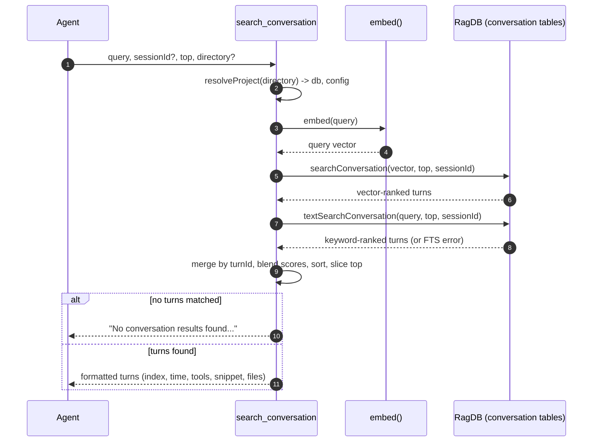

# Tool: search_conversation

`search_conversation` lets an agent search its own past Claude Code
conversations — earlier user requests, assistant replies, and the tool
calls that happened inside them. It answers questions like "did we already
decide how to handle X?" or "which files did we touch when we discussed Y?"
without re-deriving the answer from scratch. It is the read side of the
conversation store; the write side is the live conversation tail that runs
inside `mimirs serve` (see [server/start](../server/start.md)).

The tool reads the same `conversation_turns` / `conversation_chunks` tables
that the server fills while it watches your session's JSONL transcript, so
results are only as fresh as what has already been indexed.

## How it works

The handler is registered as the MCP tool `search_conversation` in
`registerConversationTools` (`src/tools/conversation-tools.ts:8`). On each
call it resolves the project directory and opens that project's database via
`resolveProject` (`src/tools/index.ts:21-37`), then runs a hybrid search that
blends semantic similarity with keyword matching.

Two independent retrievals run against the conversation tables:

- A **vector search**. The query string is embedded with the same model used
  for indexing (`embed`, `src/embeddings/embed.ts:78-86`) and the resulting
  vector is matched against `vec_conversation`, joined back to the turn rows
  (`searchConversation`, `src/db/conversation.ts:126-182`).
- A **keyword (BM25) search** over the FTS index `fts_conversation`
  (`textSearchConversation`, `src/db/conversation.ts:184-241`).

The two result lists are merged and deduplicated by turn id, then each turn's
final score is a weighted blend of its vector score and its text score:
`hybridWeight * vecScore + (1 - hybridWeight) * txtScore`
(`src/tools/conversation-tools.ts:59-62`). `hybridWeight` comes from project
config and defaults to `0.7`, i.e. 70% semantic / 30% keyword
(`src/config/index.ts:23`). Turns are then sorted by blended score and the
top `top` are formatted into a text block.



1. The agent calls the tool with a natural-language `query`, an optional
   `sessionId` filter, a `top` count (default 5), and an optional `directory`
   (`src/tools/conversation-tools.ts:11-28`).
2. `resolveProject` turns `directory` (or `RAG_PROJECT_DIR` / cwd) into an
   absolute path, loads that project's config, applies the embedding model
   settings, and returns the project's `RagDB` handle
   (`src/tools/index.ts:21-37`).
3. The query text is embedded into a single vector with mean pooling and L2
   normalization (`src/embeddings/embed.ts:78-86`).
4. The vector is matched against `vec_conversation` and joined to turn data;
   results are deduplicated by turn so each turn appears once
   (`src/db/conversation.ts:149-179`).
5. A keyword search over `fts_conversation` runs; if it throws, the error is
   logged and the keyword list is left empty
   (`src/tools/conversation-tools.ts:36-41`).
6. The two lists are merged into a per-turn score map and re-scored with the
   hybrid weight, sorted descending, and truncated to `top`
   (`src/tools/conversation-tools.ts:43-62`).
7. With no surviving turns, a fixed empty-state message is returned
   (`src/tools/conversation-tools.ts:64-71`).
8. Otherwise each turn is rendered as a header line plus a truncated snippet
   and optional file list (`src/tools/conversation-tools.ts:73-85`).

## Inputs

| name | type | required | description |
| --- | --- | --- | --- |
| `query` | string (1–2000 chars) | yes | Natural-language text to search for across conversation history (`src/tools/conversation-tools.ts:12`). |
| `directory` | string | no | Project directory to search. Falls back to `RAG_PROJECT_DIR`, then cwd (`src/tools/conversation-tools.ts:13-16`). |
| `sessionId` | string | no | Restrict results to one session. Omit to search every indexed session (`src/tools/conversation-tools.ts:17-20`). |
| `top` | integer ≥ 1 | no | Number of turns to return; defaults to 5 (`src/tools/conversation-tools.ts:21-27`). |

## Outputs

| output | where it lands / shape / description |
| --- | --- |
| Ranked turns | A single text block in the MCP response. Each turn is one entry: `Turn <index> (<timestamp>) [tool1, tool2]`, then a snippet truncated to 200 characters with a trailing `...`, then an optional `Files: a, b, ...` line listing up to 5 referenced files (`src/tools/conversation-tools.ts:73-85`). |
| Empty-state message | When nothing matched: `No conversation results found. The conversation may not be indexed yet.` (`src/tools/conversation-tools.ts:64-71`). |

Each turn carries the fields read from the join: `turnIndex`, `timestamp`,
`toolsUsed`, `filesReferenced`, and `snippet`. The `toolsUsed` and
`filesReferenced` arrays are parsed from JSON columns on the turn row, so a
turn with no tools or files simply omits those fragments
(`src/db/conversation.ts:166-176`, `src/tools/conversation-tools.ts:75-78`).

## Where the turn data comes from

This tool never indexes anything; it only reads. The rows it searches are
written by the conversation indexer that the server starts. When
`mimirs serve` boots, it discovers your Claude Code sessions, tails the most
recent one, and back-indexes older un-indexed sessions in the background; the
tail watches the JSONL transcript and, after a debounce, indexes new turns
from a saved byte offset into `conversation_turns`, `conversation_chunks`,
and `vec_conversation` (see [server/start](../server/start.md) and
[cli/conversation](../cli/conversation.md)). If the server has not indexed a
session yet, this tool returns the empty-state message.

## Branches and failure cases

- **Keyword search fails, vector still works.** If
  `textSearchConversation` throws (for example a malformed FTS expression),
  the error is logged at debug level and the keyword list stays empty, so the
  blend degrades to vector-only scoring rather than failing the call
  (`src/tools/conversation-tools.ts:37-41`).
- **Nothing indexed / no matches.** When both retrievals come back empty, or
  when a `sessionId` filter excludes every candidate, the score map is empty
  and the fixed "No conversation results found" message is returned
  (`src/tools/conversation-tools.ts:64-71`).
- **Session filter.** When `sessionId` is set, both retrievals over-fetch
  (`topK * 10` candidate rows instead of `topK * 3`) and then drop any row
  whose `session_id` does not match, so a tight filter still has enough
  candidates to fill `top` results (`src/db/conversation.ts:155`,
  `src/db/conversation.ts:164`, `src/db/conversation.ts:214`,
  `src/db/conversation.ts:223`).
- **Turn deduplication.** A single turn can produce several chunks, so each
  retrieval keeps a `seenTurns` set and emits a turn only once, stopping once
  `topK` distinct turns are collected (`src/db/conversation.ts:157-179`,
  `src/db/conversation.ts:216-238`).
- **Empty `query`.** Rejected by the schema before the handler runs; `query`
  must be at least one character (`src/tools/conversation-tools.ts:12`).
- **Missing directory.** If the resolved directory does not exist,
  `resolveProject` throws before any search runs
  (`src/tools/index.ts:28-30`).

## Scoring details

The vector branch turns SQLite-vec distance into a similarity with
`1 / (1 + distance)` (`src/db/conversation.ts:175`). The keyword branch turns
the FTS `rank` into a comparable score with `1 / (1 + |rank|)`
(`src/db/conversation.ts:234`). Because both land in a `0..1`-ish range, the
hybrid blend in the handler can weight them directly without further
normalization.

## Example

Example arguments:

```json
{
  "query": "why did we switch the embedding model",
  "top": 3,
  "sessionId": "abc123-session-uuid"
}
```

Illustrative response text (values synthetic):

```
Turn 42 (2026-05-20T14:03:00Z) [Read, Edit]
  We decided to move to the smaller model because indexing latency on large...
  Files: src/embeddings/embed.ts, src/config/index.ts

Turn 51 (2026-05-20T14:18:00Z) [Bash]
  Benchmarked both models; the quality drop was within noise so we kept...
```

## Key source files

- `src/tools/conversation-tools.ts` — the MCP tool handler: hybrid merge,
  scoring, empty-state, and output formatting.
- `src/db/conversation.ts` — `searchConversation` (vector) and
  `textSearchConversation` (keyword) over the conversation tables.
- `src/embeddings/embed.ts` — `embed` turns the query string into a vector.
- `src/db/index.ts` — `RagDB` wraps the database and exposes the two
  conversation search methods used here.

## Related flows

- [server/start](../server/start.md) — starts the conversation tail that
  writes the turn rows this tool reads.
- [cli/conversation](../cli/conversation.md) — the CLI counterpart for
  indexing and searching conversation history outside the server.
