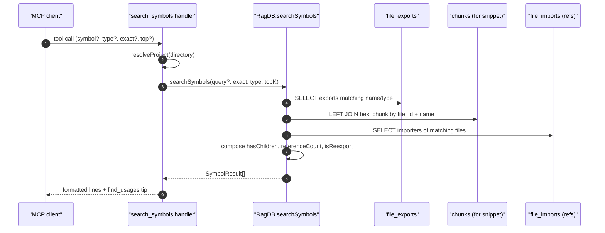

# Tool: search_symbols

The `search_symbols` MCP tool looks up exported symbols by name against
the pre-built `file_exports` table. Unlike `search`, it is not semantic:
it walks the symbol index and returns the matching definitions plus
enrichment data — child count for a class, importer module count for a
re-export, and a flag noting whether the row is a re-export. Agents use
it when they already know the name of a function, class, type, or enum
and want to jump to where it is declared.

When `symbol` is omitted, it switches to "list all exports" mode, which
is useful for browsing exported APIs by `type`. The handler is at
`src/tools/search.ts:218-274` and delegates to `searchSymbols` in
`src/db/search.ts`.



1. The client calls `search_symbols` with an optional symbol name, type
   filter, exact-match flag, and a row cap (`src/tools/search.ts:222-245`).
2. `resolveProject` opens the right project DB
   (`src/tools/search.ts:247`).
3. `ragDb.searchSymbols(symbol, exact ?? false, type, top)` runs against
   `file_exports`. When `symbol` is missing, the function takes the
   "listing" branch with a default cap of 200; when present, the default
   cap is 20 (`src/tools/search.ts:249`,
   `src/db/search.ts` — `isListing = !query`).
4. The query pulls the matching `file_exports` rows together with their
   `path`, `name`, `type`, and `is_reexport` flag, then joins to `chunks`
   on `(file_id, lower(entity_name))` to pick up a snippet for the result
   (`src/db/search.ts:357-406`).
5. A second pass aggregates `file_imports` to count distinct importer
   files and distinct importer module dirs (basename of each importer's
   parent directory) (`src/db/search.ts:357-406`).
6. Each row is returned with `hasChildren`, `childCount`,
   `referenceCount`, `referenceModuleCount`, `referenceModules`, and
   `isReexport` populated.
7. The handler prints `path  •  symbolName (type, N children, M refs / K
   modules, re-export)` for each result and truncates the snippet to 300
   characters (`src/tools/search.ts:258-267`).
8. The footer suggests `find_usages("<topSymbol>")` for follow-up
   exploration (`src/tools/search.ts:269-270`).

## Inputs

- `symbol` — optional name (1–200 chars). Omit to switch to listing mode
  (`src/tools/search.ts:222-226`).
- `exact` — optional boolean. Defaults to `false`, i.e. substring match
  on the lowercased name (`src/tools/search.ts:227-230`,
  `src/tools/search.ts:249`).
- `type` — optional enum:
  `function | class | interface | type | enum | export`. Filters the
  result set by `file_exports.type` (`src/tools/search.ts:231-234`).
- `top` — optional positive integer. Defaults vary by mode: 20 when
  searching, 200 when listing (`src/tools/search.ts:239-244`,
  default applied inside `searchSymbols`).
- `directory` — optional project root override
  (`src/tools/search.ts:235-238`).

## Outputs

- Text content with one block per symbol:
  `path  •  name (type, N children, M refs, K modules, re-export?)`
  optionally followed by a 300-char snippet of the defining chunk
  (`src/tools/search.ts:258-267`).
- A trailing tip pointing at `find_usages` with the top symbol pre-filled
  (`src/tools/search.ts:269-270`).
- No side effects on the DB: this is a pure read path.

## Enrichment fields

- `hasChildren` / `childCount` — set when the joined chunk has child
  chunks in the parent-id index. For a class export, this signals that
  it has methods you can drill into (`src/db/search.ts:357-406`).
- `referenceCount` — number of distinct importer **files**, computed
  from `file_imports.resolved_file_id` matching the symbol's defining
  file (`src/db/search.ts:357-406`).
- `referenceModuleCount` / `referenceModules` — distinct importer
  directories (parent of importer file), useful for spotting symbols
  imported by many subsystems vs by a single subsystem.
- `isReexport` — true when the row in `file_exports` has
  `is_reexport = 1`; the symbol is re-exported from another file, not
  defined locally (`src/db/search.ts:357-406`).

## Branches and failure cases

- No matches: returns "No exported symbols ..." with the search
  filter description (`src/tools/search.ts:251-256`).
- Listing mode (`symbol` omitted): pages of up to `top ?? 200` symbols,
  optionally filtered by `type`. The "no results" line drops the
  `matching "..."` phrase when only `type` is set
  (`src/tools/search.ts:251-256`).
- Substring vs exact: with `exact: false`, the SQL uses a
  `lower(name) LIKE '%query%'`-style filter, so very short queries can
  match a lot of rows; the `top` cap protects the output.

## Example

```json
{
  "symbol": "indexFile",
  "exact": false,
  "type": "function",
  "top": 5
}
```

Response shape (illustrative):

```
src/example.ts  •  indexFile (function, 12 refs, 4 modules)
export async function indexFile(path: string, db: RagDB) { ... }

---

src/cli/example.ts  •  indexFiles (function, 3 refs, 2 modules)
...

── Tip: call find_usages("indexFile") to see all call sites, or read_relevant("indexFile") for full context. ──
```

Listing all `enum` exports:

```json
{ "type": "enum", "top": 20 }
```

## Related flows

- `find_usages` — same `symbol_refs` substrate, but returns call sites
  instead of definitions.
- `search` — semantic search; use when you don't know the symbol name
  yet.

## Key source files

- `src/tools/search.ts` — handler, schema, output formatting.
- `src/db/search.ts` — `searchSymbols` query, enrichment composition.
- `src/db/index.ts` — `RagDB.searchSymbols` thin wrapper.
