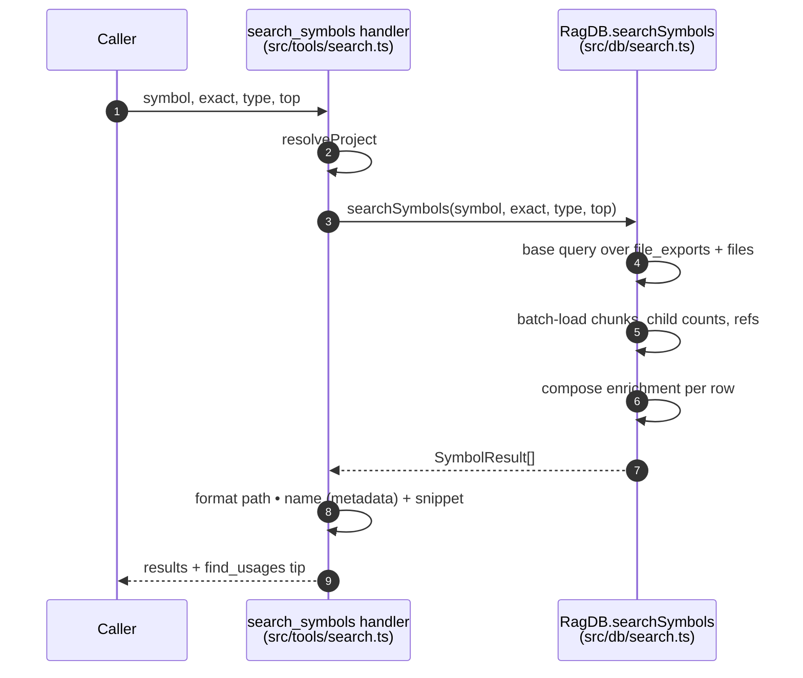

# Tool: search_symbols

The `search_symbols` MCP tool finds where a named symbol — a function, class, interface, type, or enum — is defined, by name rather than by meaning. When you already know the identifier you are after, this is faster and more precise than semantic search: it looks the name up directly in the persisted export index instead of embedding a query. It can also list every export in the project when you give it no name at all.

The handler is registered in `src/tools/search.ts:218-274`. The lookup itself runs in `searchSymbols` in `src/db/search.ts:237-406`.

## When to use it

Use `search_symbols` when you know the symbol name and want its definition location. Compare it with the neighbouring tools:

| tool | answers | matched by |
| --- | --- | --- |
| `search_symbols` | "where is `RagDB` defined?" | exact or substring of the export name |
| [search](search.md) | "where does X happen?" | semantic + keyword over file content |
| [find_usages](find-usages.md) | "who calls `RagDB`?" | call sites, not the definition |

The footer of every result nudges toward `find_usages` and `read_relevant` as natural next steps `src/tools/search.ts:269-270`.

## Inputs

| name | type | required | description |
| --- | --- | --- | --- |
| `symbol` | string (≤200 chars) | no | Symbol name to look up. Omit to list all exports. |
| `exact` | boolean | no | Require an exact (case-insensitive) name match. Defaults to false, which does a substring match. |
| `type` | enum | no | Restrict to one kind: `function`, `class`, `interface`, `type`, `enum`, or `export`. |
| `top` | integer (≥1) | no | Max results. Defaults to 20 when a name is given, 200 when listing. |
| `directory` | string | no | Which project to query. Defaults to `RAG_PROJECT_DIR` or the cwd. |

There are no path filters here — this tool queries the symbol table, not file content. The handler forwards the params straight to `ragDb.searchSymbols(symbol, exact ?? false, type, top)` `src/tools/search.ts:249`.

## Outputs

| output | where it lands / shape / description |
| --- | --- |
| Symbol matches | A single MCP text block. One entry per match: `path • symbolName (metadata)` plus a snippet of the definition truncated to 300 chars, joined by `---` separators. A footer suggests `find_usages` / `read_relevant` on the first match. |
| Empty-result message | When nothing matches, a text block such as `No exported symbols matching "..." found.` |

Each entry's metadata is assembled from the enrichment fields described below `src/tools/search.ts:258-267`.

## How a lookup runs



1. The handler resolves the project database (config is not needed here) `src/tools/search.ts:247`.
2. It calls `searchSymbols`, defaulting `exact` to false `src/tools/search.ts:249`.
3. `searchSymbols` decides listing vs lookup: an empty `query` means "list all", which sets the default limit to 200 instead of 20 `src/db/search.ts:244-245`.
4. The base query joins `file_exports` to `files` so each export comes with its file path. A name is matched with `LOWER(fe.name) LIKE LOWER(?)` — exact uses the raw string, otherwise it is wrapped in `%...%` for substring matching — and a `type` filter adds `AND fe.type = ?` `src/db/search.ts:253-274`.
5. Supporting data is batch-loaded with plain `IN` queries rather than per-row subqueries: candidate chunks, child counts, sibling exports, and resolved imports `src/db/search.ts:294-368`. Batches are capped at 499 ids to stay under SQLite's parameter limit `src/db/search.ts:408-423`.
6. Each base row is composed into a result with its enrichment fields `src/db/search.ts:371-405`.
7. The handler renders each result and returns the text block `src/tools/search.ts:258-272`.

## List-all-exports mode

When `symbol` is omitted, the tool returns every export, optionally narrowed by `type`. In source this is the `isListing` branch: with no `query` the WHERE clause becomes `WHERE 1=1` (plus any type filter) and the default limit jumps to 200 `src/db/search.ts:244-266`. Results are ordered by symbol name `src/db/search.ts:273`. This is how you enumerate, say, every exported `interface` in a project at once.

## Enrichment data

Beyond the path and name, each result carries metadata computed from the graph tables. The handler surfaces it as the parenthetical after the symbol name `src/tools/search.ts:258-267`:

| field | meaning | how it is computed |
| --- | --- | --- |
| `symbolType` | function / class / interface / etc. | the `type` column on `file_exports` `src/db/search.ts:395` |
| `hasChildren` / `childCount` | the symbol's definition chunk has nested sub-chunks (e.g. methods inside a class) | counts chunks whose `parent_id` is the symbol's definition chunk `src/db/search.ts:313-326`, `375` |
| `referenceCount` | how many files import this symbol | resolved imports whose name matches and whose target is a file that defines the name `src/db/search.ts:377-385`, `400` |
| `referenceModuleCount` | how many distinct directories those importers live in | distinct `dirname` of importer paths `src/db/search.ts:386`, `401` |
| `isReexport` | the export is a re-export, not the original definition | the `is_reexport` column `src/db/search.ts:403` |

In the rendered output these become labels: the type is always shown, `childCount children` appears when there are children, `referenceCount refs, referenceModuleCount modules` appears when there are any references, and `re-export` appears for re-exports `src/tools/search.ts:261-264`. The `snippet`, when present, is the first definition chunk's body, picked as the lowest-`chunk_index` chunk whose `entity_name` matches the symbol `src/db/search.ts:303-311`, `396`.

## Branches and failure cases

- **No matches** — returns text describing the empty filter, e.g. `matching "<symbol>"` when a name was given, or `of type "<type>"` when only a type filter was given `src/tools/search.ts:251-255`.
- **Substring vs exact** — default is substring (`%query%`); `exact: true` switches to a case-insensitive exact compare `src/db/search.ts:260-263`.
- **No `symbol`, no `type`** — lists all exports up to the 200 default `src/db/search.ts:244-266`.
- **`type` without `symbol`** — lists all exports of that kind `src/db/search.ts:264-271`.
- **`top` omitted** — 20 for a lookup, 200 for a listing `src/db/search.ts:245`.
- **Base query returns nothing** — `searchSymbols` short-circuits and returns `[]` before any enrichment work `src/db/search.ts:289`.
- **Symbol has no matching definition chunk** — `snippet` and `chunkIndex` are null, `childCount` is 0, and the entry shows only its type `src/db/search.ts:374-375`, `396-397`.

This tool reads the symbol index; it does not write anything and does not log an analytics row. If the index is empty or stale, run [index_files](index-files.md) first so `file_exports` is populated.

## Example

Find every class whose name contains "DB":

```json
{
  "symbol": "DB",
  "type": "class"
}
```

Illustrative output shape:

```
src/db/index.ts  •  RagDB (class, 60 children, 54 refs, 30 modules)
export class RagDB { ... }

── Tip: call find_usages("RagDB") to see all call sites, or read_relevant("RagDB") for full context. ──
```

List every exported interface in the project:

```json
{
  "type": "interface",
  "top": 500
}
```

## Key source files

- `src/tools/search.ts` — registers `search_symbols`, formats the metadata line and footer.
- `src/db/search.ts` — `searchSymbols` runs the export lookup and computes enrichment from the graph tables.
- `src/db/index.ts` — `RagDB.searchSymbols` is the thin method that delegates into `src/db/search.ts`.
