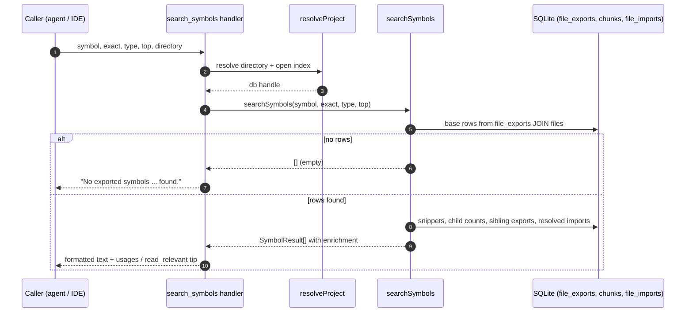

# Tool: search_symbols

`search_symbols` answers one precise question: *where is this symbol defined?* It looks up function, class, interface, type, and enum names in a pre-built export index — not by meaning, the way [search](search.md) does, and not by string scanning, the way grep does. When you already know the name you are after, this is the fastest way to jump to its definition and to gauge how widely it is used before you touch it.

One entry point serves two modes. Pass a `symbol` and you get the matching definitions. Omit `symbol` and the tool lists every exported symbol in the project, which is useful for surveying an unfamiliar codebase or auditing the public surface of a module. Either way, each result carries enrichment metadata — how many child members the symbol has, how many other files reference it, and whether the row is a re-export rather than the original definition — so you can read blast radius at a glance.

The symbol data is precomputed. During indexing, each file's exports are extracted and written to the `file_exports` table, so this tool never parses source at query time — it reads a table that was populated when the file was last indexed (`src/indexing/indexer.ts:578`, `src/db/graph.ts:924-929`).

## How a call flows



1. The caller invokes the tool with an optional `symbol`, an optional `exact` flag, an optional `type` filter, an optional `top` limit, and an optional `directory`. The handler is registered in `src/tools/search.ts:219-275`.
2. `resolveProject` turns the optional `directory` into an absolute path (falling back to the `RAG_PROJECT_DIR` environment variable or the current working directory), verifies it exists, loads that project's config, and opens its index database (`src/tools/index.ts:22-37`).
3. The handler calls `ragDb.searchSymbols(symbol, exact ?? false, type, top)`. A missing `exact` defaults to `false`, so the default behavior is a case-insensitive substring match (`src/tools/search.ts:250`). The method is a thin pass-through to the query function in the search layer (`src/db/index.ts:852-853`).
4. The query layer first fetches base rows from `file_exports` joined to `files`, applying the name pattern, the optional type filter, an `ORDER BY fe.name`, and the row limit (`src/db/search.ts:277-317`).
5. If no rows match, the function returns an empty array and the handler replies with a single "No exported symbols ... found." line, naming whichever filter was active (`src/tools/search.ts:252-256`).
6. Otherwise the query layer batch-loads supporting data — a code snippet per symbol, child-member counts, and the reference fan-in — then composes one `SymbolResult` per base row (`src/db/search.ts:319-435`).
7. The handler renders each result as a line of `path • name (metadata)` followed by a trimmed snippet, joined by `---` separators, and appends a tip suggesting `usages` or `read_relevant` on the top hit (`src/tools/search.ts:259-273`).

## Two modes: search vs. list-all-exports

The mode is decided by one line: `const isListing = !query` (`src/db/search.ts:268`). Everything else follows from whether `symbol` was supplied.

| Behavior | `symbol` given (search) | `symbol` omitted (list all) |
| --- | --- | --- |
| WHERE clause on name | `LOWER(fe.name) = LOWER(?)` (exact) or `LOWER(fe.name) LIKE LOWER(?) ESCAPE '\'` (substring) | `WHERE 1=1` (no name filter) |
| Match pattern | `query` when `exact`, else `%query%` (escaped) | n/a |
| Default `top` | 20 | 200 |
| `type` filter | applies if given | applies if given |
| Typical use | jump to a known definition | survey a module or the whole project |

The default limit changes with the mode: `topK ?? (isListing ? 200 : 20)` (`src/db/search.ts:269`). A name search returns up to 20 hits by default; an unfiltered listing returns up to 200. There is no hard ceiling — pass a larger `top` for a big project.

When `symbol` is present, the `exact` flag chooses between two distinct SQL forms. With `exact: true` the query uses equality — `WHERE LOWER(fe.name) = LOWER(?)` — so only an exact (case-insensitive) name matches. This is deliberately equality, not `LIKE`: a `LIKE`-based "exact" lookup of `do_thing` would also return `doXthing`, because `_` is a `LIKE` wildcard. With `exact: false` — the default — the query uses `WHERE LOWER(fe.name) LIKE LOWER(?) ESCAPE '\'` with the pattern wrapped in `%...%`, so any name containing the query substring matches. The substring is first run through `escapeLike`, so a literal `%`, `_`, or `\` in the search term matches itself instead of acting as a wildcard (`src/db/search.ts:284-293`, `src/search/usages.ts:24-26`).

## The type filter

The optional `type` narrows results to one kind of symbol. It is a fixed enum at the tool boundary and maps directly to an `fe.type = ?` clause in SQL (`src/tools/search.ts:232-235`, `src/db/search.ts:298-301`).

| `type` value | Meaning |
| --- | --- |
| `function` | function definitions |
| `class` | class definitions |
| `interface` | interface definitions |
| `type` | type aliases |
| `enum` | enum definitions |
| `export` | exports recorded with the generic `export` kind |

The stored `fe.type` value comes from the export extraction done at index time, so the filter only matches whatever type string was recorded for that export. The filter works on its own, too: omit `symbol` but pass `type` to list, for example, every exported `interface` in the project. The empty-result message reflects this — it reports "of type ..." when only a type filter was active and no name was given (`src/tools/search.ts:253`).

## Enrichment metadata

Each result is more than a name and a path. After loading the base rows, the query layer enriches them in a few cheap passes and returns a `SymbolResult` (`src/db/types.ts:57-69`). This was deliberately rewritten away from per-row correlated subqueries — those turned a listing of around a thousand symbols into minutes of work — into one base query plus batched `IN`-list lookups joined in JavaScript (`src/db/search.ts:274-281`). The `IN`-list helper, `batchIn`, splits ids into batches of 499 to stay under SQLite's parameter limit (`src/db/search.ts:439-453`).

- **Snippet** — the first code chunk whose `entity_name` matches the symbol in that file. Chunks are scanned once for all matched files, keyed by `file_id|lower(entity_name)`, keeping the lowest `chunk_index` so the result shows the symbol's own definition rather than a later member (`src/db/search.ts:324-341`). The handler trims this to 300 characters before display (`src/tools/search.ts:261`).
- **Child members** (`hasChildren`, `childCount`) — how many chunks name the symbol's chunk as their parent. This is computed by grouping the `chunks` table on `parent_id` for the candidate parent chunks (`src/db/search.ts:343-356`). For a class, this is roughly its method and field count; the display shows `N children` when there is at least one (`src/tools/search.ts:263`).
- **References** (`referenceCount`, `referenceModuleCount`, `referenceModules`) — how many files import this symbol, and across how many directories. The reference walk first finds every export that shares the symbol's lower-cased name to learn which files define or re-export it, then finds resolved imports of that name, and keeps only the importers whose resolved target is one of those defining files (`src/db/search.ts:358-415`). The importer paths are reduced to their directory paths to produce a module count. The display shows `N refs, N modules` when the count is above zero (`src/tools/search.ts:264`).
- **Re-export** (`isReexport`) — true when this `file_exports` row is a re-export (`export ... from`) rather than the original definition, read straight from the stored `is_reexport` column (`src/db/search.ts:433`). A symbol can therefore appear multiple times — once at its real definition and once per file that re-exports it — and the re-exporting rows are flagged so you can tell them apart. The display adds a `re-export` tag for those rows (`src/tools/search.ts:265`).

Two of the three reference fields are subtly different. `referenceCount` counts distinct importer files, and `referenceModuleCount` is the number of distinct importer *directory paths* (`refDirs.size`). The `referenceModules` array, by contrast, is the de-duplicated list of just the directory *base names* of those paths, sorted (`src/db/search.ts:416-420`). So if two importers live in `a/utils` and `b/utils`, the count is 2 but the module list collapses to a single `utils` entry. The handler displays the count, not the list (`src/tools/search.ts:264`).

Because the reference walk keys on names, it can over- or under-count when two unrelated symbols in different files share a name. The walk narrows by matching importer targets back to the defining files (`src/db/search.ts:410-415`), but identically named exports in separate modules are treated as the same name group during the lookup, so an importer of one of them counts toward all of them when their defining files overlap.

## Inputs

| name | type | required | description |
| --- | --- | --- | --- |
| `symbol` | string (max 200) | no | The name to search for. Omit to list all exports. Substring match by default; case-insensitive (`src/tools/search.ts:223-227`). |
| `exact` | boolean | no | Require an exact (case-insensitive) name match. Defaults to `false`, i.e. substring matching (`src/tools/search.ts:228-231`). |
| `type` | enum | no | Restrict to one symbol kind: `function`, `class`, `interface`, `type`, `enum`, or `export` (`src/tools/search.ts:232-235`). |
| `top` | integer ≥ 1 | no | Max results. Defaults to 20 when searching by name, 200 when listing. No upper bound (`src/tools/search.ts:240-245`, `src/db/search.ts:269`). |
| `directory` | string | no | Project directory to query. Defaults to the `RAG_PROJECT_DIR` environment variable or the current working directory (`src/tools/index.ts:26`). |

Unlike [search](search.md) and [read_relevant](read-relevant.md), this tool has no `extensions`, `dirs`, or `excludeDirs` filters — scope it with `symbol` and `type` instead.

## Outputs

| output | where it lands / shape / description |
| --- | --- |
| Symbol definitions | Returned as a single text block in the MCP response. One entry per matched export, in `path • name (metadata)` form, separated by `---`, each followed by a snippet of up to 300 characters (`src/tools/search.ts:259-268`). |
| Enrichment metadata | Inline in each entry: the symbol type, then `N children`, `N refs, N modules`, and a `re-export` tag, each shown only when its value is present or non-zero (`src/tools/search.ts:262-265`). |
| Next-step tip | A trailing line suggesting `usages("<top symbol>")` to see call sites or `read_relevant("<top symbol>")` for full context, built from the first result's name (`src/tools/search.ts:270-271`). |
| Empty-result message | When nothing matches, a single line: `No exported symbols matching "<symbol>" found.` or `... of type "<type>" found.` (`src/tools/search.ts:252-256`). |

This tool only reads the index; it does not write to the database or change any stored state.

## Branches and failure cases

- **No name, no type** — both filters are absent, the WHERE clause is `1=1`, and the tool lists up to 200 exports ordered by name (`src/db/search.ts:294-295`).
- **Name match, no rows** — the base query returns nothing, `searchSymbols` returns `[]` early, and the handler emits the "No exported symbols matching ... found." message (`src/db/search.ts:319`, `src/tools/search.ts:252-256`).
- **Substring vs. exact** — controlled by `exact`. Default substring matching can return many partial-name hits; `exact: true` narrows to one name via SQL equality (`src/db/search.ts:284-293`).
- **Type filter with no name** — valid; lists all exports of that type, and the empty message reports the type rather than a name (`src/db/search.ts:298-301`, `src/tools/search.ts:253`).
- **No matching snippet chunk** — if no chunk's `entity_name` matches the symbol, `snippet` is `null` and the display omits the code preview (`src/db/search.ts:426`, `src/tools/search.ts:261`).
- **Zero references or zero children** — a `referenceCount` of 0 and a `childCount` of 0 are omitted from the display; only the symbol type and any non-zero counts are shown (`src/tools/search.ts:262-264`).
- **Missing or invalid directory** — `resolveProject` throws if the resolved directory does not exist, surfacing as a tool error before any query runs (`src/tools/index.ts:30-32`).
- **Stale index** — exports are read from the index, not live source. A symbol added or renamed since the last indexing pass will not appear (or will appear under its old name) until the project is re-indexed. See [index_files](index-files.md).

## Example

Search for a class by name:

```json
{
  "symbol": "RagDB",
  "exact": true,
  "type": "class"
}
```

A matching result is rendered like this (path and counts are illustrative):

```
src/db/index.ts  •  RagDB (class, 40 children, 12 refs, 6 modules)
export class RagDB {
  private db: Database;
  ...

── Tip: call usages("RagDB") to see all call sites, or read_relevant("RagDB") for full context. ──
```

List every exported interface in the project:

```json
{
  "type": "interface",
  "top": 100
}
```

## Related tools

- [usages](usages.md) — once you have located a definition, this lists every call site and reference, the natural follow-up suggested in the result tip.
- [read_relevant](read-relevant.md) — fetches full chunk content with line ranges when the trimmed snippet is not enough.
- [search](search.md) — semantic file search for when you do *not* know the symbol name and need to discover where a concept lives.

## Key source files

- `src/tools/search.ts` — registers the `search_symbols` MCP tool, defines its input schema, formats results, and emits the empty-result message and follow-up tip.
- `src/db/search.ts` — the `searchSymbols` query: base export lookup, then snippet, child-count, and reference enrichment, returning the `SymbolResult` list.
- `src/db/index.ts` — the `RagDB.searchSymbols` method that forwards to the query layer (`src/db/index.ts:852-853`).
- `src/db/types.ts` — the `SymbolResult` interface that shapes each result (`src/db/types.ts:57-69`).
- `src/db/graph.ts` — `upsertFileGraph`, which writes the `file_exports` rows this tool reads (`src/db/graph.ts:893-932`).
- `src/indexing/indexer.ts` — calls `upsertFileGraph` during indexing to populate exports from the extracted symbols (`src/indexing/indexer.ts:578`).
- `src/search/usages.ts` — `escapeLike`, which neutralizes `LIKE` metacharacters in the substring search term (`src/search/usages.ts:24-26`).
- `src/tools/index.ts` — `resolveProject`, which resolves the directory and opens the index before the query runs.
