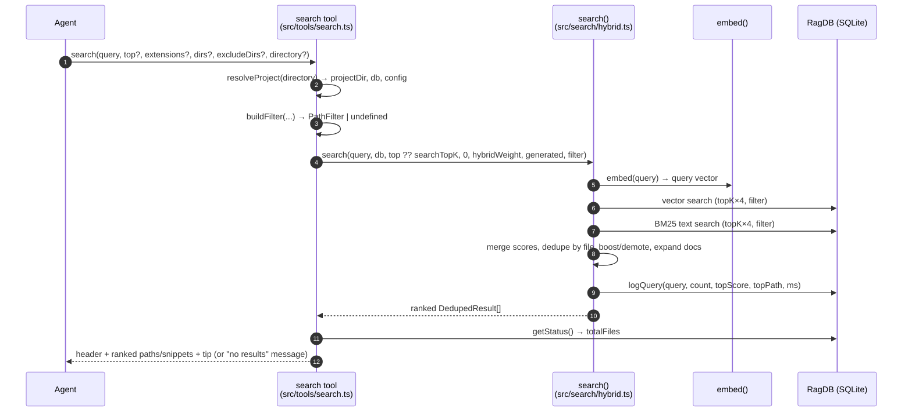

# Tool: search

`search` is the MCP tool an agent calls to find *where* something lives in a
codebase by meaning rather than by exact string. You give it a natural-language
query ("how does auth work") or a symbol name, and it returns a ranked list of
file paths, each with a short snippet preview, plus a timing header and a tip to
follow up with `read_relevant`. It is the locate-first half of the workflow:
`search` tells you which files matter; [read_relevant](read-relevant.md) then
returns the actual function/class content with line ranges.

The tool is registered in `src/tools/search.ts:32` and delegates the real work
to the `search()` function in `src/search/hybrid.ts:313`, which runs a hybrid
(vector + keyword) query against the SQLite index and reranks the candidates
with several heuristics before returning them.

## When to use it

Reach for `search` when you need to know *where* a topic is implemented across
many files and want path-level results fast. When you instead need the code
itself — the body of a specific function or class with exact line ranges — use
[read_relevant](read-relevant.md), which calls the chunk-level `searchChunks()`
path rather than the file-deduplicated `search()` path. When you already know a
symbol's exact name, [search_symbols](search-symbols.md) is a more direct lookup.

## How a call flows



1. The agent calls `search` with a query and optional `top`, scope filters, and
   `directory`. The handler is the async callback registered at
   `src/tools/search.ts:63`.
2. `resolveProject` resolves the project directory (the `directory` argument,
   else `RAG_PROJECT_DIR`, else the current working directory), confirms it
   exists, loads config, and hands back the `RagDB` handle for that project
   (`src/tools/index.ts:22`). A non-existent directory throws here before any
   search runs.
3. `buildFilter` turns the `extensions`/`dirs`/`excludeDirs` arguments into a
   `PathFilter`, resolving each directory to an absolute path so it matches the
   absolute paths stored in the index. If no filter fields are set, it returns
   `undefined` (`src/tools/search.ts:13`).
4. The handler records a start time, then calls `search()` with `top ?? config.searchTopK`
   as the result count, a threshold of `0`, the configured `hybridWeight`, the
   configured `generated` glob patterns, and the optional filter
   (`src/tools/search.ts:67-68`).
5. `search()` embeds the query string into a vector via `embed()`
   (`src/search/hybrid.ts:323`).
6. It runs a vector similarity query against `vec_chunks`, fetching `topK × 4`
   candidates so there is room to deduplicate and rerank (`src/search/hybrid.ts:326`).
7. It runs a BM25 keyword query against the `fts_chunks` full-text index, also
   `topK × 4`. This is wrapped in a try/catch: if the FTS query throws (for
   example on special characters), it logs a debug line and falls back to
   vector-only results (`src/search/hybrid.ts:330-334`).
8. The two result sets are blended by `mergeHybridScores` (default 70% vector,
   30% keyword), deduplicated to one row per file, expanded with exact symbol
   matches, then reranked by the boost/demotion heuristics and doc expansion
   described below (`src/search/hybrid.ts:336-384`).
9. `search()` writes one `query_log` row for analytics via `db.logQuery(...)`
   before returning (`src/search/hybrid.ts:386-394`).
10. Back in the handler, `getStatus()` reads the total indexed-file count, and
    the results are formatted into a header, a ranked body, and a footer tip —
    or into a "no results" message when the list is empty
    (`src/tools/search.ts:70-97`).

## Inputs

| name | type | required | description |
| --- | --- | --- | --- |
| `query` | string (1–2000 chars) | yes | The natural-language search query or a symbol name. Validated by Zod at `src/tools/search.ts:36`. |
| `top` | integer 1–1000 | no | Number of results to return. Defaults to `config.searchTopK` (10 by default) when omitted (`src/tools/search.ts:68`, `src/config/index.ts:24`). |
| `extensions` | string[] | no | Restrict to these file extensions, e.g. `[".ts", ".tsx"]`. A missing leading dot is tolerated. |
| `dirs` | string[] | no | Restrict to these directories. Relative paths are resolved against the project root before matching (`src/tools/search.ts:26`). |
| `excludeDirs` | string[] | no | Exclude these directories. Also resolved to absolute paths (`src/tools/search.ts:27`). |
| `directory` | string | no | Project directory to search. Defaults to the `RAG_PROJECT_DIR` env var, then the current working directory (`src/tools/index.ts:26`). |

## Outputs

| output | where it lands / shape / description |
| --- | --- |
| Ranked file paths with snippet previews | Returned as MCP text content. One line per file: the hybrid score to four decimals, the file path, and the first snippet truncated to 400 characters (`src/tools/search.ts:86-91`). |
| `query_log` row | A new row inserted into the `query_log` table inside `search()` — not part of the tool response, but a durable side effect used by [search_analytics](search-analytics.md) (`src/search/hybrid.ts:388-394`). |

## The header, body, and footer

The text the agent sees is assembled in three pieces (`src/tools/search.ts:84-96`):

- **Header** — a one-line banner: `── N results across M indexed files (Tms) ──`,
  where `N` is the returned count, `M` comes from `getStatus().totalFiles`, and
  `T` is the wall-clock time the handler measured around the `search()` call
  (`src/tools/search.ts:84`). Note this `durationMs` is measured in the tool
  handler and is independent of the `durationMs` that `search()` itself records
  in `query_log`.
- **Body** — each result rendered as `score  path` followed by an indented
  snippet truncated to 400 characters with a trailing `...`. The score is
  `r.score.toFixed(4)` (`src/tools/search.ts:86-91`).
- **Footer** — a fixed tip telling the agent to call `read_relevant` with the
  same query to get full function/class content with exact line ranges
  (`src/tools/search.ts:93`).

## How hybrid ranking works

`search()` does much more than a single vector lookup. The pipeline, in order
(`src/search/hybrid.ts:313-396`):

- **Embed and dual-query.** The query is embedded once, then queried two ways:
  vector similarity over `vec_chunks` and BM25 keyword match over `fts_chunks`,
  each fetching `topK × 4` rows so there is headroom for reranking
  (`src/search/hybrid.ts:323-331`).
- **Blend scores.** `mergeHybridScores` keys results by `path:chunkIndex` and
  computes `hybridWeight × vectorScore + (1 − hybridWeight) × textScore`. With
  the default `hybridWeight` of 0.7 that is 70% vector, 30% keyword
  (`src/search/hybrid.ts:65-91`, `src/config/index.ts:23`).
- **Deduplicate by file.** Multiple chunks from the same file collapse to one
  result, keeping the best score and collecting distinct snippets
  (`src/search/hybrid.ts:339-359`). This is the key difference from
  `read_relevant`, which keeps individual chunks.
- **Symbol expansion.** Code-like identifiers in the query (camelCase,
  snake_case, etc., minus stop words) are looked up by exact name in the symbol
  index. A file already present gets its score boosted up to 1.3×; a new
  symbol-only hit is added with a high base score of 0.75 (`src/search/hybrid.ts:361-374`,
  `src/search/hybrid.ts:261-279`).
- **Path and filename boosts.** Source files (`src/`, `lib/`, `app/`, etc.) are
  boosted 1.1× and tests demoted to 0.85× (`src/search/hybrid.ts:106-115`).
  Query words appearing in the filename stem or path segments add further boost,
  while boilerplate basenames (`types.ts`, `index.d.ts`, …) are demoted to 0.8×
  and files matching the configured `generated` globs to 0.75×
  (`src/search/hybrid.ts:187-235`).
- **Dependency-graph boost.** Files imported by many others get a modest
  logarithmic boost based on importer count (`src/search/hybrid.ts:301-310`).
- **Doc expansion.** Markdown results are treated as bonus context: when docs
  appear inside the top-K alongside code, the result set is widened so docs do
  not push code files out of their slots (`src/search/hybrid.ts:287-298`).

## Filtering by extension and directory

When `extensions`, `dirs`, or `excludeDirs` are supplied, `buildFilter` packages
them into a `PathFilter` (`src/tools/search.ts:13`, `src/db/types.ts:115`). That
filter is pushed down into SQL by `buildPathFilter`, which turns extensions into
`f.path LIKE '%<ext>'` clauses, directories into `f.path LIKE '<dir>/%'`
prefixes, and exclusions into `f.path NOT LIKE '<dir>/%'`
(`src/db/search.ts:16-51`). Because directory clauses are path-prefix matches
against the absolute paths stored in the `files` table, the tool resolves each
`dirs`/`excludeDirs` entry to an absolute path first (`src/tools/search.ts:26-27`).

When a filter is active, the underlying vector and FTS queries over-fetch by a
factor of `FILTER_OVERFETCH` (5×) so that enough rows survive filtering to fill
the requested `topK` (`src/db/search.ts:53-54`). A second, in-memory
`matchesFilter` guard re-applies the same extension/dir/exclude rules to any
candidates that bypassed SQL — notably the symbol-expansion hits — so scoped
searches stay scoped (`src/search/hybrid.ts:10-37`, `src/search/hybrid.ts:368`).

## State changes

### `query_log` row written per call

| | state |
| --- | --- |
| Before | No row for this query invocation. |
| After | One new row in `query_log` with the query text, returned count, top score, top path, duration, and an ISO timestamp. |

Every successful `search()` call — including ones that return zero results —
appends a row to the `query_log` table near the end of the function
(`src/search/hybrid.ts:386-394`). The insert is `db.logQuery(query, results.length, results[0]?.score ?? null, results[0]?.path ?? null, durationMs)`,
which runs an `INSERT INTO query_log (...)` statement and stamps `created_at`
with `new Date().toISOString()` (`src/db/analytics.ts:3-8`). This is why the
side effect persists even on empty results: the count is recorded as `0` and the
top-score/top-path columns as `NULL`. Those rows are what
[search_analytics](search-analytics.md) later aggregates to surface
zero-result and low-score queries as documentation gaps. The matter here is that
`search` is observable after the fact — every query an agent runs leaves a trace.

## Branches and failure cases

- **Empty results.** When `search()` returns an empty list, the handler returns
  a plain message instead of a header/body. If a scope filter was active it adds
  " matching the given scope", and it always suggests indexing first: *"No
  results found … across N indexed files. Has the directory been indexed? Try
  calling index_files first."* (`src/tools/search.ts:72-82`). A `query_log` row
  is still written for this call.
- **No filter supplied.** With no `extensions`/`dirs`/`excludeDirs`, `buildFilter`
  returns `undefined` and the SQL queries run without any path constraints and
  without the 5× over-fetch (`src/tools/search.ts:23`, `src/db/search.ts:53-54`).
- **FTS query failure.** If the BM25 text search throws — for example on a query
  with characters that break FTS5 syntax — it is caught, a debug line is logged,
  and the search continues with vector results only (`src/search/hybrid.ts:330-334`).
  The agent still gets ranked results; they are simply vector-only for that call.
- **Missing or invalid directory.** If the resolved project directory does not
  exist, `resolveProject` throws `Directory does not exist: <path>` before any
  query runs (`src/tools/index.ts:30-32`).
- **Invalid arguments.** Zod rejects an empty or over-2000-character `query`, or
  a `top` outside 1–1000, before the handler body executes
  (`src/tools/search.ts:36-49`).
- **`top` cap vs. doc expansion.** Even with `top` honored, the doc-expansion
  step can return slightly more than `top` results when Markdown files appear in
  the top-K, because docs are added as bonus rows rather than displacing code
  (`src/search/hybrid.ts:287-298`). The header count reflects the actual number
  returned.

## Example

Example arguments — scope a semantic search to TypeScript files under `src/`,
excluding tests, asking for the top 5:

```json
{
  "query": "how are query logs written for analytics",
  "top": 5,
  "extensions": [".ts"],
  "dirs": ["src"],
  "excludeDirs": ["tests"]
}
```

Illustrative response shape (values synthetic):

```
── 5 results across 174 indexed files (18ms) ──

0.8421  src/search/hybrid.ts
  export async function search(query, db, topK = 5, ...) { ... }...

0.7903  src/db/analytics.ts
  export function logQuery(db, query, resultCount, ...) { ... }...

── Tip: call read_relevant with the same query to get full function/class content with exact line ranges. ──
```

## Key source files

- `src/tools/search.ts` — registers the `search` MCP tool, builds the path
  filter, calls `search()`, and formats the header/body/footer response.
- `src/search/hybrid.ts` — the `search()` function: embedding, dual vector+BM25
  query, hybrid score merge, file deduplication, symbol expansion, ranking
  heuristics, doc expansion, and the `query_log` write.
- `src/db/search.ts` — the SQL layer: `vectorSearch`, `textSearch`, and
  `buildPathFilter` push the scope filter into SQLite.
- `src/db/analytics.ts` — `logQuery` performs the `query_log` insert.
- `src/tools/index.ts` — `resolveProject` resolves the directory, config, and
  database handle shared by all tools.
- `src/config/index.ts` — defaults for `searchTopK` (10) and `hybridWeight`
  (0.7).

## Related tools

- [read_relevant](read-relevant.md) — the follow-up tool that returns full chunk
  content with line ranges; uses `searchChunks()` instead of file-deduplicated
  `search()`.
- [search_symbols](search-symbols.md) — direct symbol-name lookup when you know
  the identifier.
- [search_analytics](search-analytics.md) — aggregates the `query_log` rows this
  tool writes.
- [search (CLI)](../cli/search.md) — the command-line entry point over the same
  `search()` function.
