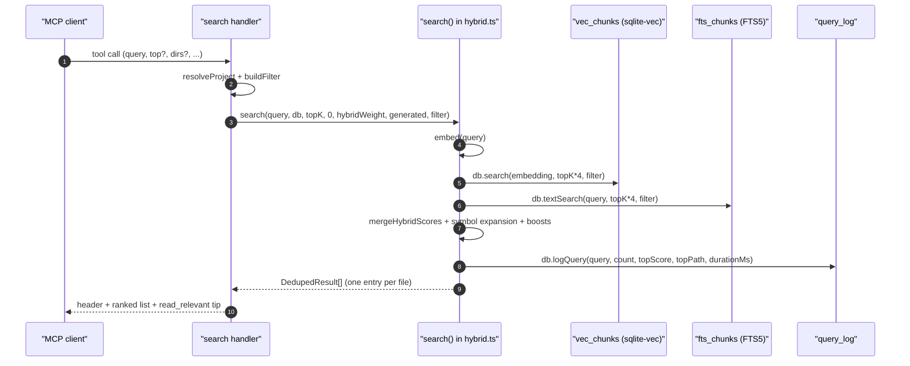

# Tool: search

The `search` MCP tool is the entry point for "where does X live?" questions.
It runs a hybrid vector + full-text search across every indexed file and
returns ranked file paths with short snippets, deduplicated so each file
shows up once. Agents use it as a discovery step before pulling content with
`read_relevant` or jumping to a specific symbol with `search_symbols`.

The handler lives in `src/tools/search.ts:31-99` and delegates the actual
ranking to the `search` function in `src/search/hybrid.ts:313-397`.



1. The client invokes `search` with a natural-language query and optional
   filters (`src/tools/search.ts:32-62`).
2. `resolveProject` opens the project DB; `buildFilter` resolves any
   `dirs`/`excludeDirs` to absolute paths against `projectDir` so they
   match the absolute paths stored in the index (`src/tools/search.ts:13-29`).
3. The handler calls `search(...)` with `topK = top ?? config.searchTopK`,
   threshold `0`, the config-driven `hybridWeight`, the configured
   `generated` patterns, and the filter (`src/tools/search.ts:67-68`).
4. `search` embeds the query, then fetches `topK*4` vector hits and
   `topK*4` BM25 hits, each pre-filtered by path
   (`src/search/hybrid.ts:322-334`).
5. `mergeHybridScores` combines the two streams using `hybridWeight`, then
   the result is deduplicated per file, keeping the best score and
   accumulating distinct snippets (`src/search/hybrid.ts:336-359`).
6. Identifier-shaped tokens in the query trigger a symbol-table lookup;
   exact symbol hits are merged into the candidate list
   (`src/search/hybrid.ts:362-374`).
7. Score adjustments: source-vs-test bias, filename affinity, generated-file
   demotion, then a dependency-graph boost based on importer count
   (`src/search/hybrid.ts:301-311`, `src/search/hybrid.ts:377-381`).
8. `expandForDocs` appends documentation matches without displacing code
   results, and the final list is logged to `query_log` via `db.logQuery`
   before returning (`src/search/hybrid.ts:384-394`).
9. The handler formats `score  path` lines with the first snippet truncated
   to 400 characters and appends a tip that points the agent at
   `read_relevant` (`src/tools/search.ts:84-97`).

## Inputs

- `query` — required string, 1 to 2000 characters. Used both for the
  embedding and as the BM25 query (`src/tools/search.ts:36`).
- `top` — optional 1–1000 result cap. Defaults to `config.searchTopK`
  when omitted (`src/tools/search.ts:43-49`, `src/tools/search.ts:68`).
- `extensions` — optional list of file extensions to include. Leading dot
  is optional; matching is implemented in `buildFilter` →
  `PathFilter.extensions` (`src/tools/search.ts:50-53`).
- `dirs` — optional include list. Paths are resolved relative to the
  project root and stored as absolute paths so they match the index
  (`src/tools/search.ts:54-57`, `src/tools/search.ts:26`).
- `excludeDirs` — optional exclude list, same resolution rule
  (`src/tools/search.ts:58-61`, `src/tools/search.ts:27`).
- `directory` — optional project root override; defaults to
  `RAG_PROJECT_DIR` or the server cwd through `resolveProject`
  (`src/tools/search.ts:37-42`).

## Outputs

- Text content with one entry per file: `score  path` then a snippet
  truncated to 400 characters. Snippets are taken from `result.snippets[0]`
  — the highest-scoring chunk per file (`src/tools/search.ts:86-91`).
- A header line counts the results, total indexed files, and elapsed
  milliseconds (`src/tools/search.ts:84`).
- A trailing tip points at `read_relevant` so the agent can pull full
  content next (`src/tools/search.ts:93`).
- Side effect: one row appended to `query_log` with the query, result
  count, top score, top path, and `durationMs` (see State changes).

## Hybrid scoring

The merge is a single linear interpolation:

- vector score and FTS score are both normalised onto a 0–1 scale before
  merging.
- `mergeHybridScores(vec, fts, hybridWeight)` returns
  `hybridWeight * vec + (1 - hybridWeight) * fts` for documents that
  appear in both lists; documents that appear in only one are scaled by
  the corresponding weight (`src/search/hybrid.ts:64`).
- `hybridWeight` comes from `config.hybridWeight` and is plumbed through
  every call from the tool handler (`src/tools/search.ts:68`).
- If the FTS query throws — usually a tokenisation error on a special
  character — the handler still returns vector-only results and a debug
  log line is emitted (`src/search/hybrid.ts:330-334`).
- After merging, paths are reshaped by `applyPathBoost`,
  `applyFilenameBoost`, and `applyGraphBoost`. The graph boost is
  `0.05 * log2(importerCount + 1)`, so a widely-imported file gains up to
  a few hundredths of a point (`src/search/hybrid.ts:301-311`).

## State changes

### `search_queries` row (the `query_log` table)

- Before: no row exists for this invocation.
- After: one new row in `query_log` with `query`, `result_count`,
  `top_score`, `top_path`, `duration_ms`, and `created_at` set to the
  current ISO timestamp.
- Trigger: every successful call to `search()` writes one row, even when
  the result list is empty — `db.logQuery` is called unconditionally at
  the end of the function (`src/search/hybrid.ts:387-394`).
- Why it matters: `search_analytics` aggregates this table to surface
  zero-result and low-score queries, and the trend command compares
  windows of it (`src/db/analytics.ts:10-67`).

## Branches and failure cases

- Empty index or no matches: the handler returns a single text block that
  reports the indexed file count and suggests calling `index_files` first.
  A scope-specific suffix is added when a path filter is active
  (`src/tools/search.ts:72-82`).
- FTS failure: caught and logged, falling back to vector-only ranking
  (`src/search/hybrid.ts:330-334`). The query is still recorded.
- Symbol expansion only runs when `extractIdentifiers(query)` finds an
  identifier-shaped token; pure-prose queries skip it
  (`src/search/hybrid.ts:362-374`).

## Example

```json
{
  "query": "how does indexing decide when to re-embed a file",
  "top": 5,
  "extensions": [".ts"],
  "dirs": ["src/indexing"],
  "excludeDirs": ["tests"]
}
```

The response is plain text:

```
── 5 results across 198 indexed files (24ms) ──

0.7421  src/indexing/indexer.ts
  export async function indexFile(...) { ... }...

0.6133  src/indexing/hash.ts
  function fileHash(...) { ... }...

── Tip: call read_relevant with the same query to get full function/class content with exact line ranges. ──
```

## Related flows

- `read_relevant` — same hybrid scoring but returns chunk bodies with
  exact line ranges instead of one row per file.
- `search_symbols` — name-based lookup when you already know the symbol.
- `search_analytics` — aggregates the `query_log` rows this tool writes.

## Key source files

- `src/tools/search.ts` — MCP registration, input schema, output
  formatting, and filter construction.
- `src/search/hybrid.ts` — embedding, vector + FTS merge, boosts, dedup,
  and analytics logging.
- `src/db/index.ts` — `RagDB.search`, `RagDB.textSearch`, and
  `RagDB.logQuery` thin wrappers over the SQLite layer.
- `src/db/analytics.ts` — `query_log` insert and aggregation SQL.
