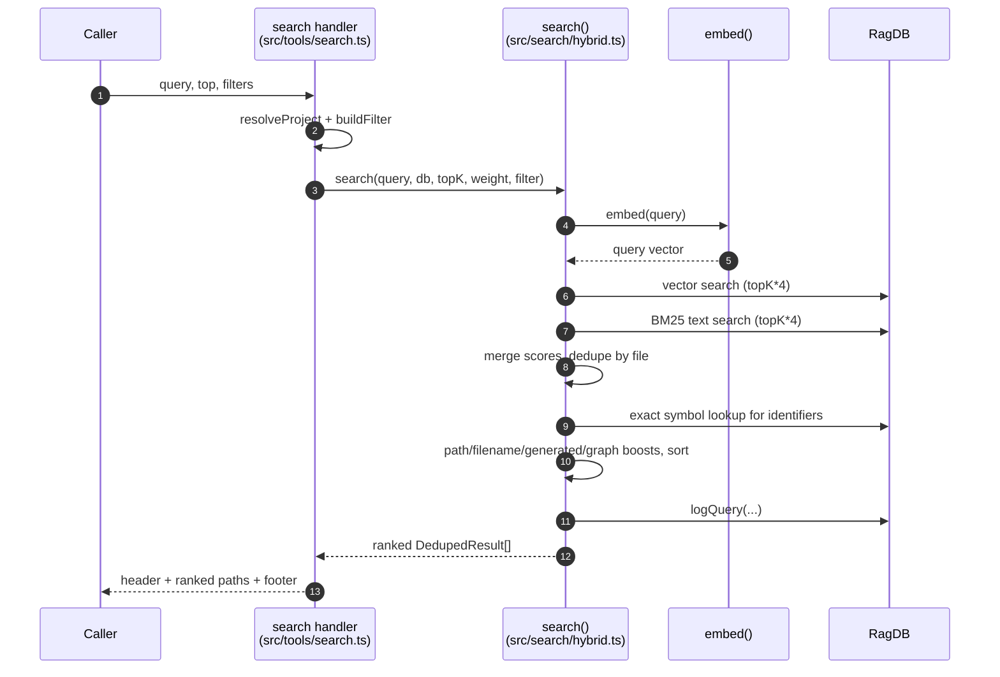

# Tool: search

The `search` MCP tool answers the question "where in this codebase does X live?" by file. You give it a natural-language query (or a symbol name), and it returns a ranked list of file paths, each with a short snippet preview and a relevance score. It is the discovery step before reading: find the files, then call `read_relevant` to pull the actual code with line ranges.

The handler is registered in `src/tools/search.ts:31-99`. The ranking work happens in the `search` function in `src/search/hybrid.ts:313-397`.

## When to use it

Use `search` when you do not yet know which files matter for a topic. It searches by meaning, not just by string match, so a query like "how does auth work" can surface files that never contain the word "auth". If you instead need the code body itself, call [read_relevant](read-relevant.md); if you know the exact symbol name, [search_symbols](search-symbols.md) is faster.

## Inputs

| name | type | required | description |
| --- | --- | --- | --- |
| `query` | string (1–2000 chars) | yes | The search text. Natural language or a symbol name. |
| `top` | integer (1–1000) | no | Number of file results to return. Defaults to `config.searchTopK`. |
| `extensions` | string[] | no | Restrict results to these file extensions, e.g. `[".ts", ".tsx"]`. A missing leading dot is tolerated. |
| `dirs` | string[] | no | Restrict to these directories. Relative paths are resolved against the project root. |
| `excludeDirs` | string[] | no | Drop results under these directories. |
| `directory` | string | no | Which project to search. Defaults to the `RAG_PROJECT_DIR` env var or the current working directory. |

The three scoping arrays are folded into a single path filter by `buildFilter` in `src/tools/search.ts:13-29`. If none of them are populated the filter is `undefined` and the search runs unscoped. Relative `dirs` and `excludeDirs` are resolved to absolute paths with `resolve(projectDir, d)` so they match the absolute paths stored in the index `src/tools/search.ts:24-28`.

## Outputs

| output | where it lands / shape / description |
| --- | --- |
| Ranked file list | Returned as a single MCP text block. A header line with the result count, total indexed file count, and elapsed milliseconds, then one entry per file: a 4-decimal score, the file path, and the first snippet truncated to 400 characters. A footer suggests calling `read_relevant`. |
| Empty-result message | When nothing matches, a text block explaining that no results were found and suggesting `index_files`. |
| Analytics row | A row written to the `query_log` table recording the query, result count, top score, top path, and duration. |

The output text is assembled at `src/tools/search.ts:84-97`. Each line is `score.toFixed(4)` followed by the path and `snippets[0]?.slice(0, 400)` `src/tools/search.ts:86-91`.

## How a query is scored

The tool runs a hybrid search: it combines semantic (vector) similarity with keyword (full-text) matching, then layers several path-based adjustments on top.



1. The handler resolves the project directory, database, and config, and builds the path filter `src/tools/search.ts:64-65`.
2. It times the call with `performance.now()` and invokes `search` with `top ?? config.searchTopK`, a threshold of `0`, `config.hybridWeight`, and the configured generated-file patterns `src/tools/search.ts:67-68`.
3. `search` embeds the query into a vector `src/search/hybrid.ts:323`.
4. It runs a vector search for `topK * 4` candidates so there is room to dedupe `src/search/hybrid.ts:326`.
5. It runs a BM25 keyword search for `topK * 4` candidates. If the full-text query throws (for example on odd characters), it logs at debug level and falls back to vector-only results `src/search/hybrid.ts:329-334`.
6. `mergeHybridScores` combines the two lists: each result's final score is `hybridWeight * vectorScore + (1 - hybridWeight) * textScore`, keyed by `path:chunkIndex` `src/search/hybrid.ts:65-91`. The default weight is 0.7, i.e. 70% vector and 30% keyword `src/search/hybrid.ts:58`.
7. Results are deduplicated to one entry per file, keeping the best score and collecting distinct snippets `src/search/hybrid.ts:339-359`.
8. If the query contains code-like identifiers, those are looked up by exact symbol name and merged in (see "Symbol expansion" below) `src/search/hybrid.ts:362-374`.
9. Three score adjustments are applied in order — path boost, filename affinity, dependency-graph boost — then the list is sorted by score `src/search/hybrid.ts:377-381`.
10. Documentation files are allowed to expand the result set so they do not push code out (see "Doc expansion") `src/search/hybrid.ts:384`.
11. The query and its top result are logged for analytics `src/search/hybrid.ts:388-394`.
12. The handler formats the ranked paths into text and returns them `src/tools/search.ts:84-97`.

### Hybrid weight

`config.hybridWeight` controls the blend. At 1.0 the score is pure vector similarity; at 0.0 it is pure keyword match. Vector scores come from distance as `1 / (1 + distance)` `src/db/search.ts:89`. The weight is read from project config and passed straight through `src/tools/search.ts:68`.

### Score adjustments

These multipliers run after merge and shape the final ranking:

| adjustment | effect | source |
| --- | --- | --- |
| Path boost | Test files are multiplied by 0.85, recognized source dirs (`src`, `lib`, `app`, `pkg`, `packages`, `internal`, `cmd`) by 1.1 | `src/search/hybrid.ts:106-115` |
| Filename affinity | Query words appearing in the filename stem add `0.1` each; words in directory segments add `0.05` each | `src/search/hybrid.ts:187-235` |
| Boilerplate demotion | Files like `types.ts`, `index.d.ts`, `doc.go` are multiplied by 0.8 | `src/search/hybrid.ts:120-123`, `202-204` |
| Generated demotion | Files matching the configured `generated` glob patterns are multiplied by 0.75 | `src/search/hybrid.ts:129`, `205-208` |
| Graph boost | Files imported by others get `+0.05 * log2(importerCount + 1)` | `src/search/hybrid.ts:301-311` |

### Symbol expansion

`search` does not rely on semantics alone. It extracts code-style identifiers from the query — tokens with mixed case, underscores, or dots, at least 3 chars, minus common English stop words `src/search/hybrid.ts:239-259`. For each identifier it does an exact symbol lookup. A symbol hit on a file already in the candidate set boosts that file's score (`* 1.3`); a brand-new file is added with a base score of 0.75, since an exact name match is high signal `src/search/hybrid.ts:261-279`. Symbol hits are filtered through the same path filter in memory via `matchesFilter`, because they bypass the SQL filter `src/search/hybrid.ts:368`.

### Doc expansion

Markdown files (`.md`, `.mdx`) are useful context but should not displace code. After sorting, `expandForDocs` checks the top-K slice: if it contains both docs and code, it widens the returned slice by the number of docs so code files keep their slots. If the slice is all docs or all code, nothing is expanded `src/search/hybrid.ts:287-298`.

## State changes

### Analytics row in `query_log`

| before | after |
| --- | --- |
| No row for this query | One new `query_log` row: query text, result count, top score, top path, duration in ms, and an ISO timestamp |

Every completed search writes this row by calling `db.logQuery(...)` near the end of `search` `src/search/hybrid.ts:388-394`. The write itself is a single `INSERT INTO query_log (...)` `src/db/analytics.ts:3-8`. This is the data that [search_analytics](search-analytics.md) later aggregates to surface zero-result and low-score queries. The row is written even when the search returns zero results — in that case `result_count` is 0 and `top_score`/`top_path` are null `src/search/hybrid.ts:391-392`.

Note that the duration recorded inside `search` is measured around the embedding and database work only `src/search/hybrid.ts:322`, `387`, which is slightly less than the duration the handler reports in the header (the handler times the whole call, including project resolution overhead) `src/tools/search.ts:67-69`.

## Branches and failure cases

- **No filter fields set** — `buildFilter` returns `undefined` and the search runs across the whole index `src/tools/search.ts:19-23`.
- **Filter set but nothing matches** — results are empty; the message includes " matching the given scope" to signal the filter may be too narrow `src/tools/search.ts:72-82`.
- **Empty index / nothing matches** — returns the "No results found... Try calling index_files first." text with the current total file count `src/tools/search.ts:78`.
- **Full-text query throws** — the BM25 path is wrapped in try/catch; on failure it logs at debug level and continues with vector-only results rather than erroring `src/search/hybrid.ts:330-334`.
- **`top` omitted** — falls back to `config.searchTopK` `src/tools/search.ts:68`.
- **Over-fetch for filters** — when a path filter is active the inner SQL fetches `topK * 5` rows before filtering, so a narrow scope still yields enough candidates `src/db/search.ts:52-63`.
- **No code-like identifiers in query** — symbol expansion is skipped entirely `src/search/hybrid.ts:363`.

## Example

Arguments to scope a search to TypeScript source under `src`, excluding tests:

```json
{
  "query": "how are query embeddings cached",
  "top": 8,
  "extensions": [".ts"],
  "dirs": ["src"],
  "excludeDirs": ["tests"]
}
```

Illustrative output shape:

```
── 8 results across 186 indexed files (42ms) ──

0.8123  src/embeddings/embed.ts
  export async function embed(text: string)...

0.7440  src/db/search.ts
  export function vectorSearch(db, queryEmbedding...)...

── Tip: call read_relevant with the same query to get full function/class content with exact line ranges. ──
```

## Key source files

- `src/tools/search.ts` — registers the `search` tool, builds the path filter, formats output.
- `src/search/hybrid.ts` — the `search` function: hybrid merge, dedupe, symbol expansion, boosts, analytics logging.
- `src/db/search.ts` — SQL-level vector and full-text search plus the path-filter clause builder.
- `src/db/analytics.ts` — `logQuery` writes the `query_log` row consumed by analytics.
