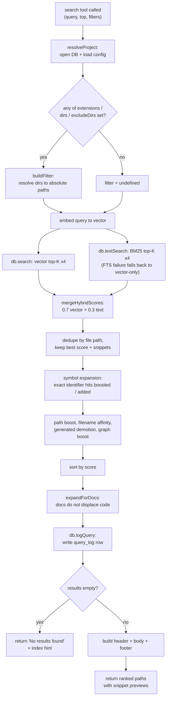

# Tool: search

`search` is the MCP tool an agent calls to find *where* something lives in a
codebase by meaning, not by exact string. You give it a natural-language query
("how does auth work") or a symbol name, and it returns a ranked list of file
paths, each with a short snippet preview, plus a one-line timing header and a tip
to follow up with `read_relevant`. It is the locate-first half of the workflow:
`search` tells you which files matter; [read_relevant](read-relevant.md) then
returns the actual function or class body with exact line ranges.

The tool is registered in `src/tools/search.ts:32` and hands the real work to the
`search()` function in `src/search/hybrid.ts:313`, which runs a hybrid (vector +
keyword) query against the SQLite index and then reranks the candidates through
several scoring stages before returning them.

## When to use it

Reach for `search` when you need to know *where* a topic is implemented across
many files and want path-level results fast. When you instead need the code
itself — the body of a specific function or class with line numbers to navigate
to — use [read_relevant](read-relevant.md), which calls the chunk-level
`searchChunks()` path rather than the file-deduplicated `search()` path. When you
already know a symbol's exact name, [search_symbols](search-symbols.md) is a more
direct lookup. To see what queries have been returning poor results, check
[search_analytics](search-analytics.md), which reads the same log this tool
writes.

## How a call flows

The interesting part of this flow is not the call order between participants — it
is the staged rerank pipeline inside `search()`. Each stage rewrites the candidate
scores, and the final order depends on all of them. A flowchart shows those stages
and their branches better than a timeline would.



1. **Entry.** The MCP server invokes the handler registered under the name
   `search` with the validated arguments `query`, `directory`, `top`,
   `extensions`, `dirs`, and `excludeDirs` (`src/tools/search.ts:63`).
2. **Resolve the project.** `resolveProject` turns the optional `directory` into
   an absolute path (falling back to `RAG_PROJECT_DIR` or the current working
   directory), verifies it exists, opens the index database for it, and loads the
   project config (`src/tools/index.ts:22`).
3. **Build the path filter.** `buildFilter` returns `undefined` when none of the
   three scope arrays is populated; otherwise it builds a `PathFilter`, resolving
   each `dirs`/`excludeDirs` entry against the project directory so they match the
   absolute paths stored in the index (`src/tools/search.ts:13`).
4. **Embed and dual-search.** `search()` embeds the query, then runs a vector
   search and a BM25 keyword search, each over-fetching four times `topK` to leave
   room for deduplication and reranking (`src/search/hybrid.ts:323`).
5. **Merge and dedupe.** Vector and text hits are blended by `mergeHybridScores`
   (70% vector, 30% text by default) and then collapsed to one row per file path,
   keeping the best score and accumulating distinct snippets
   (`src/search/hybrid.ts:336`).
6. **Rerank.** Exact symbol-name matches in the query are merged in, then path,
   filename, generated-file, and dependency-graph adjustments rewrite the scores
   and the list is re-sorted (`src/search/hybrid.ts:361`).
7. **Protect docs, then log.** Documentation hits are appended as bonus results so
   they do not push code out of the top-K, and every call writes one analytics row
   before returning (`src/search/hybrid.ts:383`).
8. **Format or report empty.** Back in the tool, an empty list returns a plain "no
   results" message with an indexing hint; otherwise the results become a header,
   a scored body, and a footer tip (`src/tools/search.ts:72`).

## Inputs

| name | type | required | description |
| --- | --- | --- | --- |
| `query` | string (1–2000 chars) | yes | Natural-language question or symbol name. Embedded for the vector search and passed verbatim to the keyword search (`src/tools/search.ts:36`). |
| `top` | integer 1–1000 | no | Number of results to return. Defaults to `config.searchTopK` (10 unless overridden) (`src/config/index.ts:24`). |
| `extensions` | string[] | no | Restrict to these file extensions, e.g. `[".ts", ".tsx"]`. A leading dot is optional; it is added if missing (`src/db/search.ts:28`). |
| `dirs` | string[] | no | Restrict to these directories, relative to the project root or absolute. Resolved to absolute paths before matching (`src/tools/search.ts:26`). |
| `excludeDirs` | string[] | no | Exclude these directories. Also resolved to absolute paths (`src/tools/search.ts:27`). |
| `directory` | string | no | Project directory to search. Defaults to the `RAG_PROJECT_DIR` env var or the current working directory (`src/tools/index.ts:26`). |

The `top`, `extensions`, `dirs`, and `excludeDirs` arguments are all optional;
only `query` must be supplied. The Zod schema rejects an empty query or one over
2000 characters before the handler runs (`src/tools/search.ts:36`).

## Outputs

| output | where it lands / shape / description |
| --- | --- |
| Ranked file paths with snippet previews | Returned as MCP text content. Each line is the score to four decimals, the file path, then the first matched snippet truncated to 400 characters with a trailing `...`. A `── N results across M indexed files (Tms) ──` header sits above and a tip to call `read_relevant` below (`src/tools/search.ts:84`). |
| `query_log` row | One row inserted into the `query_log` table per call, recording the query text, result count, top score, top path, and duration. This is a side effect, not part of the returned text (`src/search/hybrid.ts:388`). |

A sample of the returned text (synthetic values):

```
── 3 results across 412 indexed files (47ms) ──

0.8123  src/search/hybrid.ts
  export async function search(query: string, db: RagDB, topK ...

0.7740  src/tools/search.ts
  export function registerSearchTools(server: McpServer, getDB ...

0.6512  src/db/search.ts
  export function buildPathFilter(filter?: PathFilter): { clauses ...

── Tip: call read_relevant with the same query to get full function/class content with exact line ranges. ──
```

## State changes

### Query log row

Every search appends a row to the `query_log` table, regardless of whether any
results were found. After the rerank pipeline finishes, `search()` computes its
own elapsed time and calls `db.logQuery(...)` with the query string, the final
result count, the top result's score and path (or `null` when the list is empty),
and the duration in milliseconds (`src/search/hybrid.ts:386`). The insert is a
plain `INSERT INTO query_log (...)` stamped with an ISO timestamp
(`src/db/analytics.ts:3`); the table is created on database open
(`src/db/index.ts:340`).

| | value |
| --- | --- |
| before | no row for this call |
| after | one `query_log` row: `query`, `result_count`, `top_score`, `top_path`, `duration_ms`, `created_at` |

This matters because it is the only record of what was searched. The
[search_analytics](search-analytics.md) tool reads this table to surface
zero-result queries, low-scoring queries, top terms, and per-day volume — the
signal that reveals documentation or indexing gaps (`src/db/analytics.ts:10`).
Note the duration logged here is measured inside `search()` and covers only the
embed-search-rerank work; the tool computes a separate `durationMs` for the header
it returns, so the two timings can differ slightly (`src/tools/search.ts:67`).

## Branches and failure cases

- **No scope filter.** When `extensions`, `dirs`, and `excludeDirs` are all empty
  or absent, `buildFilter` returns `undefined` and the search runs across the
  whole index with no path constraints (`src/tools/search.ts:23`).
- **Scoped search.** When any scope array is set, the resulting `PathFilter` is
  pushed down into the SQL as `LIKE` clauses, and the inner vector/FTS query
  over-fetches five times `topK` so the filter has enough candidates to work with
  (`src/db/search.ts:54`). Symbol-expanded hits that bypassed SQL are filtered
  again in memory by `matchesFilter` (`src/search/hybrid.ts:368`).
- **Empty results.** If nothing survives, the tool returns a single message:
  `No results found ... across <N> indexed files. Has the directory been indexed?
  Try calling index_files first.` When a filter was active, the phrase ` matching
  the given scope` is inserted, hinting the scope may be too narrow rather than the
  index being empty (`src/tools/search.ts:72`).
- **Keyword-search failure.** The BM25 query is wrapped in a try/catch. If the
  full-text query throws (for example on special characters that the FTS
  tokenizer rejects), it is logged at debug level and the search continues
  vector-only instead of failing the whole call (`src/search/hybrid.ts:330`).
- **Symbol expansion.** If the query contains code-like identifiers (mixed case,
  underscores, or dots, three or more characters, not a stop word), each is looked
  up by exact name. A file that also matched semantically has its score boosted;
  a file found only by symbol name is added with a high base score of 0.75
  (`src/search/hybrid.ts:261`).
- **Documentation expansion.** When the top-K mixes docs (`.md`/`.mdx`) with code,
  `expandForDocs` returns extra slots equal to the doc count so docs ride along
  without evicting code; if every result is a doc, or none is, no expansion
  happens (`src/search/hybrid.ts:287`).
- **Missing directory.** `resolveProject` throws `Directory does not exist: ...`
  if the resolved path is absent, surfacing as a tool error before any search runs
  (`src/tools/index.ts:30`).

## Ranking heuristics

After the hybrid merge and dedupe, four adjustments rewrite the scores before the
final sort. They are applied in this order (`src/search/hybrid.ts:376`):

| heuristic | effect | source |
| --- | --- | --- |
| Path boost | Test files multiplied by 0.85, source-tree files (`src/`, `lib/`, `app/`, …) by 1.1 | `src/search/hybrid.ts:106` |
| Filename / path affinity | +0.1 per query word found in the filename stem, +0.05 per word found in a directory segment; boilerplate basenames demoted to 0.8 | `src/search/hybrid.ts:187` |
| Generated demotion | Files matching the configured `generated` glob patterns multiplied by 0.75 | `src/search/hybrid.ts:129` |
| Dependency-graph boost | Widely imported files get a small additive boost, `0.05 * log2(importers + 1)` | `src/search/hybrid.ts:300` |

These are heuristics tuned for "find the implementation, not the test or the
generated stub." They are worth knowing when a result ranks higher or lower than
its raw similarity would suggest. The same set is applied per-chunk in
`searchChunks()` for [read_relevant](read-relevant.md), so the two tools rank
consistently (`src/search/hybrid.ts:493`).

## search vs read_relevant

Both tools share the hybrid pipeline, but they return different units and serve
different needs.

| | `search` | `read_relevant` |
| --- | --- | --- |
| Backing function | `search()` | `searchChunks()` |
| Unit returned | one entry per file (deduped) | individual chunks; same file can repeat |
| Body content | first snippet, truncated to 400 chars | full chunk content |
| Line ranges | no | yes (`path:start-end`) |
| Default count | `searchTopK` (10) | 8 |
| Use it to | find *where* a topic lives | read the actual code |

## Example

```json
{
  "query": "how does hybrid ranking merge vector and keyword scores",
  "top": 5,
  "extensions": [".ts"],
  "dirs": ["src/search"],
  "excludeDirs": ["tests"]
}
```

This restricts the search to `.ts` files under `src/search`, excludes anything
under `tests`, and asks for the five best-ranked files.

## Key source files

- `src/tools/search.ts` — registers the `search` tool, builds the path filter,
  formats the header/body/footer, and handles the empty-result branch.
- `src/search/hybrid.ts` — the `search()` function: embed, dual-search, merge,
  dedupe, symbol expansion, rerank, doc expansion, and the analytics log write.
- `src/db/search.ts` — `vectorSearch`/`textSearch` and `buildPathFilter`, which
  turn a `PathFilter` into pushed-down SQL `LIKE` clauses.
- `src/db/analytics.ts` — `logQuery`, the insert into `query_log` that
  [search_analytics](search-analytics.md) later reads.
- `src/config/index.ts` — defaults for `searchTopK` (10) and `hybridWeight`
  (0.7) used when the caller omits `top`.
