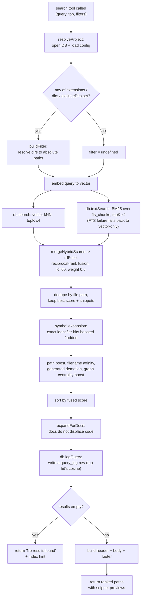

# Tool: search

`search` is the MCP tool an agent calls to find *where* something lives in a
codebase by meaning, not by exact string. You give it a natural-language query
("how does auth work") or a symbol name, and it returns a ranked list of file
paths, each with a short snippet preview, plus a one-line timing header and a tip
to follow up with `read_relevant`. It is the locate-first half of the workflow:
`search` tells you which files matter; [read_relevant](read-relevant.md) then
returns the actual function or class body with exact line ranges.

The tool is registered in `src/tools/search.ts:33` and hands the real work to the
`search()` function in `src/search/hybrid.ts:342`, which runs a hybrid query —
semantic plus keyword — against the SQLite index, fuses the two result lists by
rank, dedupes to one row per file, and reranks the survivors through several
scoring stages before returning them.

## When to use it

Reach for `search` when you need to know *where* a topic is implemented across
many files and want path-level results fast. When you instead need the code
itself — the body of a specific function or class with line numbers to navigate
to — use [read_relevant](read-relevant.md), which calls the chunk-level
`searchChunks()` path rather than the file-deduplicated `search()` path. When you
already know a symbol's exact name, [search_symbols](search-symbols.md) is a more
direct lookup. To see what queries have been returning poor results, check
[search_analytics](search-analytics.md), which reads the same log this tool
writes.

## How the two scorers are combined

The core idea is that two completely different rankers run over the same chunk
table, and their scores are not comparable. The vector leg (`db.search`) does a
k-nearest-neighbour scan over the `vec_chunks` embedding table and turns cosine
distance into `1 / (1 + distance)` (`src/db/search.ts:90`). The keyword leg
(`db.textSearch`) runs a BM25 query over the `fts_chunks` full-text table and
turns its `rank` into `1 / (1 + |rank|)` (`src/db/search.ts:132`). One lives on a
cosine scale, the other on a BM25 scale; a raw linear blend would be dominated by
whichever scorer happens to produce larger magnitudes, making the weight nearly
inert (`src/search/hybrid.ts:65-75`).

So the two lists are fused by **rank**, not by score. `rrfFuse` assigns each item
in a list a contribution of `K / (K + rank)` with `K = 60`, which is `1` at the
top of a list and decays smoothly down it. The two contributions are combined as
`weight * primaryRank + (1 - weight) * secondaryRank`, where `primary` is the
vector list and `secondary` is the BM25 list (`src/search/hybrid.ts:77-103`).
This is classic reciprocal-rank fusion: it is scale-free, keeps the fused scores
compressed near the top so the downstream boosts can still reorder them, and
dedups across the two lists by key. `mergeHybridScores` is a thin wrapper that
calls `rrfFuse` with the chunk key `path:chunkIndex`
(`src/search/hybrid.ts:109-115`). The default `hybridWeight` is `0.5` — equal
trust in the semantic and lexical signals (`src/config/index.ts:23`,
`src/search/hybrid.ts:63`).

### Identifier-aware keyword search

A plain full-text index would never let `depends` match `getDependsOn`, because
FTS5's default `unicode61` tokenizer splits on punctuation and whitespace but
*not* on case boundaries — `getDependsOn` is one opaque token
(`src/indexing/identifiers.ts:1-9`). To fix that, every chunk row carries a
companion `parts` column, and the `fts_chunks` virtual table indexes both
`snippet` and `parts` (`CREATE VIRTUAL TABLE ... fts_chunks USING fts5(snippet,
parts, content='chunks', ...)`, `src/db/index.ts:324-329`). The `parts` value is
built by `identifierParts`, which walks the chunk text and for each *compound*
identifier emits its lowercase word pieces (≥2 chars) via `splitIdentifier` —
camelCase, PascalCase, snake_case, kebab, and dotted names all split
(`src/indexing/identifiers.ts:13-41`). Single plain words already live in the
snippet, so they are not repeated; tokens longer than 80 characters are skipped
to avoid the case-boundary regex going quadratic on a base64/hex blob. The
keyword query itself is sanitized by `sanitizeFTS`, which double-quotes each
whitespace token and joins them with `OR`, so a query like `depends graph`
becomes `"depends" OR "graph"` and can hit either the snippet or the split
`parts` tokens (`src/search/usages.ts:39-43`, `src/db/search.ts:184`).

## How a call flows

The interesting part of this flow is not the call order between participants — it
is the staged rerank inside `search()`. Each stage rewrites the candidate scores,
and the final order depends on all of them. A flowchart shows those stages and
their branches better than a timeline would.



1. **Entry.** The MCP server invokes the handler registered under the name
   `search` with the validated arguments `query`, `directory`, `top`,
   `extensions`, `dirs`, and `excludeDirs` (`src/tools/search.ts:63`).
2. **Resolve the project.** `resolveProject` turns the optional `directory` into
   an absolute path (falling back to `RAG_PROJECT_DIR` or the current working
   directory), verifies it exists, loads the project config, and returns the index
   database for it (`src/tools/index.ts:22-37`).
3. **Build the path filter.** `buildFilter` returns `undefined` when none of the
   three scope arrays is populated; otherwise it builds a `PathFilter`, resolving
   each `dirs`/`excludeDirs` entry against the project directory so they match the
   absolute paths stored in the index (`src/tools/search.ts:13-29`).
4. **Embed and dual-search.** `search()` embeds the query, then runs the vector
   k-nearest-neighbour search and the BM25 keyword search, each over-fetching four
   times `topK` to leave room for deduplication and reranking
   (`src/search/hybrid.ts:352-363`).
5. **Fuse and dedupe.** The vector and keyword lists are combined by
   `mergeHybridScores` → `rrfFuse` (reciprocal-rank fusion) and then collapsed to
   one row per file path, keeping the best fused score and accumulating distinct
   snippets (`src/search/hybrid.ts:365-388`).
6. **Symbol expansion, then rerank.** Exact symbol-name matches for code-like
   words in the query are merged in, then the path, filename, generated-file, and
   dependency-graph adjustments rewrite the scores and the list is re-sorted
   (`src/search/hybrid.ts:390-410`).
7. **Protect docs, then log.** Documentation hits are appended as bonus results so
   they do not push code out of the top-K, and every call writes one analytics row
   before returning (`src/search/hybrid.ts:412-428`).
8. **Format or report empty.** Back in the tool, an empty list returns a plain "no
   results" message with an indexing hint; otherwise the results become a header,
   a scored body, and a footer tip (`src/tools/search.ts:74-102`).

## Inputs

| name | type | required | description |
| --- | --- | --- | --- |
| `query` | string (1–2000 chars) | yes | Natural-language question or symbol name. Embedded for the vector search and passed (after `sanitizeFTS`) to the keyword search (`src/tools/search.ts:38`). |
| `top` | integer 1–1000 | no | Number of results to return. Defaults to `config.searchTopK`, which is 8 unless overridden (`src/config/index.ts:24`, `src/tools/search.ts:70`). |
| `extensions` | string[] | no | Restrict to these file extensions, e.g. `[".ts", ".tsx"]`. A leading dot is optional; it is added if missing (`src/db/search.ts:52`). |
| `dirs` | string[] | no | Restrict to these directories, relative to the project root or absolute. Resolved to absolute paths before matching (`src/tools/search.ts:28`). |
| `excludeDirs` | string[] | no | Exclude these directories. Also resolved to absolute paths (`src/tools/search.ts:29`). |
| `directory` | string | no | Project directory to search. Defaults to the `RAG_PROJECT_DIR` env var or the current working directory (`src/tools/index.ts`). |

The `top`, `extensions`, `dirs`, and `excludeDirs` arguments are all optional;
only `query` must be supplied. The Zod schema rejects an empty query or one over
2000 characters before the handler runs (`src/tools/search.ts:38`).

## Outputs

| output | where it lands / shape / description |
| --- | --- |
| Ranked file paths with snippet previews | Returned as MCP text content. Each result is the fused score to four decimals, two spaces, the file path, then on the next line the first matched snippet truncated to 400 characters with a trailing `…` ellipsis. A `── N results across M indexed files (Tms) ──` header sits above and a tip to call `read_relevant` below (`src/tools/search.ts:86-98`). |
| `query_log` row | One row inserted into the `query_log` table per call, recording the query text, result count, the top vector hit's cosine similarity, the top result's path, and duration. This is a side effect, not part of the returned text (`src/search/hybrid.ts:422-428`). |

A sample of the returned text (synthetic values):

```
── 3 results across 412 indexed files (47ms) ──

0.5210  src/search/hybrid.ts
  export async function search(query: string, db: RagDB, topK ...

0.4980  src/tools/search.ts
  export function registerSearchTools(server: McpServer, getDB ...

0.4115  src/db/search.ts
  export function textSearch(db: Database, query: string ...

── Tip: call read_relevant with the same query to get full function/class content with exact line ranges. ──
```

The scores shown are fused rank values, not cosine similarities. Because
reciprocal-rank fusion compresses scores near the top (a top-of-both-lists hit
fuses to roughly `0.5 * 1 + 0.5 * 1 = 1.0` before the rerank multipliers), do not
read these numbers as a probability or a similarity — they are positional and only
meaningful relative to each other.

## State changes

### Query log row

Every search appends a row to the `query_log` table, regardless of whether any
results were found. After the rerank finishes, `search()` computes its own elapsed
time and calls `db.logQuery(...)` with the query string, the final result count,
the top result's path, the duration in milliseconds, and — deliberately — the
**top vector hit's cosine similarity** rather than the fused score
(`src/search/hybrid.ts:422-428`). Two conversions matter here. First, the fused
score is now a positional rank value that sits near `1.0` at the top, so logging
it would make "average top score" and the low-relevance (`< 0.3`) heuristic
meaningless. Second, the stored vector score is itself *not* a cosine: embeddings
are L2-normalized and `vec_chunks` uses vec0's default Euclidean distance, so the
stored `1 / (1 + distance)` bottoms out near `0.333` and the `< 0.3` heuristic
could never fire on it. So `search()` passes the raw vector score through
`vectorScoreToCosine`, which inverts the distance and applies `cosine = 1 −
distance² / 2` to recover a true cosine in `[-1, 1]` before logging it
(`src/db/search.ts:20-26`). The insert is a plain `INSERT INTO query_log (...)`
stamped with an ISO timestamp (`src/db/analytics.ts:3-8`); the table is created on
database open as part of the schema in `src/db/index.ts:482`.

| | value |
| --- | --- |
| before | no row for this call |
| after | one `query_log` row: `query`, `result_count`, `top_score` (top hit's cosine), `top_path`, `duration_ms`, `created_at` |

This matters because it is the only record of what was searched. The
[search_analytics](search-analytics.md) tool reads this table to surface
zero-result queries, low-scoring queries, top terms, and per-day volume — the
signal that reveals documentation or indexing gaps (`src/db/analytics.ts:10-77`).
Note the duration logged here is measured inside `search()` and covers only the
embed-search-rerank work; the tool computes a separate `durationMs` for the header
it returns, so the two timings can differ slightly (`src/tools/search.ts:69-71`).

## Branches and failure cases

- **No scope filter.** When `extensions`, `dirs`, and `excludeDirs` are all empty
  or absent, `buildFilter` returns `undefined` and the search runs across the
  whole index with no path constraints (`src/tools/search.ts:21-25`).
- **Scoped search.** When any scope array is set, the resulting `PathFilter` is
  pushed down into the SQL as parametrized `LIKE ? ESCAPE '\'` clauses
  (extensions as `%.ext`, dirs as `dir/%`, excludeDirs as `NOT LIKE dir/%`), and
  the inner vector/FTS query over-fetches five times `topK` so the filter has
  enough candidates to work with (`src/db/search.ts:37-78`). Each user-supplied
  extension and directory is run through `escapeLike` first, so a `%`, `_`, or `\`
  in a name (for example a directory called `my_module`) matches literally instead
  of acting as a SQL wildcard and silently over-matching (`src/search/usages.ts:24-26`).
  Symbol-expanded hits that bypassed SQL are filtered again in memory by
  `matchesFilter` (`src/search/hybrid.ts:397`).
- **Empty results.** If nothing survives, the tool returns a single message:
  `No results found ... across <N> indexed files. Has the directory been indexed?
  Try calling index_files first.` When a filter was active, the phrase ` matching
  the given scope` is inserted, hinting the scope may be too narrow rather than the
  index being empty (`src/tools/search.ts:74-84`).
- **Keyword-search failure.** The BM25 query is wrapped in a try/catch. If the
  full-text query throws (for example on input the FTS tokenizer rejects), it is
  logged at debug level and the search continues vector-only instead of failing
  the whole call — the fusion then runs with an empty secondary list
  (`src/search/hybrid.ts:358-363`).
- **Symbol expansion.** If the query contains code-like identifiers (mixed case,
  underscore, or dot, three or more characters, not a stop word), each is looked
  up by exact name via `db.searchSymbols`. A file that also matched semantically
  has its score raised toward `score * 1.3`; a file found only by symbol name is
  added with a high base score of `0.75` (`src/search/hybrid.ts:278-296`,
  `src/search/hybrid.ts:390-403`).
- **Documentation expansion.** When the top-K mixes docs (`.md`/`.mdx`) with code,
  `expandForDocs` extends the result window until the original code-slot count is
  restored (capped at twice `topK`) so docs ride along without evicting code; if
  every result is a doc, or none is, no expansion happens
  (`src/search/hybrid.ts:304-326`).
- **Missing directory.** `resolveProject` throws if the resolved path is absent,
  surfacing as a tool error before any search runs (`src/tools/index.ts`).

## Ranking heuristics

After the rank fusion, dedupe, and symbol expansion, three score transforms are
composed and the result is re-sorted (`src/search/hybrid.ts:405-410`). They run in
this nesting order: path boost first, then filename affinity (which also carries
the boilerplate and generated demotions as early-return branches), then the
dependency-graph boost.

| heuristic | effect | source |
| --- | --- | --- |
| Path boost | Test files multiplied by 0.85, source-tree files (`src/`, `lib/`, `app/`, `pkg`, `packages`, `internal`, `cmd`) by 1.1 | `src/search/hybrid.ts:123-132` |
| Filename / path affinity | +0.1 per query word found in the filename stem, +0.05 per word found in a directory segment | `src/search/hybrid.ts:242-244` |
| Boilerplate demotion | A fixed set of low-signal basenames (`types.ts`, `index.d.ts`, `doc.go`, …) multiplied by 0.8 | `src/search/hybrid.ts:219-221` |
| Generated demotion | Files matching the configured `generated` glob patterns multiplied by 0.75 | `src/search/hybrid.ts:223-225` |
| Dependency-graph boost | Widely imported files get a small additive boost, `0.05 * log2(importers + 1)` | `src/search/hybrid.ts:329-340` |

These are heuristics tuned for "find the implementation, not the test or the
generated stub." They are worth knowing when a result ranks higher or lower than
its raw fusion score would suggest. The same adjustments are applied per-chunk in
`searchChunks()` for [read_relevant](read-relevant.md), so the two tools rank
consistently (`src/search/hybrid.ts:579-627`).

## search vs read_relevant

Both tools share the hybrid pipeline, but they return different units and serve
different needs.

| | `search` | `read_relevant` |
| --- | --- | --- |
| Backing function | `search()` | `searchChunks()` |
| Unit returned | one entry per file (deduped) | individual chunks; same file can repeat |
| Body content | first snippet, truncated to 400 chars | full chunk content |
| Line ranges | no | yes (`path:start-end`) |
| Default count | `searchTopK` (8) | 8 (5 in leaf-only mode) |
| Annotations surfaced | no | yes (`[NOTE]` blocks) |
| Use it to | find *where* a topic lives | read the actual code |

## Example

```json
{
  "query": "how does hybrid ranking fuse vector and keyword results",
  "top": 5,
  "extensions": [".ts"],
  "dirs": ["src/search"],
  "excludeDirs": ["tests"]
}
```

This restricts the search to `.ts` files under `src/search`, excludes anything
under `tests`, and asks for the five best-ranked files.

## Key source files

- `src/tools/search.ts` — registers the `search` tool, builds the path filter,
  formats the header/body/footer, and handles the empty-result branch.
- `src/search/hybrid.ts` — the `search()` function plus `rrfFuse` /
  `mergeHybridScores`: embed, dual-search, rank fusion, dedupe, symbol expansion,
  rerank, doc expansion, and the analytics log write.
- `src/db/search.ts` — `vectorSearch`/`textSearch` and `buildPathFilter`, which
  turn cosine distance and BM25 rank into scores and push a `PathFilter` down into
  SQL `LIKE` clauses with a 5x over-fetch.
- `src/indexing/identifiers.ts` — `identifierParts` / `splitIdentifier`, which
  populate the `parts` FTS column so split identifier words are searchable.
- `src/db/analytics.ts` — `logQuery`, the insert into `query_log` that
  [search_analytics](search-analytics.md) later reads.
- `src/config/index.ts` — defaults for `searchTopK` (8), `hybridWeight` (0.5),
  and the `generated` patterns (empty) used when the caller omits them.
