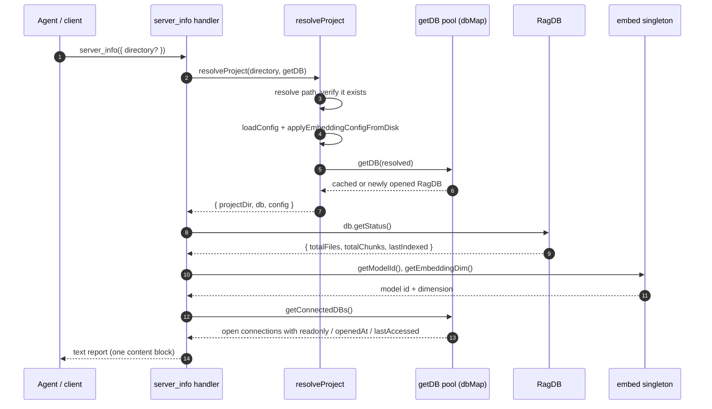

# Tool: server_info

`server_info` is the diagnostic tool you reach for when a result looks wrong and
you need to know what the running server is actually working with. In one call it
reports the package version, the resolved project and database directories, the
active log level, how much is indexed, which embedding model is loaded and at what
vector dimension, the key tuning values from the project config, and every
database the process currently holds open — including which ones are query-only,
how long each has been open, and how long since it was last touched.

It changes no stored data. It runs no search and indexes nothing. It is a read of
live process state plus one status query against SQLite, assembled into a
plain-text report. Reach for it when a tool returns surprising results (wrong
project? stale index? unexpected model?), when you want to confirm the server
picked up a config edit, or when you want to see which cross-repo connections are
attached.

The tool is registered in `src/tools/server-info-tools.ts:18` by
`registerServerInfoTools`, which the server wires up at startup through
`registerAllTools`, passing the live `getConnectedDBs` callback
(`src/tools/index.ts:130-148`, `src/server/index.ts:264`).

## Inputs

The tool takes a single optional argument.

| name | type | required | description |
| --- | --- | --- | --- |
| `directory` | string | no | Project directory to report on. When omitted it falls back to the `RAG_PROJECT_DIR` environment variable, then to the process working directory (`src/tools/index.ts:38`). |

## Outputs

The handler returns one text block — there is no structured JSON payload. Every
line is collected into a single array, joined with newlines, and returned as MCP
text content (`src/tools/server-info-tools.ts:77-79`).

| output | where it lands / shape / description |
| --- | --- |
| Server configuration report | One `text` content item. Sectioned plain text under `## Server`, `## Index`, `## Embedding`, `## Config (.mimirs/config.json)`, and `## Connected Databases (N)` headings. Reflects live process state at call time. |

## How it works



1. The client invokes `server_info` with an optional `directory`. The Zod schema
   marks the argument optional, so calling it with no arguments is valid
   (`src/tools/server-info-tools.ts:26-31`).
2. The handler calls `resolveProject(directory, getDB)`, the shared helper every
   tool uses to turn a directory argument into a concrete project
   (`src/tools/server-info-tools.ts:33`).
3. `resolveProject` resolves the directory to an absolute path and throws
   `Directory does not exist: <path>` when it is missing — one of the ways the
   call fails before producing a report (`src/tools/index.ts:52-57`).
4. It loads the project config from `.mimirs/config.json` and immediately applies
   the embedding settings, so the model id and dimension reported later reflect
   *this* project's config, not whatever was loaded earlier
   (`src/tools/index.ts:92`).
5. It asks the connection pool for the database via `getDB(resolved)`, which
   returns the already-open `RagDB` for that directory or opens a fresh one
   (`src/tools/index.ts:95`, `src/server/index.ts:46-95`).
6. Back in the handler, `db.getStatus()` runs the file/chunk count queries to read
   how much is indexed (`src/tools/server-info-tools.ts:34`).
7. The handler reads the embedding model id and vector dimension from the embedder
   singleton via `getModelId()` and `getEmbeddingDim()`
   (`src/tools/server-info-tools.ts:49-50`).
8. If the server passed a `getConnectedDBs` callback, the handler walks every open
   connection and computes its age and idle time
   (`src/tools/server-info-tools.ts:66-74`).
9. All lines are joined and returned as a single text content block
   (`src/tools/server-info-tools.ts:77-79`).

## The Server section

The first block reports four values (`src/tools/server-info-tools.ts:36-41`):

- `version` is read with a dynamic `import("../../package.json")` at call time, so
  it always matches the package the running build came from.
- `project_dir` is the absolute path `resolveProject` produced — the resolved
  form, not the raw argument.
- `db_dir` is `RAG_DB_DIR` when that environment variable is set, otherwise
  `<project_dir>/.mimirs`. This is the only place the report shows where the
  SQLite database actually lives, which matters when an override has moved it off
  the default location (`src/tools/server-info-tools.ts:40`).
- `log_level` is the `LOG_LEVEL` environment variable, defaulting to `warn` when
  unset. It reports the configured level; it does not change logging
  (`src/tools/server-info-tools.ts:41`).

## The Index section

These three numbers come straight from `db.getStatus()`, a thin wrapper over the
file-level status query (`src/db/index.ts:989-990`, `src/db/files.ts:418-436`):

- `files` is `SELECT COUNT(*) FROM files`.
- `chunks` is `SELECT COUNT(*) FROM chunks`.
- `last_indexed` is the newest `indexed_at` across all files
  (`SELECT indexed_at FROM files ORDER BY indexed_at DESC LIMIT 1`). The query
  returns `null` when no file row exists, and the handler prints the literal
  string `never` in that case
  (`src/tools/server-info-tools.ts:46`, `src/db/files.ts:427-434`).

A brand-new project reports `files: 0`, `chunks: 0`, `last_indexed: never`. This
is the same status data the [index_status](../tools/index-status.md) tool
surfaces, so the two will agree for a given project.

## The Embedding section

The model id and dimension are read from the embedder module's module-level
singletons, not from disk at report time. `currentModelId` and `currentDim` start
at the defaults `Xenova/all-MiniLM-L6-v2` and `384`
(`src/embeddings/embed.ts:53`, `src/embeddings/embed.ts:81-82`). `getModelId()`
returns `currentModelId` and `getEmbeddingDim()` returns `currentDim`
(`src/embeddings/embed.ts:423-431`).

The report shows only the model id and dimension — it does not print the pooling
strategy or dtype, even though the embedder tracks those internally. The values
can differ from the defaults because step 4 calls `applyEmbeddingConfigFromDisk`,
which reads the embedding fields straight from `.mimirs/config.json` (best-effort:
malformed JSON is ignored and falls back to the defaults) and then calls
`configureEmbedder` (`src/config/index.ts:413`). `configureEmbedder` only mutates
the singletons — and clears the cached extractor and tokenizer — when the model,
dimension, pooling, dtype, or revision actually changes
(`src/embeddings/embed.ts:105-128`). So the reported model and dimension reflect
the *current* project's configured embedder, which is why resolving the project
first matters before reading them. Reading the embedding fields from raw disk
rather than the validated config object is deliberate: a config that fails schema
validation still keeps its real `embeddingDim`, so the query embedder always
matches the dimension the index was built at (`src/tools/index.ts:84-92`).

A non-default model from `config.json` is not honored blindly.
`applyEmbeddingConfigFromDisk` runs the disk fields through `resolveModel`, which
ignores a custom `embeddingModel` unless `MIMIRS_ALLOW_CUSTOM_MODEL=1` is set,
because a cloned repo could otherwise choose which model mimirs downloads
(`src/config/index.ts:339-341`, `src/config/index.ts:351`).

## The Config section

The handler reads the in-memory `RagConfig` that `loadConfig` returned and prints
a curated subset (`src/tools/server-info-tools.ts:52-63`). These are the values
most likely to explain surprising indexing or search behavior:

| line | config field | default | meaning |
| --- | --- | --- | --- |
| `chunk_size` | `chunkSize` | 512 | Target chunk size in tokens (`src/config/index.ts:21`). |
| `chunk_overlap` | `chunkOverlap` | 50 | Overlap between adjacent chunks (`src/config/index.ts:22`). |
| `hybrid_weight` | `hybridWeight` | 0.5 | Tunes how the vector and BM25 result lists are fused in hybrid search (`src/config/index.ts:23`). |
| `search_top_k` | `searchTopK` | 8 | Default result count for searches (`src/config/index.ts:24`). |
| `incremental` | `incrementalChunks` | false | Whether re-indexing reuses unchanged chunks (`src/config/index.ts:27`). |
| `include` | `include.length` | many | Reported as a *count* of include glob patterns, not the patterns themselves (`src/tools/server-info-tools.ts:58`). |
| `exclude` | `exclude.length` | many | Reported as a count of exclude glob patterns (`src/tools/server-info-tools.ts:59`). |
| `index_batch` | `indexBatchSize` | optional | Only printed when set; embedding batch size (`src/tools/server-info-tools.ts:62`). |
| `index_threads` | `indexThreads` | optional | Only printed when set; thread count for embedding (`src/tools/server-info-tools.ts:63`). |

`hybrid_weight` weights how the two ranked lists are combined, not a percentage of
the final score. A higher value pulls results toward the vector (semantic)
ranking; a lower value pulls toward the BM25 (keyword) ranking. The schema clamps
it to the `0..1` range (`src/config/index.ts:23`). How that weight is actually
applied lives in the [hybrid search ranking](../mechanisms/hybrid-ranking.md)
mechanism.

The `include` and `exclude` lines deliberately show only the pattern *count* to
keep the report compact; the full pattern lists live in `.mimirs/config.json`. The
two optional lines are appended conditionally, so a config that never sets
`indexBatchSize` or `indexThreads` simply omits those rows
(`src/tools/server-info-tools.ts:62-63`).

The section is labeled `## Config (.mimirs/config.json)` because that file is the
source of truth, but the values printed are the parsed and validated config
object. `loadConfig` does not discard the whole file on a bad field: when schema
validation fails, it drops only the offending top-level keys and re-parses, so a
config that just sets one bad value keeps its other valid fields and the rest of
the report shows those rather than all defaults. Only if even the salvaged config
fails — or the file is unparseable JSON — does it log a warning and fall back to
the built-in defaults (`src/config/index.ts:183-203`).

## The Connected Databases section

This section is what distinguishes `server_info` from a static config dump: it
reports the *live* connection pool of the running process. It is only emitted when
the server supplied a `getConnectedDBs` callback
(`src/tools/server-info-tools.ts:66`). The MCP server always supplies one, so in
normal operation the section is present (`src/server/index.ts:264`).

The pool is a `Map` keyed by resolved project directory. Each entry records the
`RagDB`, whether it was opened `readonly`, the `openedAt` timestamp from when the
connection was first created, and a `lastAccessed` timestamp refreshed on every
`getDB` hit (`src/server/index.ts:23-31`, `src/server/index.ts:66`,
`src/server/index.ts:94`). A single server process can hold several open databases
at once — its own primary project plus any cross-repo connections — because
connections are kept open so background work like the file watcher and auto-index
never use a closed handle. The pool is capped at eight entries (`DB_MAP_MAX`):
once full, `getDB` evicts the least-recently-used idle connection that is not the
primary project, rather than closing a handle that may be mid-operation
(`src/server/index.ts:43`, `src/server/index.ts:71-94`).

For each connection the handler prints the project directory — suffixed with
`(query-only)` when that entry was opened read-only — then an age and an idle
duration computed against `Date.now()` and formatted by `formatDuration`
(`src/tools/server-info-tools.ts:69-74`). The primary project is opened writable
and shows no suffix; a repo attached with [connect_repo](../tools/connect-repo.md)
(or warm-attached from `connectedRepos` at startup) is opened query-only and
carries the `(query-only)` marker, because the foreign repo's own server owns
writes to it. The `readonly` flag the marker reflects is set when the connection
is created (`src/server/index.ts:94`) and surfaced by `getConnectedDBs`
(`src/server/index.ts:100-106`). `formatDuration` renders the largest sensible
unit: seconds under a minute, then `Xm Ys`, then `Xh Ym`, then `Xd Yh`
(`src/tools/server-info-tools.ts:169-178`). A high idle time on a connection is a
hint that the process is holding a database it has not touched recently.

## State changes

`server_info` itself writes nothing. The one indirect effect comes from
`resolveProject`, shared by every tool: if the requested project has no open
connection yet, `getDB` opens one and records it in the pool
(`src/server/index.ts:94`).

| name | before | after | why it matters | evidence |
| --- | --- | --- | --- | --- |
| Connection added to pool | directory absent from `dbMap` | a `DBEntry` with fresh `openedAt`/`lastAccessed` exists, and the `## Connected Databases` section lists it | reporting on a never-before-seen project opens (and keeps) a real SQLite handle | `src/server/index.ts:94` |
| `lastAccessed` refreshed | existing entry has a prior `lastAccessed` | `getDB` sets `entry.lastAccessed = new Date()` before returning | calling `server_info` resets that connection's reported idle time to roughly zero | `src/server/index.ts:66` |
| Embedder reconfigured | singleton holds the previously applied model/dim | `applyEmbeddingConfigFromDisk` may switch it to this project's model/dim if it differs | only updates the recorded id and dimension and clears the cached extractor — it does not load the model | `src/config/index.ts:413`, `src/embeddings/embed.ts:105-128` |

## Branches and failure cases

| condition | behavior | source |
| --- | --- | --- |
| `directory` omitted | Falls back to `RAG_PROJECT_DIR`, then `process.cwd()`. | `src/tools/index.ts:38` |
| Directory does not exist | `resolveProject` throws `Directory does not exist: <path>`; the tool errors before producing any report. | `src/tools/index.ts:52-57` |
| `directory` points at a non-configured, non-indexed dir | A read tool refuses to scaffold a database there: it throws either a `RAG_DB_DIR is set` error or a `No mimirs index at <path>` error rather than silently creating `.mimirs/` and an empty index. | `src/tools/index.ts:70-83` |
| `RAG_DB_DIR` set | `db_dir` shows that path; otherwise `<project_dir>/.mimirs`. | `src/tools/server-info-tools.ts:40` |
| `LOG_LEVEL` unset | `log_level` shows `warn`. | `src/tools/server-info-tools.ts:41` |
| Nothing indexed yet | `files`/`chunks` are `0` and `last_indexed` is `never`. | `src/tools/server-info-tools.ts:46`, `src/db/files.ts:427-434` |
| Custom embedding model/dim in config | `model`/`dim` reflect the configured values after `applyEmbeddingConfigFromDisk`; a non-default *model* is ignored unless `MIMIRS_ALLOW_CUSTOM_MODEL=1`. | `src/config/index.ts:339-341`, `src/config/index.ts:413` |
| `config.json` missing | `loadConfig` writes the defaults to disk and returns them, so the report shows defaults. | `src/config/index.ts:175-178` |
| `config.json` invalid (bad JSON) | `loadConfig` logs a warning and returns built-in defaults; the report shows defaults, not the broken file. | `src/config/index.ts:183-186` |
| `config.json` fails schema validation | `loadConfig` drops only the offending top-level keys, keeps the rest, and reports defaults only if even the salvaged config is unusable. | `src/config/index.ts:189-203` |
| `indexBatchSize` / `indexThreads` unset | Those two `## Config` rows are omitted entirely. | `src/tools/server-info-tools.ts:62-63` |
| `getConnectedDBs` callback absent | The whole `## Connected Databases` section is skipped. The MCP server always passes it, so this is the non-server / test path. | `src/tools/server-info-tools.ts:66` |
| Query-only connection present | That entry's line carries a `(query-only)` suffix; the primary writable project does not. | `src/tools/server-info-tools.ts:72`, `src/server/index.ts:94` |
| No databases open | Section header reads `## Connected Databases (0)` with no entries. In practice resolving the project just opened at least one. | `src/tools/server-info-tools.ts:68` |

## Example

Call with no arguments to report on the default project:

```json
{}
```

Or target a specific project:

```json
{ "directory": "/Users/example/repos/myproject" }
```

A representative report (synthetic values), with one cross-repo connection
attached query-only:

```
## Server
  version:     1.7.0
  project_dir: /Users/example/repos/myproject
  db_dir:      /Users/example/repos/myproject/.mimirs
  log_level:   warn

## Index
  files:        128
  chunks:       1842
  last_indexed: 2026-05-31T10:22:14.000Z

## Embedding
  model: Xenova/all-MiniLM-L6-v2
  dim:   384

## Config (.mimirs/config.json)
  chunk_size:      512
  chunk_overlap:   50
  hybrid_weight:   0.5
  search_top_k:    8
  incremental:     false
  include:         67 patterns
  exclude:         33 patterns
  index_batch:     50

## Connected Databases (2)
  - /Users/example/repos/myproject
    opened: 12m 4s ago  |  last_active: 0s ago
  - /Users/example/repos/backend  (query-only)
    opened: 12m 4s ago  |  last_active: 3m 18s ago
```

## Key source files

- `src/tools/server-info-tools.ts` — registers the `server_info` tool, assembles
  every report section, and defines `formatDuration`.
- `src/tools/index.ts` — `resolveProject`, the shared resolver that turns the
  `directory` argument into `{ projectDir, db, config }`, and `registerAllTools`,
  which wires the tool up with the `getConnectedDBs` callback.
- `src/server/index.ts` — owns the connection pool (`dbMap`, `getDB`,
  `getConnectedDBs`) whose live state the report exposes, including the
  `readonly` flag behind the `(query-only)` marker.
- `src/db/files.ts` — `getStatus`, the file/chunk count and last-indexed query
  behind the `## Index` section.
- `src/embeddings/embed.ts` — the embedder singleton plus `getModelId` and
  `getEmbeddingDim` behind the `## Embedding` section.
- `src/config/index.ts` — `loadConfig` and `applyEmbeddingConfigFromDisk` that
  produce the config object and the embedder settings.

## Related

- [index_status](../tools/index-status.md) — surfaces the same index counts on
  their own.
- [connect_repo](../tools/connect-repo.md) — attaches the query-only connections
  this report lists.
- [Server start](../server/start.md) — builds the connection pool and registers
  this tool during startup.
