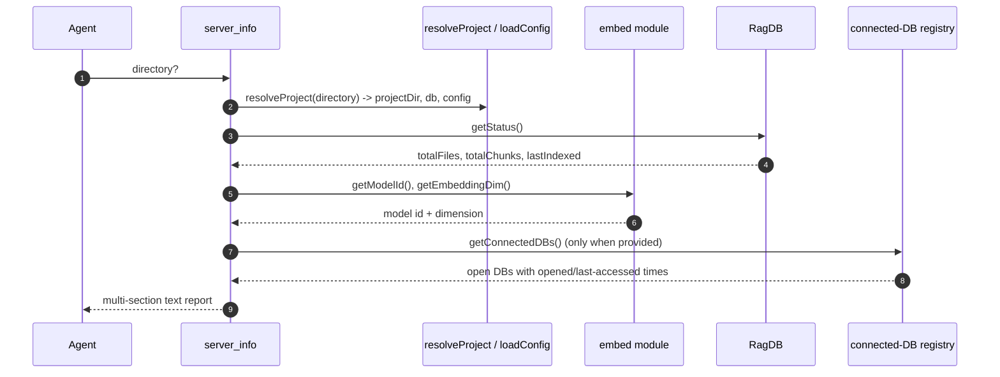

# Tool: server_info

`server_info` is a diagnostic readout. It tells an agent (or a human reading
the agent's output) what the MCP server is actually working with right now:
which project directory it resolved, where the database lives, how much is
indexed, which embedding model is loaded, the effective configuration values,
and — when running inside the long-lived server — every project database
currently open in memory. It is the tool to reach for when search behaves
unexpectedly and you want to confirm the server is pointed at the right project
with the settings you think it has.

It only reads state and formats it; it changes nothing.

## How it works

The handler is registered as the MCP tool `server_info` in
`registerServerInfoTools` (`src/tools/server-info-tools.ts:12-19`). It takes a
single optional `directory`, resolves the project and database with
`resolveProject` (`src/tools/server-info-tools.ts:27`), reads the index status
with `ragDb.getStatus()` (`src/tools/server-info-tools.ts:28`), and assembles a
text report in fixed sections.

The report is built as an array of lines and joined at the end
(`src/tools/server-info-tools.ts:30-73`). The values come from several
sources: the package version, environment variables, the index status query,
the embedding module's current model and dimension, and the resolved config
object.



1. The agent calls with an optional `directory`
   (`src/tools/server-info-tools.ts:20-25`).
2. `resolveProject` resolves the directory (or `RAG_PROJECT_DIR` / cwd),
   loads the project config, applies the embedding settings, and returns the
   project path, database handle, and config
   (`src/tools/server-info-tools.ts:27`).
3. `getStatus()` counts files and chunks and finds the most recent index time
   (`src/tools/server-info-tools.ts:28`, `src/db/files.ts`).
4. The current embedding model id and vector dimension are read from the
   embedding module (`src/tools/server-info-tools.ts:43-44`).
5. Config values are read straight off the resolved config object
   (`src/tools/server-info-tools.ts:47-57`).
6. If a connected-database accessor was wired in at registration, each open
   database is listed with how long ago it was opened and last accessed
   (`src/tools/server-info-tools.ts:60-69`).
7. The joined lines are returned as a single text block
   (`src/tools/server-info-tools.ts:71-73`).

## Inputs

| name | type | required | description |
| --- | --- | --- | --- |
| `directory` | string | no | Project directory to report on. Falls back to `RAG_PROJECT_DIR`, then cwd (`src/tools/server-info-tools.ts:21-24`). |

The report also draws on ambient inputs that are not call arguments: the
`RAG_DB_DIR` and `LOG_LEVEL` environment variables
(`src/tools/server-info-tools.ts:34-35`), the loaded project config, the
embedding module's current state, and — under the server — the in-memory
registry of open databases.

## Outputs

The single text block is divided into labeled sections.

| section | what it reports |
| --- | --- |
| `## Server` | Package version, resolved `project_dir`, the reported `db_dir`, and `log_level` (`LOG_LEVEL` or `warn`) (`src/tools/server-info-tools.ts:30-35`). |
| `## Index` | File count, chunk count, and last-indexed timestamp (or `never`) from `getStatus()` (`src/tools/server-info-tools.ts:37-40`). |
| `## Embedding` | The active embedding `model` id and vector `dim` (`src/tools/server-info-tools.ts:42-44`). |
| `## Config (.mimirs/config.json)` | `chunk_size`, `chunk_overlap`, `hybrid_weight`, `search_top_k`, `incremental`, and the count of `include` / `exclude` glob patterns. `index_batch` and `index_threads` lines appear only when those optional config values are set (`src/tools/server-info-tools.ts:46-57`). |
| `## Connected Databases (<n>)` | One entry per open database with its project directory and how long ago it was opened and last active. Present only when a connected-DB accessor was provided (`src/tools/server-info-tools.ts:60-69`). |

### The reported database location

The `db_dir` line shows `RAG_DB_DIR` when that environment variable is set,
otherwise it prints `<projectDir>/.rag`
(`src/tools/server-info-tools.ts:34`). When `RAG_DB_DIR` is not set, the actual
database is opened under `<projectDir>/.mimirs` by `RagDB`'s constructor
(`src/db/index.ts:94-96`). So with no `RAG_DB_DIR` override, the reported path
and the real on-disk path differ: the report says `.rag`, the database lives in
`.mimirs`. The section heading `## Config (.mimirs/config.json)` already points
at the real `.mimirs` directory. If you are hunting for the database file, look
under `.mimirs/index.db` regardless of what `db_dir` prints.

### Embedding model and dimension

`getModelId()` and `getEmbeddingDim()` return the currently active values, not
hard-coded defaults — they reflect any model override applied while loading the
project config (`src/embeddings/embed.ts:201-209`). The default model id and
dimension are defined in the same module
(`src/embeddings/embed.ts:16-17`, `src/embeddings/embed.ts:211-213`). The
dimension matters because the vector tables are created sized to it; a
mismatch between the configured dimension and the dimension the database was
built with is a real source of search failures
(`src/db/index.ts` schema uses `getEmbeddingDim()` when creating the vector
tables).

### Config values

The config section reads from the resolved config object whose defaults are
`chunkSize` 512, `chunkOverlap` 50, `hybridWeight` 0.7, `searchTopK` 10, and
`incrementalChunks` false (`src/config/index.ts:21-27`). The include/exclude
lines report only the pattern *counts*, not the patterns themselves
(`src/tools/server-info-tools.ts:52-53`).

## Connected databases

The MCP server can serve more than one project at once and caches an open
`RagDB` per project directory. The server wires its `getConnectedDBs` accessor
into the tool when it registers all tools
(`src/server/index.ts:189`), and that accessor returns each open database's
project directory, open time, and last-access time
(`src/server/index.ts:54-59`). `server_info` turns those timestamps into
human-readable durations with `formatDuration`, which scales from seconds up to
days (`src/tools/server-info-tools.ts:64-67`,
`src/tools/server-info-tools.ts:78-87`).

## Branches and failure cases

- **No connected-DB accessor.** The accessor is optional. When the tool is
  registered without it (for example outside the long-lived server), the
  `## Connected Databases` section is omitted entirely
  (`src/tools/server-info-tools.ts:60`).
- **Never indexed.** When `getStatus()` reports no last-indexed time, the
  `last_indexed` line prints `never`
  (`src/tools/server-info-tools.ts:40`).
- **Optional config not set.** The `index_batch` and `index_threads` lines are
  only added when `indexBatchSize` / `indexThreads` are present in config
  (`src/tools/server-info-tools.ts:56-57`).
- **Missing directory.** `resolveProject` throws if the resolved directory
  does not exist, before any report is built.
- **`LOG_LEVEL` / `RAG_DB_DIR` unset.** `log_level` defaults to `warn` and
  `db_dir` falls back to `<projectDir>/.rag`
  (`src/tools/server-info-tools.ts:34-35`).

## Example

Example arguments:

```json
{}
```

Illustrative output (values synthetic):

```
## Server
  version:     1.2.5
  project_dir: /Users/example/repos/myproject
  db_dir:      /Users/example/repos/myproject/.rag
  log_level:   warn

## Index
  files:        184
  chunks:       2103
  last_indexed: 2026-05-28T10:12:00.000Z

## Embedding
  model: <model-id>
  dim:   384

## Config (.mimirs/config.json)
  chunk_size:      512
  chunk_overlap:   50
  hybrid_weight:   0.7
  search_top_k:    10
  incremental:     false
  include:         40 patterns
  exclude:         12 patterns

## Connected Databases (1)
  - /Users/example/repos/myproject
    opened: 12m 4s ago  |  last_active: 3s ago
```

## Key source files

- `src/tools/server-info-tools.ts` — the MCP handler that assembles the
  report, plus `formatDuration` and the `ConnectedDBInfo` shape.
- `src/config/index.ts` — `loadConfig` and the config defaults the report
  echoes.
- `src/embeddings/embed.ts` — `getModelId` / `getEmbeddingDim` supply the
  embedding section.
- `src/db/index.ts` — `RagDB.getStatus` supplies the index counts; its
  constructor determines where the database actually lives.
- `src/server/index.ts` — provides the `getConnectedDBs` accessor used for the
  connected-databases section.

## Related flows

- [index_status](index-status.md) — focused report on indexing progress and
  the index lock, complementary to this tool's `## Index` section.
- [server/start](../server/start.md) — boots the server that maintains the
  connected-database registry listed here.
