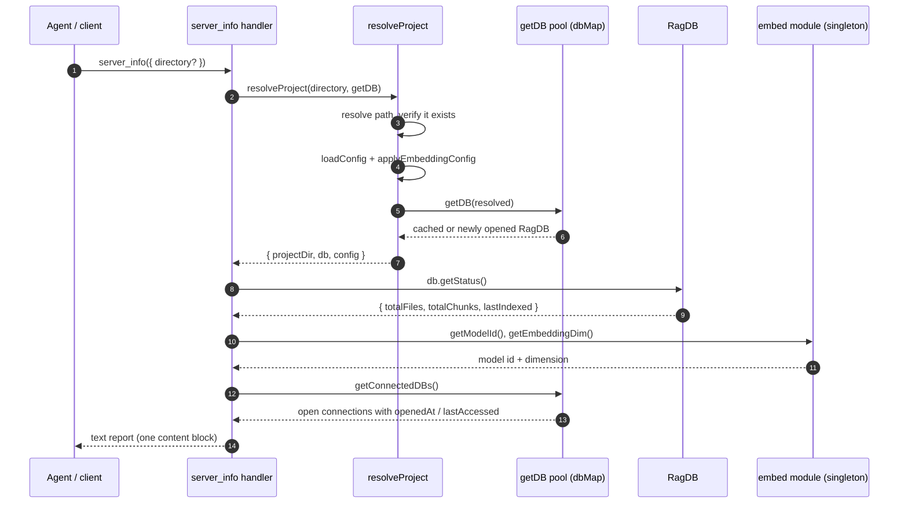

# Tool: server_info

`server_info` is a diagnostic MCP tool. It answers one question an agent or a
human debugging a flaky setup keeps asking: *what is this server actually doing
right now?* In one call it reports the package version, the resolved project and
database directories, the active log level, how much is indexed, which embedding
model is loaded and at what vector dimension, the key tuning values from the
project config, and every database the running process currently has open — with
how long each has been open and how long since it was last touched.

It changes no state. It opens no new files for writing. It is a pure read of
process state plus a single status query against the database, formatted into a
plain-text report. Reach for it when a tool returns surprising results (wrong
project? stale index? unexpected model?) or when you want to confirm the server
picked up the config you edited.

The tool is registered in `src/tools/server-info-tools.ts:12` by
`registerServerInfoTools`, which the server wires up at startup through
`registerAllTools` (`src/tools/index.ts:39-56`).

## What the caller provides

The tool takes a single optional argument.

| name | type | required | description |
| --- | --- | --- | --- |
| `directory` | string | no | Project directory to report on. When omitted it falls back to the `RAG_PROJECT_DIR` environment variable, then to the process working directory (`src/tools/index.ts:26`). |

## What the caller gets back

The handler returns a single text block — there is no structured JSON payload.
Everything is assembled into one array of lines that is joined with newlines and
returned as MCP text content (`src/tools/server-info-tools.ts:71-73`).

| output | where it lands / shape / description |
| --- | --- |
| Server configuration report | One `text` content item. Sectioned plain text under `## Server`, `## Index`, `## Embedding`, `## Config (.mimirs/config.json)`, and `## Connected Databases (N)` headings. Reflects live process state at call time. |

## How it works



1. The client invokes `server_info` with an optional `directory`. The Zod schema
   marks the argument optional, so calling it with no arguments is valid
   (`src/tools/server-info-tools.ts:20-25`).
2. The handler calls `resolveProject(directory, getDB)`, the shared helper every
   tool uses to turn a directory argument into a concrete project
   (`src/tools/server-info-tools.ts:27`).
3. `resolveProject` resolves the directory to an absolute path and throws
   `Directory does not exist: <path>` if it is missing — this is the only way the
   call fails before producing a report (`src/tools/index.ts:29-32`).
4. It loads the project config from `.mimirs/config.json` and immediately applies
   the embedding settings, so the model id and dimension reported later reflect
   *this* project's config, not just whatever was loaded earlier
   (`src/tools/index.ts:34-35`).
5. It asks the connection pool for the database via `getDB(resolved)`, which
   returns the already-open `RagDB` for that directory or opens a fresh one
   (`src/tools/index.ts:36`, `src/server/index.ts:34-51`).
6. Back in the handler, `db.getStatus()` runs three `COUNT`/`ORDER BY` queries to
   read how much is indexed (`src/tools/server-info-tools.ts:28`).
7. The handler reads the embedding model id and vector dimension from the
   embedder singleton via `getModelId()` and `getEmbeddingDim()`
   (`src/tools/server-info-tools.ts:43-44`).
8. If the server passed a `getConnectedDBs` callback, the handler walks every open
   connection and computes its age and idle time (`src/tools/server-info-tools.ts:60-68`).
9. All lines are joined and returned as a single text content block
   (`src/tools/server-info-tools.ts:71-73`).

## The Server section

The first block reports four values (`src/tools/server-info-tools.ts:30-35`):

- `version` is read with a dynamic `import("../../package.json")` at call time, so
  it always matches the package the running build came from.
- `project_dir` is the absolute path `resolveProject` produced — the resolved
  form, not the raw argument.
- `db_dir` is `RAG_DB_DIR` when that environment variable is set, otherwise
  `<project_dir>/.mimirs`. This is the only place the report shows where the
  SQLite database actually lives, which matters when an override has moved it off
  the default location.
- `log_level` is the `LOG_LEVEL` environment variable, defaulting to `warn` when
  unset. It reports the configured level; it does not change logging.

## The Index section

These three numbers come straight from `db.getStatus()`, which is a thin wrapper
over the file-level status query (`src/db/index.ts:646-648`,
`src/db/files.ts:354-372`):

- `files` is `SELECT COUNT(*) FROM files`.
- `chunks` is `SELECT COUNT(*) FROM chunks`.
- `last_indexed` is the newest `indexed_at` across all files, or the literal
  string `never` when no file row exists yet (`src/tools/server-info-tools.ts:40`).

A brand-new project reports `files: 0`, `chunks: 0`, `last_indexed: never`. This
is the same status data the [index_status](./index-status.md) tool surfaces, so
the two will agree for a given project.

## The Embedding section

The model id and dimension are read from the embedder module's module-level
singletons, not from disk (`src/embeddings/embed.ts:22-23`). `getModelId()`
returns `currentModelId` and `getEmbeddingDim()` returns `currentDim`
(`src/embeddings/embed.ts:202-208`). Out of the box these are
`Xenova/all-MiniLM-L6-v2` and `384` (`src/embeddings/embed.ts:16-17`).

The values can differ from the defaults because step 4 calls
`applyEmbeddingConfig`, which calls `configureEmbedder(model, dim)` using the
project's `embeddingModel` and `embeddingDim` config fields when they are set
(`src/config/index.ts:166-170`). `configureEmbedder` only mutates the singletons
when the model or dimension actually changes (`src/embeddings/embed.ts:35-42`).
So the reported model and dimension reflect the *current* project's configured
embedder — which is why resolving the project first matters before reading them.

## The Config section

The handler reads the in-memory `RagConfig` that `loadConfig` returned and prints
a curated subset (`src/tools/server-info-tools.ts:46-57`). These are the values
most likely to explain surprising indexing or search behavior:

| line | config field | default | meaning |
| --- | --- | --- | --- |
| `chunk_size` | `chunkSize` | 512 | Target chunk size in tokens for chunking (`src/config/index.ts:21`). |
| `chunk_overlap` | `chunkOverlap` | 50 | Overlap between adjacent chunks (`src/config/index.ts:22`). |
| `hybrid_weight` | `hybridWeight` | 0.7 | Vector-vs-keyword blend; 0.7 means 70% vector (`src/config/index.ts:23`). |
| `search_top_k` | `searchTopK` | 10 | Default result count for searches (`src/config/index.ts:24`). |
| `incremental` | `incrementalChunks` | false | Whether re-indexing reuses unchanged chunks (`src/config/index.ts:27`). |
| `include` | `include.length` | many | Reported as a *count* of include glob patterns, not the patterns themselves. |
| `exclude` | `exclude.length` | many | Reported as a count of exclude glob patterns. |
| `index_batch` | `indexBatchSize` | optional | Only printed when set; embedding batch size (`src/tools/server-info-tools.ts:56`). |
| `index_threads` | `indexThreads` | optional | Only printed when set; thread count for embedding (`src/tools/server-info-tools.ts:57`). |

The `include` and `exclude` lines deliberately show only the pattern *count* to
keep the report compact; the full pattern lists live in `.mimirs/config.json`.
The two optional lines are appended conditionally, so a config that never sets
`indexBatchSize` or `indexThreads` simply omits those rows
(`src/tools/server-info-tools.ts:56-57`).

Note the section is labeled `## Config (.mimirs/config.json)` because that file is
the source of truth, but the values printed are the parsed and validated config
object. If `config.json` had invalid JSON or failed schema validation, `loadConfig`
would have logged a warning and returned the built-in defaults, so the report
would show defaults rather than the broken file's contents
(`src/config/index.ts:146-157`).

## The Connected Databases section

This section is what distinguishes `server_info` from a static config dump: it
reports the *live* connection pool of the running process. It is only emitted
when the server supplied a `getConnectedDBs` callback
(`src/tools/server-info-tools.ts:60`). The MCP server always supplies one, so in
normal operation the section is present (`src/server/index.ts:189`).

The pool is a `Map` keyed by resolved project directory. Each entry records the
`RagDB`, the `openedAt` timestamp from when the connection was first created, and
a `lastAccessed` timestamp refreshed on every `getDB` hit
(`src/server/index.ts:23-51`). A single server process can hold several open
databases at once — one per project directory it has been asked about — because
connections are kept open so background work like the file watcher and auto-index
never use a closed handle (`src/server/index.ts:20-22`).

For each connection the handler prints the project directory, then an age and an
idle duration computed against `Date.now()` and formatted by `formatDuration`
(`src/tools/server-info-tools.ts:63-68`). `formatDuration` renders the largest
sensible unit: seconds under a minute, then `Xm Ys`, then `Xh Ym`, then `Xd Yh`
(`src/tools/server-info-tools.ts:78-87`). A high idle time on a connection is a
hint that the process is holding a database it has not touched recently.

## Branches and failure cases

| condition | behavior | source |
| --- | --- | --- |
| `directory` omitted | Falls back to `RAG_PROJECT_DIR`, then `process.cwd()`. | `src/tools/index.ts:26` |
| Directory does not exist | `resolveProject` throws `Directory does not exist: <path>`; the tool errors before producing any report. | `src/tools/index.ts:30-32` |
| `RAG_DB_DIR` set | `db_dir` shows that path; otherwise `<project_dir>/.mimirs`. | `src/tools/server-info-tools.ts:34` |
| `LOG_LEVEL` unset | `log_level` shows `warn`. | `src/tools/server-info-tools.ts:35` |
| Nothing indexed yet | `files`/`chunks` are `0` and `last_indexed` is `never`. | `src/tools/server-info-tools.ts:40`, `src/db/files.ts:361-370` |
| Custom embedding model/dim in config | `model`/`dim` reflect the configured values after `applyEmbeddingConfig`. | `src/config/index.ts:166-170` |
| `config.json` missing | `loadConfig` writes the defaults to disk and returns them, so the report shows defaults. | `src/config/index.ts:136-140` |
| `config.json` invalid (bad JSON or schema) | `loadConfig` logs a warning and returns built-in defaults; the report shows defaults, not the broken file. | `src/config/index.ts:146-157` |
| `indexBatchSize` / `indexThreads` unset | Those two `## Config` rows are omitted entirely. | `src/tools/server-info-tools.ts:56-57` |
| `getConnectedDBs` callback absent | The whole `## Connected Databases` section is skipped. (The MCP server always passes it, so this is the non-server / test path.) | `src/tools/server-info-tools.ts:60` |
| No databases open | Section header reads `## Connected Databases (0)` with no entries. In practice resolving the project just opened at least one. | `src/tools/server-info-tools.ts:62-63` |

## State changes

`server_info` itself writes nothing. The one indirect side effect comes from
`resolveProject`, shared by every tool: if the requested project has no open
connection yet, `getDB` opens one and records it in the pool
(`src/server/index.ts:47-48`). Two things follow when that happens.

- **A connection may be added to the pool.** Before the call the directory may be
  absent from `dbMap`; after it, a `DBEntry` with fresh `openedAt`/`lastAccessed`
  exists and the `## Connected Databases` section will list it
  (`src/server/index.ts:40-48`).
- **`lastAccessed` is refreshed.** For an already-open connection, `getDB` sets
  `entry.lastAccessed = new Date()` before returning, so calling `server_info`
  resets that connection's reported idle time to roughly zero
  (`src/server/index.ts:42-44`).

A side effect of `applyEmbeddingConfig` is that the embedder singleton may be
reconfigured to the project's model/dim if it differs from what was last set
(`src/config/index.ts:166-170`, `src/embeddings/embed.ts:35-42`). This does not
load the model — it only updates the recorded model id and dimension and clears
any cached extractor.

## Example

Call with no arguments to report on the default project:

```json
{}
```

Or target a specific project:

```json
{ "directory": "/Users/example/repos/myproject" }
```

A representative report (synthetic values):

```
## Server
  version:     1.3.0
  project_dir: /Users/example/repos/myproject
  db_dir:      /Users/example/repos/myproject/.mimirs
  log_level:   warn

## Index
  files:        128
  chunks:       1842
  last_indexed: 2026-05-31T10:22:14.000Z

## Embedding
  model: Xenova/all-MiniLM-L6-v2
  dim:   384

## Config (.mimirs/config.json)
  chunk_size:      512
  chunk_overlap:   50
  hybrid_weight:   0.7
  search_top_k:    10
  incremental:     false
  include:         67 patterns
  exclude:         33 patterns
  index_batch:     50

## Connected Databases (1)
  - /Users/example/repos/myproject
    opened: 12m 4s ago  |  last_active: 0s ago
```

## Key source files

- `src/tools/server-info-tools.ts` — registers the `server_info` tool, assembles
  every report section, and defines `formatDuration`.
- `src/tools/index.ts` — `resolveProject`, the shared resolver that turns the
  `directory` argument into `{ projectDir, db, config }`, and `registerAllTools`,
  which wires the tool up with the `getConnectedDBs` callback.
- `src/server/index.ts` — owns the connection pool (`dbMap`, `getDB`,
  `getConnectedDBs`) whose live state the report exposes.
- `src/db/files.ts` — `getStatus`, the file/chunk count and last-indexed query
  behind the `## Index` section.
- `src/embeddings/embed.ts` — the embedder singleton plus `getModelId` and
  `getEmbeddingDim` behind the `## Embedding` section.
- `src/config/index.ts` — `loadConfig`/`applyEmbeddingConfig` that produce the
  config object and the embedder settings.

## Related

- [index_status](./index-status.md) — surfaces the same index counts on their own.
- [Server start](../server/start.md) — builds the connection pool and registers
  this tool during startup.
