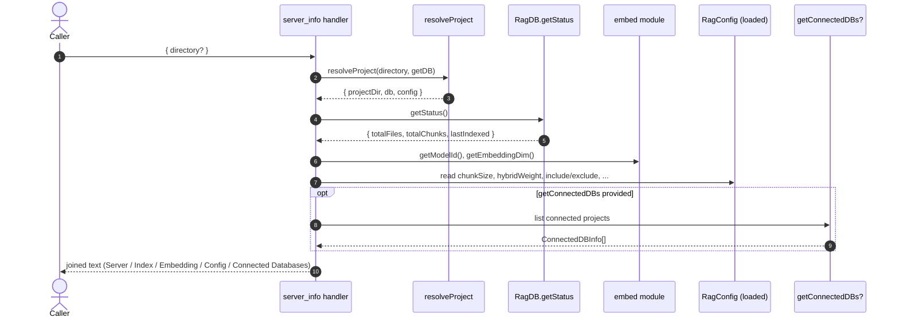

# Tool: server_info

Reports a single multi-section diagnostic blob describing the running mimirs MCP server: what version it is, where it is looking for files and the SQLite DB, how many files and chunks are indexed, which embedding model is loaded, the resolved config values, and the list of project DBs currently open in the same server process. It is the "what is my server actually doing right now" introspection tool.

Pure read-only. No side effects on the DB, no spawning, no embedding work.

## Flow



1. The caller passes an optional `directory`. The handler resolves it through `resolveProject(directory, getDB)`, which returns the chosen project's path, the cached `RagDB` instance, and the loaded `RagConfig` `src/tools/server-info-tools.ts:26-27`.
2. `ragDb.getStatus()` runs two `COUNT(*)` queries and reads the most recent `indexed_at` to produce `{ totalFiles, totalChunks, lastIndexed }` `src/db/files.ts`.
3. The handler builds the `Server` section: package version (imported dynamically from `package.json`), the resolved `project_dir`, the DB directory (`RAG_DB_DIR` env or `<projectDir>/.rag`), and the active log level (`LOG_LEVEL` env or `warn`) `src/tools/server-info-tools.ts:30-35`.
4. The `Index` section prints the three `getStatus` fields. `last_indexed` falls back to the literal `never` when no files have been ingested yet `src/tools/server-info-tools.ts:37-40`.
5. The `Embedding` section reads `getModelId()` and `getEmbeddingDim()` from `src/embeddings/embed.ts`. These reflect the model that was configured at server start by `applyEmbeddingConfig`, not the disk config — if a session changed the model in memory, what is shown here is what will be used for the next embed `src/embeddings/embed.ts:201-211`.
6. The `Config (.mimirs/config.json)` section prints six values that always show, plus two that only show when truthy (`indexBatchSize`, `indexThreads`). The `include` and `exclude` lines render counts, not the patterns themselves `src/tools/server-info-tools.ts:46-57`.
7. If the server registered a `getConnectedDBs` callback at startup, the handler appends `## Connected Databases (<n>)` and, for each `ConnectedDBInfo`, prints two lines with `opened ... ago` and `last_active ... ago` durations computed against `Date.now()` and formatted by the local `formatDuration` helper `src/tools/server-info-tools.ts:60-69`.
8. All lines are joined with `\n` into one MCP text content block.

## Inputs

| Name | Type | Default | Notes |
| --- | --- | --- | --- |
| `directory` | string | `RAG_PROJECT_DIR` env or cwd | Selects which project this snapshot is for. Other open projects still appear in `Connected Databases`. |

## Outputs

| Output | Shape |
| --- | --- |
| MCP text content | One string with sections `## Server`, `## Index`, `## Embedding`, `## Config (.mimirs/config.json)`, and optionally `## Connected Databases (N)`. Field labels are stable; values reflect live state. |

### What each section reports

- **Server.** `version` from `package.json`; `project_dir` resolved by `resolveProject`; `db_dir` from `RAG_DB_DIR` env or the default `<projectDir>/.rag`; `log_level` from `LOG_LEVEL` env, default `warn` `src/tools/server-info-tools.ts:30-35`.
- **Index.** `files`, `chunks`, and `last_indexed` — directly from `RagDB.getStatus()` over the `files` and `chunks` tables; `last_indexed` is the max `indexed_at` or `never`.
- **Embedding.** `model` is the runtime model id (e.g. the default in `DEFAULT_MODEL_ID`, or whatever `configureEmbedder` last applied). `dim` is the embedding dimension reported by the loaded embedder (or `DEFAULT_EMBEDDING_DIM` if no embedder has been loaded yet) `src/embeddings/embed.ts:201-211`.
- **Config (.mimirs/config.json).** `chunk_size`, `chunk_overlap`, `hybrid_weight`, `search_top_k`, `incremental`, plus `include`/`exclude` pattern counts. `index_batch` and `index_threads` only appear when set. Defaults (`chunkSize: 512`, `chunkOverlap: 50`, `hybridWeight: 0.7`, `searchTopK: 10`, `incrementalChunks: false`) come from `DEFAULT_CONFIG` in `src/config/index.ts:39-125`.
- **Connected Databases.** Per-project `opened` (time since `openedAt`) and `last_active` (time since `lastAccessed`). Durations are formatted as `<n>s`, `<n>m <n>s`, `<n>h <n>m`, or `<n>d <n>h` depending on magnitude `src/tools/server-info-tools.ts:78-87`.

## Branches and failure cases

- **Optional `getConnectedDBs`.** The registration function takes `getConnectedDBs?` as a third argument. When the host server did not pass one, the `Connected Databases` section is omitted entirely — there is no "0 connections" placeholder `src/tools/server-info-tools.ts:12-16`, `src/tools/server-info-tools.ts:60-69`.
- **`indexBatchSize` / `indexThreads` are conditional.** Both lines are guarded by truthiness checks — when the config leaves them undefined or zero, they are silently dropped `src/tools/server-info-tools.ts:56-57`.
- **`last_indexed` placeholder.** If the index is empty or has never been written, `getStatus` returns `lastIndexed: null` and the line reads `never` `src/tools/server-info-tools.ts:40`.
- **`include`/`exclude` are counts, not patterns.** The view is intentionally compact. To see the patterns, open `.mimirs/config.json` directly.
- **Env-var precedence.** `db_dir` and `log_level` are read from the environment at request time, not from the config file. Changing `RAG_DB_DIR` mid-session is reflected on the next call, even though the open DB handle still points at the original path.

## Example

```json
{
  "name": "server_info",
  "arguments": { "directory": "/Users/me/repos/example" }
}
```

Illustrative output (synthetic values):

```
## Server
  version:     0.x.y
  project_dir: /Users/me/repos/example
  db_dir:      /Users/me/repos/example/.rag
  log_level:   warn

## Index
  files:        420
  chunks:       12345
  last_indexed: 2026-05-27T10:11:12.000Z

## Embedding
  model: <model-id>
  dim:   <dim>

## Config (.mimirs/config.json)
  chunk_size:      512
  chunk_overlap:   50
  hybrid_weight:   0.7
  search_top_k:    10
  incremental:     false
  include:         42 patterns
  exclude:         24 patterns

## Connected Databases (1)
  - /Users/me/repos/example
    opened: 3m 12s ago  |  last_active: 4s ago
```

## Related flows

- [index_status](index-status.md) — narrower view: just the index counters and last-indexed timestamp.
- [cli/doctor](../cli/doctor.md) — the same kind of report from the CLI, suitable for issue reports.
- [cli/serve](../cli/serve.md) — the long-running server that exposes this tool and owns the connected-DB list.

## Key source files

- `src/tools/server-info-tools.ts` — registers `server_info`, assembles the text, formats durations.
- `src/config/index.ts` — defines `RagConfig`, defaults, and the loader (`DEFAULT_CONFIG` at `src/config/index.ts:39`, `loadConfig` at `src/config/index.ts:131`).
- `src/embeddings/embed.ts` — exposes `getModelId` and `getEmbeddingDim` for the Embedding section.
- `src/db/index.ts` — the `RagDB` class whose `getStatus` backs the Index section.
