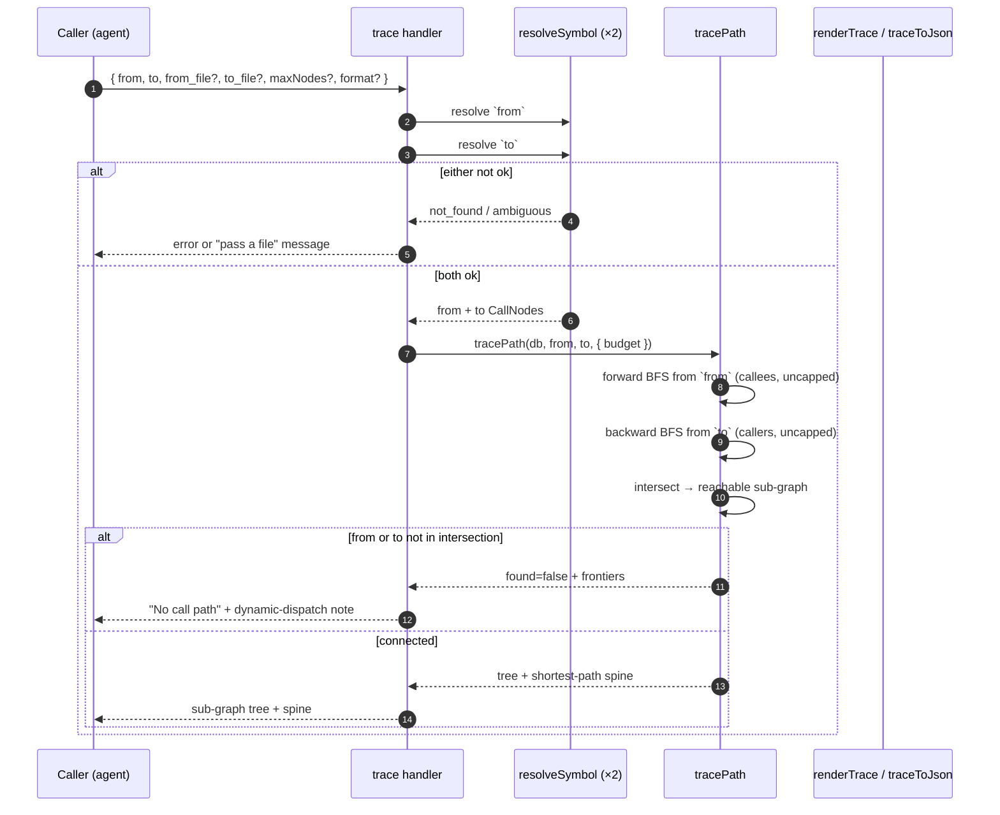

# Tool: trace

`trace` answers a directional question about the call graph: *how does one symbol reach another?* You name a `from` function and a `to` function, and it returns the reachable call sub-graph between them — every function that lies on some path from the source to the target — with the shortest path highlighted as a "spine." Branches that wander off and never reach the target are pruned away, so what you see is only the routes that actually connect the two.

This is the tool for "I know `handleRequest` eventually triggers `writeAudit`, but through what?" — onboarding into an unfamiliar call chain, confirming a refactor didn't sever a path, or understanding why a change in one place shows up in another. It is the directional counterpart to [`impact`](impact.md), which walks *all* callers of a single symbol regardless of destination. For raw textual references see [`usages`](usages.md), and for the single hop *outward* — what one symbol calls — see [`callees`](callees.md).

## What runs when you call it



1. The caller invokes the tool with required `from` and `to` names plus optional `from_file`, `to_file`, `maxNodes`, `directory`, and `format`. The handler is registered inside `registerGraphTools` (`src/tools/graph-tools.ts:273-311`).
2. Each endpoint is resolved with `resolveSymbol`, optionally disambiguated by its `_file` argument. If either fails to resolve to a single callable, the tool returns an error or a "pass a file" message and stops before doing any graph work (`src/tools/graph-tools.ts:296-303`).
3. With both endpoints resolved, `tracePath` runs a forward breadth-first search from `from` over *callees* and a backward one from `to` over *callers*, then intersects them (`src/graph/trace.ts:431-435`).
4. If the intersection does not contain both endpoints, the two are not connected through any statically resolvable path: the tool reports `found: false` and a pair of frontiers to help the caller find the gap (`src/graph/trace.ts:437-452`).
5. Otherwise it builds a forward tree over the sub-graph and computes the shortest path (the spine), returned as readable text by `renderTrace` or as JSON by `traceToJson` (`src/graph/trace.ts:464-495`, `src/tools/graph-tools.ts:305-309`).

## The reachable sub-graph: forward ∩ backward

The core idea is a set intersection. A function lies on *some* path from `from` to `to` if and only if two things are true at once: `from` can reach it (it is forward-reachable along callee edges), and it can reach `to` (it is backward-reachable along caller edges from the target). Nodes that satisfy only one of those are dead ends — reachable from the source but going nowhere useful, or feeding the target but not from this source — and have no business in the answer (`src/graph/trace.ts:429-430`).

`tracePath` computes this with two breadth-first searches sharing one `CallGraph` view (`src/graph/trace.ts:413`). The forward search walks `callees` outward from `from`; the backward search walks `callers` outward from `to` (`src/graph/trace.ts:431-432`). The callee and caller edges come from the resolved symbol-ref graph — `getCalleeRefsForExport` / `getCalleeRefsForLocalSymbol` forward, `getCallersOfExport` / `getCallersOfLocalSymbol` backward — with unresolved or non-callable refs dropped as leaves (`src/graph/trace.ts:81-151`). The reachable sub-graph is the set of keys present in *both* searches (`src/graph/trace.ts:434-435`). This is what "branches that don't reach the target are pruned" means concretely: a node only survives if it appears in both directions.

Reachability here is **complete**, not bounded by a hop count. Both searches run with `Infinity` depth and `Infinity` budget, so the only thing that terminates them is the visited-set that every breadth-first walk keeps — the graph is finite, so an uncapped walk still halts (`src/graph/trace.ts:431-432`, `src/graph/trace.ts:406-411`). The consequence matters for how you read a result: a "no path" answer means the two symbols are *truly* unreachable through the static call graph, not merely "farther apart than some limit." A trivial case short-circuits before either search runs: if `from` and `to` resolve to the same node, the trace is a single node with nothing to walk (`src/graph/trace.ts:417-427`).

The `maxNodes` argument does **not** affect that connectivity answer. It bounds only how much of the connecting sub-graph is *drawn* for display; a path is always found if one exists (`src/graph/trace.ts:410-411`).

## The forward tree and the shortest-path spine

Once the sub-graph is known, the tool presents it two ways. First it restricts the forward adjacency to sub-graph members only, then builds a tree rooted at `from`, where each node's children are its sub-graph callees; the target is treated as a leaf, and a node reached a second time is shown once and marked seen so diamonds don't duplicate (`src/graph/trace.ts:457-493`). This tree is the full picture of how the source fans out toward the target. The drawn tree is bounded by the display `budget` (default 300): the shortest-path spine is always kept, and other nodes fill the remaining budget. When that budget is exceeded, a `truncated` flag is set, but `subgraphSize` still reports the *true* connecting size rather than the drawn one (`src/graph/trace.ts:468-491`).

Second, it computes the **spine** — the shortest path from `from` to `to` — with a breadth-first search over the restricted adjacency that records each node's predecessor, then walks the predecessor chain back from the target (`src/graph/trace.ts:464`, `src/graph/trace.ts:498-526`). The renderer prints it as `from → … → to (N hops)`, the at-a-glance route through what may be a wide sub-graph (`src/graph/trace.ts:734-735`).

## When there is no path: frontiers and the static-resolution limit

If the intersection is missing either endpoint, the two functions are not connected through any statically resolvable path, and the tool says so plainly. To make the gap diagnosable rather than a dead "not found," it returns two frontiers: the deepest nodes the forward search reached from `from`, and the direct callers of `to` — each capped at 8 entries (`src/graph/trace.ts:446-450`). Read together, they show where the forward reach stopped and what feeds the target, so you can spot the missing hop.

That missing hop is usually the same thing: **resolution is static name-match.** The walk follows edges only where a callee or caller resolves to an indexed callable. A dynamic-dispatch hop — a callback passed as a value, an interface method dispatched to an implementation, a dependency-injected service — has no statically resolvable edge, so the chain ends there (`src/graph/trace.ts:11-14`). The no-path message states this explicitly and points the reader at `read_relevant` to inspect the gap manually (`src/graph/trace.ts:710-723`). This is a real limitation, not a bug: a "no path" result means *no statically resolvable path*, and a genuine runtime path may still exist across a dynamic boundary.

## Inputs

| name | type | required | description |
| --- | --- | --- | --- |
| `from` | string (1–200 chars) | yes | Source symbol (function/method) the path starts at (`src/tools/graph-tools.ts:277`). |
| `to` | string (1–200 chars) | yes | Target symbol the path should reach (`src/tools/graph-tools.ts:278`). |
| `from_file` | string | no | Project-relative path to disambiguate `from` when defined in several places (`src/tools/graph-tools.ts:279`). |
| `to_file` | string | no | Project-relative path to disambiguate `to` (`src/tools/graph-tools.ts:280`). |
| `maxNodes` | integer (≥ 1) | no | Max nodes to *draw* in the connecting sub-graph. Defaults to 300. Does not limit reachability — a path is always found if one exists (`src/tools/graph-tools.ts:281-286`, `src/graph/trace.ts:412`). |
| `directory` | string | no | Project whose index to query. Defaults to `RAG_PROJECT_DIR` or the current working directory (`src/tools/index.ts:38-39`). |
| `format` | `"text"` \| `"json"` | no | Output shape. Defaults to `"text"`; `"json"` returns the object from `traceToJson` (`src/tools/graph-tools.ts:291`, `src/tools/graph-tools.ts:306-308`). |

## Outputs

| output | where it lands / shape / description |
| --- | --- |
| Reachable sub-graph tree | On success, a text tree rooted at `from`, indented, with the target marked `◀ target` and revisited nodes marked `(↑ seen above)`; the header states the sub-graph node count (`src/graph/trace.ts:726-733`). |
| Shortest-path spine | A `spine (shortest): from → … → to (N hops)` line below the tree (`src/graph/trace.ts:734-735`). |
| No-path frontier | When unconnected, text: a "No call path …" line, the static-resolution note, the deepest forward-reached nodes, and the direct callers of `to` (`src/graph/trace.ts:710-723`). |

For `format: "json"`, the structured object carries `from`, `to`, `found`, `subgraphSize`, `truncated`, the `spine`, the `tree`, and (when not found) `forwardFrontier` / `backwardFrontier` (`src/graph/trace.ts:770-782`).

This tool only reads the index; it writes nothing back, so it produces no persistent state changes.

## Branches and failure cases

- **`from` unresolved.** If `from` resolves to `not_found` or `ambiguous`, the tool returns the resolve error for the `from` role and stops before resolving `to` (`src/tools/graph-tools.ts:296-299`).
- **`to` unresolved.** Same handling for the `to` role (`src/tools/graph-tools.ts:300-303`). The error names whether the symbol was missing or defined in multiple places and reminds the caller that `trace` tracks functions and methods, not classes/constants/types (`src/tools/graph-tools.ts:36-45`).
- **Same symbol.** When `from` and `to` resolve to the same node, the trace short-circuits to a one-node result, and the renderer reports "resolve to the same symbol — nothing to trace" (`src/graph/trace.ts:417-427`, `src/graph/trace.ts:707-709`).
- **No path.** When the forward/backward intersection misses an endpoint, `found` is false and the frontier report is returned; because reachability was complete this is a definitive no-path, not a "searched too shallow" (`src/graph/trace.ts:437-452`, `src/graph/trace.ts:710-723`).
- **Drawn sub-graph truncated.** Hitting the node budget while drawing the tree sets `truncated`; the renderer adds a note that the drawn sub-graph was capped and states the true connecting node count. The spine is always kept regardless (`src/graph/trace.ts:484-491`, `src/graph/trace.ts:736`).
- **Dynamic-dispatch gap.** A callback, interface→impl, or DI hop has no static edge and ends the chain; this commonly produces the no-path branch and is called out in its message (`src/graph/trace.ts:11-14`, `src/graph/trace.ts:713`).
- **Missing directory.** A non-existent `directory` makes `resolveProject` throw before any search runs (`src/tools/index.ts:45-47`).

## Example

Trace how one function reaches another, widening the drawn sub-graph:

```json
{
  "from": "handleSearch",
  "to": "logQuery",
  "maxNodes": 500
}
```

Illustrative text output (names and line numbers are synthetic):

```
Trace  handleSearch ⇒ logQuery  (reachable sub-graph: 4 nodes)

handleSearch  src/example/search.ts:30
  runHybrid  src/example/hybrid.ts:120
    rankResults  src/example/hybrid.ts:200
      logQuery  src/example/analytics.ts:18  ◀ target

spine (shortest): handleSearch → runHybrid → rankResults → logQuery  (3 hops)
```

A disconnected pair instead returns:

```
No call path from handleSearch to logQuery (searched the full reachable graph).
Resolution is static — a dynamic-dispatch hop (callback, interface→impl, DI) breaks the chain. Try read_relevant around the gap.

From handleSearch, deepest reached:
  runHybrid  src/example/hybrid.ts:120

Direct callers of logQuery:
  rankResults  src/example/hybrid.ts:200
```

## Key source files

- `src/tools/graph-tools.ts` — registers the `trace` MCP tool, resolves both endpoints, dispatches to `tracePath`, and renders text or JSON (`src/tools/graph-tools.ts:273-311`).
- `src/graph/trace.ts` — the engine: `tracePath` (dual BFS, intersection, tree build), `bfs`, `shortestPath` (the spine), the `CallGraph` edge view, and the `renderTrace`/`traceToJson` renderers.
- `src/db/graph.ts` — the store: `getCalleeRefsForExport`/`getCalleeRefsForLocalSymbol` (forward edges), `getCallersOfExport`/`getCallersOfLocalSymbol` (backward edges), `getCallablesByName` (endpoint resolution).
- `src/tools/index.ts` — `resolveProject`, which opens the project index before the search.
