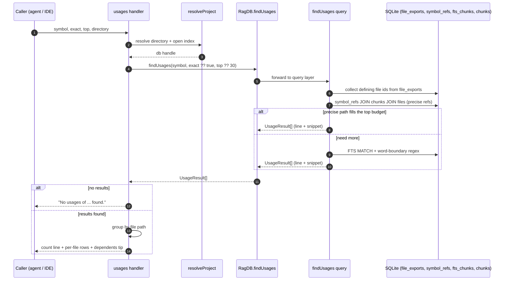

# Tool: usages

`usages` answers one question: *where is this symbol used?* Give it a name — a function, class, type, or any identifier — and it returns every place that name appears across the indexed files, grouped by file with a line number and the matching source line for each hit. The defining file itself is left out, so what you see is the call sites and references, not the declaration. This is what you reach for before renaming a symbol or changing a function signature, when you need the blast radius and a plain text grep would either miss aliased imports or drown you in matches inside comments and strings.

Unlike [search_symbols](search-symbols.md), which finds where a name is *defined*, this tool finds where it is *called or referenced*. And unlike a plain text scan, the primary lookup runs against a precomputed reference index, so it only reports true identifier occurrences — not the same word buried in a doc comment or a string literal. For symbol-level *call-tree* blast radius (transitive callers, not just raw references) see [impact](impact.md); for file-level reverse dependencies see [dependents](dependents.md).

## How a call flows



1. The caller invokes the tool with a required `symbol`, an optional `exact` flag, an optional `top` limit, and an optional `directory`. The handler is registered inside `registerGraphTools` at `src/tools/graph-tools.ts:90-144`.
2. `resolveProject` turns the optional `directory` into an absolute path — falling back to the `RAG_PROJECT_DIR` environment variable or the current working directory — verifies it exists, loads that project's config, and opens its index database (`src/tools/index.ts:22-37`).
3. The handler calls `ragDb.findUsages(symbol, exact ?? true, top ?? 30)`. A missing `exact` defaults to `true` and a missing `top` defaults to `30` (`src/tools/graph-tools.ts:108`). The method on the database class just forwards to the query layer (`src/db/index.ts:667-669`).
4. The query function first collects the ids of every file that *defines* the symbol, by matching the name (case-insensitively) against the `file_exports` table. These ids are used later to drop the declaration from the results (`src/db/search.ts:427-434`).
5. The primary lookup queries the `symbol_refs` reference index, joined to the chunks and files tables, for rows whose recorded name matches the requested symbol. This is the precise path — only real identifier occurrences (`src/db/search.ts:442-466`).
6. If the precise path does not already fill the `top` budget, a fallback runs a full-text search over chunk text and then locates the matching line inside each chunk with a word-boundary regular expression (`src/db/search.ts:489-550`).
7. Each surviving hit becomes a `UsageResult` carrying the file path, a 1-indexed line number, and the trimmed matching source line (`src/db/types.ts:41-45`).
8. Back in the handler, an empty result list short-circuits to a single explanatory line. Otherwise the results are grouped by file path, rendered as a file heading followed by indented `:line  snippet` rows, and a closing tip suggests running [dependents](dependents.md) on any listed file (`src/tools/graph-tools.ts:110-142`).

## Two lookup strategies, one result list

The query layer does not pick a single strategy — it runs the precise one first and uses the text-based one only to top up. Understanding the split explains why some results are exact identifier hits and others are looser.

| | Primary path | Fallback path |
| --- | --- | --- |
| Source table | `symbol_refs` joined to `chunks` and `files` | `fts_chunks` joined to `chunks` and `files` |
| What it matches | extracted identifier references only | any chunk whose full text contains the token |
| Precision | call / reference sites, never comments or strings | can match inside comments or strings, narrowed by a regex |
| `exact: true` filter | `LOWER(sr.name) = LOWER(?)` | `\b<symbol>\b` word-boundary regex |
| `exact: false` filter | `LOWER(sr.name) LIKE LOWER(?) || '%'` (prefix) | `\b<symbol>` leading-boundary regex |
| When it runs | always, first | only if the primary path returns fewer than `top` |

The primary path reads the `symbol_refs` index — a per-file table of identifier occurrences populated during indexing. Each row stores the chunk it came from, the file, the bare name, and the line, with `resolved_export_id` left null until a later cross-file resolution pass links the reference to its declaration. Because these rows come from the chunker's reference extraction rather than a text scan, a hit here is a genuine use of the identifier. The refs are written by `upsertSymbolRefs` (`src/db/graph.ts:10-35`).

The fallback exists for cases the reference index cannot cover: files indexed before the reference table existed, languages without a reference query (such as HTML, CSS, TOML, or YAML), and names that never landed in any extracted reference set, like dynamically dispatched or `eval`'d identifiers (`src/db/search.ts:489-492`). It performs a full-text MATCH on chunk text, ordered by rank, fetching up to `top * 5` candidate chunks, then walks each chunk's lines looking for the first one that matches the regex (`src/db/search.ts:493-509`, `src/db/search.ts:524-537`).

## The `exact` flag

`exact` controls how strictly the symbol name must match, and it shapes both lookup paths.

| `exact` value | Primary (`symbol_refs`) | Fallback (regex) | Effect |
| --- | --- | --- | --- |
| `true` (default) | `LOWER(sr.name) = LOWER(?)` | `\b<symbol>\b` | only the whole identifier matches |
| `false` | `LOWER(sr.name) LIKE LOWER(?) || '%'` | `\b<symbol>` | any identifier that *starts with* the symbol matches |

With the default `exact: true`, a search for `getDB` returns uses of `getDB` but not `getDBForProject` — the reference name must be equal (case-insensitively), and the fallback regex requires a word boundary on both sides (`src/db/search.ts:442-454`, `src/db/search.ts:521`).

With `exact: false`, both paths loosen to a prefix match: the SQL uses `LIKE LOWER(?) || '%'` and the regex drops its trailing `\b`, so `getDB` would also surface `getDB_cache` and similar leading-prefix identifiers (`src/db/search.ts:455-466`, `src/db/search.ts:520-522`). The word-boundary regex is built from an escaped form of the symbol via `escapeRegex`, so a name containing regex metacharacters is treated literally rather than as a pattern (`src/search/usages.ts:14-16`).

## Line numbers and snippets

The reference index stores 0-indexed file lines, while chunk start lines are 1-indexed, so the primary path converts each reference line by adding one before reporting it. It then slices the matching source line out of the chunk's stored snippet — using the offset between the reference line and the chunk's `start_line` — and trims it for display. If that offset falls outside the chunk text for any reason, it falls back to the first 120 characters of the chunk (`src/db/search.ts:471-479`).

The fallback path has no stored per-reference line, so it derives one: it adds the index of the first regex-matching line within the chunk to the chunk's start line. If no line matches but the chunk does, the line falls back to the chunk's `start_line`, and the snippet to the chunk's leading 120 characters (`src/db/search.ts:527-542`).

## Grouping the output

The handler does not return the flat result list as-is. It walks the results in order and buckets them into a `Map` keyed by file path, preserving first-seen order, so every reference in one file is listed together under a single heading (`src/tools/graph-tools.ts:116-121`).

The rendered text opens with a count line — how many usages across how many files, with correct singular/plural wording — then for each file prints the path followed by indented `:line  snippet` rows. A missing line number renders as an empty prefix rather than `:null`. A closing tip points the reader at [dependents](dependents.md) for a file's full importer tree (`src/tools/graph-tools.ts:123-138`).

## Inputs

| name | type | required | description |
| --- | --- | --- | --- |
| `symbol` | string (1–200 chars) | yes | The identifier to find references to. Matched case-insensitively against the reference index and, in the fallback, against chunk text (`src/tools/graph-tools.ts:94`). |
| `exact` | boolean | no | Whether the whole identifier must match. Defaults to `true`. Set `false` for prefix matching (`src/tools/graph-tools.ts:95-98`). |
| `top` | integer (≥ 1) | no | Maximum number of usage rows to return. Defaults to `30`. Both lookup paths stop once this many results accumulate (`src/tools/graph-tools.ts:103`, `src/db/search.ts:486`, `src/db/search.ts:549`). |
| `directory` | string | no | Project directory whose index to query. Defaults to the `RAG_PROJECT_DIR` environment variable or the current working directory (`src/tools/index.ts:26`). |

## Outputs

| output | where it lands / shape / description |
| --- | --- |
| Usages grouped by file | A single text block in the tool's `content` array. Begins with a `Found N usages of "<symbol>" across M files:` count line, then one path heading per file with indented `:line  snippet` rows beneath it, and ends with a tip line (`src/tools/graph-tools.ts:123-138`). |
| Empty-result message | When nothing matches, a single line explaining the symbol may only appear in its definition file or the index may need re-running — no headings, no tip (`src/tools/graph-tools.ts:110-114`). |

This tool only reads the index. It opens no files, runs no parser, and writes nothing back to the database, so it produces no persistent state changes.

## Branches and failure cases

- **No usages found.** When the result list is empty, the handler returns the `No usages of "<symbol>" found.` message and stops. This happens for a genuinely unused symbol, for a symbol that appears only in its own defining file (those rows are excluded), or when the index has not been built or refreshed (`src/tools/graph-tools.ts:110-114`).
- **Defining file excluded.** Any hit whose file id is in the defining-file set is skipped on both lookup paths, so the declaration site never appears in the output (`src/db/search.ts:469`, `src/db/search.ts:525`).
- **Deduplication.** Both paths track a `seen` set keyed by `path:line`, so the same file-and-line reported twice (for instance once by the precise path and again by the fallback) is only emitted once (`src/db/search.ts:481-483`, `src/db/search.ts:544-546`).
- **`top` budget reached early.** If the precise path alone reaches `top` results, the function returns immediately and the fallback never runs. Otherwise the fallback fills the remainder up to the same limit (`src/db/search.ts:486`, `src/db/search.ts:549`).
- **FTS query fails.** The fallback's full-text query is wrapped in a try/catch. A symbol that produces a malformed FTS expression throws, the error is logged at debug level, and the function returns whatever the precise path already collected instead of crashing. With no precise hits that means an empty result (`src/db/search.ts:510-518`).
- **Prefix matching via `exact: false`.** Setting `exact: false` widens both paths to prefix matches, so a search for `getDB` also surfaces identifiers like `getDB_cache` (`src/db/search.ts:455-466`, `src/db/search.ts:520-522`).
- **Missing directory.** If `directory` points at a path that does not exist, `resolveProject` throws `Directory does not exist: <path>` before any query runs, surfacing as an error from the tool rather than an empty result (`src/tools/index.ts:30-32`).

## Example

Find every reference to a function before changing its signature, requiring a whole-identifier match and capping the output at 20 rows:

```json
{
  "symbol": "resolveProject",
  "exact": true,
  "top": 20
}
```

A successful response is plain text shaped like this (paths and line numbers are illustrative):

```
Found 3 usages of "resolveProject" across 2 files:

src/example/handler.ts
  :42  const { projectDir, db } = await resolveProject(directory, getDB);
  :88  const { db: ragDb } = await resolveProject(dir, getDB);

src/example/other.ts
  :17  await resolveProject(undefined, getDB);

── Tip: call dependents("<file>") on any file above to see its full importer tree. ──
```

## Key source files

- `src/tools/graph-tools.ts` — registers the `usages` MCP tool, resolves the project, handles the empty case, and groups and renders the results (`src/tools/graph-tools.ts:90-144`).
- `src/db/search.ts` — the `findUsages` query function: defining-file exclusion, the `symbol_refs` primary path, the FTS-plus-regex fallback, deduplication, and line/snippet computation (`src/db/search.ts:426-553`).
- `src/db/graph.ts` — `upsertSymbolRefs` populates and maintains the `symbol_refs` reference index that the primary path reads (`src/db/graph.ts:10-35`).
- `src/search/usages.ts` — the `escapeRegex` helper used to build a literal word-boundary pattern (`src/search/usages.ts:14-16`).
- `src/db/index.ts` — exposes the `findUsages` wrapper on the database class (`src/db/index.ts:667-669`).
- `src/tools/index.ts` — `resolveProject`, which resolves the target directory and opens its index before the query runs (`src/tools/index.ts:22-37`).
