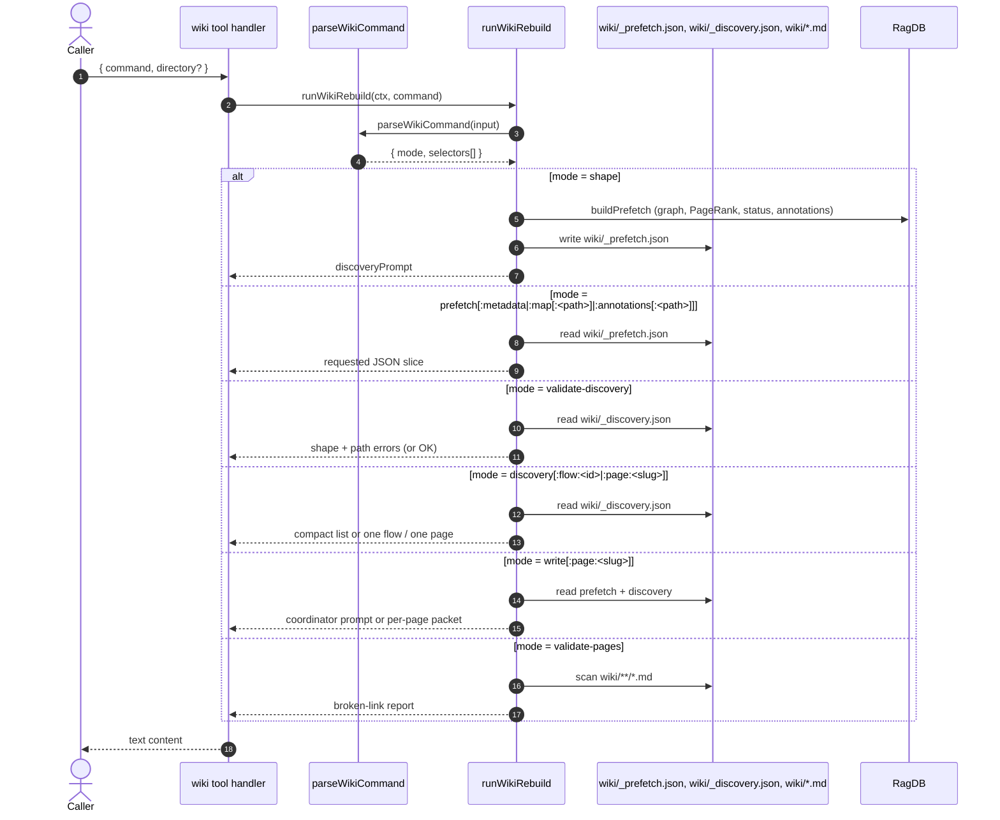

# Tool: wiki

The `wiki` tool is the single entry point for the mimirs wiki rebuild workflow. Every step — extracting prefetch data from the index, prompting for discovery, validating discovery, prompting for page writing, splitting page work by slug, and validating cross-links — is one invocation of this tool with a different `command` string. The handler is a thin wrapper around `runWikiRebuild` in `src/wiki/rebuild.ts`; the heavy lifting (graph build, PageRank, schema checks, link checking) lives there.

Use this page if you are running a wiki rebuild yourself, debugging a step that failed, or extending the workflow with a new selector.

## Flow



1. The caller passes a single `command` string (and optional `directory`). The handler calls `resolveProject` for a `RagDB` handle, then forwards the command to `runWikiRebuild` with a `WikiContext` that carries the DB, project directory, and the running package version `src/tools/wiki-tools.ts:33-44`.
2. `parseWikiCommand` splits the input on `:`. The first segment is the **mode**; the rest are **selectors**. Empty segments throw — `prefetch::map` is rejected as "empty selector parts are not allowed" `src/wiki/rebuild.ts:95-103`.
3. The driver dispatches on `mode`. Each branch is independent: there is no implicit chaining. The caller is responsible for running the steps in order.
4. Any thrown error inside `runWikiRebuild` is caught by the tool handler and reformatted as `wiki(<command>) failed: <message>`, so even fatal errors come back as a normal MCP text response `src/tools/wiki-tools.ts:45-53`.

## Inputs

| Name | Type | Default | Notes |
| --- | --- | --- | --- |
| `command` | string | required | Colon-separated `mode[:selector[:value]]`. See **Command grammar** below. |
| `directory` | string | `RAG_PROJECT_DIR` env or cwd | Selects which project the rebuild reads from and writes into. The wiki output lives under `<directory>/wiki/`. |

## Outputs

| Output | Where |
| --- | --- |
| Per-command prompt or JSON slice or validation report | Returned as MCP text content. |
| `wiki/_prefetch.json` | Written by `wiki(shape)` via `buildPrefetch` `src/wiki/rebuild.ts:903-916`. |
| `wiki/_discovery.json` | **Not** written by the tool. The discovery prompt asks the agent to author it on disk; the tool only reads and validates it. |
| `wiki/<slug>.md` | **Not** written by the tool. The write prompts return per-page packets the agent writes itself. |

## Command grammar

Commands use `:` as the selector separator. `parseWikiCommand` rejects empty parts and `assertSafeSelector` rejects further `:` inside specific selector values (path, flow id, page slug) so user-provided values cannot smuggle extra segments `src/wiki/rebuild.ts:121-125`.

| Command | Action |
| --- | --- |
| `shape` | Build prefetch from the index, write `wiki/_prefetch.json`, and return the discovery prompt. Also prepends a "stop: index is empty" warning when `getStatus` reports zero files `src/wiki/rebuild.ts:378-387`. |
| `prefetch` | Return the entire `wiki/_prefetch.json` as JSON. |
| `prefetch:metadata` | Return only the `metadata` block (project root, generated timestamp, last commit hash, mimirs version, index status). |
| `prefetch:map` | Return the full file map (every node with imports, importedBy, fanIn, fanOut, PageRank, exports). |
| `prefetch:map:<path>` | Return the one map entry whose `path` matches the normalized argument. Throws if no entry exists `src/wiki/rebuild.ts:886-893`. |
| `prefetch:annotations` | Return all annotations grouped by file path. |
| `prefetch:annotations:<path>` | Return the annotation array for one file (empty if none). |
| `validate-discovery` | Read `wiki/_discovery.json`, run shape checks (`validateDiscoveryShape`) and path-existence checks (`validateDiscoveryPaths`), and return either "passed structural checks" or a bulleted list of errors `src/wiki/rebuild.ts:924-935`. |
| `discovery` | Return a compact summary of all flows and pages (`id`/`slug`/`title`/`kind`/counts), without full evidence — useful for splitting writes by slug `src/wiki/rebuild.ts:521-540`. |
| `discovery:flow:<id>` | Return the full discovery entry for one flow. |
| `discovery:page:<slug>` | Return the full discovery entry for one page. |
| `write` | Return the coordinator prompt: how to split the page-writing work by slug across subagents `src/wiki/rebuild.ts:389-407`. |
| `write:page:<slug>` | Return a per-page packet (the page object, its referenced flows, prefetch map entries for `primaryFiles`, annotations for those files, and a flattened `evidence` list) plus the page-writer prompt for that slug. For pages whose `kind` starts with `overview:`, the prompt template differs `src/wiki/rebuild.ts:409-462`, `src/wiki/rebuild.ts:464-519`. |
| `validate-pages` | Walk `wiki/**/*.md`, extract relative `.md` links, and report any that do not resolve to an existing file `src/wiki/rebuild.ts:779-816`. |

### Workflow order

```
shape → (author wiki/_discovery.json) → validate-discovery → write → write:page:<slug>... → validate-pages
```

`shape` is the only command that writes a workflow JSON file. It also returns the prompt that instructs the agent to author `wiki/_discovery.json`. Once the file exists, `validate-discovery` is the gate before any page writing — `write` and `write:page:<slug>` both call `readDiscovery`, which throws if the file is missing or invalid JSON. After all pages are written, `validate-pages` is the closing check that no markdown link points at a nonexistent file.

## State changes

### `wiki/_prefetch.json` — absent → regenerated index snapshot

`wiki(shape)` calls `buildPrefetch(ctx)`, which builds a graph-shaped file map (sorted imports/importedBy, fanIn, fanOut, an iterated PageRank, and per-symbol export rows from chunk ranges) `src/wiki/rebuild.ts:165-209`. It groups annotations by file, then writes the whole structure to `wiki/_prefetch.json` with `writeJSON`. Reruns overwrite without merging — the file is intended to be regenerated whenever the index moves on `src/wiki/rebuild.ts:220-233`, `src/wiki/rebuild.ts:906-916`.

### `wiki/_discovery.json` — agent-authored → validated shape

The tool does not write `_discovery.json` itself. The `shape` prompt instructs the agent to author it, and `validate-discovery` runs two passes:

- **`validateDiscoveryShape`** checks the top-level `metadata`/`flows`/`pages`; that every flow has a unique `id` without `:`; that every page has a `kind` and `slug`; that overview pages use the canonical slug for their kind and appear at most once per kind; that broad reserved slugs (`api`, `endpoints`, `events`, `glossary`, `messages`, `modules`, `overview`, `queues`, `routes`, etc.) are rejected; that non-overview pages have exactly one `flowIds` entry and no two pages share a flow id; and that state-change items have `item`, `from`, `to`, and `description` `src/wiki/rebuild.ts:656-753`.
- **`validateDiscoveryPaths`** collects every `path` referenced in `flows[].files`, `flows[].evidence`, `flows[].stateChanges[].files`, `flows[].stateChanges[].evidence`, and `pages[].primaryFiles`, then asserts each exists on disk under the project directory `src/wiki/rebuild.ts:587-630`.

If both pass, the response is `wiki/_discovery.json passed structural checks.` Otherwise the response is a bulleted error list and the caller is told to fix and re-run `src/wiki/rebuild.ts:755-770`.

## Branches and failure cases

- **Empty selector parts.** `prefetch::map` or a trailing colon throws `Invalid wiki command ... Empty selector parts are not allowed.` `src/wiki/rebuild.ts:99-101`.
- **`:` inside a user-provided value.** `assertSafeSelector` blocks path, flow id, and page slug values that contain `:`, since the selector grammar reserves it `src/wiki/rebuild.ts:121-125`.
- **Unknown mode or selector.** `Unknown wiki command '<input>'` for unknown modes, `Unknown prefetch selector '<x>'` for unknown prefetch sub-selectors, `Unknown discovery selector '<x>'` for `discovery:<x>`, and `Unknown write selector '<x>'` for anything after `write:` other than `page` `src/wiki/rebuild.ts:881-988`.
- **Missing prefetch.json.** `wiki(prefetch...)`, `wiki(discovery...)`, and `wiki(validate-discovery)` all read JSON eagerly; if the file is absent they bubble up the read error wrapped by the handler as `wiki(<command>) failed: ...`. `write:page:<slug>` is more lenient — it falls back to an empty prefetch when `wiki/_prefetch.json` does not exist, so page writing can still get the discovery packet `src/wiki/rebuild.ts:972-976`.
- **Empty index on `shape`.** When `buildPrefetch` reports `totalFiles === 0`, the response includes a "Stop: index is empty" block instructing the caller to run `index_files` and call `shape` again `src/wiki/rebuild.ts:378-387`.
- **`prefetch:map:<path>` miss.** Throws `No prefetch map entry found for '<path>'.` rather than returning empty `src/wiki/rebuild.ts:889-892`.
- **`discovery:flow:<id>` / `discovery:page:<slug>` miss.** Throws `No flow found for id '<id>'.` or `No page found for slug '<slug>'.` `src/wiki/rebuild.ts:946-961`.
- **`write:page:<slug>` for unknown slug.** `buildPagePacket` throws `No page found for slug '<slug>'.` `src/wiki/rebuild.ts:853-856`.
- **Broken cross-links.** `validate-pages` returns a list of `<file> → <target>` lines for every relative `.md` link whose resolved target does not exist. The caller is told to fix and re-run `src/wiki/rebuild.ts:818-829`.

## Example

```json
{ "name": "wiki", "arguments": { "command": "shape" } }
```

```json
{ "name": "wiki", "arguments": { "command": "prefetch:map:src/server.ts" } }
```

```json
{ "name": "wiki", "arguments": { "command": "validate-discovery" } }
```

```json
{ "name": "wiki", "arguments": { "command": "write:page:tools/search" } }
```

```json
{ "name": "wiki", "arguments": { "command": "validate-pages" } }
```

## Key source files

- `src/tools/wiki-tools.ts` — registers the MCP tool, lists supported commands in the description, forwards to `runWikiRebuild`, and wraps thrown errors in a graceful text response.
- `src/wiki/rebuild.ts` — owns everything else: command parsing, prefetch construction (graph map, PageRank, annotations), discovery shape + path validation, the discovery / coordinator / per-page prompts, and the `wiki/` link checker.
- `src/db/index.ts` — supplies `RagDB.getGraph`, `getStatus`, `getAnnotations`, `getFileChunkRanges` used by `buildPrefetch`.
