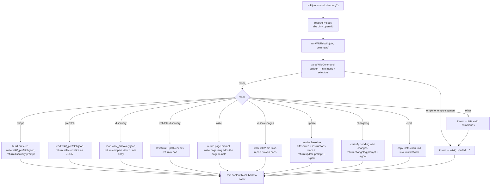

# Tool: wiki

The `wiki` MCP tool runs the wiki rebuild workflow: the multi-step process that turns the indexed codebase into a set of Markdown pages under `wiki/`. It is not a single action. It is one entry point that an agent calls many times with different `command` strings, walking through phases — survey the code, draft a plan, validate the plan, write pages, validate links, detect what changed for an incremental refresh, and summarize the diff — one step at a time. Each call returns text: usually the next instruction prompt to follow, a chunk of JSON to read, or a validation report. A few calls also write files to disk.

You reach for this tool when you want to regenerate or extend the project's wiki, or when you need one slice of the workflow — re-reading the dependency map for a single file, checking that the wiki's internal links still resolve, finding out which pages a code change made stale, or producing a changelog entry for a pending update. Most of the work lives in the rebuild module; the tool layer is a thin wrapper that resolves the project, calls the workflow, and wraps any thrown error into readable text instead of crashing the MCP connection.

## How a call is dispatched

The tool itself is small. `registerWikiTools` declares one tool named `wiki` with two arguments, `directory` and `command`, where `command` is a free-form string `src/tools/wiki-tools.ts:27-36`. The list of supported command strings is baked into the tool description so the calling agent sees them, but no enum is enforced at the schema level — every value is accepted by the schema and validated inside the workflow.

When invoked, the handler does everything inside one `try` block so *any* failure — a bad directory, a config-load error, or a thrown workflow error — comes back as a friendly text result rather than a raw MCP protocol error `src/tools/wiki-tools.ts:38-60`:

1. `resolveProject(directory, getDB)` turns the optional `directory` into an absolute path (falling back to `RAG_PROJECT_DIR` or the current working directory), verifies the directory exists, loads config, and hands back the project's database handle `src/tools/index.ts:22-45`.
2. The handler calls `runWikiRebuild` with a small context object — the database, the resolved project directory, and the mimirs version read from `process.env.npm_package_version` (or `"unknown"`) — plus the raw command string `src/tools/wiki-tools.ts:41-49`.
3. Whatever text the workflow returns is wrapped as a single MCP text content block and returned `src/tools/wiki-tools.ts:50`.
4. If anything throws, the handler catches it and returns the message as text — `wiki(<command>) failed: <message>` — so an invalid command, a missing directory, or a missing state file surfaces as a normal tool result, not a transport error `src/tools/wiki-tools.ts:51-59`.

The command itself is parsed once and then dispatched by its leading word. Because the real interest of this flow is *which* branch a command takes rather than the back-and-forth timing, the diagram below shows the dispatcher as a tree of modes.



1. The agent calls `wiki` with a command string and an optional directory.
2. The handler resolves the project directory and opens the matching database handle before doing anything else; this now runs inside the `try`, so a non-existent directory becomes a `failed:` text result rather than a protocol error.
3. It builds a context object carrying the database, the absolute project directory, and the version string, and passes that plus the raw command into `runWikiRebuild`.
4. `parseWikiCommand` splits the command on `:` into a leading `mode` and a list of `selectors`. An empty command, or one with an empty segment such as `prefetch::map`, throws here.
5. The dispatcher branches on `mode`. `shape` is the only branch that always writes `wiki/_prefetch.json`; `eject` writes under `.mimirs/wiki/`; every other branch — including `update` and `changelog` — is read-only and returns text.
6. An unrecognized mode falls through to a final `throw` that lists the valid commands.
7. Any throw — from parsing, an unknown mode, a missing file, or a bad selector — is caught by the tool handler and returned as a `failed:` text block, so the MCP session keeps running.

## The command grammar

`parseWikiCommand` does the splitting. It trims the input, rejects an empty string with a hint to try `shape`, splits on `:`, and rejects any empty segment (so a stray double colon or a trailing colon is an error) `src/wiki/rebuild.ts:144-152`. The first segment becomes `mode`; the rest become `selectors`. `runWikiRebuild` then branches on `mode` and reads `selectors[0]`, `selectors[1]`, and so on for sub-commands `src/wiki/rebuild.ts:973-1170`.

Several modes guard their selectors with `assertSafeSelector`. That guard does two jobs `src/wiki/rebuild.ts:170-179`. First, it rejects a missing value or a value that itself contains a `:` — that character is reserved purely as the segment separator, so a file path or slug passed as a selector must not contain one. Second, because a page slug becomes the file path `wiki/<slug>.md`, it rejects any slug that could escape the `wiki/` directory: a leading `/` (absolute path), a backslash, or a `..` path segment. So `write:page:../../etc/passwd` is refused before any file is touched.

Each `mode` maps to one phase of the workflow:

| Command | What it does | Writes files? |
| --- | --- | --- |
| `shape` | Builds prefetch data, writes `wiki/_prefetch.json`, and returns the drafting prompt for the plan | Yes — `wiki/_prefetch.json` |
| `prefetch` | Reads back `wiki/_prefetch.json`; selectors narrow to `metadata`, `map`, `map:<path>`, `annotations`, or `annotations:<path>` | No |
| `validate-discovery` | Structurally checks `wiki/_discovery.json` and reports errors or a go-ahead | No |
| `discovery` | Returns a compact view of the plan; `discovery:flow:<id>` and `discovery:page:<slug>` return one entry | No |
| `write` | Returns the page-writing prompt; `write:page:<slug>` returns the prompt plus that page's data bundle | No |
| `validate-pages` | Checks every relative `.md` link under `wiki/` resolves to a real file | No |
| `update` | Resolves the commit the wiki was last generated from and returns the source and instruction changes since then, plus the page index, so the caller can decide which pages to rewrite | No |
| `changelog` | Classifies pending `wiki/` changes by how much each page changed and returns the changelog prompt plus a signal describing them | No |
| `eject` | Copies the packaged instruction Markdown into `.mimirs/wiki/` so a project can customize it; `eject:force` overwrites | Yes — `.mimirs/wiki/*.md` |

Any other leading word falls through to a final `throw` that lists the valid commands, which the handler turns into a `failed:` string `src/wiki/rebuild.ts:1169`.

### `shape` — survey and draft prompt

`shape` is the starting point. It calls `buildPrefetch`, which assembles a snapshot of the indexed project: metadata (project root, current git HEAD via `git rev-parse HEAD`, the mimirs version, and index counts from `db.getStatus()`), a dependency map of every file with its imports, importers, fan-in, fan-out, a computed PageRank score, and exported symbols with line numbers, plus all stored annotations grouped by file `src/wiki/rebuild.ts:388-400`. It creates `wiki/` if needed, writes that snapshot to `wiki/_prefetch.json`, and returns the drafting instructions for the plan `src/wiki/rebuild.ts:976-990`.

If the index is empty — `metadata.index.totalFiles` is `0` — `shape` prepends a "Stop: index is empty" notice telling the caller to run [index_files](index-files.md) first and then re-run `shape`, so the plan is built from real evidence rather than guesses `src/wiki/rebuild.ts:434-443`.

### `prefetch` — read the snapshot back

`prefetch` reads `wiki/_prefetch.json` from disk and returns part of it as pretty-printed JSON. `readSelector` decides which part: no selector returns the whole object, `metadata` returns just the header, `map` returns the full dependency map, `map:<path>` returns one file's entry (throwing if that path is not in the map), `annotations` returns all grouped annotations, and `annotations:<path>` returns one file's notes (or an empty list) `src/wiki/rebuild.ts:849-869`. The `<path>` selectors run through `assertSafeSelector` and are normalized before lookup.

### `discovery` — read the plan

The plan a human or agent drafts after `shape` lives in `wiki/_discovery.json`: a list of flows (one per entry point) and a list of pages (one Markdown file each). Bare `discovery` returns a compact summary — for each flow just its id, title, kind, confidence, and state-change count; for each page its slug, title, kind, linked flows, and input/output counts — so the reader can scan the whole plan without pulling every detail `src/wiki/rebuild.ts:1015-1018`, `src/wiki/rebuild.ts:460`. `discovery:flow:<id>` and `discovery:page:<slug>` return one full entry, throwing a clear error if the id or slug is missing or not found `src/wiki/rebuild.ts:1019-1035`.

### `validate-discovery` — structural check

Before pages are written, `validate-discovery` reads `wiki/_discovery.json` and runs two passes. `validateDiscoveryShape` checks the JSON shape: top-level `metadata`, `flows`, and `pages` must exist; flow ids must be unique and free of `:`; each page must name a string `kind`; slugs must be unique, must not contain `:`, must not use path traversal (no leading `/`, no `\`, no `..` segment — they would escape `wiki/`), must not collide with a reserved overview slug, and must not be one of a fixed set of too-broad slugs such as `api`, `routes`, or `overview`; overview pages must use one of the fixed overview kinds, the matching slug, and at least three primary files `src/wiki/rebuild.ts:621-705`. `validateDiscoveryPaths` then checks that every file path referenced anywhere in the plan actually exists on disk `src/wiki/rebuild.ts:559`. If the file cannot even be parsed as JSON, that failure is caught and reported as a single error rather than thrown `src/wiki/rebuild.ts:997-1007`. The response either confirms the checks passed and tells the caller to ask the human before running `write`, or lists every error to fix `src/wiki/rebuild.ts:1004`.

### `write` — page-writing prompts

Bare `write` returns the top-level page-writing instructions. `write:page:<slug>` does the real assembly. It first refuses a malformed selector: more than two `:`-segments after `write` is rejected with a message that a slug cannot contain `:` `src/wiki/rebuild.ts:1042-1046`, and the slug then passes through `assertSafeSelector` `src/wiki/rebuild.ts:1049`. It reads the prefetch snapshot (falling back to an empty one if `wiki/_prefetch.json` is absent), reads the plan, and calls `buildPagePacket` to bundle everything needed to write that one page — the page entry, its resolved flows, the dependency-map entries and annotations for its primary files, and all flow evidence `src/wiki/rebuild.ts:1050-1054`, `src/wiki/rebuild.ts:821-833`. It returns the kind-specific writing prompt — flow, screen, or one of the overview prompts, chosen by `writePagePrompt` `src/wiki/rebuild.ts:445` — followed by that bundle as a fenced JSON block `src/wiki/rebuild.ts:1055-1063`.

### `validate-pages` — link check

`validate-pages` walks every `.md` file under `wiki/`, extracts each relative Markdown link, resolves it against the file's own directory, and records any that point at a missing file `src/wiki/rebuild.ts:769`. It skips absolute URLs, anchors, and links with a scheme such as `http:`. The response either confirms all links resolve or lists each broken link `src/wiki/rebuild.ts:1010-1012`.

### `update` — detect what changed since the last wiki

`update` answers a different question from the rest of the workflow: not "how do I write this page" but "which pages are now stale". It is the entry point for an incremental refresh, so you do not rebuild every page when only a few flows changed.

It first anchors a baseline — the commit the wiki was last generated from — with `resolveBaseline`. That function never trusts a remembered hash blindly. It reads the commit stamp from the top of `wiki/CHANGELOG.md`, and only uses it if `git cat-file -e` proves the commit still exists and `git merge-base --is-ancestor` proves it is reachable from `HEAD`. If the stamp exists but has diverged, it falls back to the merge-base; if the stamp is missing or unreachable, it falls back to the last commit that touched `wiki/` (reachable by definition); if there is no git history at all, it returns a warning telling the caller to regenerate instead `src/wiki/rebuild.ts:894-922`.

With a baseline in hand, `buildCausePacket` runs `git diff --numstat <baseline>` over the working tree and keeps only the files that could change a page: it drops binaries (numstat `-` / `-`), lockfiles such as `package-lock.json` or `bun.lockb` (`isNoiseFile`), and everything under `wiki/` itself — the output it is about to regenerate. No directory layout is assumed, so the detection works whether or not the project keeps code under `src/` `src/wiki/rebuild.ts:938-970`. It then reads the current page index — each page's slug and title from `wiki/_discovery.json` — so the caller can map the changed files onto pages `src/wiki/rebuild.ts:924-933`.

If the change set is large — more than 64 KB of diff or more than 25 files — the result is flagged `tooLarge`: the diff is omitted and the signal tells the caller to run a full rebuild rather than a targeted update, because at that size deciding page by page is unreliable `src/wiki/rebuild.ts:874-875`, `src/wiki/rebuild.ts:968`. The command returns the update prompt followed by an "Update signal" block: the baseline and how it was resolved, the changed files, the page index to map them against, and (unless `tooLarge`) the cause diff `src/wiki/rebuild.ts:1105-1139`. When the baseline resolves but nothing changed, it reports "nothing to update"; when no baseline can be anchored, it returns the warning alone.

### `changelog` — record what the update changed

`changelog` is the step you run after rewriting pages but before committing. Where `update` looks at the *cause* of a change (source diffs since the baseline), `changelog` looks at the *effect*: what actually changed under `wiki/`. It reads the current git HEAD (shortened to seven characters, or `"unknown"`), takes today's date, and calls `pendingWikiChanges` to compare the working tree against HEAD `src/wiki/rebuild.ts:1142-1146`.

`pendingWikiChanges` parses `git status --porcelain` for `wiki/`, classifying each changed `.md` page as added, deleted, or modified and excluding `CHANGELOG.md` itself `src/wiki/rebuild.ts:233-243`. For each modified page it measures *churn*: one `git diff --numstat HEAD` gives the added and deleted line counts, which combined with the page's current length yield a changed-line ratio between 0 and 1 `src/wiki/rebuild.ts:251-266`. A page whose churn is at or above `WIKI_WHOLESALE_RATIO` (0.3) is treated as a wholesale rewrite — a reword, restructure, or diagram swap — and is only *listed*; a page below that threshold is a surgical edit whose diff is worth summarizing, so its diff is gathered `src/wiki/rebuild.ts:201`, `src/wiki/rebuild.ts:268-279`.

Two backstops then guard against a near-total regeneration flooding the changelog prompt with diffs. If at least 60% of all pages changed (`WIKI_FULL_REGEN_FRACTION`), the run is flagged `fullRegen` and no surgical diff is even gathered `src/wiki/rebuild.ts:206`, `src/wiki/rebuild.ts:284-290`. And regardless of fraction, if the combined surgical diff would exceed 32 KB (`WIKI_CHANGELOG_DIFF_MAX_BYTES`), every surgical page is collapsed into the refreshed list with no diff `src/wiki/rebuild.ts:211`, `src/wiki/rebuild.ts:294-298`. This is what keeps a full 50-page regeneration from feeding an enormous diff into the changelog prompt.

The command returns the changelog-writing prompt followed by a "Changelog signal" block: the commit stamp, the count of pending changes, an optional full-regeneration note, and four buckets — surgical edits (with their diffs appended below), pages refreshed wholesale (listed only), new pages, and removed pages `src/wiki/rebuild.ts:1151-1164`. The prompt then has the caller prepend one entry to `wiki/CHANGELOG.md`: behavior summaries drawn from the surgical diffs, plain listings for everything else.

### `eject` — customize the instructions

The prose that drives generation lives in packaged Markdown files, not in code. `eject` copies all ten of them — `README`, `discovery`, `write`, `writing-contract`, `self-check`, `page-flow`, `page-overview`, `page-screen`, `changelog`, and `update` — into `.mimirs/wiki/`, where a project-local copy overrides the packaged default on future runs `src/wiki/rebuild.ts:1066-1103`. By default it skips any file already present and lists what it skipped; `eject:force` overwrites them all `src/wiki/rebuild.ts:1067`, `src/wiki/rebuild.ts:1086-1093`. The override is read by `loadWikiInstruction`, which prefers `.mimirs/wiki/<name>.md` over the packaged default `src/wiki/rebuild.ts:13-23`.

## Inputs

| name | type | required | description |
| --- | --- | --- | --- |
| `command` | string | yes | The workflow step to run, written as colon-separated segments. The leading segment is the mode (`shape`, `prefetch`, `validate-discovery`, `discovery`, `write`, `validate-pages`, `update`, `changelog`, `eject`); later segments are selectors such as a file path, flow id, or page slug. Validated inside the workflow, not by the tool schema `src/tools/wiki-tools.ts:33-35`. |
| `directory` | string | no | Project directory to operate on. Defaults to `RAG_PROJECT_DIR` or the current working directory, resolved to an absolute path and checked for existence by `resolveProject` `src/tools/index.ts:26-34`. |

## Outputs

| output | where it lands / shape / description |
| --- | --- |
| Workflow text | The MCP result: a single text content block. Depending on the mode it is an instruction prompt to follow next, pretty-printed JSON (`prefetch`, `discovery`), or a report or signal (`validate-discovery`, `validate-pages`, `update`, `changelog`) `src/tools/wiki-tools.ts:50`. |
| `wiki/_prefetch.json` | Written by `shape`. The dependency map, index metadata, and grouped annotations used as evidence for the rest of the workflow `src/wiki/rebuild.ts:979`. |
| `wiki/_discovery.json` | Read by `discovery`, `validate-discovery`, `write`, and `update`. Not written by the tool — it is authored by the caller between `shape` and `write`. |
| Generated wiki pages | Written by the caller while following the `write:page:<slug>` prompt; the tool supplies the prompt and data bundle but does not write the `.md` page itself. |
| `.mimirs/wiki/*.md` | Written by `eject` / `eject:force` — copies of the ten packaged instruction files for per-project customization `src/wiki/rebuild.ts:1090-1092`. |
| Failure text | When the workflow throws, the message is returned as `wiki(<command>) failed: <message>` instead of an exception `src/tools/wiki-tools.ts:56`. |

## State changes

| Item | Before | After | Why it matters |
| --- | --- | --- | --- |
| `wiki/_prefetch.json` | Absent or stale | Rewritten with a fresh snapshot of the index, dependency map, git HEAD, and annotations | This is the evidence base for the whole workflow. `shape` always overwrites it, so later steps read a current snapshot `src/wiki/rebuild.ts:977-979`. |
| `.mimirs/wiki/*.md` | Packaged defaults only | Project-local override copies present | Once these exist, `loadWikiInstruction` prefers them over the packaged prose, so generation prompts can be customized per project `src/wiki/rebuild.ts:13-23`, `src/wiki/rebuild.ts:1090-1092`. |

`shape` calls `mkdir(wikiDir, { recursive: true })` before writing, so the `wiki/` directory is created if missing; `eject` does the same for `.mimirs/wiki/` `src/wiki/rebuild.ts:978`, `src/wiki/rebuild.ts:1069`. No other mode mutates disk — `prefetch`, `discovery`, `validate-discovery`, `validate-pages`, `update`, and `changelog` are all read-only (the page `.md` files and `CHANGELOG.md` are written by the caller, not by the tool).

## Branches and failure cases

- **Empty or malformed command** — an empty string, or any command with an empty segment (a leading, trailing, or double colon), throws in `parseWikiCommand` and is reported as a `failed:` string `src/wiki/rebuild.ts:144-152`.
- **Bad directory** — a `directory` that does not exist now fails inside the handler's `try` and is returned as a `failed:` text result rather than a protocol error `src/tools/wiki-tools.ts:38-41`, `src/tools/index.ts:31-34`.
- **Unknown mode** — any leading word not handled by a branch hits the final `throw` listing the valid commands `src/wiki/rebuild.ts:1169`.
- **Reserved-character or traversal selector** — a selector that contains `:`, is missing where required, or would escape `wiki/` (leading `/`, a `\`, or a `..` segment) is rejected by `assertSafeSelector` for `prefetch:map:<path>`, `prefetch:annotations:<path>`, `discovery:flow:<id>`, `discovery:page:<slug>`, and `write:page:<slug>` `src/wiki/rebuild.ts:170-179`.
- **Extra `:` in `write:page`** — passing more than two `:`-segments after `write` (so the slug appears to contain a `:`) throws a specific message before the slug guard runs `src/wiki/rebuild.ts:1042-1046`.
- **Empty index on `shape`** — when the index reports zero files, `shape` still writes the snapshot but prepends a stop notice pointing at [index_files](index-files.md) `src/wiki/rebuild.ts:434-443`.
- **Missing or corrupt state file** — `readJSON` distinguishes the two: a missing file throws `Missing <file>. <hint>`, while unparseable JSON throws `Corrupt JSON in <file> (<msg>). <hint>`. The hint is tailored per file — `Re-run wiki(shape) to regenerate it.` for `_prefetch.json`, `Run wiki(shape) and write discovery first.` for `_discovery.json` `src/wiki/rebuild.ts:408-428`. `prefetch` reads `_prefetch.json` directly and surfaces these; `write:page` instead falls back to an empty prefetch snapshot so a page can still be drafted `src/wiki/rebuild.ts:1050-1052`.
- **Missing or unparseable `wiki/_discovery.json`** — `validate-discovery` catches a JSON parse failure and reports it as one error `src/wiki/rebuild.ts:1005-1006`; `discovery` and `write` let the read error propagate to the handler's catch block; `update` treats an unreadable discovery file as an empty page index `src/wiki/rebuild.ts:924-933`.
- **Unknown flow id or page slug** — `discovery:flow:<id>`, `discovery:page:<slug>`, and `write:page:<slug>` each throw a specific "No flow/page found" error `src/wiki/rebuild.ts:1024`, `src/wiki/rebuild.ts:1032`, `src/wiki/rebuild.ts:823`.
- **Unknown sub-selector** — an unrecognized selector under `prefetch`, `discovery`, or `write` throws (for example `Unknown prefetch selector '...'`) `src/wiki/rebuild.ts:868`, `src/wiki/rebuild.ts:1035`, `src/wiki/rebuild.ts:1041`.
- **No baseline on `update`** — when there is no usable changelog stamp and no `wiki/` history, `update` returns a warning telling the caller to regenerate rather than attempt a targeted update `src/wiki/rebuild.ts:917-921`, `src/wiki/rebuild.ts:1109-1111`.
- **Nothing changed on `update`** — when the baseline resolves but no source or instruction file changed since it, `update` reports "nothing to update" `src/wiki/rebuild.ts:1112-1121`.
- **Too much changed on `update`** — when the cause diff exceeds 64 KB or 25 files, the diff is omitted and the signal recommends a full rebuild `src/wiki/rebuild.ts:968`, `src/wiki/rebuild.ts:1129-1131`.
- **No pending wiki changes on `changelog`** — when nothing under `wiki/` has changed, every bucket is empty, the pending count is `0`, and no diff block is appended `src/wiki/rebuild.ts:1146-1164`.
- **Wholesale refresh on `changelog`** — a modified page whose churn reaches 30% is listed as "refreshed" with no diff `src/wiki/rebuild.ts:201`, `src/wiki/rebuild.ts:273-274`; and a near-total regen (≥60% of pages, or >32 KB combined surgical diff) collapses every page to "refreshed" so the changelog input never explodes `src/wiki/rebuild.ts:284-298`.
- **`eject` collision** — without `force`, files already present in `.mimirs/wiki/` are skipped and listed; `eject:force` overwrites them `src/wiki/rebuild.ts:1086-1093`.
- **All errors are non-fatal to the connection** — every throw above is caught by the tool handler and returned as text, so the MCP session continues `src/tools/wiki-tools.ts:51-59`.

## Example

A typical regeneration runs the modes in order. Each call is a separate tool invocation:

```json
{ "command": "shape" }
```

```json
{ "command": "validate-discovery" }
```

```json
{ "command": "write:page:tools/search" }
```

```json
{ "command": "changelog" }
```

An incremental refresh starts by asking what changed since the wiki was last generated, then rewrites only the affected pages:

```json
{ "command": "update" }
```

Targeted reads scope to one file or entry:

```json
{ "command": "prefetch:map:src/server.ts", "directory": "/abs/path/to/project" }
```

```json
{ "command": "discovery:page:tools/search" }
```

## Key source files

- `src/tools/wiki-tools.ts` — the MCP tool registration; resolves the project and runs the workflow inside one `try`, wrapping every error (including a bad directory) into text.
- `src/wiki/rebuild.ts` — the entire workflow: command parsing (`parseWikiCommand`), selector safety (`assertSafeSelector`), the mode dispatcher (`runWikiRebuild`), prefetch building (`buildPrefetch`), state-file reads with tailored errors (`readJSON`), discovery validation (`validateDiscoveryShape`, `validateDiscoveryPaths`), per-page data assembly (`buildPagePacket`), link checking (`validateWikiPages`), baseline resolution and cause detection for `update` (`resolveBaseline`, `buildCausePacket`), pending-change classification for `changelog` (`pendingWikiChanges`), and eject.
- `src/tools/index.ts` — `resolveProject`, which maps the optional `directory` argument to an absolute path and database handle.
- `src/wiki/instructions/*.md` — the packaged generation prompts that `shape`, `write`, `update`, `changelog`, and `eject` read and that a project can override under `.mimirs/wiki/`.
