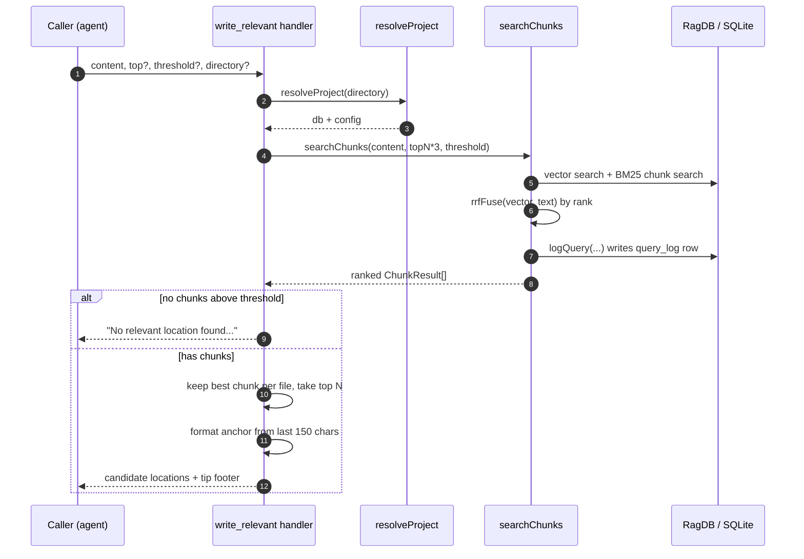

# Tool: write_relevant

`write_relevant` answers a placement question rather than a lookup question:
*given a piece of code or documentation I am about to add, which file does it
belong in, and where in that file should it go?* It takes the new content you
intend to write, searches the index for the chunks most similar to it, and returns
a short list of candidate files — each with a suggested insertion point and a text
anchor you can match against to land the edit precisely.

The intent is the inverse of [search](./search.md) and
[read_relevant](./read-relevant.md). Those answer "where does this topic already
live?" so you can read it. `write_relevant` answers "where should this *new* thing
live?" so you can write it. All three lean on the same underlying chunk search, so
the ranking signal is identical; only the post-processing and the framing of the
output differ.

The tool is registered alongside the other search tools, and its handler runs
end-to-end inside `src/tools/search.ts:307-378`.

## When you would use it

Before adding a new function, type, or doc section, you usually have to guess which
existing file is the right home. `write_relevant` turns that guess into a ranked
suggestion grounded in what is already indexed. You paste the content you plan to
add (even a rough draft), and it points you at the file whose existing chunks are
most semantically similar — typically the file that already owns that concept —
plus the chunk to insert after.

## How it works

The handler is a thin orchestration layer over the shared chunk search. The only
work unique to this tool is collapsing the chunk hits down to one best location per
file and formatting each location as an insertion suggestion.



1. The caller invokes the tool with the `content` to add and optional `top`,
   `threshold`, and `directory` arguments. `content` is required and capped at 5000
   characters; the rest are optional (`src/tools/search.ts:310-328`).
2. The handler resolves the project: `resolveProject` turns the optional
   `directory` into an absolute path, verifies it exists, loads config, and hands
   back the `RagDB` and `RagConfig` (`src/tools/index.ts:33-83`). If the directory
   does not exist it throws before any search runs.
3. It computes `topN = top ?? 3` and calls `searchChunks` with the *content* as the
   query, asking for `topN * 3` chunks so there is enough spread to surface several
   distinct files (`src/tools/search.ts:332-342`). The `threshold`,
   `config.hybridWeight`, `config.generated`, and `config.parentGroupingMinCount`
   values are passed straight through; no path filter is applied.
4. `searchChunks` embeds the query, runs a vector search and a BM25 text search over
   chunks, fuses the two ranked lists by reciprocal-rank fusion, rescores by path and
   importer count, groups child chunks under their parent, expands documentation
   hits, and returns a ranked `ChunkResult[]` (`src/search/hybrid.ts:504-698`).
5. As its final step, `searchChunks` records the query in the analytics log — the
   same write that powers [search_analytics](./search-analytics.md). This is the one
   persistent side effect of an otherwise read-only tool
   (`src/search/hybrid.ts:688-695`).
6. If the search returned nothing above the threshold, the handler short-circuits
   with a plain message telling the caller the index may be empty and to run
   `index_files` first (`src/tools/search.ts:344-348`).
7. Otherwise the handler reduces the chunk list to the single highest-scoring chunk
   per file, then sorts those representatives by score and keeps the top `topN`
   (`src/tools/search.ts:350-361`).
8. Each surviving candidate is rendered as a one-block suggestion: its score, its
   file path, an "Insert after" line, and an anchor built from the trailing text of
   the chunk. A tip footer is appended and the whole thing is returned as a single
   text block (`src/tools/search.ts:363-376`).

### Chunk search: rank fusion, not a linear blend

The score on each chunk is **not** a weighted average of cosine similarity and BM25.
Vector (cosine) and text (BM25-derived) scores live on different, non-comparable
scales, so a raw linear blend would be dominated by whichever signal has the larger
magnitude. Instead `searchChunks` fuses the two lists by *rank*: each list is sorted
best-first, and each chunk contributes `K/(K + rank)` with `K = 60`, so the top hit
of a list scores `1.0` and lower ranks decay toward `0`. The two contributions are
blended by `hybridWeight` toward the vector list — `weight * vectorRRF + (1 - weight)
* textRRF` (`src/search/hybrid.ts:77-103`). This is `rrfFuse`, the single source of
truth for hybrid fusion; `mergeHybridScores` is the thin wrapper that keys it by
`<path>:<chunkIndex>` (`src/search/hybrid.ts:109-115`).

`hybridWeight` defaults to `0.5` — equal weight to the semantic and lexical rank
signals (`src/search/hybrid.ts:63`). After fusion the scores are rescored: test
paths are demoted by `0.85`, boilerplate basenames by `0.8`, and generated files by
the generated-demotion factor; filename-stem and path-segment matches add small
`1 + 0.1 * stemMatchCount` and `1 + 0.05 * pathMatchCount` multipliers, and a
`0.05 * log2(importerCount + 1)` boost rewards files that many others import
(`src/search/hybrid.ts:584-625`). Because these multipliers and the additive boost
are applied on top of the compressed RRF score, a final score can sit above the
`1.0` ceiling of a raw RRF value. For `write_relevant` this matters because the
content you paste in is usually full of identifiers, not prose, so the lexical side
of the fusion carries real signal.

The text side of the fusion is identifier-aware: the full-text index carries a
companion `parts` column of split identifier words (camelCase / snake_case / kebab /
dotted), so a query for `depends` can match a symbol named `getDependsOn` even
though the default tokenizer treats the whole identifier as one opaque token
(`src/indexing/identifiers.ts:13`, `src/db/index.ts:316-339`). That is what lets the
content you paste produce useful lexical matches.

### Best-per-file selection

`searchChunks` deliberately does **not** deduplicate by file — its fusion key is
`<path>:<chunkIndex>`, so two chunks from the same file can both appear in its ranked
output (`src/search/hybrid.ts:114`).
That is the right behaviour when you want to read several relevant snippets, but for
placement it is noise: you only want one insertion point per file. So the handler
does its own file-level dedup. It walks the chunk list and keeps, per path, the
chunk with the highest score:

```
const byFile = new Map<string, (typeof chunks)[0]>();
for (const r of chunks) {
  const existing = byFile.get(r.path);
  if (!existing || r.score > existing.score) byFile.set(r.path, r);
}
```

The map's values are then sorted by descending score and sliced to `topN`
(`src/tools/search.ts:359-361`). Requesting `topN * 3` chunks up front is what makes
this work: it gives the dedup step a good chance of surfacing `topN` *different*
files even when one file contributes several near-duplicate chunks.

### Candidate insertion points with anchors

Each returned candidate carries two placement hints. The first is a human-readable
insert position. If the chunk corresponds to a named entity (a function or class),
the line reads `after \`<entityName>\` (chunk <chunkIndex>)`; otherwise it falls
back to `after chunk <chunkIndex>`. Both `entityName` and `chunkIndex` come straight
off the `ChunkResult` shape (`src/search/hybrid.ts:47-57`,
`src/tools/search.ts:365-367`).

The second hint is the **anchor**: the last 150 characters of the chunk's content,
trimmed (`src/tools/search.ts:368`). The idea is that the anchor is the tail of the
code you should insert *after*, so an editing agent can string-match that fragment
in the real file and place new content immediately following it, without relying on
line numbers that may have drifted.

One subtlety worth knowing: when chunk search consolidates several sibling chunks
into their parent (parent grouping), the promoted parent chunk is emitted with
`chunkIndex: -1` (`src/search/hybrid.ts:475-485`). In that case the suggestion will
read `(chunk -1)`, which signals that the match is a whole parent unit (for example
an entire file or large block) rather than a precise sub-chunk. The anchor text is
still meaningful, but the chunk index is not a real position.

## Inputs

| name | type | required | description |
| --- | --- | --- | --- |
| `content` | string (1–5000 chars) | yes | The code or documentation you intend to add. Used directly as the search query (`src/tools/search.ts:311`). |
| `top` | integer ≥ 1 | no | Number of candidate locations to return. Defaults to `3` (`src/tools/search.ts:316-332`). |
| `threshold` | number 0–1 | no | Minimum relevance score for a chunk to be considered. Defaults to `0.3` (`src/tools/search.ts:322-337`). |
| `directory` | string | no | Project directory to target. Falls back to the `RAG_PROJECT_DIR` env var, then the current working directory (`src/tools/index.ts:38-39`). |

Note that `write_relevant` does **not** expose the `extensions` / `dirs` /
`excludeDirs` filters that [search](./search.md) and
[read_relevant](./read-relevant.md) accept — it always passes `undefined` for the
path filter, so the whole index is in scope (`src/tools/search.ts:340`).

## Outputs

| output | where it lands / shape / description |
| --- | --- |
| Candidate locations | A single text block returned to the caller. Each candidate is one section separated by `---`, formatted as `[<score>] <path>`, an `Insert ...` line, and an `Anchor: ...<trailing text>` line (`src/tools/search.ts:363-371`). |
| Tip footer | A trailing line suggesting `read_relevant` to view the surrounding code at the chosen insertion point (`src/tools/search.ts:374`). |
| Empty-result message | When nothing scores above the threshold, the text block is replaced by `"No relevant location found. The index may be empty — try index_files first."` (`src/tools/search.ts:344-348`). |

The scores are the post-rescoring chunk scores from `searchChunks`, formatted with
`toFixed(2)`. They are reciprocal-rank-fusion values further adjusted by path
multipliers and an importer-count boost, so a score can exceed `1.0`
(`src/search/hybrid.ts:584-625`).

## State changes

| item | before | after | trigger |
| --- | --- | --- | --- |
| `query_log` row | no row for this call | one new row recording the query text, result count, the top vector hit's cosine similarity, top path, and duration | `db.logQuery(...)` at the end of `searchChunks` (`src/search/hybrid.ts:688-695`) |

Although `write_relevant` reads the index and never writes code or chunks, it does
leave a footprint. Every call flows through `searchChunks`, whose last action is to
insert an analytics row before returning. The `RagDB.logQuery` wrapper delegates to
the analytics helper, which runs a single `INSERT` into the `query_log` table
(`src/db/index.ts:1238-1243`, `src/db/analytics.ts:3-8`). The row's columns are
defined by the table schema — `query`, `result_count`, `top_score`, `top_path`,
`duration_ms`, and an ISO `created_at` timestamp (`src/db/index.ts:482-490`).

Two details are worth knowing. First, the stored `top_score` is *not* the final
fused score the tool reports. The fused score is a positional rank-fusion value that
sits near `1.0` at the top, so logging it would flatten the analytics. But the raw
vector score is not a usable signal either: embeddings are L2-normalized and
`vec_chunks` uses Euclidean distance, so the stored `1 / (1 + distance)` bottoms out
near `0.333` and the low-relevance (`< 0.3`) heuristic could never fire on it. So the
top vector hit's raw score is passed through `vectorScoreToCosine`, which recovers a
true cosine via `cosine = 1 − distance² / 2` before logging (`src/search/hybrid.ts:688-695`,
`src/db/search.ts:20-26`). Second, the `query` stored here is the *content you passed
in*, not a natural-language search phrase, so write-placement calls show up in
[search_analytics](./search-analytics.md) mixed with ordinary searches. The `top_path`
recorded is whatever `searchChunks` ranked first, which may differ from the top file
the tool ultimately reports after best-per-file dedup, since the analytics row is
written before the handler's own reduction step.

## Branches and failure cases

- **Directory does not exist.** `resolveProject` resolves the path and throws
  `Directory does not exist: <path>` before any search runs, so the call fails with
  that error (`src/tools/index.ts:44-47`).
- **No chunks above threshold.** If `searchChunks` returns an empty list — an empty
  index, or a `threshold` set too high for any chunk to clear — the handler returns
  the "No relevant location found" message instead of candidates
  (`src/tools/search.ts:344-348`). A `query_log` row is still written, recording
  zero results.
- **Fewer files than `topN`.** The best-per-file map may contain fewer entries than
  `topN`; the slice simply returns what exists, so you can get fewer candidates than
  requested without an error (`src/tools/search.ts:359-361`).
- **Custom `top`.** `topN * 3` chunks are requested, so a larger `top` widens both
  the candidate pool and the number of returned locations
  (`src/tools/search.ts:332-342`).
- **Parent-grouped match.** When a candidate is a consolidated parent chunk, its
  reported chunk index is `-1`; the suggestion still names the entity and anchor but
  the index is not a literal position (`src/search/hybrid.ts:475-485`).
- **Unnamed chunk.** When a chunk has no `entityName`, the insert line drops the
  entity reference and reads `after chunk <chunkIndex>`
  (`src/tools/search.ts:365-367`).
- **FTS failure inside search.** If the BM25 text query throws, `searchChunks` logs
  a debug line and continues vector-only; `write_relevant` is unaffected and still
  returns vector-based candidates (`src/search/hybrid.ts:531-535`).

## Example

Arguments:

```json
{
  "content": "export function debounce<T>(fn: T, ms: number) { /* ... */ }",
  "top": 2,
  "threshold": 0.3
}
```

Illustrative response shape (paths and scores are synthetic):

```
[0.71] src/example/timing.ts
  Insert after `throttle` (chunk 4)
  Anchor: ...  };
  return wrapped;
}

---

[0.55] src/example/index.ts
  Insert after chunk 0
  Anchor: ...export * from "./timing";

── Tip: call read_relevant with your content query to see the surrounding code at the insertion point. ──
```

The top suggestion names the file and the existing entity to insert after; the
anchor is the tail of that chunk's content so an agent can locate the exact
position. Following the footer's advice, calling [read_relevant](./read-relevant.md)
with the same content shows the real surrounding lines before you write the edit.

## Key source files

- `src/tools/search.ts` — registers `write_relevant` and holds the handler:
  best-per-file dedup, anchor formatting, and the empty-result branch
  (`src/tools/search.ts:307-378`).
- `src/search/hybrid.ts` — `searchChunks`, the shared chunk search that does the
  embedding, reciprocal-rank fusion (`rrfFuse`), path/importer rescoring, parent
  grouping, and the analytics write (`src/search/hybrid.ts:504-698`).
- `src/tools/index.ts` — `resolveProject`, which resolves the directory and supplies
  the database and config (`src/tools/index.ts:33-83`).
- `src/db/search.ts` — `vectorScoreToCosine`, which converts the stored L2-based
  vector score back to a true cosine for the analytics log (`src/db/search.ts:20-26`).
- `src/db/index.ts` / `src/db/analytics.ts` — the `RagDB.logQuery` wrapper
  (`src/db/index.ts:1238-1243`), the `INSERT` into `query_log` (`src/db/analytics.ts:3-8`),
  and that table's schema (`src/db/index.ts:482-490`).
- `src/config/index.ts` — defaults for `hybridWeight` (0.5, `src/config/index.ts:23`)
  and `parentGroupingMinCount` (2, `src/config/index.ts:34`) that feed the search.
