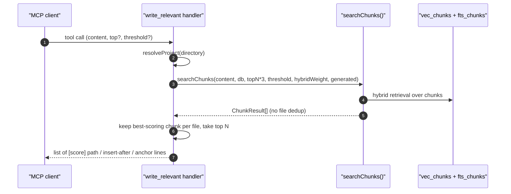

# Tool: write_relevant

The `write_relevant` MCP tool answers "where should I put this?". The
caller passes the content they want to add — a function body, a
documentation paragraph, a class — and the tool returns the most
semantically appropriate existing files and a per-file insertion anchor.
It is meant to be called *before* writing new code so the addition lands
next to related code instead of in a new file.

Internally it reuses the same chunk retrieval pipeline as
`read_relevant`, then collapses the results to the best chunk per file
and formats them as insertion candidates. The handler lives at
`src/tools/search.ts:276-345`.



1. The client passes the candidate content as `content` (1–5000 chars)
   plus optional `top` (default `3`) and `threshold` (default `0.3`)
   (`src/tools/search.ts:280-297`).
2. The handler opens the project DB through `resolveProject`
   (`src/tools/search.ts:299`).
3. It calls `searchChunks(content, db, topN*3, threshold, hybridWeight,
   generated)`. The `topN*3` over-fetch leaves room for the per-file
   collapse step below (`src/tools/search.ts:302-309`).
4. Each chunk is keyed by file path, and the highest-scoring chunk wins
   per file (`src/tools/search.ts:317-324`).
5. The remaining candidates are sorted by score and sliced to `topN`
   (`src/tools/search.ts:326-328`).
6. For each candidate, the tool builds an insertion description:
   - When the chunk has an `entityName`, the suggestion is
     `after \`entityName\` (chunk N)`.
   - Otherwise, it falls back to `after chunk N`.
   - The anchor is the last 150 characters of the chunk body, trimmed —
     this gives the caller a unique fingerprint to find the spot in the
     file (`src/tools/search.ts:330-338`).
7. The handler appends a tip suggesting `read_relevant` against the same
   query to inspect the surrounding code (`src/tools/search.ts:340-343`).

## Inputs

- `content` — required string, 1 to 5000 characters. This is what the
  caller wants to write; it is fed into the hybrid retrieval pipeline as
  if it were a query (`src/tools/search.ts:280`).
- `top` — optional positive integer. Caps the number of candidate files
  in the output (default `3`) (`src/tools/search.ts:285-290`,
  `src/tools/search.ts:301`).
- `threshold` — optional 0–1 minimum relevance score (default `0.3`),
  forwarded to `searchChunks` (`src/tools/search.ts:291-296`).
- `directory` — optional project root override
  (`src/tools/search.ts:281-284`).

Note: this tool exposes `content`/`top`/`threshold`/`directory`. It does
not currently accept `extensions`, `dirs`, or `excludeDirs` filters even
though `searchChunks` supports them (`src/tools/search.ts:280-297`).

## Outputs

- Text content with one block per candidate file:
  `[score] path` / `Insert after \`entityName\` (chunk N)` / `Anchor:
  ...trailing 150 chars`. Blocks are separated by `---`
  (`src/tools/search.ts:330-338`).
- A trailing tip line that points to `read_relevant`
  (`src/tools/search.ts:341`).
- Side effect: one row in `query_log` is written inside `searchChunks`
  with the content used as the "query" string — `write_relevant`
  invocations show up alongside real searches in
  `search_analytics`. This is worth knowing when reading analytics
  output (`src/search/hybrid.ts:544-551`).

## Picking the anchor

The anchor is intentionally lightweight: the last 150 characters of the
top-scoring chunk in the file, with whitespace trimmed. The intent is to
let an editor or follow-up tool locate the insertion point by searching
for that suffix rather than relying on line numbers that may drift
(`src/tools/search.ts:335-336`). When the chunk has an `entityName`
(function name, class name, exported constant), the message also tells
the caller they should insert after that entity — which usually
translates to "right after the closing brace of that symbol".

## Branches and failure cases

- Empty index or all chunks below `threshold`: returns a single message
  "No relevant location found. The index may be empty — try
  `index_files` first." (`src/tools/search.ts:311-315`).
- Sparse fan-out: when fewer than `topN` distinct files survive the
  per-file collapse, the response simply contains fewer blocks; there is
  no padding.

## Example

```json
{
  "content": "function lower-cases a path and matches it against a list of glob patterns to decide if a file is generated",
  "top": 3,
  "threshold": 0.3
}
```

Response shape (illustrative):

```
[0.78] src/example/generated.ts
  Insert after `buildGeneratedMatcher` (chunk 4)
  Anchor: ...return (p: string) => patterns.some((re) => re.test(p));

---

[0.61] src/example/config.ts
  Insert after `loadConfig` (chunk 2)
  Anchor: ...config.generated = config.generated ?? [];

── Tip: call read_relevant with your content query to see the surrounding code at the insertion point. ──
```

## Related flows

- `read_relevant` — same retrieval substrate; use it to inspect the
  proposed insertion site before writing.
- `search` — when you would rather scan a list of files than chunk
  bodies for placement decisions.

## Key source files

- `src/tools/search.ts` — handler, per-file collapse, anchor format.
- `src/search/hybrid.ts` — `searchChunks` retrieval and analytics
  logging.
- `src/db/index.ts` — `RagDB` wrappers used by the retrieval path.
