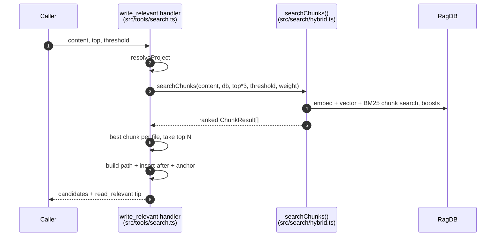

# Tool: write_relevant

The `write_relevant` MCP tool answers a question you face before writing code, not after: "where should this new function (or doc section) go?" You hand it the content you intend to add, and it returns the existing files whose code is most similar in meaning, each with a concrete insertion point and an anchor string you can match against. It turns "find the right home for this" into a ranked shortlist instead of a manual hunt.

The handler is registered in `src/tools/search.ts:276-345`. It reuses the chunk-level search engine `searchChunks` in `src/search/hybrid.ts:470-554`.

## When to use it

Use `write_relevant` before adding a new function, class, or documentation section, when you are unsure which file it belongs in. It is the write-time counterpart to [read_relevant](read-relevant.md): both run the same chunk search, but `read_relevant` returns code for you to read, while `write_relevant` collapses results to one suggestion per file and tells you where to insert after.

## Inputs

| name | type | required | description |
| --- | --- | --- | --- |
| `content` | string (1–5000 chars) | yes | The code or doc text you want to add. This is embedded and matched against existing chunks. |
| `top` | integer (≥1) | no | Number of candidate locations (files) to return. Defaults to 3. |
| `threshold` | number (0–1) | no | Minimum relevance score for a chunk to be considered. Defaults to 0.3. |
| `directory` | string | no | Which project to search. Defaults to `RAG_PROJECT_DIR` or the cwd. |

There are no path-scoping filters on this tool — the call into `searchChunks` passes no filter `src/tools/search.ts:302-309`. The query text is the `content` itself, so the more representative your snippet, the better the match.

## Outputs

| output | where it lands / shape / description |
| --- | --- |
| Candidate insertion points | A single MCP text block. One entry per file: `[score] path`, an `Insert after ...` line naming the entity (or chunk) to insert after, and an `Anchor: ...` line showing the last ~150 chars of that chunk so you can locate the exact spot. Entries are joined by `---`. A footer suggests calling `read_relevant`. |
| Empty-result message | When no chunk clears the threshold, a text block suggesting `index_files`. |

The output is built in `src/tools/search.ts:330-343`. The `Insert after` line reads `after \`entityName\` (chunk N)` when the chunk has an entity, otherwise `after chunk N` `src/tools/search.ts:332-334`. The anchor is the chunk's trailing 150 characters, trimmed `src/tools/search.ts:335`.

## How a suggestion is produced



1. The handler resolves the project database and config `src/tools/search.ts:299`.
2. It computes `topN = top ?? 3` and asks for `topN * 3` chunks — over-fetching so that after collapsing to one chunk per file there are still enough distinct files to fill `topN` slots `src/tools/search.ts:301-309`.
3. `searchChunks` embeds the `content`, runs the hybrid vector + keyword chunk search, applies the path/filename/graph boosts, and returns ranked chunks `src/search/hybrid.ts:470-554`. The threshold (default 0.3) is forwarded so weak matches are dropped `src/tools/search.ts:302-309`.
4. The handler keeps the single best-scoring chunk per file, building a `Map` keyed by path `src/tools/search.ts:318-324`.
5. It sorts those per-file bests by score and slices to `topN` `src/tools/search.ts:326-328`.
6. For each candidate it formats the path, the insert-after target, and the anchor `src/tools/search.ts:330-338`.
7. It returns the text block with a footer pointing at `read_relevant` `src/tools/search.ts:340-343`.

The result is "best place per file", not "best chunks overall" — this is why the over-fetch and per-file dedupe exist, and it is the key difference from `read_relevant`, which returns multiple chunks from the same file.

## Anchors and insertion points

The point of the anchor is to give a precise, matchable target rather than a line number that may drift. Each candidate names the entity to insert after (e.g. a function or class) when the matched chunk has an `entityName`, and falls back to the chunk index otherwise `src/tools/search.ts:332-334`. The anchor string is the literal tail of that chunk's content — `r.content.slice(-150).trim()` — so you can grep for it to find exactly where the chunk ends and your new code should begin `src/tools/search.ts:335`.

## Branches and failure cases

- **No chunk clears the threshold** — returns "No relevant location found. The index may be empty — try index_files first." `src/tools/search.ts:311-315`.
- **`top` omitted** — defaults to 3 candidate files `src/tools/search.ts:301`.
- **`threshold` omitted** — defaults to 0.3, forwarded to `searchChunks` `src/tools/search.ts:302-309`.
- **Fewer matching files than `top`** — only as many candidates as there are distinct files are returned, since dedupe happens before the slice `src/tools/search.ts:318-328`.
- **Matched chunk has no entity name** — the insert-after target degrades to `after chunk N` `src/tools/search.ts:332-334`.
- **Full-text search throws inside `searchChunks`** — caught there; the search falls back to vector-only results rather than failing `src/search/hybrid.ts:485-489`.

This tool is read-only: it suggests where to write but writes nothing itself. Unlike file-level [search](search.md) and [read_relevant](read-relevant.md), it does not record an analytics row, because `searchChunks` logs internally while this handler simply consumes the returned chunks.

## Example

```json
{
  "content": "export function debounceIndex(fn: () => void, ms: number) {\n  let t: Timer;\n  return () => { clearTimeout(t); t = setTimeout(fn, ms); };\n}",
  "top": 3,
  "threshold": 0.3
}
```

Illustrative output shape:

```
[0.71] src/utils/debounce.ts
  Insert after `throttle` (chunk 2)
  Anchor: ...return () => { if (!pending) { pending = true; queueMicrotask(flush); } };

---

[0.58] src/indexing/watcher.ts
  Insert after chunk 5
  Anchor: ...watcher.on("change", (p) => scheduleReindex(p));

── Tip: call read_relevant with your content query to see the surrounding code at the insertion point. ──
```

## Key source files

- `src/tools/search.ts` — registers `write_relevant`, dedupes to best-per-file, formats the insert-after and anchor lines.
- `src/search/hybrid.ts` — `searchChunks` provides the ranked chunks the handler turns into insertion candidates.
